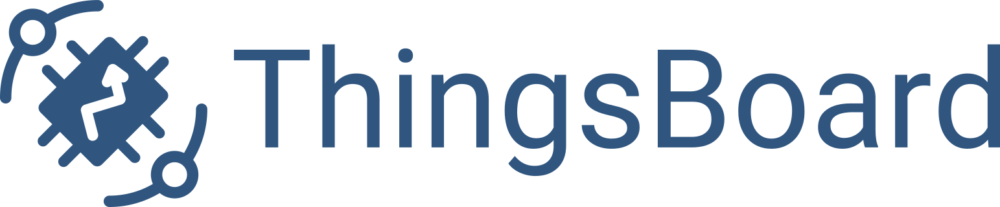

# index

## Who we are?

ThingsBoard, Inc. is a US corporation founded in 2016 with RnD center in Kyiv, Ukraine. We are main contributor and maintainer of ThingsBoard open-source IoT Platform.

## Our mission

We deliver and constantly improve scalable, robust and affordable IoT Platform that dramatically reduces time-to-market for life-changing IoT solutions. We also help companies to deliver great IoT products based on ThingsBoard.

|  | +1 415 766 9144 |
| :--- | :--- |
|  | [info@thingsboard.io](mailto:info@thingsboard.io) |
|  | 39 Carlton Club Drive, Piscataway, NJ, 08854, US |
| [Contact us](https://github.com/caoyingde/thingsboard.github.io/tree/9437083b88083a9b2563248432cbbe460867fbaf/docs/contact-us/README.md) |  |

