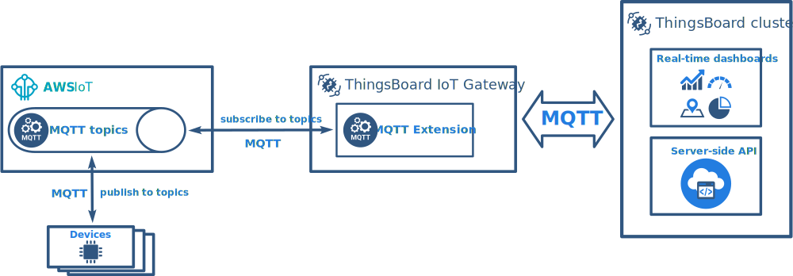
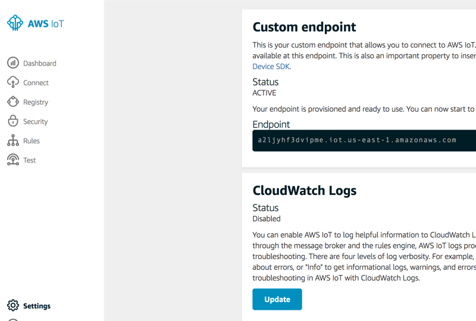
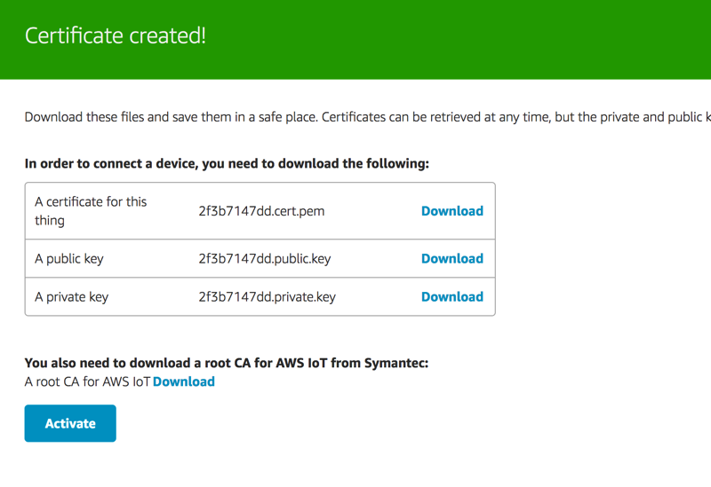
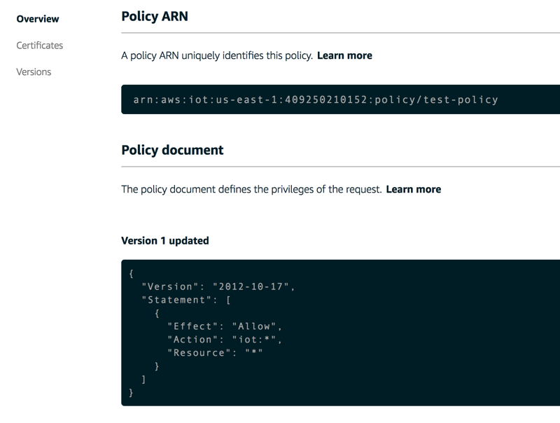

# integration-with-aws-iot

* TOC

  {:toc}

While some of the AWS IoT and ThingsBoard features overlap, you are able to integrate them and leverage best features from both. For example, you can collect data using AWS IoT and then push it to ThingsBoard for storage and data visualization on customizable end-user dashboards.

There are two options how one can integrate AWS IoT and ThingsBoard.

**First option** is to write custom [lambda function](http://docs.aws.amazon.com/lambda/latest/dg/lambda-introduction-function.html) based on ThingsBoard [APIs](https://github.com/caoyingde/thingsboard.github.io/tree/9437083b88083a9b2563248432cbbe460867fbaf/docs/reference/gateway-mqtt-api/README.md). This is quite a simple solution, however, it allows only to push data to ThingsBoard and does not provide an ability to control your devices using ThingsBoard widgets.

**Second option** is to use ThingsBoard [**IoT Gateway**](https://github.com/caoyingde/thingsboard.github.io/tree/9437083b88083a9b2563248432cbbe460867fbaf/docs/iot-gateway/what-is-iot-gateway/README.md), which is an open-source solution that allows you to integrate devices connected to legacy and third-party systems with ThingsBoard. We recommend to use the second option and will cover basic configuration steps below.

## Overview



ThingsBoard IoT Gateway is a light-weight service that connects to both AWS IoT MQTT broker and ThingsBoard MQTT server and acts as a proxy or API bridge. You are able to configure the Gateway to subscribe to certain AWS IoT topics, convert incoming data to unified format and push it to ThingsBoard. This article provides basic configuration steps. You can refer to advanced configuration topic for [more details](https://github.com/caoyingde/thingsboard.github.io/tree/9437083b88083a9b2563248432cbbe460867fbaf/docs/iot-gateway/mqtt/README.md).

## Prerequisites

We assume you have already [**installed**](https://github.com/caoyingde/thingsboard.github.io/tree/9437083b88083a9b2563248432cbbe460867fbaf/docs/iot-gateway/installation/README.md) ThingsBoard IoT Gateway and [**provisioned**](https://github.com/caoyingde/thingsboard.github.io/tree/9437083b88083a9b2563248432cbbe460867fbaf/docs/iot-gateway/getting-started/README.md#step-3-gateway-provisioning) it within your local or demo ThingsBoard instance.

## AWS IoT configuration steps

Before configuration of the ThingsBoard **IoT Gateway** we must prepare certificates, policies and copy Rest URL from the **AWS IoT** console.

### Step 1. Custom Endpoint URL of the AWS IoT

Get **Custom Endpoint URL** of the **AWS IoT** that we will use later in this guide. This URL is located in the AWS IoT **Settings** page:



We will refer later to this URL as **"$MQTT\_ENDPOINT"**.

### Step 2. AWS IoT certificates

Download certificates from **AWS IoT** and copy them beside ThingsBoard **IoT Gateway** in the configuration folder:

```bash
Windows: YOUR_INSTALL_DIR/conf
Linux: /etc/tb-gateway/conf
```

You can put it inside _conf_ folder or create new sub-folder _cert_ for example.



We need to copy private key \(**2f3b7147dd.private.key** in the example\), certificate \(**2f3b7147dd.cert.pem** in the example\) and root CA certificate that you are able to download from Symantec.

Please copy these three PEM files to configuration folder of ThingsBoard **IoT Gateway** as described above.

Later we will refer to the path where private key PEM file is located as **"$PRIVATE\_KEY"**, certificate as **"$CERTIFICATE"** and root CA as **"$ROOT\_CA\_CERT"**

### Step 3. AWS IoT policy configuration

Configure security policy.



In the example below we have allowed any IoT action and for any resources, but you definitely can restrict these values based on your security rules.

## ThingsBoard IoT Gateway configuration steps

### Step 4. Enable MQTT extension

Navigate to the gateway configuration folder and edit **tb-gateway.yml** file. Please change **mqtt.enabled** property value to **true** to enable Gateway MQTT extension.

### Step 5. MQTT extension configuration

Now it's time to configure ThingsBoard **IoT Gateway** to connect to your **AWS IoT** broker.

The configuration of the brokers is located in **mqtt-config.json** file.

You should update it using next values:

```javascript
{
"host": "$MQTT_ENDPOINT",
"port": 8883,
"ssl": true,
"retryInterval": 3000,
"credentials": {
    "type": "cert.PEM",
    "caCert" : "$ROOT_CA_CERT",
    "privateKey" : "$PRIVATE_KEY",
    "cert" : "$CERTIFICATE"
 }
 ...
}
```

here is sample with real values:

```javascript
{
"host": "a2ljyhf3dvidme.iot.us-east-1.amazonaws.com",
"port": 8883,
"ssl": true,
"retryInterval": 3000,
"credentials": {
    "type": "cert.PEM",
    "caCert" : "/etc/tb-gateway/conf/cert/rootCA.pem",
    "privateKey" : "/etc/tb-gateway/conf/cert/privateKey.pem",
    "cert" : "/etc/tb-gateway/conf/cert/cert.pem"
 }
 ...
}
```

The configuration of the broker is done. Now you are ready to start ThingsBoard **IoT Gateway** and publish messages to **AWS IoT** topics that will be consumed by ThingsBoard **IoT Gateway** and republished to **ThingsBoard** instance.

## Dry Run

Consider that we have next default configuration of the mapping:

```javascript
{
    "topicFilter": "sensor/+/temperature",
    "converter": {
      "type": "json",
      "filterExpression": "",
      "deviceNameTopicExpression": "(?<=sensor\/)(.*?)(?=\/temperature)",
      "timeseries": [
        {
          "type": "double",
          "key": "temperature",
          "value": "${$.value}"
        }
      ]
    }
}
```

To check that everything is configured correctly you are able to use **mosquitto\_pub** tool that is able to publish messages to **AWS IoT**.

Here is a sample of the command that will publish temperature readings to AWS IoT topic **sensor/SN-001/temperature**. ThingsBoard **IoT Gateway** will receive this values, create or update device **SN-001** inside **ThingsBoard**, and publish telemetry _'temperature'_ using value **73.8**

```bash
mosquitto_pub --cert ./cert/cert.pem --key ./cert/privateKey.pem --cafile ./cert/rootCA.pem -h a2ljyhf3dvipme.iot.us-east-1.amazonaws.com -p 8883 -t sensor/SN-001/temperature -m '{"value":73.8}'
```

To validate that data arrived in ThingsBoard, please open the administration UI and navigate to **Devices-&gt;SN-001-&gt;Latest Telemetry**. See the screenshot attached.


