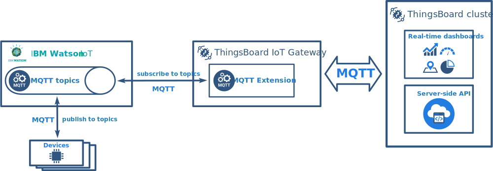
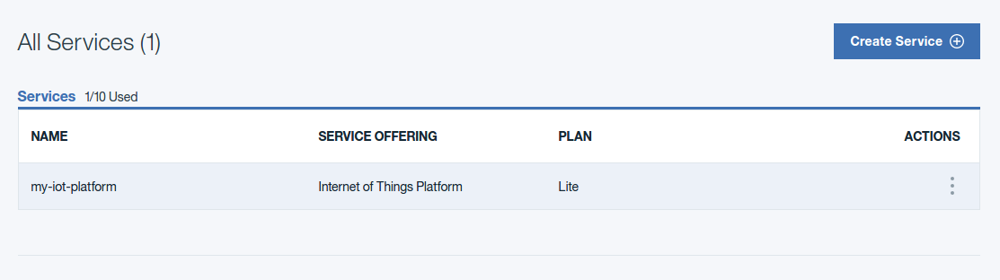
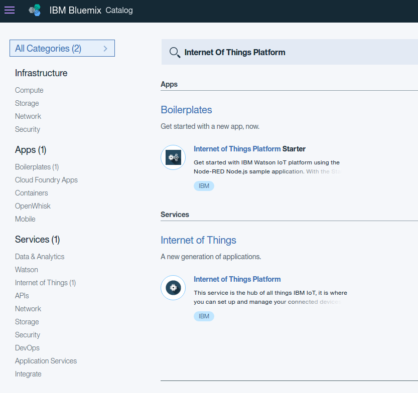
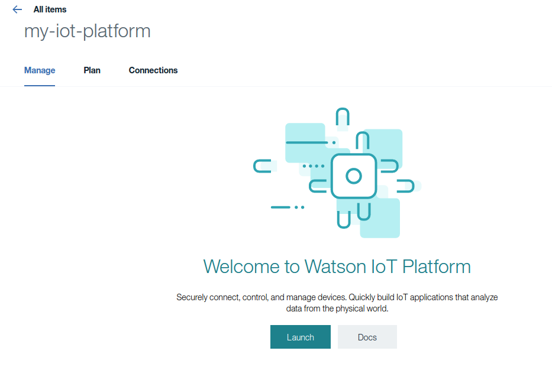
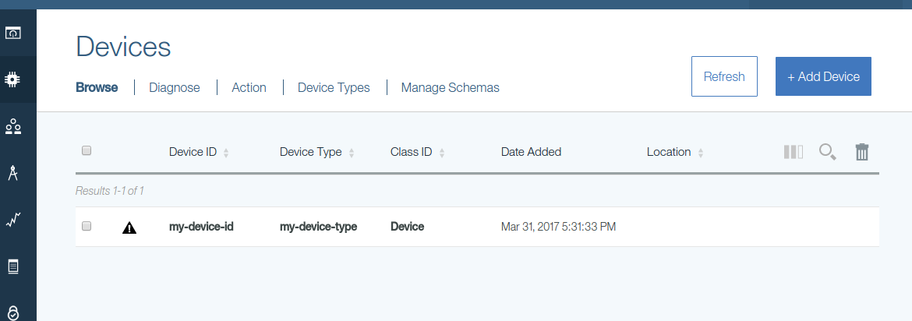
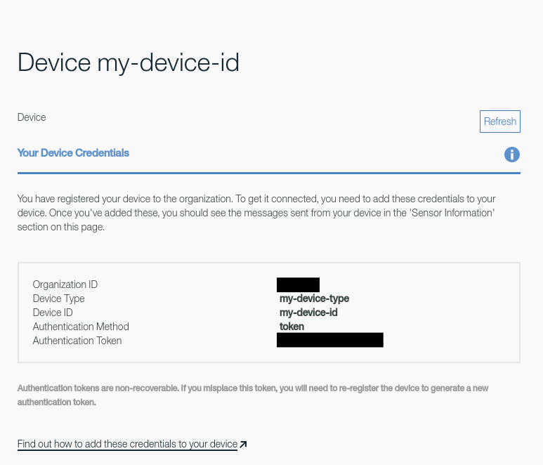
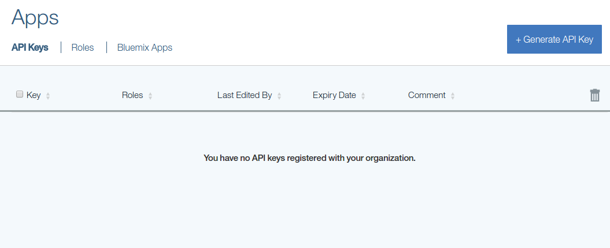
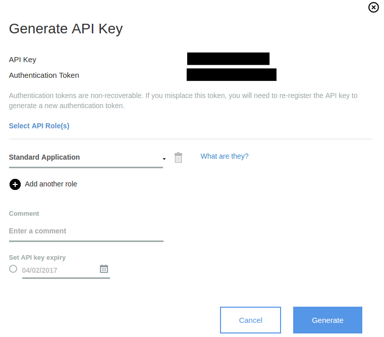
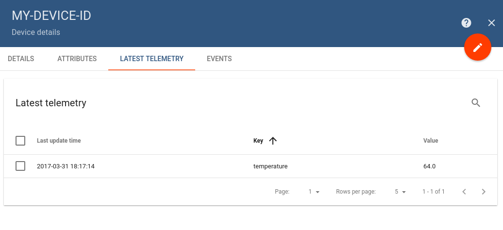

# integration-with-ibm-watson-iot

* TOC

  {:toc}

While some of the IBM Watson IoT and ThingsBoard features overlap, you are able to integrate them and leverage best features from both. For example, you can collect data using IBM Watson IoT and then push it to ThingsBoard for storage and data visualization on customizable end-user dashboards.

To integrate IBM Watson IoT and ThingsBoard the best option is to use ThingsBoard [**IoT Gateway**](https://github.com/caoyingde/thingsboard.github.io/tree/9437083b88083a9b2563248432cbbe460867fbaf/docs/iot-gateway/what-is-iot-gateway/README.md), which is an open-source solution that allows you to integrate devices connected to legacy and third-party systems with ThingsBoard. We will cover basic configuration steps below.

## Overview



ThingsBoard IoT Gateway is a light-weight service that connects to both IBM Watson IoT MQTT broker and ThingsBoard MQTT server and acts as a proxy or API bridge. You are able to configure the Gateway to subscribe to certain IBM Watson IoT topics, convert incoming data to unified format and push it to ThingsBoard. This article provides basic configuration steps. You can refer to advanced configuration topic for [more details](https://github.com/caoyingde/thingsboard.github.io/tree/9437083b88083a9b2563248432cbbe460867fbaf/docs/iot-gateway/mqtt/README.md).

## Prerequisites

We assume you have already [**installed**](https://github.com/caoyingde/thingsboard.github.io/tree/9437083b88083a9b2563248432cbbe460867fbaf/docs/iot-gateway/installation/README.md) ThingsBoard IoT Gateway and [**provisioned**](https://github.com/caoyingde/thingsboard.github.io/tree/9437083b88083a9b2563248432cbbe460867fbaf/docs/iot-gateway/getting-started/README.md#step-3-gateway-provisioning) it within your local or demo ThingsBoard instance.

As well we assume that you have **IBM Account** already and have access to **IBM Watson IoT Platform**.

Additionally service **Internet of Things Platform** must be created inside your IBM account. You can check it by this [link](https://console.ng.bluemix.net/dashboard/services) or by navigation **Menu -&gt; Services -&gt; Dashboard**:



If service is not created please click **Create Service** button and in the Catalog filter _Internet of Things Platform_:



Select **Internet of Things Platform** and following instructions to create this service.

## IBM Watson IoT configuration steps

Before configuration of the ThingsBoard **IoT Gateway** we must configure **IBM Watson** IoT Platform service and generate access tokens.

### Step 1. IBM Watson IoT platform device

We must have some **IBM Watson IoT device** registered in the platform. Let's launch IoT Platform service:



Go to the **Device** menu and verify list of devices that already exists:



If you don't have device created, please click **Add Device** and create it following the instructions. In other case click on particular device and get device credentials:



In this window you'll need _Organization ID_ that we later refer as **$IBM\_WATSON\_ORGANIZATION\_ID**, _Device Type_ as **$IBM\_WATSON\_DEVICE\_TYPE**, _Device ID_ as **$IBM\_WATSON\_DEVICE\_ID** and _Authentication Token_ as **$IBM\_WATSON\_DEVICE\_TOKEN**.

Please write them down somewhere because later we'll use them.

### Step 2. IBM Watson IoT API key for applications

Now we need to generate **API key** for the **IBM Watson** _application_. In our case **ThingsBoard Gateway** is going to be an application that will be subscribed to **IBM Watson** _MQTT_ topics.

Go to **Apps** menu:



If you have key already created you can use it, in other case click **Generate API Key** button:



Please write down from this screen _API Key_ that we'll later refer to as **$IBM\_WATSON\_APP\_NAME** and _Authentication Token_ as **$IBM\_WATSON\_APP\_TOKEN**.

## ThingsBoard IoT Gateway configuration steps

### Step 3. Enable MQTT extension

Navigate to the gateway configuration folder and edit **tb-gateway.yml** file. Please change **mqtt.enabled** property value to **true** to enable Gateway MQTT extension.

### Step 4. MQTT extension configuration

Now it's time to configure ThingsBoard **IoT Gateway** to connect to your **IBM Watson IoT** broker.

**NOTE** If you at this point don't know how devices and applications are connecting to MQTT topics in **IBM Watson** platform please visit these links [Connecting applications, devices, and gateways to Watson IoT Platform](https://console.ng.bluemix.net/docs/services/IoT/reference/security/connect_devices_apps_gw.html) and [MQTT connectivity for applications](https://console.ng.bluemix.net/docs/services/IoT/applications/mqtt.html) before continuing.

We need to compose **host** and **clientId** properties to be able to connect **ThingsBoard Gateway** to **IBM Watson** _MQTT_ topics.

According to **IBM Watson** [documentation](https://console.ng.bluemix.net/docs/services/IoT/applications/mqtt.html) **host** should be create as **$IBM\_WATSON\_ORGANIZATION\_ID**._messaging.internetofthings.ibmcloud.com_. We'll later refer to this as **$IBM\_WATSON\_MQTT\_ENDPOINT**.

As well for identification we'll need correctly compose **clientId** property as _a_:**$IBM\_WATSON\_ORGANIZATION\_ID**.**$IBM\_WATSON\_APP\_NAME**. We'll later refer to this as **$IBM\_WATSON\_CLIENT\_ID**.

Configuration of the brokers is located in **mqtt-config.json** file.

You should update it using next values:

```javascript
{
"host": "$IBM_WATSON_MQTT_ENDPOINT",
"port": 1883,
"ssl": false,
"retryInterval": 3000,
"clientId": "$IBM_WATSON_CLIENT_ID",
"credentials": {
    "type": "basic",
    "username": "$IBM_WATSON_APP_NAME",
    "password": "$IBM_WATSON_APP_TOKEN"
}
 ...
}
```

here is a sample with real values:

```javascript
{
    "host": "4p62co.messaging.internetofthings.ibmcloud.com",
    "port": 1883,
    "ssl": false,
    "retryInterval": 3000,
    "clientId": "a:4p62co:a-4p62co-vuflwimden",
    "credentials": {
        "type": "basic",
        "username": "a-4p62co-vuflwimden",
        "password": "l5xa*A9X9)PrDi5Jvg"
    }
    ...
}
```

The configuration of the broker is done. Now you are ready to start ThingsBoard **IoT Gateway** and publish messages to **IBM Watson IoT** topics that will be consumed by ThingsBoard **IoT Gateway** and republished to **ThingsBoard** instance.

## Dry Run

It's time to configure the mapping of the **ThingsBoard Gateway** to be able to subscribe to **IBM Watson** device topics.

**NOTE** If you at this point don't know how to subscribe to **IBM Watson** _MQTT_ topics please visit this [link](https://console.ng.bluemix.net/docs/services/IoT/applications/mqtt.html#subscribe_device_events)

In general _topic_ that we can use to subscribe to device events has next definition:

_iot-2/type_/**$IBM\_WATSON\_DEVICE\_TYPE**/_id_/**$IBM\_WATSON\_DEVICE\_ID**/_evt_/**event\_id**/_fmt_/**format\_string**

Here is the detail description of _event\_id_ and _format\_string_ properties:

* **event\_id** is the ID of the event, for example, “status”. The event ID can be any string permitted by MQTT. Subscriber applications must use this string in their subscription topic to receive the events published on this topic if wildcards are not used.
* **format\_string** is the format of the event payload, for example, “json”. The format can be any string permitted by MQTT. Subscriber applications must use this string in their subscription topic to receive events published on this topic if wildcards are not used. If the format is not “json”, then messages will not be stored in the Historian.

Consider that we have next configuration of the mapping for **my-device-type** _Device Type_ and would like to get all **temp** events for all the _Device Ids_. _Device Id_ is going to be used as _Device Name_ in **ThingsBoard**:

```javascript
{
    ...
    "topicFilter": "iot-2/type/my-device-type/id/+/evt/temp/fmt/json",
    "converter": {
        "type": "json",
        "filterExpression": "",
        "deviceNameTopicExpression": "(?<=iot-2/type/my-device-type/id\/)(.*?)(?=\/evt/temp/fmt/json)",
        "timeseries": [
          {
            "type": "double",
            "key": "temperature",
            "value": "${$.value}"
          }
        ]
    }
    ...
}
```

To check that everything is configured correctly you are able to use **mosquitto\_pub** tool that is able to publish messages to **IBM Watson IoT**. The list of options that we are going to use in **mosquitto\_pub**:

* **'-h'** Specify the host to connect to.
* **'-u'** Provide a username to be used for authenticating with the broker.
* **'-P'** Provide a password to be used for authenticating with the broker.
* **'-i'** The id to use for this client.
* **'-t'** The MQTT topic on which to publish the message.

Here is the general command that could be used to publish message of particular device to **IBM Watson** _MQTT_ topic:

```bash
mosquitto_pub -h $IBM_WATSON_ORGANIZATION_ID.messaging.internetofthings.ibmcloud.com -p 1883 -u 'use-token-auth' -P '$IBM_WATSON_DEVICE_TOKEN' -i "d:$IBM_WATSON_ORGANIZATION_ID:$IBM_WATSON_DEVICE_TYPE:$IBM_WATSON_DEVICE_ID" -t iot-2/evt/$event_id/fmt/$format_string -m '{"value":64}'
```

**NOTE** For the details how to connect to **IBM Watson** _MQTT_ topics please visit this [link](https://console.ng.bluemix.net/docs/services/IoT/applications/mqtt.html)

And this is a sample of the command that will publish temperature readings to IBM Watson IoT topic **iot-2/evt/temp/fmt/json**. ThingsBoard **IoT Gateway** will receive these values, create or update device **MY-DEVICE-ID** inside **ThingsBoard**, and publish telemetry _'temperature'_ using value **64**

```bash
mosquitto_pub -h 4p62co.messaging.internetofthings.ibmcloud.com -p 1883 -u 'use-token-auth' -P 'Lw&FJ3F29Rs&xNeuJt' -i "d:4p62co:my-device-type:my-device-id" -t iot-2/evt/temp/fmt/json -m '{"value":64}'
```

To validate that data arrived in ThingsBoard, please open the administration UI and navigate to **Devices -&gt; MY-DEVICE-ID -&gt; Latest Telemetry**. See screenshot attached.



