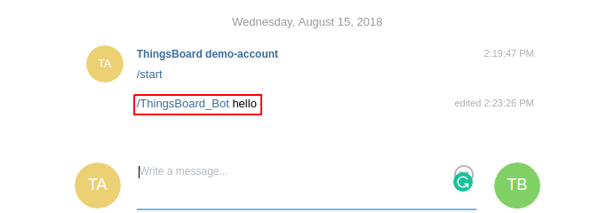
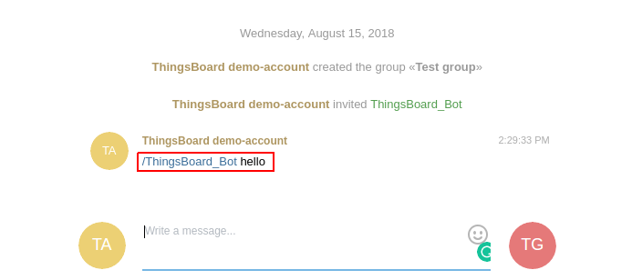
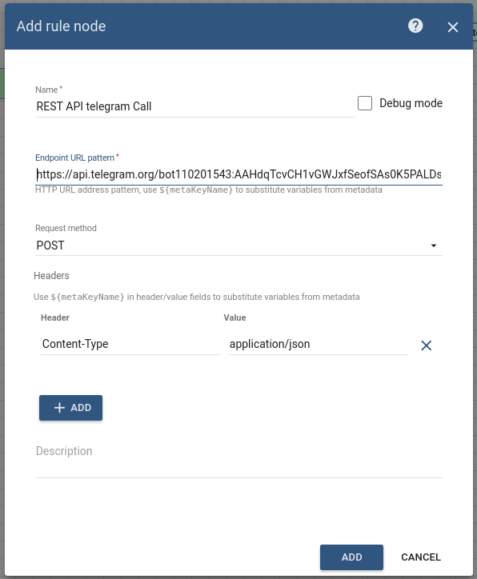
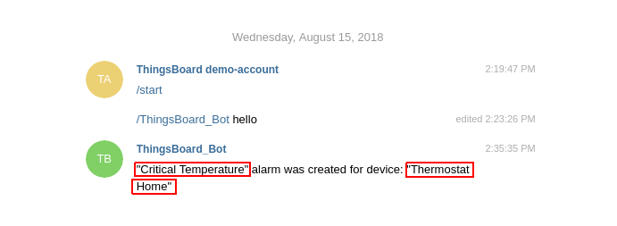
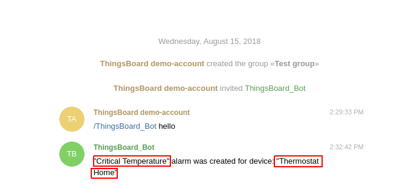

# integration-with-telegram-bot

* TOC

  {:toc}

## Overview

Telegram provides a possibility to create Telegram Bots, which are considered as third-party applications. So, In this tutorial, we are going to demonstrate how you can create a Telegram Bot  
 and configure your ThingsBoard rule engine to be able to send notifications to Telegram App using Rest API Call extension.

## Use case

This tutorial is based on the [create & clear alarms](https://github.com/caoyingde/thingsboard.github.io/tree/9437083b88083a9b2563248432cbbe460867fbaf/docs/user-guide/rule-engine-2-0/tutorials/create-clear-alarms/README.md#use-case) tutorial and it's use case. We will reuse the rule chains from above mentioned tutorial and will add few more rule nodes to integrate with Telegram

Let's assume your device is using DHT22 sensor to collect and push temperature readings to ThingsBoard. DHT22 sensor is good for -40 to 80°C temperature readings.We want to generate Alarms if temperature is out of good range and send notifications to Telegram App when the alarm was created.

In this tutorial we will configure ThingsBoard Rule Engine to:

* Send a message notification to the user if the alarm was created.
* Add current alarm type and it originator to the message body using Script Transform node.

## Prerequisites

We assume you have completed the following guides and reviewed the articles listed below:

* [Getting Started](https://github.com/caoyingde/thingsboard.github.io/tree/9437083b88083a9b2563248432cbbe460867fbaf/docs/getting-started-guides/helloworld/README.md) guide.
* [Rule Engine Overview](https://github.com/caoyingde/thingsboard.github.io/tree/9437083b88083a9b2563248432cbbe460867fbaf/docs/user-guide/rule-engine-2-0/overview/README.md).
* [Create & clear alarms](https://github.com/caoyingde/thingsboard.github.io/tree/9437083b88083a9b2563248432cbbe460867fbaf/docs/user-guide/rule-engine-2-0/tutorials/create-clear-alarms/README.md) guide.

## Message flow

In this section, we explain the purpose of each node in this tutorial:

* Node A: [**Transform Script**](https://github.com/caoyingde/thingsboard.github.io/tree/9437083b88083a9b2563248432cbbe460867fbaf/docs/user-guide/rule-engine-2-0/transformation-nodes/README.md#script-transformation-node) node.
  * This node will be used to creating a body of the Telegram message notification.  
* Node B: [**REST API Call**](https://github.com/caoyingde/thingsboard.github.io/tree/9437083b88083a9b2563248432cbbe460867fbaf/docs/user-guide/rule-engine-2-0/external-nodes/README.md#rest-api-call-node) node.
  * This node will send Telegram message payload to the configured REST endpoint. In our case, it is Telegram REST API.

## Creation of the Telegram Bot

[The BotFather](https://telegram.me/botfather) is the main bot that will help you to [create](https://core.telegram.org/bots#6-botfather) new bots and change their settings.

Once the creation of the bot is finished, you can generate an authorization token for your new bot. The token is a string that looks like this - **'110201543:AAHdqTcvCH1vGWJxfSeofSAs0K5PALDsaw'** that is required to authorize the bot.

Prerequisites :

* ThingsBoard is up and running
* Telegram Bot is created

### Getting the Chat ID

In the next step, we need to retrieve a Chat ID. The Chat ID is needed to send messages via the HTTP API.

There are several ways to get the Chat ID:

* First of all, you need send some message to your Bot:
  * in the private chat;

    

  * in the group where your Bot was added as a member.

    

  
     where **ThingsBoard\_Bot** is name of the Telegram bot.
* Next, open your web browser and enter the following URL:

```bash
https://api.telegram.org/bot"YOUR_BOT_TOKEN"/getUpdates

"YOUR_BOT_TOKEN" has to be replaced by the authentication token of your bot, e.g.:

https://api.telegram.org/bot110201543:AAHdqTcvCH1vGWJxfSeofSAs0K5PALDsaw/getUpdates
```

From the outcoming data you can find field **'id'**. This is the so-called chat\_id.

* First option:


* Second option:


After that, you can start to configure Rule engine to use Rest API Call extension.

## Configure Rule Chains

In this tutorial, we used Rule Chains from [create & clear alarms](https://github.com/caoyingde/thingsboard.github.io/tree/9437083b88083a9b2563248432cbbe460867fbaf/docs/iot-gateway/create-clear-alarms/README.md) tutorial. We modified Rule Chain **Create & Clear Alarms** by adding nodes that was described above in the section [Message flow](https://github.com/caoyingde/thingsboard.github.io/tree/9437083b88083a9b2563248432cbbe460867fbaf/docs/iot-gateway/integration-with-telegram-bot/README.md#message-flow)  
 and renamed this rule chain to: **Create/Clear Alarms & send notifications to Telgram**.

  
The following screenshots show how the above Rule Chains should look like:

* **Create/Clear Alarms & send notifications to Telgram:**


* **Root Rule Chain:**


Download the attached json [**file**](https://github.com/caoyingde/thingsboard.github.io/tree/9437083b88083a9b2563248432cbbe460867fbaf/docs/iot-gateway/resources/create_clear_alarms___send_notifications_to_telgram.json) for the **Create/Clear Alarms & send notifications to Telgram** rule chain.

The following section shows you how to modify this rule chain from scratch.   


### Modify **Create/Clear Alarm & Send Email**

#### Adding the required nodes

In this rule chain, you will create 2 nodes as it will be explained in the following sections:

**Node A: Transform Script**

* Add the **Transform Script** node and connect it to the **Create Alarm** node with a relation type **Created**.  This node will use for creating a body of the message notification.  Body Template must have 2 parameters:
  * chat\_id;
  * text.

    this is an example of the outbound message:

```javascript
{"chat_id" : "PUT YOUR CHOSEN CHAT_ID", "text" : "SOME MESSAGE YOU WANT TO RECEIVE"}
```

* To do this use the following script:
* Enter the Name field as **New telegram message**.  


**Node B: REST API Call**

* Add the **REST API Call** node and connect it to the **Transform Script** node with a relation type **Success**.

  
  This node will send full Message payload to the configured REST endpoint. In our case, it is the Telegram REST API.

  
  At the scope of this tutorial, we will use **'/sendMessage'** action path to refer to Telegram Bot API to send a message.

* Fill in the fields with the input data shown in the following table:

  | **Field** | **Input Data** |
  | :--- | :--- |
  | Name | REST API telegram Call |
  | Endpoint URL pattern | https://api.telegram.org/bot"YOUR\_BOT\_TOKEN"/sendMessage |
  | Request method | POST |
  | Header | Content-Type |
  | Value | application/json |



## Post telemetry and verify

For posting device telemetry we will use the Rest APIs, [Telemetry upload APIs](https://github.com/caoyingde/thingsboard.github.io/tree/9437083b88083a9b2563248432cbbe460867fbaf/docs/reference/http-api/README.md#telemetry-upload-api). For this we will need to copy device access token from then device **Thermostat Home**.


Lets post temperature = 99. Alarm should be created:

You should understand that message won't be sent to the Telegram App when the alarm was updated, only in the case when the alarm will be created.

Finally, we can see that the message was received with the correct values:

* first option:



* second option: 



Also, you can:

* configure Alarm Details function in the Create and Clear Alarm nodes.
* configure the Dashboard by adding an alarm widget to visualize the alarms.
* define other additional logic for alarm processing, for example, sending an email.

Please refer to the links under the **See Also** section to see how to do this.

## See Also

* [Create & Clear Alarms: alarm details:](https://github.com/caoyingde/thingsboard.github.io/tree/9437083b88083a9b2563248432cbbe460867fbaf/docs/user-guide/rule-engine-2-0/tutorials/create-clear-alarms-with-details/README.md#step-2-createupdate-alarm) guide - to learn how to configure Alarm Details function in Alarm nodes.
* [Create & Clear Alarms: configure dashboard](https://github.com/caoyingde/thingsboard.github.io/tree/9437083b88083a9b2563248432cbbe460867fbaf/docs/user-guide/rule-engine-2-0/tutorials/create-clear-alarms-with-details/README.md#configure-device-and-dashboard) guide - to learn how to add an Alarm widget to the dashboard.
* [Send Email](https://github.com/caoyingde/thingsboard.github.io/tree/9437083b88083a9b2563248432cbbe460867fbaf/docs/user-guide/rule-engine-2-0/tutorials/send-email/README.md) tutorial.

## Next steps

