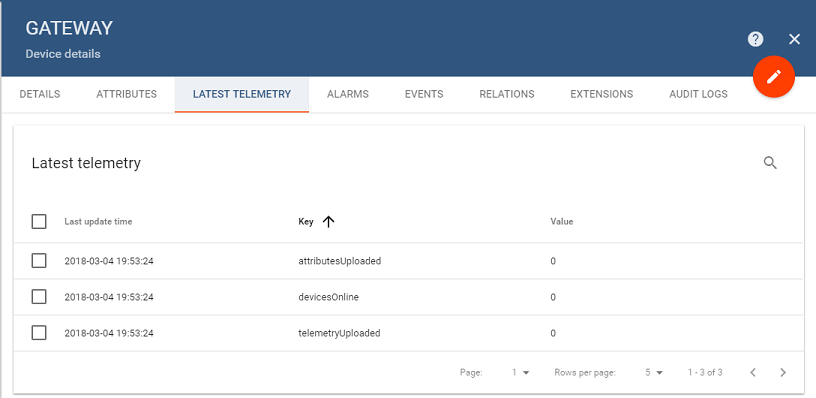

# multi-tenant-configuration

Starting from version 1.4, ThingsBoard IoT Gateway supports multi-tenancy. This guide describes how to configure multi-tenant support for ThingsBoard IoT Gateway.

## Prerequisites

For this guide you need to have Thingsboard and ThingsBoard IoT Gateway installed and running. Two tenants - **Tenant 1** and **Tenant 2** with users must be created within ThingsBoard.

## Provision Gateway device for each tenant

Each tenant who will be using shared ThingsBoard IoT Gateway must have it provisioned as a device.

Login as a **Tenant 1** user and provision Gateway device. See [Step 3: Gateway provisioning](https://github.com/caoyingde/thingsboard.github.io/tree/9437083b88083a9b2563248432cbbe460867fbaf/docs/iot-gateway/getting-started/README.md#step-3-gateway-provisioning) from Getting Started guide for information how to do it.

After the Gateway device is created, copy the Gateway's access token and store it somewhere.

Repeat this operation for **Tenant 2**

## Configure Gateway

Navigate to the gateway configuration folder and edit **tb-gateway.yml** file.

```bash
Windows: YOUR_INSTALL_DIR/conf
Linux: /etc/tb-gateway/conf
```

**tb-gateway.yml** file contains a single tenant configuration by default. To add another tenant, you need to add a second tenant entry under **tenants:**. Edit your **tb-gateway.yml** so it looks like:

```yaml
gateways:
  tenants:
    -
      label: "Tenant 1"
      reporting:
        interval: 60000
      persistence:
        type: file
        path: storage
        bufferSize: 1000
      connection:
        host: "${GATEWAY_HOST:localhost}"
        port: 1883
        retryInterval: 3000
        maxInFlight: 1000
        security:
          accessToken: "${GATEWAY_ACCESS_TOKEN_1:ACCESS_TOKEN_FOR_TENANT_1}"
      remoteConfiguration: true
    -
      label: "Tenant 2"
      reporting:
        interval: 60000
      persistence:
        type: file
        path: storage
        bufferSize: 1000
      connection:
        host: "${GATEWAY_HOST:localhost}"
        port: 1883
        retryInterval: 3000
        maxInFlight: 1000
        security:
          accessToken: "${GATEWAY_ACCESS_TOKEN_2:ACCESS_TOKEN_FOR_TENANT_2}"
      remoteConfiguration: true
```

Make sure to replace **ACCESS\_TOKEN\_FOR\_TENANT\_1** and **ACCESS\_TOKEN\_FOR\_TENANT\_2** with the actual values you have saved before.

Save the configuration and then restart your gateway using the following commands:

```bash
Windows: 
net stop tb-gateway
net start tb-gateway

Linux: 
sudo service tb-gateway restart
```

## Verify configuration

First, check the Gateway log file.

Logs are located in the following folder:

```bash
Windows: YOUR_INSTALL_DIR/logs
Linux: /var/log/tb-gateway
```

If everything was configured correctly, restart should go smoothly with no errors.

Log in to ThingsBoard as **Tenant 1** user and verify that the ThingsBoard has received telemetry update from the Gateway:

{:refdef: style="text-align: center;"}  {: refdef}

The update time and date must be recent. The same thing should be displayed for **Tenant 2**.

