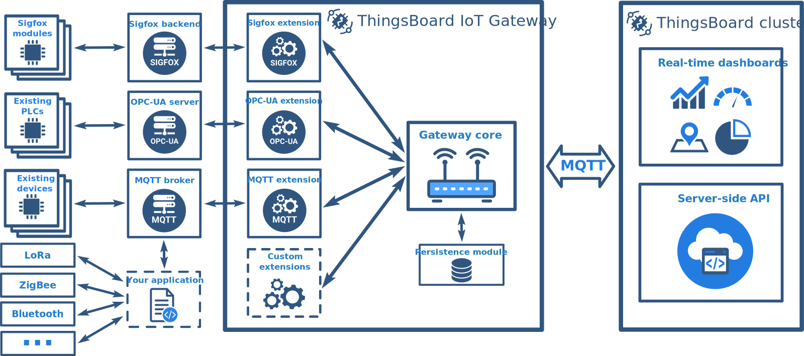

# what-is-iot-gateway

The ThingsBoard **IoT Gateway** is an open-source solution that allows you to integrate IoT devices connected to legacy and third-party systems with ThingsBoard.

ThingsBoard is an open-source IoT platform that enables rapid development, management and scaling of IoT applications. See [**What is ThingsBoard?**](https://github.com/caoyingde/thingsboard.github.io/tree/9437083b88083a9b2563248432cbbe460867fbaf/docs/getting-started-guides/what-is-thingsboard/README.md) if you are new platform user.

## Gateway features

ThingsBoard IoT Gateway provides following features:

* **MQTT** extension to control, configure and collect data from IoT devices that are connected to external MQTT brokers using existing protocols.
* **OPC-UA** extension to collect data from IoT devices that are connected to OPC-UA servers.
* **Sigfox** extension to collect data from IoT devices that are connected to Sigfox Backend.
* **Modbus** extension to collect data from IoT devices that are connected through Modbus protocol.
* **Persistence** of collected data to guarantee data delivery in case of network and hardware failures.
* **Automatic reconnect** to ThingsBoard cluster.
* Simple yet powerful **mapping** of incoming data and messages **to unified format**.

## Architecture

{:refdef: style="text-align: center;"}  {: refdef}

The IoT Gateway is built on top of **Java**, however, it is different from similar projects that leverage OSGi technology. The idea is distantly similar to the microservices architecture. There are **other programming languages** \(C, C++, Python, Javascript, Go..\) that may be more suitable for the development of the applications that target IoT devices. Especially, when we are talking about language APIs and existing libraries to work with serial ports, GPIOs, I2C, and new modules and sensors that are released every day.

The Gateway provides simple integration APIs, and encapsulates common ThingsBoard related tasks: device provisioning, local data persistence and delivery, message converters/adaptors and other. As an application developer, you are able to choose Python, Go, C/C++ and other languages and connect to ThingsBoard Gateway through external MQTT broker or OPC-UA server. IoT devices that support other protocols may be connected to the gateway by implementing custom extensions.

## Project Roadmap

The initial Gateway release goal is to bring ThingsBoard [data collection](https://github.com/caoyingde/thingsboard.github.io/tree/9437083b88083a9b2563248432cbbe460867fbaf/docs/user-guide/telemetry/README.md) feature to OPC-UA and MQTT enabled devices. ThingsBoard Gateway 1.2 provides the ability to configure and control MQTT enabled devices from ThingsBoard through the Gateway.

The Gateway project is currently in active development stage and you should expect following major features in next releases:

* Sigfox and OPC-UA extension improvements:
  * Ability to configure IoT devices connected through the Gateway using ThingsBoard [Attributes](https://github.com/caoyingde/thingsboard.github.io/tree/9437083b88083a9b2563248432cbbe460867fbaf/docs/user-guide/attributes/README.md) feature.
  * Ability to control IoT devices connected through the Gateway using ThingsBoard [RPC](https://github.com/caoyingde/thingsboard.github.io/tree/9437083b88083a9b2563248432cbbe460867fbaf/docs/user-guide/rpc/README.md) feature.
* Ability to configure Gateway distantly from ThingsBoard [Dashboards](https://github.com/caoyingde/thingsboard.github.io/tree/9437083b88083a9b2563248432cbbe460867fbaf/docs/user-guide/visualization/README.md).
* Client-side load balancing based on information about ThingsBoard cluster.
* Ability to visualize collected device data on the Gateway Web UI. 
* Configurable edge analytics.

## Next Steps

[Getting Started](https://github.com/caoyingde/thingsboard.github.io/tree/9437083b88083a9b2563248432cbbe460867fbaf/docs/iot-gateway/getting-started/README.md)

