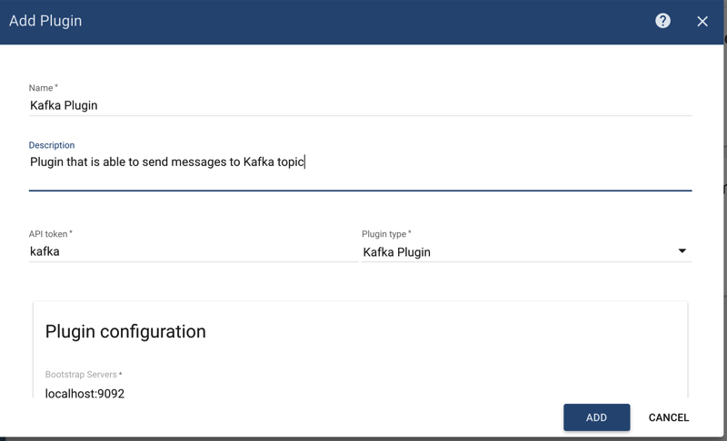
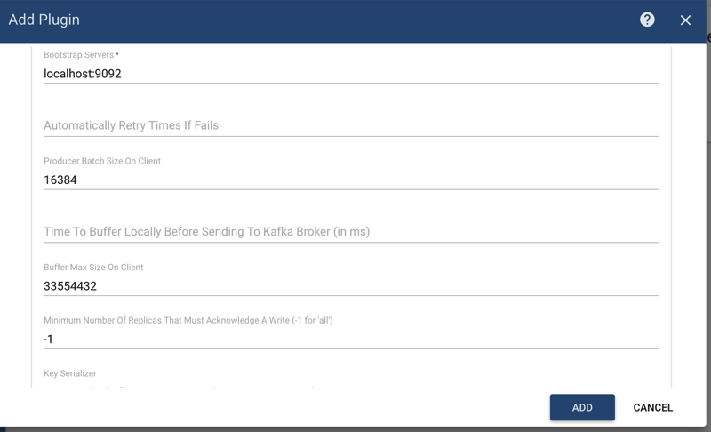
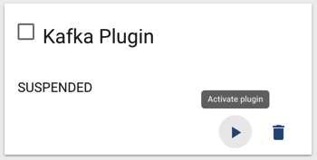
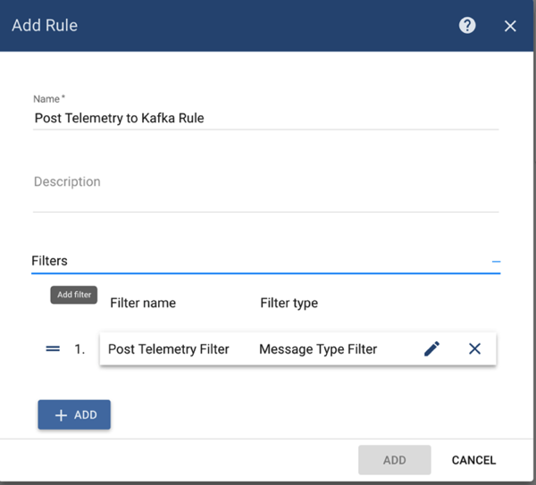
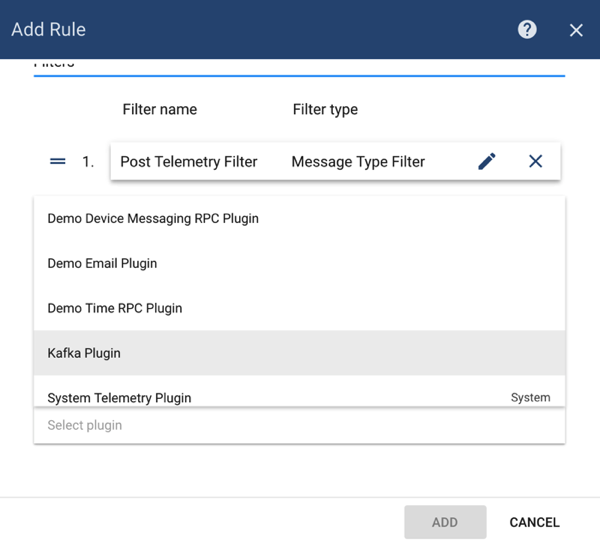
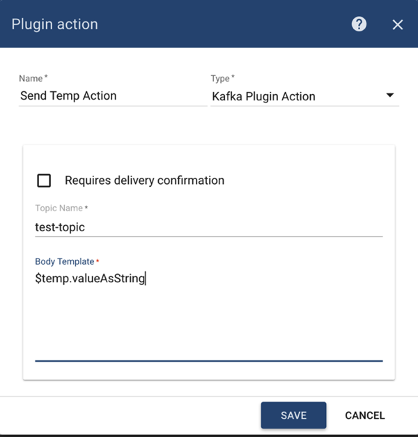

# kafka

## Overview

Kafka plugin is responsible for sending messages to Kafka brokers triggered by specific rules

## Configuration

You can specify following configuration parameters:

* _bootstrap servers_ - list of kafka brokers
* _number of attempts to reconnect to kafka if connection fails_
* _number of messages to unit into batch on client_
* _time to buffer locally before sending to kafka broker \(in ms\)_
* _buffer max size on client_
* _minimum number of replicas that must acknowledge a write_
* _topic key serializer_ by default - org.apache.kafka.common.serialization.StringSerializer
* _topic value serializer_ by default - org.apache.kafka.common.serialization.StringSerializer
* any other additional properties could be provided for kafka broker connection

## Server-side API

This plugin does not provide any server-side API.

## Example

In this example, we are going to demonstrate how you can configure this extension to be able to send a message to Kafka topic every time new telemetry message for the device arrives.

Prerequisites before contining Kafka extension configuration:

* Kafka broker is up and running
* Appropriate Kafka Topic created
* ThingsBoard is up and running

### Kafka Plugin Configuration

Let's configure Kafka plugin first. Go to _Plugins_ menu and create new plugin:





Please set correctly Kafka Bootstrap Servers URL and any other parameters located in plugin configuration section that is suitable for your case so Kafka extension is able to connect to Kafka broker.

Click on _'Activate'_ plugin button:



### Kafka Rule Configuration

Now it's time to create appropriate Rule.



Add filter for **POST\_TELEMETRY** message type:


Click _'Add'_ button to add filter.

Then select _'Kafka Plugin'_ in the drop-down box for the Plugin field:



Add action that will send temperature telemetry of device to particular kafka topic:



Click _'Add'_ button and then activate Rule.

### Sending Temperature Telemetry

Now you can send Telemetry message that contains _'temp'_ telemetry for any of your devices:

```javascript
{"temp":73.4}
```

You should see **'73.4'** message in appropriate Kafka topic once you'll post this message.

Here is an example of a command that publish single telemetry message to locally installed ThingsBoard:

```bash
mosquitto_pub -d -h "localhost" -p 1883 -t "v1/devices/me/telemetry" -u "$ACCESS_TOKEN" -m '{"temp":73.4}'
```

