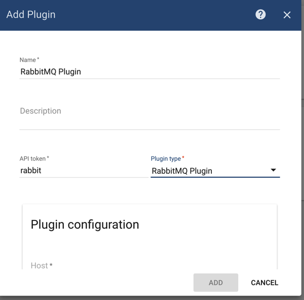
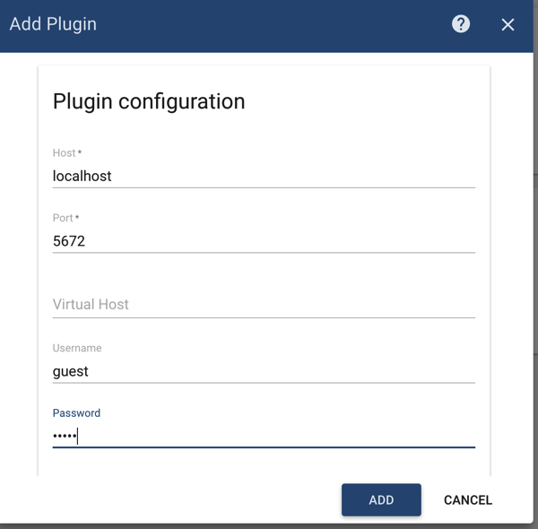
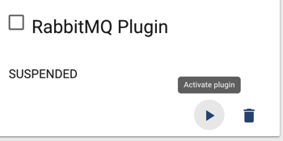
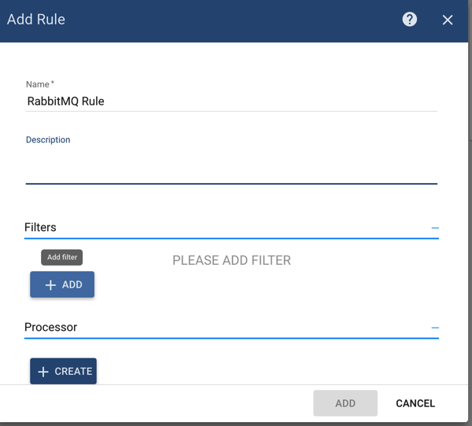
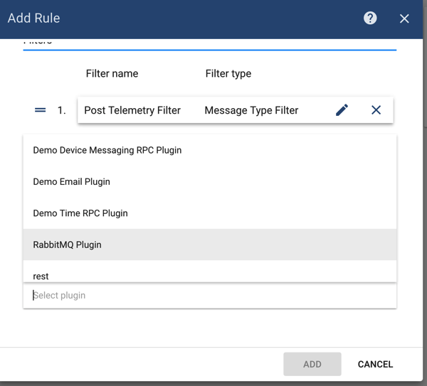
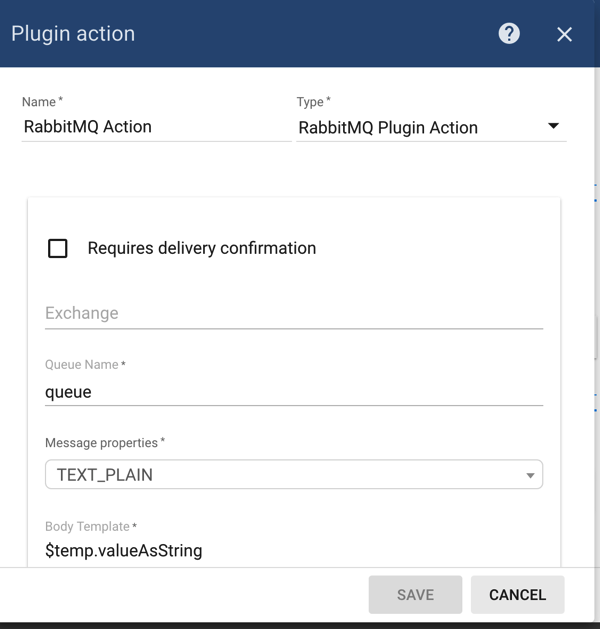

# rabbitmq

## Overview

RabbitMQ plugin is responsible for sending messages to RabbitMQ instances triggered by specific rules

## Configuration

You can specify following configuration parameters:

* rabbitmq instance host
* rabbitmq instance port
* rabbitmq virtual host
* username for authorization
* password for authorization
* enables automation connection revovery in case of failure
* connection timeout
* handshake timeout
* additional client properties that could be usefull for connecting to specific rabbitmq instances

## Server-side API

This plugin does not provide any server-side API.

## Example

In this example, we are going to demonstrate how you can configure RabbitMQ extension to be able to send messages to particular queue every time new telemetry message for the device arrives.

Prerequisites before continuing RabbitMQ extension configuration:

* ThingsBoard is up and running
* RabbitMQ instance is up and running

### RabbitMQ Plugin Configuration

Let's configure RabbitMQ plugin first. Go to _Plugins_ menu, click on a '+' button and create new plugin:





Please set host, port and credentials correctly so extension is able to connect to RabbitMQ broker.

Save plugin and click on _'Activate'_ plugin button:



### RabbitMQ Rule Configuration

Now it's time to create appropriate Rule.



Add filter for **POST\_TELEMETRY** message type:


Click _'Add'_ button to add the filter.

Then select _'RabbitMQ Plugin'_ in the drop-down box for the Plugin field:



Add action that will send temperature telemetry of device to particular RabbitMQ queue:



Click _'Add'_ button and then activate Rule.

### Sending Temperature Telemetry

Now for any of your devices send Telemetry message that contains _'temp'_ telemetry:

```javascript
{"temp":73.4}
```

You should receive message **'73.4'** in appropriate RabbitMQ queue once you'll post this message.

Here is an example of a command that publish single telemetry message to locally installed ThingsBoard:

```bash
mosquitto_pub -d -h "localhost" -p 1883 -t "v1/devices/me/telemetry" -u "$ACCESS_TOKEN" -m '{"temp":73.4}'
```

