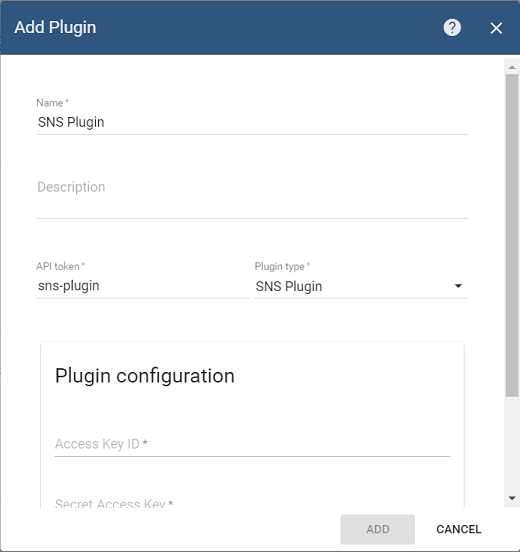
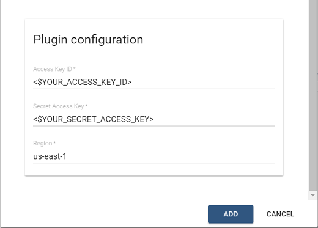
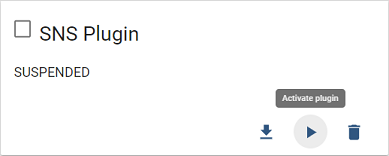
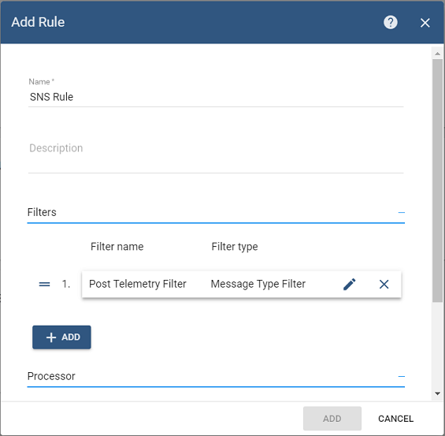
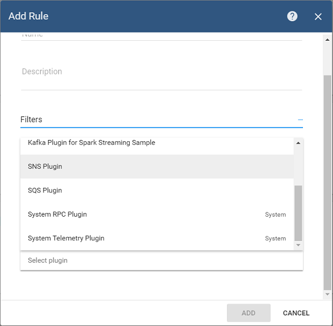
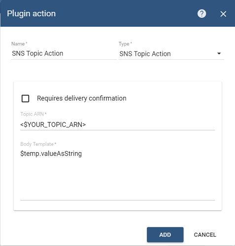
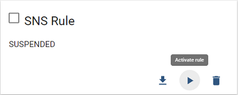
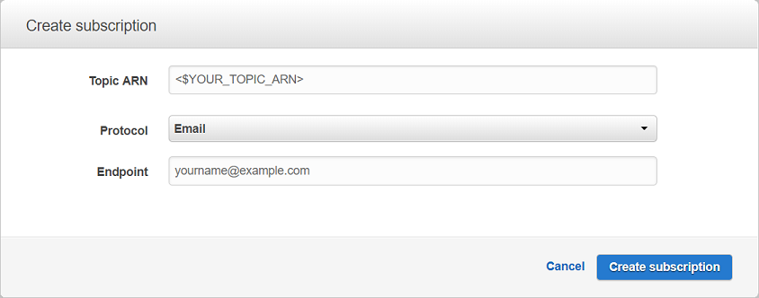
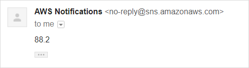

# sns

## Overview

SNS plugin is responsible for sending messages to Amazon Web Services Simple Notification Service topics triggered by specific rules

## Configuration

SNS Plugin has the following configuration parameters:

* _Access Key ID_
* _Secret Access Key_
* _Region_

_Access Key ID_ and _Secret Access Key_ are the credentials of an AWS IAM User with programmatic access. More information on AWS access keys can be found [here](http://docs.aws.amazon.com/IAM/latest/UserGuide/id_credentials_access-keys.html)

_Region_ must correspond to the one in which the SNS Queue\(s\) are created. Current list of AWS Regions can be found [here](http://docs.aws.amazon.com/general/latest/gr/rande.html)

## Server-side API

This plugin does not provide any server-side API.

## Example

In this example, we are going to demonstrate how you can configure this extension to be able to send a message to an SNS Topic every time new telemetry message for the device arrives.

Prerequisites before contining Kafka extension configuration:

* AWS IAM User is created and Access Key ID/Secret Access Key are obtained
* SNS Topic is created
* ThingsBoard is up and running

The information on how to create SNS Topic can be found [here](http://docs.aws.amazon.com/sns/latest/dg/CreateTopic.html)

### SNS Plugin Configuration

Let's configure SNS plugin first. Go to _Plugins_ menu and create new plugin:





Make sure to replace &lt;$YOUR\_ACCESS\_KEY\_ID&gt; and &lt;$YOUR\_SECRET\_ACCESS\_KEY&gt; placeholders with the actual values and set the right region.

Click on _'Activate'_ plugin button:



### SNS Rule Configuration

In order to create SNS Rule, go to Rules screen and click 'Add New rule' button.



Add filter for **POST\_TELEMETRY** message type:


Click _'Add'_ button to add filter.

Then select _'SNS Plugin'_ in the drop-down box for the Plugin field:



Add action that will send temperature telemetry of device to the particular SNS Topic:



Click _'Add'_ button and then activate Rule.



### Creating Email SNS Subscription

SNS is a push-based service, so we need to create a subscription in order to receive messages from it. In AWS console under SNS Dashboard, go to **Topics**, select your topic, then click **Action -&gt; Subscribe to topic**. In the window that appears, select Protocol: Email amd enter your email address:



### Sending Temperature Telemetry

Now you can send Telemetry message that contains _'temp'_ telemetry for any of your devices:

```javascript
{"temp":88.2}
```

Here is an example of a command that publish single telemetry message to locally installed ThingsBoard:

```bash
mosquitto_pub -d -h "localhost" -p 1883 -t "v1/devices/me/telemetry" -u "$ACCESS_TOKEN" -m "{'temp':88.2}"
```

Now you should receive an email with the telemetry data in your mailbox:



