# sqs

## Overview

SQS plugin is responsible for sending messages to Amazon Web Services Simple Queue Service queues triggered by specific rules

## Configuration

SQS Plugin has the following configuration parameters:

* _Access Key ID_
* _Secret Access Key_
* _Region_

_Access Key ID_ and _Secret Access Key_ are the credentials of an AWS IAM User with programmatic access. More information on AWS access keys can be found [here](http://docs.aws.amazon.com/IAM/latest/UserGuide/id_credentials_access-keys.html)

_Region_ must correspond to the one in which the SQS Queue\(s\) are created. Current list of AWS Regions can be found [here](http://docs.aws.amazon.com/general/latest/gr/rande.html)

## Server-side API

This plugin does not provide any server-side API.

## Example

In this example, we are going to demonstrate how you can configure this extension to be able to send a message to both SQS Sandard and FIFO queues every time new telemetry message for the device arrives.

Prerequisites before contining Kafka extension configuration:

* AWS IAM User is created and Access Key ID/Secret Access Key are obtained
* SQS Standard Queue is created
* SQS FIFO Queue is created
* ThingsBoard is up and running

The information on how to create SQS Queues can be found [here](http://docs.aws.amazon.com/AWSSimpleQueueService/latest/SQSDeveloperGuide/sqs-create-queue.html)

### SQS Plugin Configuration

Let's configure SQS plugin first. Go to _Plugins_ menu and create new plugin:

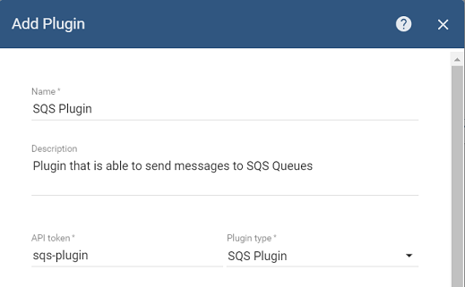

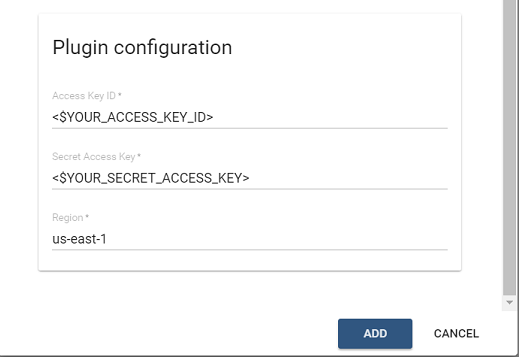

Make sure to replace &lt;$YOUR\_ACCESS\_KEY\_ID&gt; and &lt;$YOUR\_SECRET\_ACCESS\_KEY&gt; placeholders with the actual values and set the right region.

Click on _'Activate'_ plugin button:

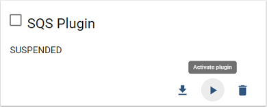

### SQS Standard Queue Rule Configuration

[SQS Standard Queue](http://docs.aws.amazon.com/AWSSimpleQueueService/latest/SQSDeveloperGuide/standard-queues.html) does not preserve the order in which messages have arrived and ensures _At-Least-Once_ message delivery.

In order to create SQS Standard Queue Rule, go to Rules screen and click 'Add New rule' button.

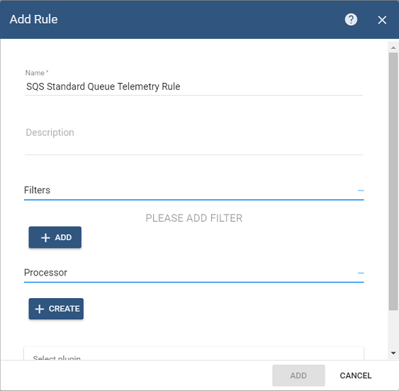

Add filter for **POST\_TELEMETRY** message type:


Click _'Add'_ button to add filter.

Then select _'SQS Plugin'_ in the drop-down box for the Plugin field:

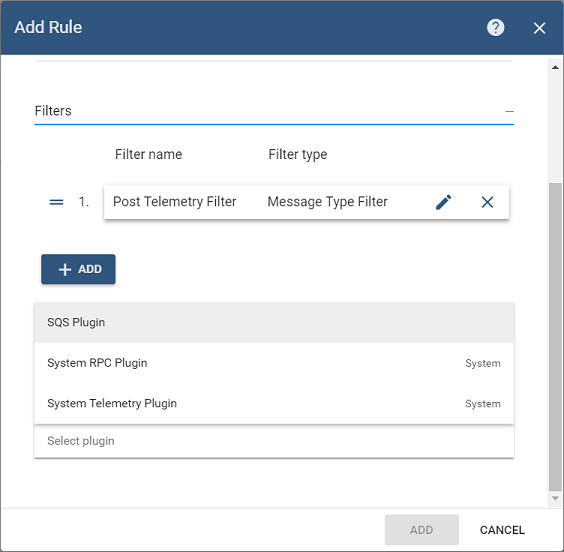

Add action that will send temperature telemetry of device to the particular SQS Standard Queue:

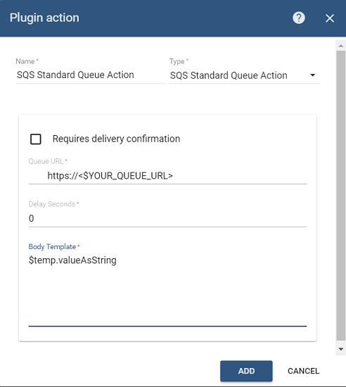

Click _'Add'_ button and then activate Rule.

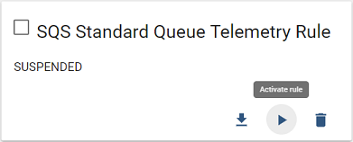

### Sending Temperature Telemetry

Now you can send Telemetry message that contains _'temp'_ telemetry for any of your devices:

```javascript
{"temp":73.4}
```

Here is an example of a command that publish single telemetry message to locally installed ThingsBoard:

```bash
mosquitto_pub -d -h "localhost" -p 1883 -t "v1/devices/me/telemetry" -u "$ACCESS_TOKEN" -m "{'temp':73.4}"
```

Now you should be able to see the message available in your SQS Standard Queue through AWS console:

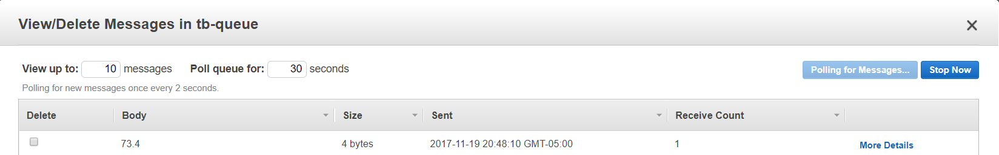

### SQS FIFO Queue Rule Configuration

[SQS FIFO Queue](http://docs.aws.amazon.com/AWSSimpleQueueService/latest/SQSDeveloperGuide/FIFO-queues.html) maintains First-In-First-Out order Per Message Group ID and ensures exactly one processing. ThingsBoard SQS Plugin uses Device ID as Message Group ID when sending a message to SQS FIFO Queue. It means that FIFO order will be maintained on per-device basis.

SQS FIFO Queue Rule configation is very similar to the SQS Standard Queue configuration with subtle differences.

In order to create SQS FIFO Queue Rule, go to Rules screen and click 'Add New rule' button.

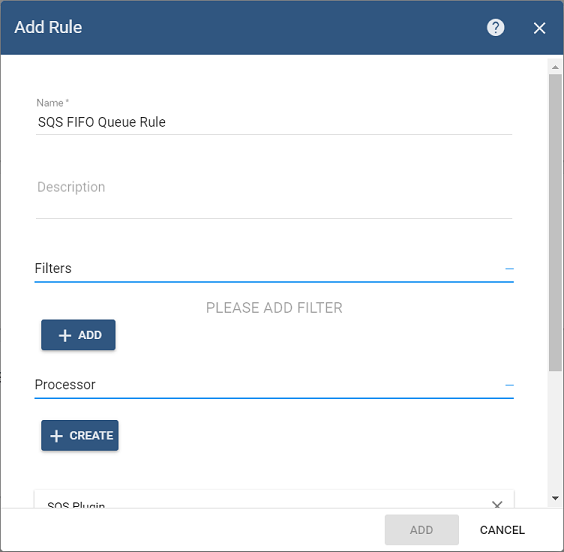

Add filter for **POST\_TELEMETRY** message type:


Click _'Add'_ button to add filter.

Then select _'SQS Plugin'_ in the drop-down box for the Plugin field:


Add action that will send temperature telemetry of device to the particular SQS FIFO Queue:

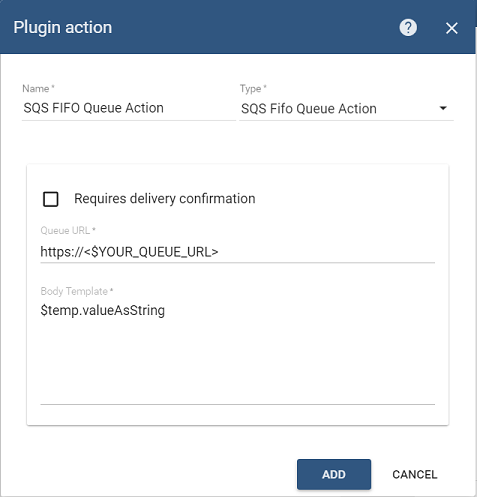

Click _'Add'_ button and then activate Rule.

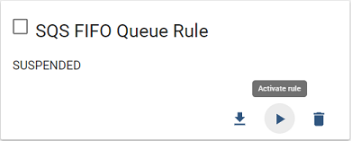

### Sending Temperature Telemetry

Now you can send Telemetry message that contains _'temp'_ telemetry for any of your devices:

```javascript
{"temp":68.3}
```

Here is an example of a command that publish single telemetry message to locally installed ThingsBoard:

```bash
mosquitto_pub -d -h "localhost" -p 1883 -t "v1/devices/me/telemetry" -u "$ACCESS_TOKEN" -m "{'temp':68.3}"
```

Now you should be able to see the message available in your SQS FIFO Queue through AWS console:

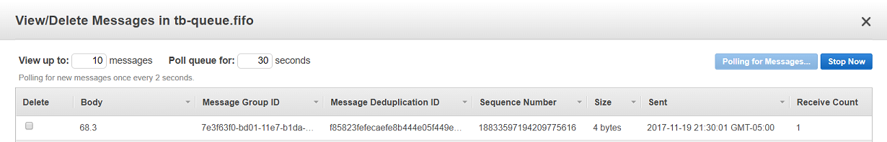

