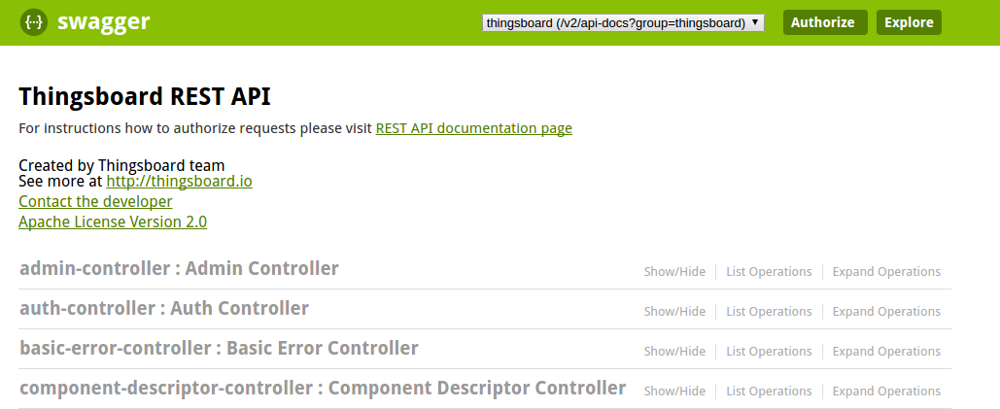

# rest-api

* TOC

  {:toc}

## Swagger UI

ThingsBoard REST API may be explored using Swagger UI. You can explore REST API of the live-demo server using this [**Swagger UI link.**](https://demo.thingsboard.io/swagger-ui.html)

To explore REST API provided by ThingsBoard Professional Edition please use the following [**Swagger UI link.**](https://cloud.thingsboard.io/swagger-ui.html)

Once you will install ThingsBoard server you can open UI using the following URL:

```text
http://YOUR_HOST:PORT/swagger-ui.html
```

## REST API Auth

ThingsBoard uses JWT for request auth. You will need to populate "X-Authorization" header using "Authorize" button in the top-right corner of the Swagger UI.



In order to get the JWT token, you need to execute the following request:

In case of local installation:

* replace **$THINGSBOARD\_URL** with **127.0.0.1:8080**

In case of live-demo server:

* replace **$THINGSBOARD\_URL** with **demo.thingsboard.io**
* replace **tenant@thingsboard.org** with your live-demo username \(email\)
* replace **tenant** password with your live-demo password

  See [**live-demo**](https://github.com/caoyingde/thingsboard.github.io/tree/9437083b88083a9b2563248432cbbe460867fbaf/docs/user-guide/live-demo/README.md) page for more details how to get your account.

* Now, you should set  'X-Authorization' to "Bearer $YOUR\_JWT\_TOKEN"  

