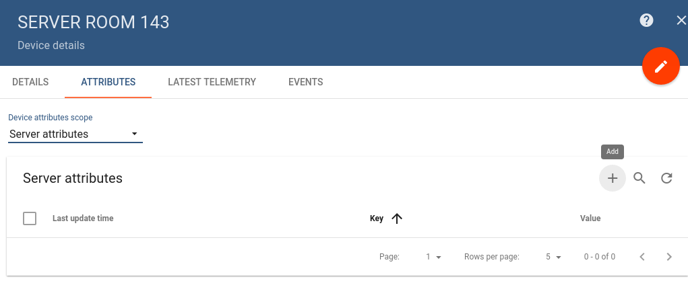
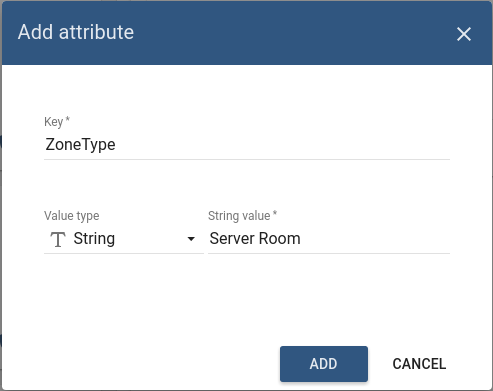
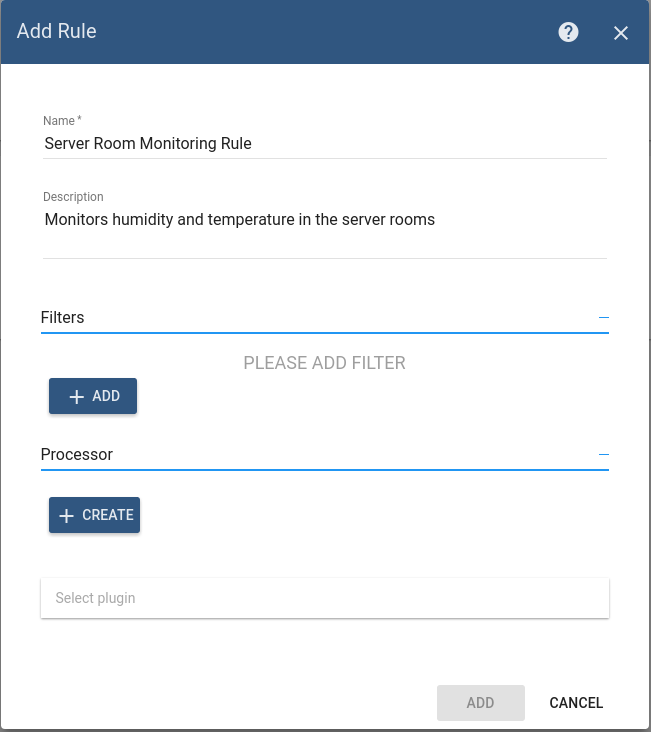
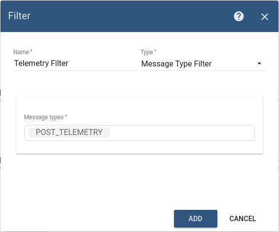
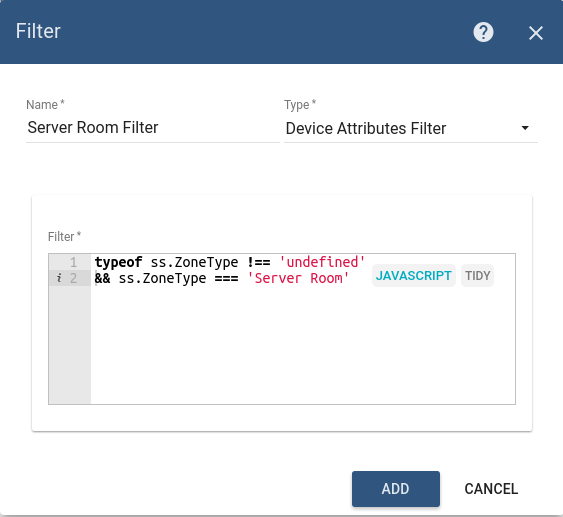
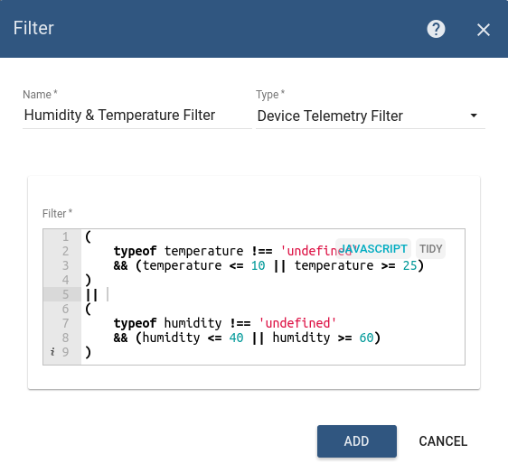
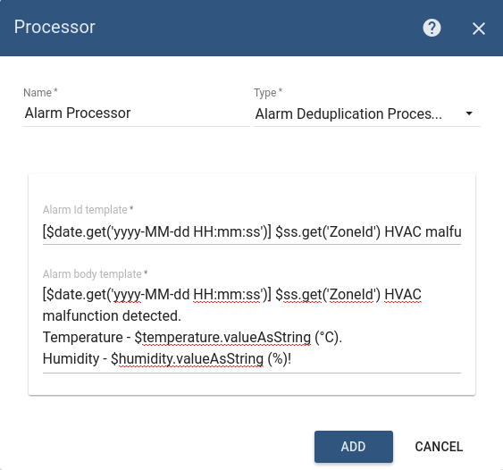
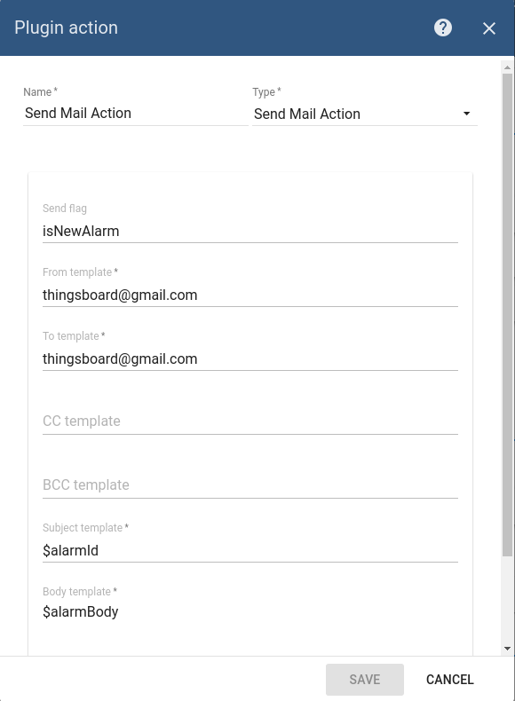
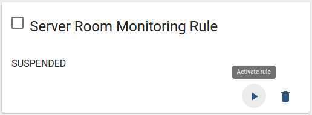
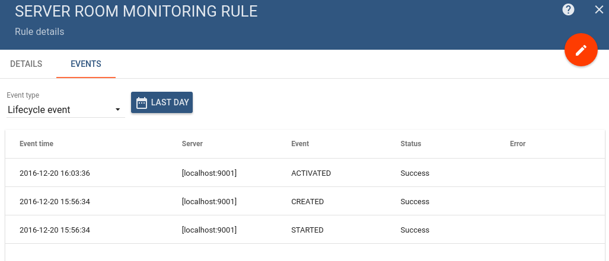

# basic-rules

* TOC

  {:toc}

This tutorial will demonstrate how to configure Rule that will generate Alarm when certain device reports temperature or humidity that exceeds certain thresholds.

Let's assume that we have devices that are able to report humidity and temperature values. We have one device per room \(zone\) in the building or other facility and we want to specify different rules based on zone type.

## Assumptions

We assume you have already configured email plugin that will distribute generated alarms to recipients. You can follow previous [tutorial](https://github.com/caoyingde/thingsboard.github.io/tree/9437083b88083a9b2563248432cbbe460867fbaf/docs/samples/alarms/mail/README.md) to do this.

## How it works?

We will provision simple rule that filters incoming data using:

* "Message type" filter to react on telemetry data.
* "Device Attributes" filter to process data from a device that has certain room type as a server side attribute.
* "Device Telemetry" filter to detect humidity and temperature values that are out of pre-configured range.

## Device provisioning

Let's create a Device and provision certain server-side attributes: ZoneId and ZoneType.

### Step 1. Create Device

Navigate to [devices](https://demo.thingsboard.io/devices) page and click on big red "+" button. Populate device name and description and click "Add" button.


### Step 2. Provision ZoneID and ZoneType attributes

Open device card that you have created. Navigate to "Attributes" tab and select "Server" attributes scope.



Click on the highlighted "+" button. Add two attributes "ZoneId" and "ZoneType" as shown below. We will use them later in the rule filters.

 

## Rule configuration

### Step 3. Create "Server Room Monitoring" Rule

Navigate to [rules](https://demo.thingsboard.io/rules) page and click on big red "+" button. Populate rule name and description first.



Our rule will contain three filters as described in "[how it works](basic-rules.md#how-it-works)" section.

### Step 4. Message type filter

Add filter based on message type \(see image below\).



### Step 5. Attributes filter

Add filter based on the server-side attributes \(see image below\).

```javascript
typeof ss.ZoneType !== 'undefined' && ss.ZoneType === 'Server Room'
```



### Step 6. Telemetry filter

```javascript
(
    typeof temperature !== 'undefined' 
    && (temperature <= 10 || temperature >= 25)
)
|| 
(
    typeof humidity !== 'undefined' 
    && (humidity <= 40 || humidity >= 60)
)
```

Add filter based on the sensor reading \(see image below\).



### Step 7. Alarm Processor

Let's add simple processor that will generate and save alarm to the database based on templates below.

Alarm ID:

```text
[$date.get('yyyy-MM-dd HH:mm')] $ss.get('ZoneId') HVAC malfunction detected!
```

Alarm Body:

```text
[$date.get('yyyy-MM-dd HH:mm:ss')] $ss.get('ZoneId') HVAC malfunction detected. 
Temperature - $temperature.valueAsString (°C). 
Humidity - $humidity.valueAsString (%)!
```



**NOTE** Alarm Id is a unique identifier. If there will be multiple events that match filters, alarms will be de-duplicated based on the Alarm Id. An email will be sent once per alarm.

In our case, we use a timestamp that is truncated to minutes to make sure that we will send an email once per minute or less frequently.

### Step 8. Rule Action

Select "SendGrid Email Plugin" from previous [tutorial](https://github.com/caoyingde/thingsboard.github.io/tree/9437083b88083a9b2563248432cbbe460867fbaf/docs/samples/alarms/mail/README.md) and click on "Create" button. Don't forget to replace "thingsboard@gmail.com" with your email address.



### Step 9. Save and Activate Rule

Once a rule is saved successfully, don't forget to activate it by clicking on "Activate" button \(see image below\).



## Dry run

Let's check our configuration by publishing some telemetry data. We will use access token from the device that we have created in the [first step](basic-rules.md#step1-create-device).

```text
mosquitto_pub -d -h "demo.thingsboard.io" -t "v1/devices/me/telemetry" -u "$YOUR_ACCESS_TOKEN" -m "{'temperature':42, 'humidity':74}"
```

## Troubleshooting

If you have configured something wrong, you should see errors logged on the corresponding tab:



If there is no error in the rule, but you can't see the email - check errors in the target plugin.

