# spark-integration-with-thingsboard

* TOC

  {:toc}

ThingsBoard rule engine supports basic analysis of incoming telemetry data, for example, threshold crossing. The idea behind rule engine is to provide functionality to route data from IoT Devices to different plugins, based on device attributes or the data itself.

However, most of the real-life use cases also require the support of advanced analytics: machine learning, predictive analytics, etc.

This tutorial will demonstrate how you can:

* route telemetry device data from ThingsBoard to Kafka topic using the built-in plugin.
* aggregate data from multiple devices using a simple Apache Spark application.
* push results of the analytics back to ThingsBoard for persistence and visualization.

The analytics in this tutorial is, of course, quite simple, but our goal is to highlight the integration steps.

### Overview

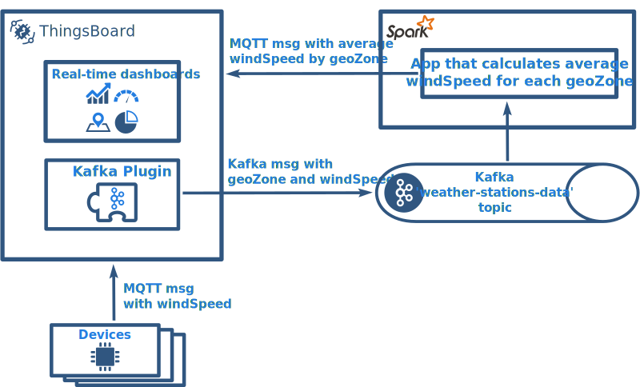

Let's assume we have a large number of weather stations that are located in different geo-location zones. ThingsBoard is used to collect, store and visualize wind speed from these stations, but we are also interested in average wind speed in each geo-location zone. Once again, this is a completely fake scenario just to demonstrate the integration of all components.

In this scenario we are going to upload wind speed as a telemetry reading, however, the geo-location zone will be a static attribute of the weather station device. This makes sense, since telemetry readings are going to change often, and the geo-location is static.

We will analyze real-time data from multiple devices using [Spark Streaming](http://spark.apache.org/docs/latest/streaming-programming-guide.html) job with 10 seconds batch window.

In order to store and visualize the results of the analytics, we are going to create one virtual device for each geo-location zone. This is possible using special ThingsBoard MQTT Gateway [API](https://github.com/caoyingde/thingsboard.github.io/tree/9437083b88083a9b2563248432cbbe460867fbaf/docs/reference/gateway-mqtt-api/README.md). This API allows to efficiently stream data from multiple devices using single MQTT session. So, in our case, the Spark Job itself acts as a gateway that publishes data on behalf of several virtual devices. Let's name this gateway as an **Analytics Gateway**.

### Prerequisites

The following services must be up and running:

* ThingsBoard [instance](https://github.com/caoyingde/thingsboard.github.io/tree/9437083b88083a9b2563248432cbbe460867fbaf/docs/user-guide/install/installation-options/README.md)
* Kafka. This guide assumes that you have it running on localhost on port 9092

We also assume that you are familiar with Kafka and Spark and have also prepared those environments for this tutorial.

The [sample application](https://github.com/thingsboard/samples/tree/master/spark-kafka-streaming-integration) used in ths tutorial has a dependency on **org.thingsboard.common.data** project. It is not in the public maven repository, so you need to [build ThingsBoard from source](https://github.com/caoyingde/thingsboard.github.io/tree/9437083b88083a9b2563248432cbbe460867fbaf/docs/user-guide/install/building-from-source/README.md) before proceeding with this tutorial.

### ThingsBoard configuration steps

### Step 1. Kafka Plugin Configuration

We need to configure Kafka Plugin that will be used to push telemetry data to Kafka. You can find the detailed description of Kafka Plugin [here](https://github.com/caoyingde/thingsboard.github.io/tree/9437083b88083a9b2563248432cbbe460867fbaf/docs/reference/plugins/kafka/README.md).

**NOTE** If you are running ThingsBoard from your IDE, you need to add Kafka plugin dependency to **application/pom.xml**

```markup
<dependencies>
...
    <dependency>
       <groupId>org.thingsboard.extensions</groupId>
        <artifactId>extension-kafka</artifactId>
        <version>${project.version}</version>
    </dependency>
...
</dependencies>
```

The reason is that when ThingsBoard is run as a service, it dynamically adds Kafka along with other plugins to classpath, which is not the case when running from IDE

[**Download**](https://github.com/caoyingde/thingsboard.github.io/tree/9437083b88083a9b2563248432cbbe460867fbaf/docs/samples/analytics/resources/kafka_plugin_for_spark_streaming_sample.json) the json with plugin descriptor and use [**these instructions**](https://github.com/caoyingde/thingsboard.github.io/tree/9437083b88083a9b2563248432cbbe460867fbaf/docs/user-guide/ui/plugins/README.md#plugin-import) to import it to your instance.


Don't forget to **activate** your new plugin instance by clicking on the corresponding button in plugin details!

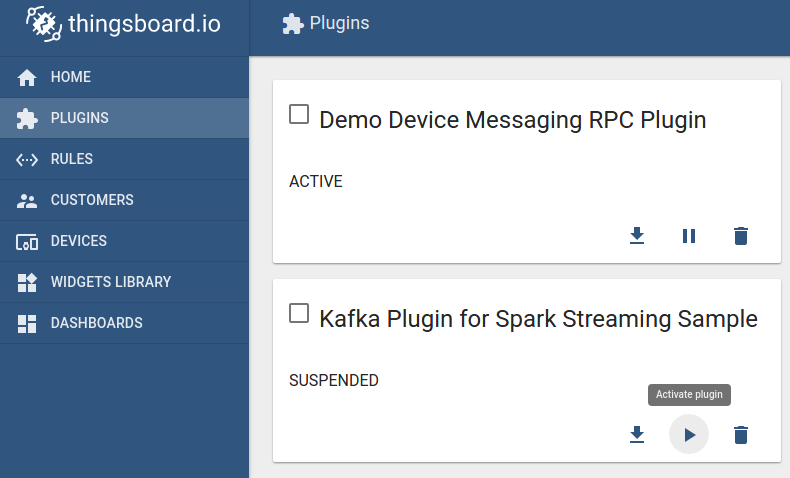

### Step 2. Configuration of Telemetry Forwarding Rule

Now we need to configure the Rule that will be used to push wind speed data from the weather stations to Kafka.

[**Download**](https://github.com/caoyingde/thingsboard.github.io/tree/9437083b88083a9b2563248432cbbe460867fbaf/docs/samples/analytics/resources/windspeed_telemetry_rule.json) the json with rule descriptor and use these [**instructions**](https://github.com/caoyingde/thingsboard.github.io/tree/9437083b88083a9b2563248432cbbe460867fbaf/docs/user-guide/ui/rules/README.md#rule-import) to import it to your instance.

Don't forget to **activate** your new rule instance by clicking on the corresponding button in rule details!

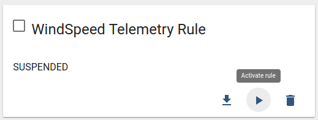

Let's review the main rule configuration below.

#### Attributes filter

ThingsBoard may process data from completely different devices. We will use filter by device attributes in order to filter out data that belongs to Weather Station devices.

The filter expression below validates that two attributes are set for a particular device: **deviceType** and **geoZone**. You may notice that we check that **deviceType** is equal to "WeatherStation". The **cs** variable is a map that contains all client-side attributes. See corresponding [**filter**](https://github.com/caoyingde/thingsboard.github.io/tree/9437083b88083a9b2563248432cbbe460867fbaf/docs/reference/filters/device-attributes-filter/README.md) documentation for more details.

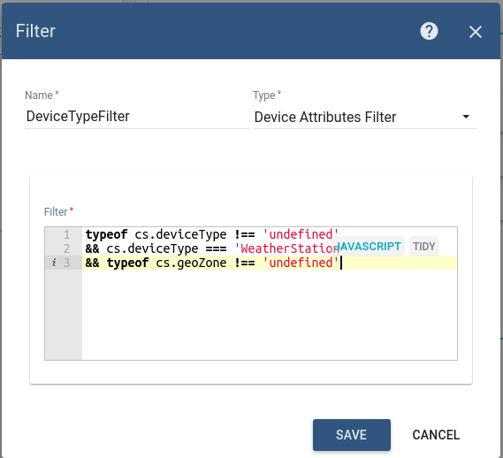

#### Timeseries data filter

Each device connected to ThingsBoard may upload multiple telemetry keys simultaneously or independently. In some use cases, you may need to process only a certain sub-set of data. We will use telemetry data filter to achieve this.

The filter expression below validates that **windSpeed** telemetry is present in the processed message.

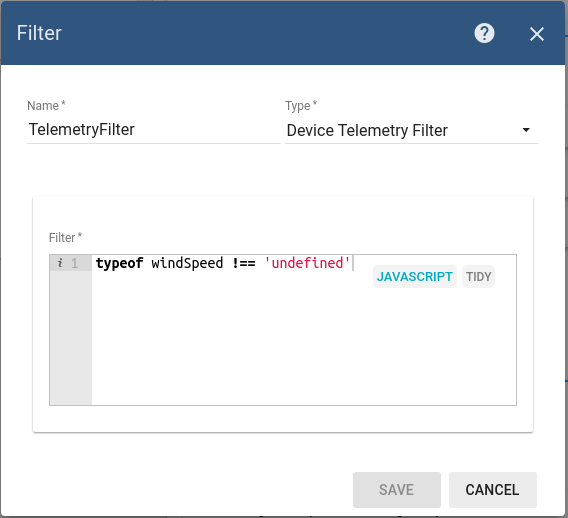

See corresponding [**filter**](https://github.com/caoyingde/thingsboard.github.io/tree/9437083b88083a9b2563248432cbbe460867fbaf/docs/reference/filters/device-telemetry-filter/README.md) documentation for more details.

#### Kafka plugin action

Topic name in our case is **'weather-stations-data'** and the message is a valid JSON that uses client-side attribute **geoZone** and **windSpeed** telemetry value:

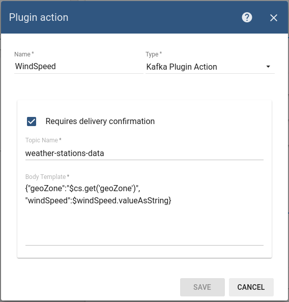

### Step 3. Wind Turbine Device Configuration

Now let us create three devices that we define as **Wind Turbine 1**, **Wind Turbine 2** and **Wind Turbine 3** with the Device Type of **WeatherStation**. We will send the telemetry data from these devices via MQTT later. Please, make sure to set the device type to 'WeatherStation' for all three devices:

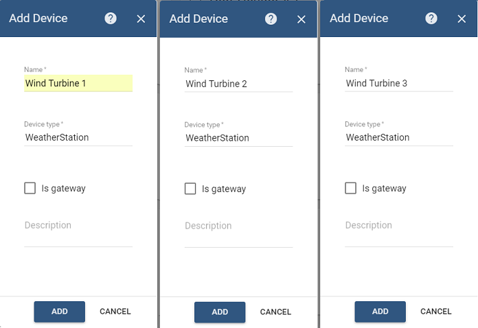

Once added, for each device open the device card, click on 'Copy Access Token' button and store the token somewhere. We'll use these tokens later in Python scripts sending MQTT data to ThingsBoard.

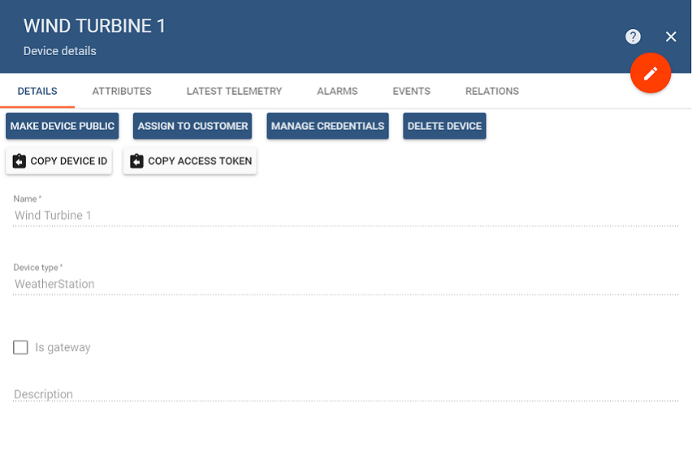

### Step 4: Create an Asset

Now we have to create an Asset which will receive the aggregated data from Spark Application. Add a new Asset on the Assets screen. Please, make sure to set the Asset type to WeatherStation:

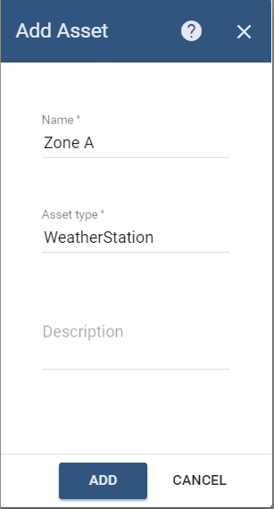

## Spark Application

### Step 5. Download the sample application source code

Feel free to grab the [code from this sample ThingsBoard repository](https://github.com/thingsboard/samples/) and build the samples project with maven:

```bash
mvn clean install
```

The sample application that we are interested in is in the **samples/spark-kafka-streaming-integration**. Go ahead and add that maven project to your favorite IDE.

### Step 6. Dependencies review

The sample application was developed using Spark version **2.1.0**. Please consider this if you use a different version of Spark because in this case you may need to use a different version of Kafka Streaming API as well.

Dependencies that are used in the sample project:

```markup
<!-- Spark, Spark Streaming and Kafka Dependencies -->
<dependency>
    <groupId>org.apache.spark</groupId>
    <artifactId>spark-core_2.11</artifactId>
    <version>${spark-version}</version>
</dependency>
<dependency>
    <groupId>org.apache.spark</groupId>
    <artifactId>spark-streaming_2.11</artifactId>
    <version>${spark-version}</version>
</dependency>
<dependency>
    <groupId>org.apache.spark</groupId>
    <artifactId>spark-streaming-kafka-0-10_2.11</artifactId>
    <version>${spark-version}</version>
</dependency>
<!-- HTTP Client to to send messages to ThingsBoard through REST API-->
<dependency>
    <groupId>org.springframework</groupId>
    <artifactId>spring-web</artifactId>
    <version>${spring.version}</version>
</dependency>
```

### Step 7. Source code review

The Spark Application logic is concentrated mainly in two classes:

* **SparkKafkaStreamingDemoMain** is listening to the Kafka topic and calculates the averages
* **RestClient** finds the ThingsBoard Asset by name and pushes the aggregated data to it.

  Below is a description of particular code snippet from **SparkKafkaStreamingDemoMain** class.

  Main constants are listed below: 

```java
// Kafka brokers URL for Spark Streaming to connect and fetched messages from.
private static final String KAFKA_BROKER_LIST = "localhost:9092";
// Time interval in milliseconds of Spark Streaming Job, 10 seconds by default.
private static final int STREAM_WINDOW_MILLISECONDS = 10000; // 10 seconds
// Kafka telemetry topic to subscribe to. This should match to the topic in the rule action.
private static final Collection<String> TOPICS = Arrays.asList("weather-stations-data");
```

Main processing logic is listed below:

```java
try (JavaStreamingContext ssc = new JavaStreamingContext(conf, new Duration(STREAM_WINDOW_MILLISECONDS))) {

    JavaInputDStream<ConsumerRecord<String, String>> stream =
            KafkaUtils.createDirectStream(
                    ssc,
                    LocationStrategies.PreferConsistent(),
                    ConsumerStrategies.<String, String>Subscribe(TOPICS, getKafkaParams())
            );

    stream.foreachRDD(rdd ->
    {
        // Map incoming JSON to WindSpeedAndGeoZoneData objects
        JavaRDD<WindSpeedAndGeoZoneData> windRdd = rdd.map(new WeatherStationDataMapper());
        // Map WindSpeedAndGeoZoneData objects by GeoZone
        JavaPairRDD<String, AvgWindSpeedData> windByZoneRdd = windRdd.mapToPair(d -> new Tuple2<>(d.getGeoZone(), new AvgWindSpeedData(d.getWindSpeed())));
        // Reduce all data volume by GeoZone key
        windByZoneRdd = windByZoneRdd.reduceByKey((a, b) -> AvgWindSpeedData.sum(a, b));
        // Map <GeoZone, AvgWindSpeedData> back to WindSpeedAndGeoZoneData
        List<WindSpeedAndGeoZoneData> aggData = windByZoneRdd.map(t -> new WindSpeedAndGeoZoneData(t._1, t._2.getAvgValue())).collect();
        // Push aggregated data to ThingsBoard Asset
        restClient.sendTelemetryToAsset(aggData);
    });

    ssc.start();
    ssc.awaitTermination();
}
```

The next section describes the **RestClient** class. Main constants are listed below:

```java
// ThingsBoard server URL
private static final String THINGSBOARD_REST_ENDPOINT = "http://localhost:8080";
// ThingsBoard Create Asset endpoint
private static final String CREATE_ASSET_ENDPOINT = THINGSBOARD_REST_ENDPOINT + "/api/asset";
// ThingsBoard Get WeatherStation Assets endpoint
private static final String GET_ALL_TENANT_ASSETS_ENDPOINT = THINGSBOARD_REST_ENDPOINT + "/api/tenant/assets?limit=100&type=WeatherStation";
// ThingsBoard Publish Asset telemetry endpoint template 
private static final String PUBLISH_ASSET_TELEMETRY_ENDPOINT = THINGSBOARD_REST_ENDPOINT + "/api/plugins/telemetry/ASSET/${ASSET_ID}/timeseries/values";
// ThingsBoard User login
private static final String USERNAME = "tenant@thingsboard.org";
// ThingsBoard User password
private static final String PASSWORD = "tenant";
```

The **getOrCreateAsset** method tries to get the Asset by name from **assetMap**. If no Asset with such name is found, it calls **createAsset** method which propagates a new Asset to ThingsBoard:

```java
private Asset getOrCreateAsset(String assetName) {
    Asset asset = assetMap.get(assetName);
    if (asset == null) {
        asset = createAsset(assetName);
        assetMap.put(assetName, asset);
    }
    return asset;
}

private Asset createAsset(String assetName) {
    Asset asset = new Asset();
    asset.setName(assetName);
    asset.setType(WEATHER_STATION);
    HttpHeaders requestHeaders = getHttpHeaders();
    HttpEntity<Asset> httpEntity = new HttpEntity<>(asset, requestHeaders);
    ResponseEntity<Asset> responseEntity = restTemplate.postForEntity(CREATE_ASSET_ENDPOINT, httpEntity, Asset.class);
    return responseEntity.getBody();
}
```

The following method iterates over the aggregated data list, strips off the **geoZone** attribute and sends the aggregated **windSpeed** to the Asset:

```java
public void sendTelemetryToAsset(List<WindSpeedAndGeoZoneData> aggData) {
    if (aggData.isEmpty()) {
        return;
    }
    for (WindSpeedAndGeoZoneData windSpeedGeoZoneata : aggData) {
        String assetName = windSpeedGeoZoneata.getGeoZone();
        if (StringUtils.isEmpty(assetName)) {
            return;
        }
        Asset asset = getOrCreateAsset(assetName);
        HttpHeaders requestHeaders = getHttpHeaders();
        HttpEntity<?> httpEntity = new HttpEntity<Object>(new WindSpeedData(windSpeedGeoZoneata.getWindSpeed()), requestHeaders);
        String assetPublishEndpoint = getAssetPublishEndpoint(asset.getId().getId());
        restTemplate.postForEntity(assetPublishEndpoint,
                httpEntity, Void.class);

    }
}
```

Now let's run **SparkKafkaStreamingDemoMain** class from the IDE or submit it to a Spark cluster. Sample app will be fetching all the messages from Kafka topic and send average wind speed telemetry to the appropriate Asset in _ThingsBoard_.

## Dry Run

Once _Kafka Plugin_ is configured, _'Analytics Gateway device'_ is provisioned and _Spark Streaming Application_ is running please start sending **windSpeed** telemetry from different devices.

The following commands will provision **deviceType** and **geoZone** attributes for the devices. Let us provision the **"geozone":"Zone A"** for **Wind Turbine 1** and **Wind Turbine 2**:

```text
 
```

For **Wind Turbine 3** let us set **"geozone" to "Zone B"**:

```text
 
```

Now let us send the telemetry for the **Wind Turbine 1**. The following [**send-randomized-windspeed-1.py**](https://github.com/caoyingde/thingsboard.github.io/tree/9437083b88083a9b2563248432cbbe460867fbaf/docs/samples/analytics/resources/send-randomized-windspeed-1.py) script will send randomized windSpeed values in the range between 30 and 35 inclusively. Just replace the **$WIND\_TURBINE\_1\_ACCESS\_TOKEN** with the actual value or set the environment variable:

```python
import paho.mqtt.client as mqtt
from time import sleep
import random

broker="test.mosquitto.org"
topic_pub='v1/devices/me/telemetry'

client = mqtt.Client()

client.username_pw_set("$WIND_TURBINE_1_ACCESS_TOKEN")
client.connect('127.0.0.1', 1883, 1)

while True:
    x = random.randrange(30, 36)
    print x
    msg = '{"windSpeed":"'+ str(x) + '"}'
    client.publish(topic_pub, msg)
    sleep(0.1)
```

The **Zone A** Asset will start recieving the aggregated windSpeed telemetry:

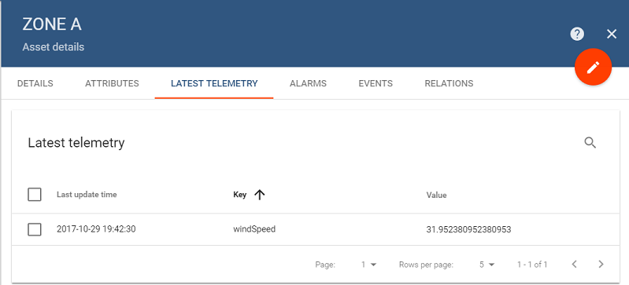

Let us keep this script running. Now, in a separate terminal window let's run [**send-randomized-windspeed-2.py**](https://github.com/caoyingde/thingsboard.github.io/tree/9437083b88083a9b2563248432cbbe460867fbaf/docs/samples/analytics/resources/send-randomized-windspeed-2.py) script which will start publishing telemetry data for **Wind Turbine 2**. The windSpeed for **Wind Turbine 2** will be fluctuating between 45 and 50:

```python
import paho.mqtt.client as mqtt
from time import sleep
import random

broker="test.mosquitto.org"
topic_pub='v1/devices/me/telemetry'

client = mqtt.Client()

client.username_pw_set("$WIND_TURBINE_2_ACCESS_TOKEN")
client.connect('127.0.0.1', 1883, 1)

while True:
    x = random.randrange(45, 51)
    print x
    msg = '{"windSpeed":"'+ str(x) + '"}'
    client.publish(topic_pub, msg)
    sleep(0.1)
```

As soon as both **Wind Turbine 1** and **Wind Turbine 2** have the **geoZone** attribute set to **Zone A**, the Spark application will average the windSpeed values from both devices and push the aggregate to **Zone A** Asset. Now **Zone A** Asset will receive the aggregate windSpeed something closer to the value of 40:

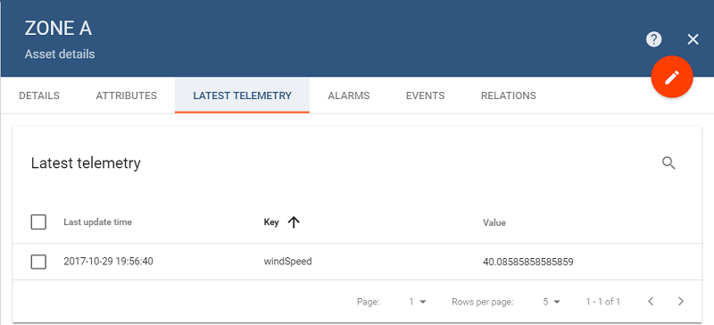

Now let us push telemetry for **Wind Turbine 3**. As you remember, it's **geoZone** is **Zone B**, and currently the asset with such name does not exist. What will happen is when the Spark application will receive the telemetry from **Wind Turbine 3**, it will detect that the target asset is missing and will propagate one to ThingsBoard.

The [**send-randomized-windspeed-3.py**](https://github.com/caoyingde/thingsboard.github.io/tree/9437083b88083a9b2563248432cbbe460867fbaf/docs/samples/analytics/resources/send-randomized-windspeed-3.py) will post telemetry for **Wind Turbine 3** with windSpeed fluctuating between 30 and 60:

```python
import paho.mqtt.client as mqtt
from time import sleep
import random

broker="test.mosquitto.org"
topic_pub='v1/devices/me/telemetry'

client = mqtt.Client()

client.username_pw_set("$WIND_TURBINE_3_ACCESS_TOKEN")
client.connect('127.0.0.1', 1883, 1)

while True:
    x = random.randrange(30, 61)
    print x
    msg = '{"windSpeed":"'+ str(x) + '"}'
    client.publish(topic_pub, msg)
    sleep(0.1)
```

Now you should see the new **Zone B** Asset propagated on Assets screen:


Open the **Zone B** Asset card to check out the telemetry:


