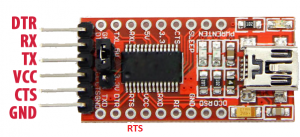
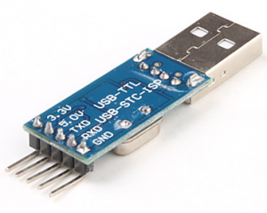
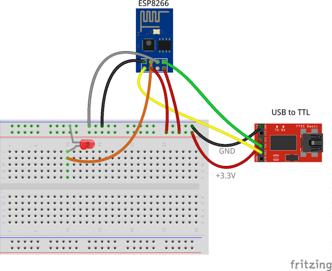
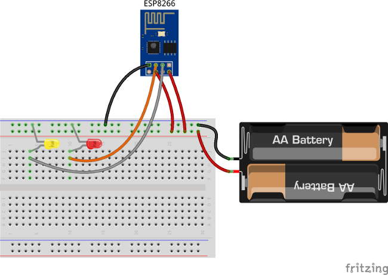
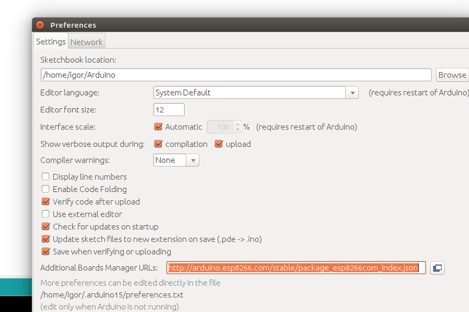
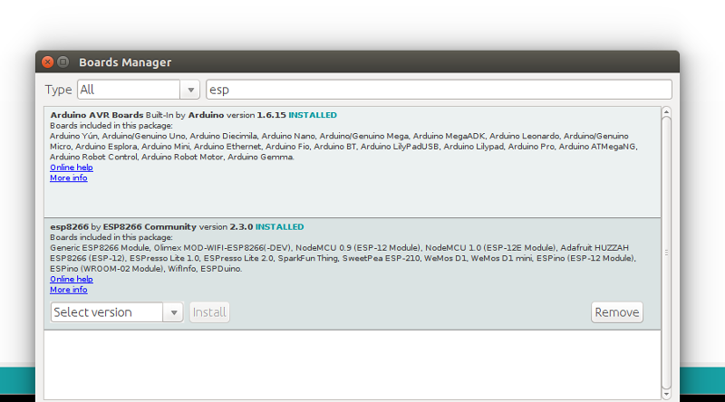

# gpio

* TOC

  {:toc}

## Introduction

This sample application will allow you to control GPIO of your ESP8266 device using ThingsBoard web UI. We will observe GPIO control using LEDs connected to the pins. The purpose of this application is to demonstrate ThingsBoard [RPC capabilities](https://github.com/caoyingde/thingsboard.github.io/tree/9437083b88083a9b2563248432cbbe460867fbaf/docs/user-guide/rpc/README.md).

The application that is running on ESP8266 is written using Arduino SDK which is quite simple and easy to understand. ESP8266 offers a complete and self-contained Wi-Fi networking solution. ESP8266 pushes data to ThingsBoard server via MQTT protocol by using [PubSubClient](https://github.com/knolleary/pubsubclient) library for Arduino. Current GPIO state and GPIO control widget is visualized using built-in customizable dashboard.

The video below demonstrates the final result of this tutorial.

  &lt;/div&gt;   
   

## List of hardware and pinouts

* [ESP8266 module](https://www.aliexpress.com/item/2PCS-ESP8266-Serial-Esp-01-WIFI-Wireless-Transceiver-Module-Send-Receive-LWIP-AP-STA/32302638695.html?spm=2114.03010208.3.163.FPBlcc&ws_ab_test=searchweb0_0,searchweb201602_2_10065_10068_10084_10083_10080_10082_10081_10060_10061_10062_10056_10055_10054_10059_10099_10078_10079_10093_427_10073_10103_10102_10096_10052_10050_10051,searchweb201603_3&btsid=1494d8a7-6202-4a69-a0e7-877ffa333243)

  

* USB to TTL
  * [With DTR & RTS](https://www.aliexpress.com/item/Free-shipping-1pcs-FT232RL-FTDI-USB-3-3V-5-5V-to-TTL-Serial-Adapter-Module-for/32256920717.html?spm=2114.03010208.3.11.qSXSby&ws_ab_test=searchweb0_0,searchweb201602_2_10065_10068_10084_10083_10080_10082_10081_10060_10061_10062_10056_10055_10054_10059_10099_10078_10079_10093_427_10073_10103_10102_10096_10052_10050_10051,searchweb201603_3&btsid=54ef4b72-5ab0-4ce6-aa89-74726d95c099)

    

  * Or [Without DTR & RTS](https://www.aliexpress.com/item/1pcs-lot-PL2303-USB-To-RS232-TTL-Converter-Adapter-Module-with-Dust-proof-Cover-PL2303HX/32642301991.html?spm=2114.03010208.3.50.WdAM18&ws_ab_test=searchweb0_0,searchweb201602_2_10065_10068_10084_10083_10080_10082_10081_10060_10061_10062_10056_10055_10054_10059_10099_10078_10079_10093_427_10073_10103_10102_10096_10052_10050_10051,searchweb201603_3&btsid=9ac20e48-da8c-4a0f-8f33-d40c241fe5a3)

    
* Breadboard
* 2 female-to-female jumper wires
* 7 female-to-male jumper wires
* 2 LEDs
* 3.3V power source \(for example 2 AA batteries\)

## Wiring schemes

### Programming/flashing scheme

| ESP8266 Pin | USB-TTL Pin |
| :--- | :--- |
| ESP8266 VCC | USB-TTL VCC +3.3V |
| ESP8266 CH\_PD | USB-TTL VCC +3.3V |
| ESP8266 GND \(-\) | USB-TTL GND |
| ESP8266 GPIO 0 | USB-TTL GND |
| ESP8266 RX | USB-TTL TX |
| ESP8266 TX | USB-TTL RX |

| LED 1 Pin | USB-TTL Pin |
| :--- | :--- |
| cathode | USB-TTL GND |

| LED 1 Pin | ESP8266 Pin |
| :--- | :--- |
| anode | ESP8266 GPIO 2 |

The following picture summarizes the connections for this project in programming/debug mode:

### Final schema \(Battery Powered\)

| ESP8266 Pin | 3.3V power source |
| :--- | :--- |
| ESP8266 VCC | VCC+ |
| ESP8266 CH\_PD | VCC+ |
| ESP8266 GND \(-\) | VCC- |

| LED 1 Pin | ESP8266 Pin |
| :--- | :--- |
| anode | ESP8266 GPIO 2 |

| LED 1 Pin | 3.3V power source |
| :--- | :--- |
| cathode | VCC- |

| LED 2 Pin | ESP8266 Pin |
| :--- | :--- |
| anode | ESP8266 GPIO 0 |

| LED 2 Pin | 3.3V power source |
| :--- | :--- |
| cathode | VCC- |

The final picture:

### Provision your device

This step contains instructions that are necessary to connect your device to ThingsBoard.

Open ThingsBoard Web UI \([http://localhost:8080](http://localhost:8080)\) in browser and login as tenant administrator

* login: tenant@thingsboard.org
* password: tenant

Go to "Devices" section. Click "+" button and create a device with the name "ESP8266 Demo Device".

Once device created, open its details and click "Manage credentials". Copy auto-generated access token from the "Access token" field. Please save this device token. It will be referred to later as **$ACCESS\_TOKEN**.

Click "Copy Device ID" in device details to copy your device id to the clipboard. Paste your device id to some place, this value will be used in further steps.

### Provision your dashboard

Download the dashboard file using this [**link**](https://github.com/caoyingde/thingsboard.github.io/tree/9437083b88083a9b2563248432cbbe460867fbaf/docs/samples/esp8266/resources/esp8266_gpio_dashboard_v2.json). Use import/export [**instructions**](https://github.com/caoyingde/thingsboard.github.io/tree/9437083b88083a9b2563248432cbbe460867fbaf/docs/user-guide/ui/dashboards/README.md#dashboard-importexport) to import the dashboard to your ThingsBoard instance.

## Programming the ESP8266

### Step 1. ESP8266 and Arduino IDE setup.

In order to start programming ESP8266 device, you will need Arduino IDE installed and all related software.

Download and install [Arduino IDE](https://www.arduino.cc/en/Main/Software).

After starting Arduino IDE, open the preferences from the ‘file’ menu.

Paste the following URL to the “Additional board managers URL”: [http://arduino.esp8266.com/stable/package\_esp8266com\_index.json](http://arduino.esp8266.com/stable/package_esp8266com_index.json)

Close the screen by clicking the OK button.

Now we can add the board ESP8266 using the board manager.

In the menu tools, click on the menu option Board: “_Most likely Arduino UNO_”. There you will find the first option “Board Manager”.

Type in the search bar the 3 letters ESP. Locate and click on "_esp8266 by ESP8266 Community_". Click on install and wait for a minute to download the board.

**Note** that this tutorial was tested with the "_esp8266 by ESP8266 Community_" version 2.3.0.

In the menu Tools “Board “_Most likely Arduino UNO_” three new boards are added.

Select “Generic ESP8266 Module”.

Prepare your hardware according to the [Programming/flashing scheme](gpio.md#programmingflashing-schema). Connect USB-TTL adapter with PC.

In the menu Tools, select the corresponding port of the USB-TTL adapter. Open the serial monitor \(by pressing CTRL-Shift-M or from the menu Tools\). Set the key emulation to “Both NL & CR” and the speed to 115200 baud. This can be set at the bottom of the terminal screen.

### Step 2. Install Arduino libraries.

Open Arduino IDE and go to **Sketch -&gt; Include Library -&gt; Manage Libraries**. Find and install the following libraries:

* [PubSubClient by Nick O'Leary](http://pubsubclient.knolleary.net/).
* [ArduinoJson by Benoit Blanchon](https://github.com/bblanchon/ArduinoJson)

**Note** that this tutorial was tested with the following versions of the libraries:

* PubSubClient 2.6
* ArduinoJson 5.8.0

### Step 3. Prepare and upload a sketch.

Download and open **esp8266-gpio-control.ino** sketch.

**Note** You need to edit following constants and variables in the sketch:

* WIFI\_AP - name of your access point
* WIFI\_PASSWORD - access point password
* TOKEN - the **$ACCESS\_TOKEN** from ThingsBoard configuration step.
* thingsboardServer - ThingsBoard HOST/IP address that is accessible from within your wifi network. Specify "demo.thingsboard.io" if you are using [live demo](https://demo.thingsboard.io/) server.

Connect USB-TTL adapter to PC and select the corresponding port in Arduino IDE. Compile and Upload your sketch to the device using "Upload" button.

After the application is uploaded and started it will try to connect to ThingsBoard node using mqtt client and upload current GPIOs state.

## Autonomous operation

When you have uploaded the sketch, you may remove all the wires required for uploading including USB-TTL adapter and connect your ESP8266 and LEDs directly to the power source according to the [Final wiring schema](gpio.md#final-schema-battery-powered).

## Troubleshooting

In order to perform troubleshooting, you should assemble your hardware according to the [Programming/flashing scheme](gpio.md#programmingflashing-schema). Then connect USB-TTL adapter with PC and select port of the USB-TTL adapter in Arduino IDE. Finally, open "Serial Monitor" in order to view the debug information produced by serial output.

## Data visualization

Finally, open ThingsBoard Web UI. You can access this dashboard by logging in as a tenant administrator.

In case of local installation:

* login: tenant@thingsboard.org
* password: tenant

In case of live-demo server:

* login: your live-demo username \(email\)
* password: your live-demo password

See [**live-demo**](https://github.com/caoyingde/thingsboard.github.io/tree/9437083b88083a9b2563248432cbbe460867fbaf/docs/user-guide/live-demo/README.md) page for more details how to get your account.

Once logged in, open **Dashboards-&gt;ESP8266 GPIO Demo Dashboard** page. You should observe demo dashboard with GPIO control and status panel for your device. Now you can switch status of GPIOs using control panel. As a result, you will see LEDs status change on the device and on the status panel.

Below is the screenshot of the "ESP8266 GPIO Demo Dashboard".

## See also

Browse other [samples](https://github.com/caoyingde/thingsboard.github.io/tree/9437083b88083a9b2563248432cbbe460867fbaf/docs/samples/README.md) or explore guides related to main ThingsBoard features:

* [Device attributes](https://github.com/caoyingde/thingsboard.github.io/tree/9437083b88083a9b2563248432cbbe460867fbaf/docs/user-guide/attributes/README.md) - how to use device attributes.
* [Telemetry data collection](https://github.com/caoyingde/thingsboard.github.io/tree/9437083b88083a9b2563248432cbbe460867fbaf/docs/user-guide/telemetry/README.md) - how to collect telemetry data.
* [Using RPC capabilities](https://github.com/caoyingde/thingsboard.github.io/tree/9437083b88083a9b2563248432cbbe460867fbaf/docs/user-guide/rpc/README.md) - how to send commands to/from devices.
* [Rule Engine](https://github.com/caoyingde/thingsboard.github.io/tree/9437083b88083a9b2563248432cbbe460867fbaf/docs/user-guide/rule-engine/README.md) - how to use rule engine to analyze data from devices.
* [Data Visualization](https://github.com/caoyingde/thingsboard.github.io/tree/9437083b88083a9b2563248432cbbe460867fbaf/docs/user-guide/visualization/README.md) - how to visualize collected data.

## Next steps

