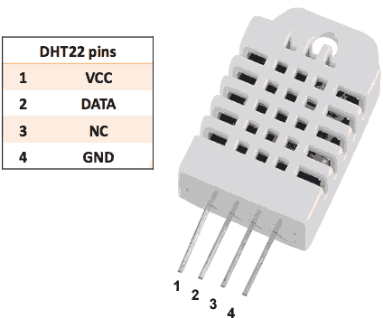
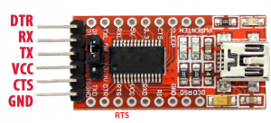
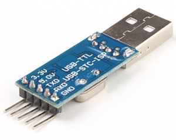
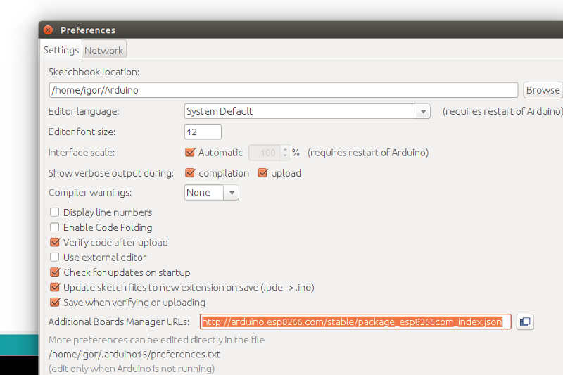
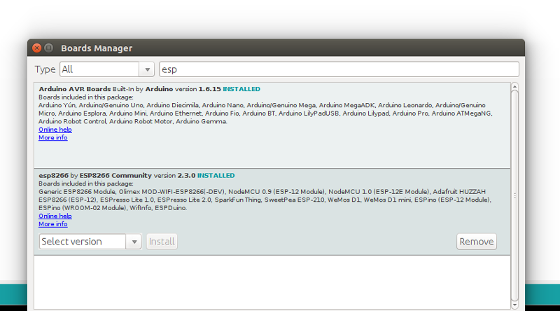

# temperature

* TOC

  {:toc}

## Introduction

This sample application performs collection of temperature and humidity values produced by [DHT22 sensor](https://www.adafruit.com/product/385) and further visualization on the real-time web dashboard. Collected data is pushed via MQTT to ThingsBoard server for storage and visualization. The purpose of this application is to demonstrate ThingsBoard [data collection API](https://github.com/caoyingde/thingsboard.github.io/tree/9437083b88083a9b2563248432cbbe460867fbaf/docs/user-guide/telemetry/README.md) and [visualization capabilities](https://github.com/caoyingde/thingsboard.github.io/tree/9437083b88083a9b2563248432cbbe460867fbaf/docs/user-guide/visualization/README.md).

The DHT22 sensor is connected to [ESP8266](https://en.wikipedia.org/wiki/ESP8266). ESP8266 offers a complete and self-contained Wi-Fi networking solution. ESP8266 push data to ThingsBoard server via MQTT protocol by using [PubSubClient](https://github.com/knolleary/pubsubclient) library for Arduino. Data is visualized using built-in customizable dashboard. The application that is running on ESP8266 is written using Arduino SDK which is quite simple and easy to understand.

The video below demonstrates the final result of this tutorial.

  &lt;/div&gt;   
   

Once you complete this sample/tutorial, you will see your sensor data on the following dashboard.

## List of hardware and pinouts

* [ESP8266 module](https://www.aliexpress.com/item/2PCS-ESP8266-Serial-Esp-01-WIFI-Wireless-Transceiver-Module-Send-Receive-LWIP-AP-STA/32302638695.html?spm=2114.03010208.3.163.FPBlcc&ws_ab_test=searchweb0_0,searchweb201602_2_10065_10068_10084_10083_10080_10082_10081_10060_10061_10062_10056_10055_10054_10059_10099_10078_10079_10093_427_10073_10103_10102_10096_10052_10050_10051,searchweb201603_3&btsid=1494d8a7-6202-4a69-a0e7-877ffa333243)

  

* [DHT22 sensor](https://www.aliexpress.com/item/1pcs-DHT22-digital-temperature-and-humidity-sensor-Temperature-and-humidity-module-AM2302-replace-SHT11-SHT15/32316036161.html?spm=2114.03010208.3.49.aZvfaG&ws_ab_test=searchweb0_0,searchweb201602_2_10065_10068_10084_10083_10080_10082_10081_10060_10061_10062_10056_10055_10054_10059_10099_10078_10079_10093_426_10073_10103_10102_10096_10052_10050_10051,searchweb201603_6&btsid=28d9ee9a-283a-4e97-af7b-a7e530490916)

  

* USB to TTL
  * [With DTR & RTS](https://www.aliexpress.com/item/Free-shipping-1pcs-FT232RL-FTDI-USB-3-3V-5-5V-to-TTL-Serial-Adapter-Module-for/32256920717.html?spm=2114.03010208.3.11.qSXSby&ws_ab_test=searchweb0_0,searchweb201602_2_10065_10068_10084_10083_10080_10082_10081_10060_10061_10062_10056_10055_10054_10059_10099_10078_10079_10093_427_10073_10103_10102_10096_10052_10050_10051,searchweb201603_3&btsid=54ef4b72-5ab0-4ce6-aa89-74726d95c099)

    

  * Or [Without DTR & RTS](https://www.aliexpress.com/item/1pcs-lot-PL2303-USB-To-RS232-TTL-Converter-Adapter-Module-with-Dust-proof-Cover-PL2303HX/32642301991.html?spm=2114.03010208.3.50.WdAM18&ws_ab_test=searchweb0_0,searchweb201602_2_10065_10068_10084_10083_10080_10082_10081_10060_10061_10062_10056_10055_10054_10059_10099_10078_10079_10093_427_10073_10103_10102_10096_10052_10050_10051,searchweb201603_3&btsid=9ac20e48-da8c-4a0f-8f33-d40c241fe5a3)

    
* Resistor \(between 4.7K and 10K\)
* Breadboard
* 2 female-to-female jumper wires
* 10 female-to-male jumper wires
* 3 male-to-male jumper wire
* 3.3V power source \(for example 2 AA batteries\)

## Wiring schemes

### Programming/flashing schema

| ESP8266 Pin | USB-TTL Pin |
| :--- | :--- |
| ESP8266 VCC | USB-TTL VCC +3.3V |
| ESP8266 CH\_PD | USB-TTL VCC +3.3V |
| ESP8266 GND \(-\) | USB-TTL GND |
| ESP8266 GPIO 0 | USB-TTL GND |
| ESP8266 RX | USB-TTL TX |
| ESP8266 TX | USB-TTL RX |

| DHT-22 Pin | ESP8266 Pin |
| :--- | :--- |
| DHT-22 Data | ESP8266 GPIO 2 |

| DHT-22 Pin | USB-TTL Pin |
| :--- | :--- |
| DHT-22 VCC | USB-TTL VCC +3.3V |
| DHT-22 GND \(-\) | USB-TTL GND |

Finally, place a resistor \(between 4.7K and 10K\) between pin number 1 and 2 of the DHT sensor.

The following picture summarizes the connections for this project in programming/debug mode:

### Final schema \(Battery Powered\)

| ESP8266 Pin | 3.3V power source |
| :--- | :--- |
| ESP8266 VCC | VCC+ |
| ESP8266 CH\_PD | VCC+ |
| ESP8266 GND \(-\) | VCC- |

| DHT-22 Pin | ESP8266 Pin |
| :--- | :--- |
| DHT-22 Data | ESP8266 GPIO 2 |

| DHT-22 Pin | 3.3V power source |
| :--- | :--- |
| DHT-22 VCC | VCC+ |
| DHT-22 GND \(-\) | VCC- |

The final picture:

### Provision your device

This step contains instructions that are necessary to connect your device to ThingsBoard.

Open ThingsBoard Web UI \([http://localhost:8080](http://localhost:8080)\) in browser and login as tenant administrator

* login: tenant@thingsboard.org
* password: tenant

Go to "Devices" section. Click "+" button and create a device with the name "ESP8266 Demo Device".

Once device created, open its details and click "Manage credentials". Copy auto-generated access token from the "Access token" field. Please save this device token. It will be referred to later as **$ACCESS\_TOKEN**.

Click "Copy Device ID" in device details to copy your device id to the clipboard. Paste your device id to some place, this value will be used in further steps.

### Provision your dashboard

Download the dashboard file using this [**link**](https://github.com/caoyingde/thingsboard.github.io/tree/9437083b88083a9b2563248432cbbe460867fbaf/docs/samples/esp8266/resources/esp8266_dht_temp_dashboard_v2.json). Use import/export [**instructions**](https://github.com/caoyingde/thingsboard.github.io/tree/9437083b88083a9b2563248432cbbe460867fbaf/docs/user-guide/ui/dashboards/README.md#dashboard-importexport) to import the dashboard to your ThingsBoard instance.

## Programming the ESP8266

### Step 1. ESP8266 and Arduino IDE setup.

In order to start programming ESP8266 device, you will need Arduino IDE installed and all related software.

Download and install [Arduino IDE](https://www.arduino.cc/en/Main/Software).

After starting Arduino IDE, open the preferences from the ‘file’ menu.

Paste the following URL to the “Additional board managers URL”: [http://arduino.esp8266.com/stable/package\_esp8266com\_index.json](http://arduino.esp8266.com/stable/package_esp8266com_index.json)

Close the screen by clicking the OK button.

Now we can add the board ESP8266 using the board manager.

In the menu tools, click on the menu option Board: “_Most likely Arduino UNO_”. There you will find the first option “Board Manager”.

Type in the search bar the 3 letters ESP. Locate and click on "_esp8266 by ESP8266 Community_". Click on install and wait for a minute to download the board.

**Note** that this tutorial was tested with the "_esp8266 by ESP8266 Community_" version 2.3.0.

In the menu Tools “Board “_Most likely Arduino UNO_” three new boards are added.

Select “Generic ESP8266 Module”.

Prepare your hardware according to the [Programming/flashing schema](temperature.md#programmingflashing-schema). Connect USB-TTL adapter with PC.

In the menu Tools, select the corresponding port of the USB-TTL adapter. Open the serial monitor \(by pressing CTRL-Shift-M or from the menu Tools\). Set the key emulation to “Both NL & CR” and the speed to 115200 baud. This can be set in the bottom of terminal screen.

### Step 2. Install Arduino libraries.

Open Arduino IDE and go to **Sketch -&gt; Include Library -&gt; Manage Libraries**. Find and install the following libraries:

* [PubSubClient by Nick O'Leary](http://pubsubclient.knolleary.net/).
* [Adafruit Unified Sensor by Adafruit](https://github.com/adafruit/Adafruit_Sensor)
* [DHT sensor library by Adafruit](https://github.com/adafruit/DHT-sensor-library)

**Note** that this tutorial was tested with the following versions of the libraries:

* PubSubClient 2.6
* Adafruit Unified Sensor 1.0.2
* DHT sensor library 1.3.0

### Step 3. Prepare and upload a sketch.

Download and open **esp8266-dht-mqtt.ino** sketch.

**Note** You need to edit following constants and variables in the sketch:

* WIFI\_AP - name of your access point
* WIFI\_PASSWORD - access point password
* TOKEN - the **$ACCESS\_TOKEN** from ThingsBoard configuration step.
* thingsboardServer - ThingsBoard HOST/IP address that is accessible within your wifi network. Specify "demo.thingsboard.io" if you are using [live demo](https://demo.thingsboard.io/) server.

Connect USB-TTL adapter to PC and select the corresponding port in Arduino IDE. Compile and Upload your sketch to the device using "Upload" button.

After application will be uploaded and started it will try to connect to ThingsBoard node using mqtt client and upload "temperature" and "humidity" timeseries data once per second.

## Autonomous operation

When you have uploaded the sketch, you may remove all the wires required for uploading including USB-TTL adapter and connect your ESP8266 and DHT sensor directly to the power source according to the [Final wiring schema](temperature.md#final-schema-battery-powered).

## Troubleshooting

In order to perform troubleshooting, you should assemble your hardware according to the [Programming/flashing schema](temperature.md#programmingflashing-schema). Then connect USB-TTL adapter with PC and select port of the USB-TTL adapter in Arduino IDE. Finally, open "Serial Monitor" in order to view debug information produced by serial output.

## Data visualization

Finally, open ThingsBoard Web UI. You can access this dashboard by logging in as a tenant administrator. Use:

* login: tenant@thingsboard.org
* password: tenant

in case of local ThingsBoard installation.

Go to **"Devices"** section and locate **"ESP8266 Demo Device"**, open device details and switch to **"Latest telemetry"** tab. If all is configured correctly you should be able to see latest values of _"temperature"_ and _"humidity"_ in the table.

After, open **"Dashboards"** section then locate and open **"ESP8266 DHT22: Temperature & Humidity Demo Dashboard"**. As a result, you will see two digital gauges and two time-series charts displaying temperature and humidity level \(similar to dashboard image in the introduction\).

## See also

Browse other [samples](https://github.com/caoyingde/thingsboard.github.io/tree/9437083b88083a9b2563248432cbbe460867fbaf/docs/samples/README.md) or explore guides related to main ThingsBoard features:

* [Device attributes](https://github.com/caoyingde/thingsboard.github.io/tree/9437083b88083a9b2563248432cbbe460867fbaf/docs/user-guide/attributes/README.md) - how to use device attributes.
* [Telemetry data collection](https://github.com/caoyingde/thingsboard.github.io/tree/9437083b88083a9b2563248432cbbe460867fbaf/docs/user-guide/telemetry/README.md) - how to collect telemetry data.
* [Using RPC capabilities](https://github.com/caoyingde/thingsboard.github.io/tree/9437083b88083a9b2563248432cbbe460867fbaf/docs/user-guide/rpc/README.md) - how to send commands to/from devices.
* [Rule Engine](https://github.com/caoyingde/thingsboard.github.io/tree/9437083b88083a9b2563248432cbbe460867fbaf/docs/user-guide/rule-engine/README.md) - how to use rule engine to analyze data from devices.
* [Data Visualization](https://github.com/caoyingde/thingsboard.github.io/tree/9437083b88083a9b2563248432cbbe460867fbaf/docs/user-guide/visualization/README.md) - how to visualize collected data.

## Next steps

