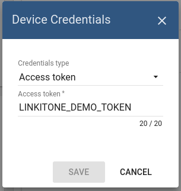

# gps

* TOC

  {:toc}

## Introduction

This sample application shows the capability to track GPS location of LinkIt ONE device and perform further visualization on the map. It performs collection of latitude and longitude values produced by GPS module. Collected data is pushed to ThingsBoard for storage and visualization. The purpose of this application is to demonstrate ThingsBoard data collection API and visualization capabilities.

The GPS module is a built-in module of [LinkIt ONE](http://wiki.seeed.cc/LinkIt_ONE/). LinkIt ONE pushes data to ThingsBoard server via MQTT protocol by using [PubSubClient](https://github.com/knolleary/pubsubclient) library for Arduino. Data is visualized using the map widget which is a part of a customizable dashboard. The application that is running on LinkIt ONE is written using Arduino SDK which is quite simple and easy to understand.

Once you complete this sample/tutorial, you will see your device GPS and battery data on the following dashboard.

This tutorial was prepared for Windows OS users. However, it is possible to run it on other OS \(Linux or MacOS\).

## List of hardware

* [LinkIt One](https://www.seeedstudio.com/LinkIt-ONE-p-2017.html)

  GPS and WIFI Antenna are shipped with a board.

### Provision your device

This step contains instructions that are necessary to connect your device to ThingsBoard.

Open ThingsBoard Web UI \([http://localhost:8080](http://localhost:8080)\) in browser and login as tenant administrator

* login: tenant@thingsboard.org
* password: tenant

Go to "Devices" section. Click "+" button and create a device with the name "LinkIt One Demo Device".

Once device created, open its details and click "Manage credentials".

Copy auto-generated access token from the "Access token" field. Please save this device token. It will be referred to later as **$ACCESS\_TOKEN**.

Click "Copy Device ID" in device details to copy your device id to the clipboard. Paste your device id to some place, this value will be used in further steps.

### Provision your dashboard

Download the dashboard file using this [**link**](https://github.com/caoyingde/thingsboard.github.io/tree/9437083b88083a9b2563248432cbbe460867fbaf/docs/samples/linkit-one/resources/linkit_one_gps_dashboard_v2.json). Use import/export [**instructions**](https://github.com/caoyingde/thingsboard.github.io/tree/9437083b88083a9b2563248432cbbe460867fbaf/docs/user-guide/ui/dashboards/README.md#dashboard-importexport) to import the dashboard to your ThingsBoard instance.

## Programming the LinkIt One device

If you already familiar with basics of LinkIt One programming using Arduino IDE you can skip the following step and proceed with step 2.

### Step 1. LinkIt ONE and Arduino IDE setup.

In order to start programming LinkIt One device, you will need Arduino IDE installed and all related libraries. Please follow this [guide](http://labs.mediatek.com/site/global/developer_tools/mediatek_linkit/get-started/windows_os_stream/install/index.gsp) in order to install the Arduino IDE and LinkIt One SDK:

It's recommended to update your firmware by following [this guide](http://labs.mediatek.com/site/global/developer_tools/mediatek_linkit/get-started/windows_os_stream/update_firmware/index.gsp). To try your first LinkIt One sample, please follow [this guide](http://labs.mediatek.com/site/global/developer_tools/mediatek_linkit/get-started/windows_os_stream/configure/index.gsp).

### Step 2. PubSubClient library installation.

Open Arduino IDE and go to **Sketch -&gt; Include Library -&gt; Manage Libraries**. Find PubSubClient by Nick O'Leary and install it.

**Note** that this tutorial was tested with PubSubClient 2.6.

Download and open **gps\_tracker.ino** sketch.

**Note** You need to edit following constants and variables in the sketch:

* WIFI\_AP - name of your access point
* WIFI\_PASSWORD - access point password
* WIFI\_AUTH - choose one of LWIFI\_OPEN, LWIFI\_WPA, or LWIFI\_WEP.
* TOKEN - the **$ACCESS\_TOKEN** from ThingsBoard configuration step.
* thingsboardServer - ThingsBoard HOST/IP address that is accessible within your wifi network. Specify "demo.thingsboard.io" if you are using [live demo](https://demo.thingsboard.io/) server.

Connect your LinkIt One device via USB cable and select Serial Debug COM port in Arduino IDE. Compile and Upload your sketch to the device using "Upload" button.

After application will be uploaded and started it will try to connect to ThingsBoard node using mqtt client and upload "latitude" and "longitude" attributes once per second.

## Troubleshooting

When the application is running you can connect your device to Serial Debug COM port in Arduino IDE and open "Serial Monitor" in order to view debug information produced by serial output.

## Data visualization

Finally, open ThingsBoard Web UI. You can access this dashboard by logging in as a tenant administrator. Use

* login: tenant@thingsboard.org
* password: tenant

in case of local ThingsBoard installation.

Go to **"Devices"** section and locate **"LinkIt One Demo Device"**, open device details and switch to **"Attributes"** tab. If all is configured correctly you should be able to see _"latitude"_, _"longitude"_ and battery status attributes and their latest values in the table.

After, open **"Dashboards"** section then locate and open **"LinkIt One GPS Tracking Demo Dashboard"**. As a result, you will see the map widget with a pointer indicating your device location and a battery level widget \(similar to dashboard image in the introduction\).

## See also

Browse other [samples](https://github.com/caoyingde/thingsboard.github.io/tree/9437083b88083a9b2563248432cbbe460867fbaf/docs/samples/README.md) or explore guides related to main ThingsBoard features:

* [Device attributes](https://github.com/caoyingde/thingsboard.github.io/tree/9437083b88083a9b2563248432cbbe460867fbaf/docs/user-guide/attributes/README.md) - how to use device attributes.
* [Telemetry data collection](https://github.com/caoyingde/thingsboard.github.io/tree/9437083b88083a9b2563248432cbbe460867fbaf/docs/user-guide/telemetry/README.md) - how to collect telemetry data.
* [Using RPC capabilities](https://github.com/caoyingde/thingsboard.github.io/tree/9437083b88083a9b2563248432cbbe460867fbaf/docs/user-guide/rpc/README.md) - how to send commands to/from devices.
* [Rule Engine](https://github.com/caoyingde/thingsboard.github.io/tree/9437083b88083a9b2563248432cbbe460867fbaf/docs/user-guide/rule-engine/README.md) - how to use rule engine to analyze data from devices.
* [Data Visualization](https://github.com/caoyingde/thingsboard.github.io/tree/9437083b88083a9b2563248432cbbe460867fbaf/docs/user-guide/visualization/README.md) - how to visualize collected data.

## Next steps

