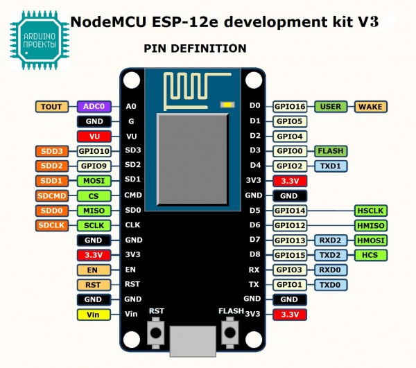

# index

* TOC

  {:toc}

[NodeMCU](https://en.wikipedia.org/wiki/NodeMCU) is an open source IoT platform. It includes both firmware which runs on the ESP8266 Wi-Fi SoC, and hardware which is based on the ESP-12 module.

The applications in these samples that are running on NodeMCU are written using Lua scripting language which is quite simple and easy to understand.

## Samples

* [Temperature upload over MQTT using NodeMCU and DHT22 sensor](https://github.com/caoyingde/thingsboard.github.io/tree/9437083b88083a9b2563248432cbbe460867fbaf/docs/samples/nodemcu/temperature/README.md)

## Documentation

* [GitHub Repository for NodeMCU Firmware](https://github.com/nodemcu/nodemcu-firmware)
* [NodeMCU Wiki](https://github.com/nodemcu/nodemcu-firmware/wiki)
* [NodeMCU Documentation](http://nodemcu.readthedocs.io/)

  

  

