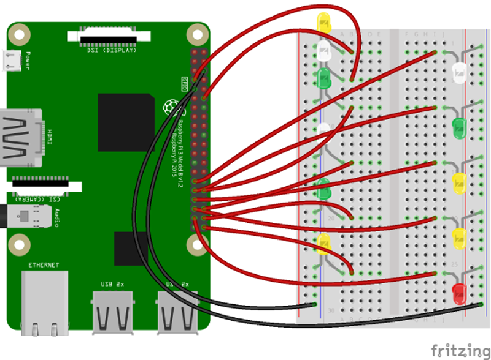

# gpio-android-things

* TOC

  {:toc}

## Introduction

This sample application will allow you to control GPIO of your Raspberry Pi device using ThingsBoard RPC widgets. We will observe GPIO control using LEDs connected to the pins. The purpose of this application is to demonstrate ThingsBoard [RPC capabilities](https://github.com/caoyingde/thingsboard.github.io/tree/9437083b88083a9b2563248432cbbe460867fbaf/docs/user-guide/rpc/README.md).

Raspberry Pi will use simple [Android Things](https://developer.android.com/things/index.html) application that will connect to ThingsBoard server via [MQTT](https://en.wikipedia.org/wiki/MQTT) and listen to RPC commands. Current GPIO state and GPIO control widget is visualized using built-in customizable dashboard.

The video below demonstrates the final result of this tutorial.

  &lt;/div&gt;   
   


## List of hardware and pinouts

* [Raspberry Pi](https://en.wikipedia.org/wiki/Raspberry_Pi) - we will use Raspberry Pi 3 Model B but you can use any other model.
* 11 LEDs with corresponding resistors
* 13 female-to-male jumper wires

## Wiring schema

Since our application will allow us to control the state of all available GPIO pins, we recommend attaching some LEDs to those pins for visibility. You can use this [basic instruction](https://www.raspberrypi.org/documentation/usage/gpio/) or [another one](https://projects.drogon.net/raspberry-pi/gpio-examples/tux-crossing/gpio-examples-1-a-single-led/) to wire some LEDs. Below is sample wiring schema used in this tutorial.



## Programming the Raspberry Pi

### Flashing the Android Things image

First, you need to flash Android Things image to your Raspberry Pi board using this [**guide**](https://developer.android.com/things/hardware/raspberrypi.html#flashing_the_image). After finishing this guide make sure that your board has Internet access and accessible via adb tool.

### Android Things development environment

Before starting with application introduced in this tutorial you need to prepare development environment to work with Android Things applications. Follow instructions from the official [**guide**](https://developer.android.com/things/training/first-device/index.html) to build and deploy your first Android Things application.

### Application source code

Now you should obtain the source code of the GpioControlSample application from ThingsBoard samples GitHub repository. You can do this by issuing the following git clone command:

```bash
git clone https://github.com/thingsboard/samples
```

Open cloned samples folder and navigate to **android-things/GpioControlSample**.

Open **GpioControlActivity.java** file located at **app/src/main/java/org/thingsboard/sample/gpiocontrol** folder.

You will need to modify **THINGSBOARD\_HOST** constant to match your ThingsBoard server installation IP address or hostname. Use "demo.thingsboard.io" if you are using [live demo](https://demo.thingsboard.io/) server.

The value of **ACCESS\_TOKEN** constant corresponds to sample Raspberry Pi device in pre-provisioned [demo data](https://github.com/caoyingde/thingsboard.github.io/tree/9437083b88083a9b2563248432cbbe460867fbaf/docs/samples/demo-account/README.md#tenant-devices). If you are using [live demo](https://demo.thingsboard.io/) server - [get the access token](https://github.com/caoyingde/thingsboard.github.io/tree/9437083b88083a9b2563248432cbbe460867fbaf/docs/user-guide/ui/devices/README.md#manage-device-credentials) for pre-provisioned "Raspberry Pi Demo Device".

### Running the application

Make sure that your Raspberry device is accessible via adb tool:

```bash
adb devices
```

Navigate to **GpioControlSample** application folder and deploy application to the device:

```bash
./gradlew assembleDebug
adb push ./app/build/outputs/apk/app-debug.apk /data/local/tmp/org.thingsboard.sample.gpiocontrol
adb shell pm install -r "/data/local/tmp/org.thingsboard.sample.gpiocontrol"
```

Or you can use other options to deploy the Android application:

* [Using Android Studio](https://developer.android.com/studio/run/index.html)
* [Using Command Line](https://developer.android.com/studio/build/building-cmdline.html)

Finally you can start the application by issuing the following adb command:

```bash
adb shell am start -n "org.thingsboard.sample.gpiocontrol/org.thingsboard.sample.gpiocontrol.GpioControlActivity" -a android.intent.action.MAIN -c android.intent.category.LAUNCHER
```

## Data visualization

In order to simplify this guide, we have included "Raspberry PI GPIO Demo Dashboard" to the [demo data](https://github.com/caoyingde/thingsboard.github.io/tree/9437083b88083a9b2563248432cbbe460867fbaf/docs/samples/demo-account/README.md#dashboards) that is available in each Thingboard installation. Of course, you can modify this dashboard: tune, add, delete widgets, etc. You can access this dashboard by logging in as a tenant administrator.

In case of local installation:

* login: tenant@thingsboard.org
* password: tenant

In case of live-demo server:

* login: your live-demo username \(email\)
* password: your live-demo password

See [**live-demo**](https://github.com/caoyingde/thingsboard.github.io/tree/9437083b88083a9b2563248432cbbe460867fbaf/docs/user-guide/live-demo/README.md) page for more details how to get your account.

Once logged in, open **Dashboards-&gt;Raspberry PI GPIO Demo Dashboard** page. You should observe demo dashboard with GPIO control and status panel for your device. Now you can switch status of GPIOs using control panel. As a result, you will see LEDs status change on the device and on the status panel.

Below is the screenshot of the "Raspberry PI GPIO Demo Dashboard".


## See also

Browse other [samples](https://github.com/caoyingde/thingsboard.github.io/tree/9437083b88083a9b2563248432cbbe460867fbaf/docs/samples/README.md) or explore guides related to main ThingsBoard features:

* [Device attributes](https://github.com/caoyingde/thingsboard.github.io/tree/9437083b88083a9b2563248432cbbe460867fbaf/docs/user-guide/attributes/README.md) - how to use device attributes.
* [Telemetry data collection](https://github.com/caoyingde/thingsboard.github.io/tree/9437083b88083a9b2563248432cbbe460867fbaf/docs/user-guide/telemetry/README.md) - how to collect telemetry data.
* [Using RPC capabilities](https://github.com/caoyingde/thingsboard.github.io/tree/9437083b88083a9b2563248432cbbe460867fbaf/docs/user-guide/rpc/README.md) - how to send commands to/from devices.
* [Rule Engine](https://github.com/caoyingde/thingsboard.github.io/tree/9437083b88083a9b2563248432cbbe460867fbaf/docs/user-guide/rule-engine/README.md) - how to use rule engine to analyze data from devices.
* [Data Visualization](https://github.com/caoyingde/thingsboard.github.io/tree/9437083b88083a9b2563248432cbbe460867fbaf/docs/user-guide/visualization/README.md) - how to visualize collected data.

## Next steps

