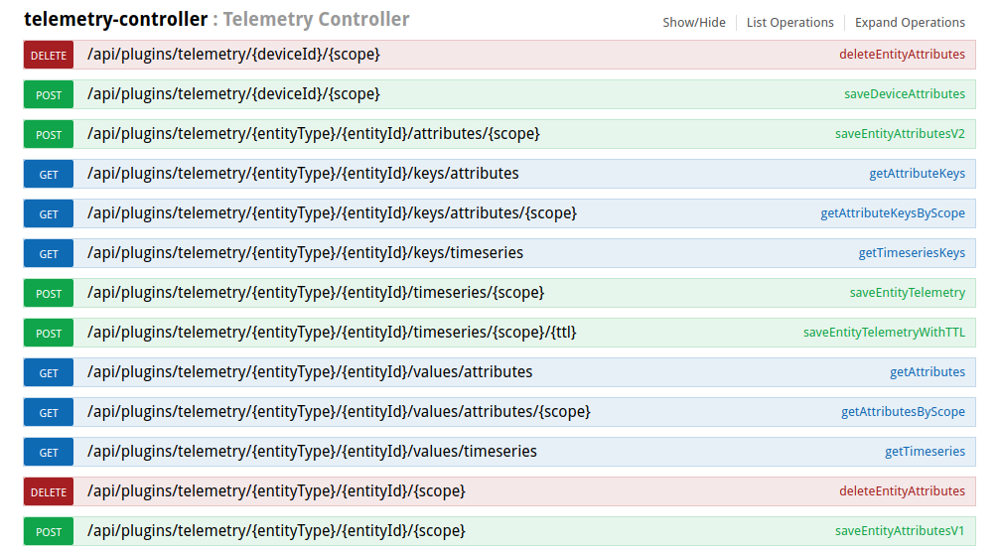

# attributes

* TOC

  {:toc}

ThingsBoard provides the ability to assign custom attributes to your entities and manage these attributes. Attributes are treated key-value pairs. Flexibility and simplicity of the key-value format allow easy and seamless integration with almost any IoT device on the market.

## Attribute types

Attributes are separated into three main groups:

* **server-side** - attributes are reported and managed by the server-side application. Not visible to the device application. Some secret data that may be used by thingsboard rules but should not be available to the device. Any ThingsBoard entity supports server-side attributes: Device, Asset, Customer, Tenant, Rules, etc.

  {:refdef: style="text-align: center;"}  {: refdef}

* **client-side** - see device specific attributes
* **shared** - see device specific attributes

## Device specific Attribute types

All attributes may be used in [Rule Engine](https://github.com/caoyingde/thingsboard.github.io/tree/9437083b88083a9b2563248432cbbe460867fbaf/docs/user-guide/rule-engine/README.md) components: filters, processors, and actions. This guide provides the overview of the features listed above and some useful links to get more details.

Device specific attributes are separated into two main groups:

* **client-side** - attributes are reported and managed by the device application. For example current software/firmware version, hardware specification, etc.

  {:refdef: style="text-align: center;"}  {: refdef}

* **shared** - attributes are reported and managed by the server-side application. Visible to the device application. For example customer subscription plan, target software/firmware version.

  {:refdef: style="text-align: center;"}  {: refdef}

## Device attributes API

ThingsBoard provides following API to device applications:

* upload _client-side_ attributes to the server
* request _client-side_ and _shared_ attributes from the server.
* subscribe to updates of _shared_ attributes.

Attributes API is specific for each supported network protocol. You can review API and examples in corresponding reference page:

* [MQTT API reference](https://github.com/caoyingde/thingsboard.github.io/tree/9437083b88083a9b2563248432cbbe460867fbaf/docs/reference/mqtt-api/README.md#attributes-api)
* [CoAP API reference](https://github.com/caoyingde/thingsboard.github.io/tree/9437083b88083a9b2563248432cbbe460867fbaf/docs/reference/coap-api/README.md#attributes-api)
* [HTTP API reference](https://github.com/caoyingde/thingsboard.github.io/tree/9437083b88083a9b2563248432cbbe460867fbaf/docs/reference/http-api/README.md#attributes-api)

## Telemetry Service

Telemetry Service is responsible for persisting attributes data to internal data storage; provides server-side API to query and subscribe for attribute updates.

### Internal data storage

ThingsBoard uses either Cassandra NoSQL database or SQL database to store all data.

Although you can query the database directly, ThingsBoard provides a set of RESTful and Websocket API that simplify this process and apply certain security policies:

* Tenant Administrator user is able to manage attributes for all entities that belong to the corresponding tenant.
* Customer user is able to manage attributes only for entities that are assigned to the corresponding customer.

### Data Query API

Telemetry Service provides following REST API to fetch entity data:



**NOTE:** The API listed above is available via Swagger UI, please review general [REST API](https://github.com/caoyingde/thingsboard.github.io/tree/9437083b88083a9b2563248432cbbe460867fbaf/docs/reference/rest-api/README.md) documentation for more details. The API is backward compatible with TB v1.0+ and this is the main reason why API call URLs contain "plugin".

#### Attribute keys API

You can fetch list of all _attribute keys_ for particular _entity type_ and _entity id_ using GET request to the following URL

```text
http(s)://host:port/api/plugins/telemetry/{entityType}/{entityId}/keys/attributes
```

Supported entity types are: TENANT, CUSTOMER, USER, RULE, DASHBOARD, ASSET, DEVICE, ALARM

#### Attribute values API

You can fetch list of latest values for particular _entity type_ and _entity id_ using GET request to the following URL

```text
http(s)://host:port/api/plugins/telemetry/{entityType}/{entityId}/values/attributes?keys=key1,key2,key3
```

Supported entity types are: TENANT, CUSTOMER, USER, RULE, DASHBOARD, ASSET, DEVICE, ALARM

### Telemetry Rule Node

There are Rule Nodes in the Rule Engine that allows to work with Telemetry Service. Please find more details in node description:

* [**Enrichment Nodes - load latest telemetry for entity**](https://github.com/caoyingde/thingsboard.github.io/tree/9437083b88083a9b2563248432cbbe460867fbaf/docs/user-guide/rule-engine-2-0/enrichment-nodes/README.md)
* [**Save Timeseries**](https://github.com/caoyingde/thingsboard.github.io/tree/9437083b88083a9b2563248432cbbe460867fbaf/docs/user-guide/rule-engine-2-0/action-nodes/README.md#save-timeseries-node)
* [**Save Attributes**](https://github.com/caoyingde/thingsboard.github.io/tree/9437083b88083a9b2563248432cbbe460867fbaf/docs/user-guide/rule-engine-2-0/action-nodes/README.md#save-attributes-node)

## Data visualization

ThingsBoard provides the ability to configure and customize dashboards for data visualization. This topic is covered in a separate guide.

[Data Visualization guide](https://github.com/caoyingde/thingsboard.github.io/tree/9437083b88083a9b2563248432cbbe460867fbaf/docs/user-guide/visualization/README.md)

## Rule engine

ThingsBoard provides the ability to configure data processing rules. Device attributes can be used inside rule filters. This allows applying rules based on certain device properties. You can find more details in a separate guide.

[Rule Engine guide](https://github.com/caoyingde/thingsboard.github.io/tree/9437083b88083a9b2563248432cbbe460867fbaf/docs/user-guide/rule-engine/README.md)

