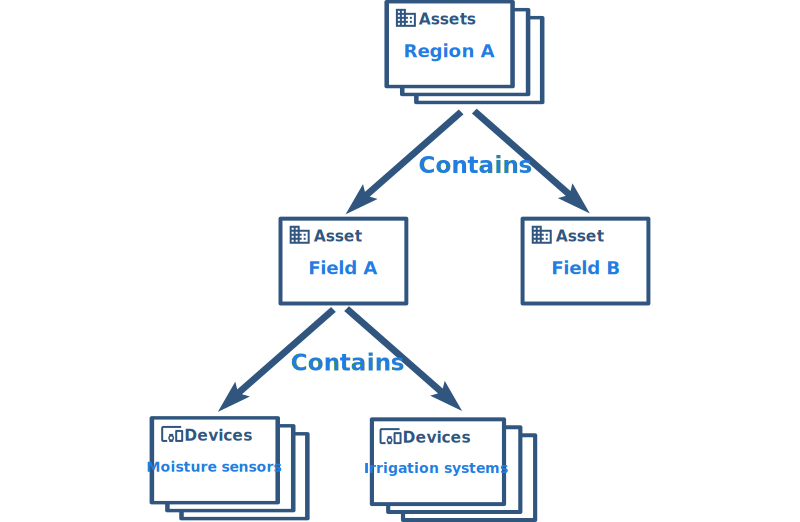

# entities-and-relations

* TOC

  {:toc}

## Entities Overview

ThingsBoard provides the user interface and REST APIs to provision and manage multiple entity types and their relations in your IoT application. Supported entities are:

* **Tenants** - you can treat tenant as a separate business-entity: individual or organization who owns or produce devices and assets;

  Tenant may have multiple tenant administrator users and millions of customers;

* **Customers** - customer is also a separate business-entity: individual or organization who purchase or uses tenant devices and/or assets;

  Customer may have multiple users and millions of devices and/or assets;

* **Users** - users are able to browse dashboards and manage entities;
* **Devices** - basic IoT entities that may produce telemetry data and handle RPC commands. For example sensors, actuators, switches;
* **Assets** - abstract IoT entities that may be related to other devices and assets. For example factory, field, vehicle;      
* **Alarms** - events that identify issues with your assets, devices or other entities;
* **Dashboards** - visualization of your IoT data and ability to control particular devices through user interface; 
* **Rule Node** - processing units for incoming messages, entity lifecycle events, etc;
* **Rule Chain** - logic unit of related Rule Nodes;

Each entity supports:

* **Attributes** - static and semi-static key-value pairs associated with entities. For example serial number, model, firmware version;
* **Telemetry data** - time-series data points available for storage, querying and visualization. For example temperature, humidity, battery level;
* **Relations** - directed connections to other entities. For example contains, manages, owns, produces.

Additionally, devices and assets also have a type. This allows distinguising them and process data from them in a different way.

This guide provides the overview of the features listed above, some useful links to get more details and real-life examples of their usage.

## Real-life application

The easiest way to understand the concepts of ThingsBoard is to implement your first ThingsBoard application. Let's assume we want to build an application that collects data from soil moisture and temperature sensors, visualize this data on the dashboard, detect issues, raise alarms and control the irrigation.

Let's also assume we want to support multiple fields with hundreds of sensors. Fields may be also grouped to the Geo regions.

We believe there should be following logical steps to build such an application:

### Step 1: Provision entities and relations

We are going to setup following hierarchy of assets and devices:



Please review the following screen cast to learn how to provision region and fields assets and their relations using ThingsBoard Web UI

Please review the following screen cast to learn how to provision devices and their relations with assets using ThingsBoard Web UI

You can automate this actions using ThingsBoard REST API. You can provision new asset using POST request to the following URL

```text
http(s)://host:port/api/asset
```

For example:

**Note:** in order to execute this request, you will need to substitute **$JWT\_TOKEN** with a valid JWT token. This token should belong to a user with **TENANT\_ADMIN** role. You can use following [guide](https://github.com/caoyingde/thingsboard.github.io/tree/9437083b88083a9b2563248432cbbe460867fbaf/docs/reference/rest-api/README.md#rest-api-auth) to get the token.

Also, you can provision new relation using POST request to the following URL

```text
http(s)://host:port/api/relation
```

For example

**Note:** Don't forget to replace $FROM\_ASSET\_ID and $TO\_ASSET\_ID with valid asset ids. **Note:** One can relate any entities. For example, assets to devices or assets to users. You can receive them as a result of previous REST API call or use Web UI.

### Step 2: Assign attributes to the assets

ThingsBoard provides the ability to assign attributes to entities and manage them. This topic is covered in separate guide.

[Working with device attributes](https://github.com/caoyingde/thingsboard.github.io/tree/9437083b88083a9b2563248432cbbe460867fbaf/docs/user-guide/attributes/README.md)

### Step 3: Upload telemetry data from devices

ThingsBoard provides the ability to work with telemetry data for devices and other entities. This topic is covered in separate guide.

[Working with telemetry data](https://github.com/caoyingde/thingsboard.github.io/tree/9437083b88083a9b2563248432cbbe460867fbaf/docs/user-guide/telemetry/README.md)

### Step 4: Creating Rules for Alarms

ThingsBoard provides the ability to raise alarms using rule engine for devices and other entities. This topic is covered in the separate guide.

[Working with alarms](https://github.com/caoyingde/thingsboard.github.io/tree/9437083b88083a9b2563248432cbbe460867fbaf/docs/user-guide/alarms/README.md)

### Step 5: Design your dashboard

Please [import](https://github.com/caoyingde/thingsboard.github.io/tree/9437083b88083a9b2563248432cbbe460867fbaf/docs/user-guide/ui/dashboards/README.md#dashboard-import) the following [**dashboard**](https://github.com/caoyingde/thingsboard.github.io/tree/9437083b88083a9b2563248432cbbe460867fbaf/docs/user-guide/resources/region_fields_dashboard.json) that demonstrates Map, Alarm, Entity Table and Charts widgets.

