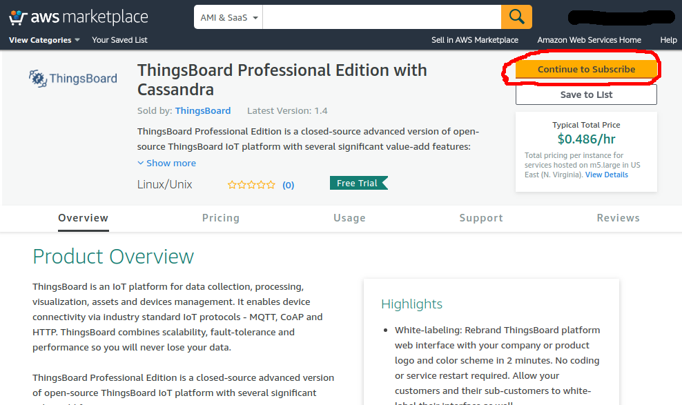
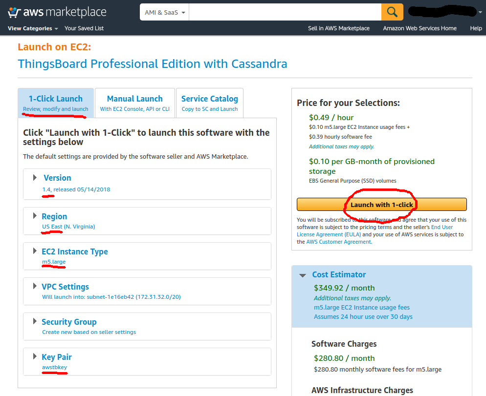
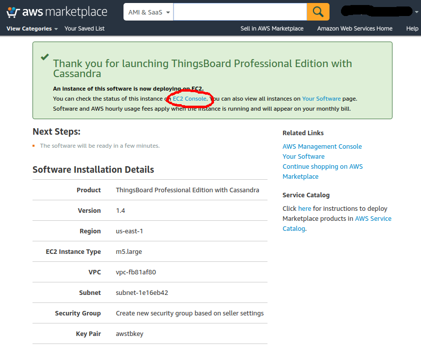
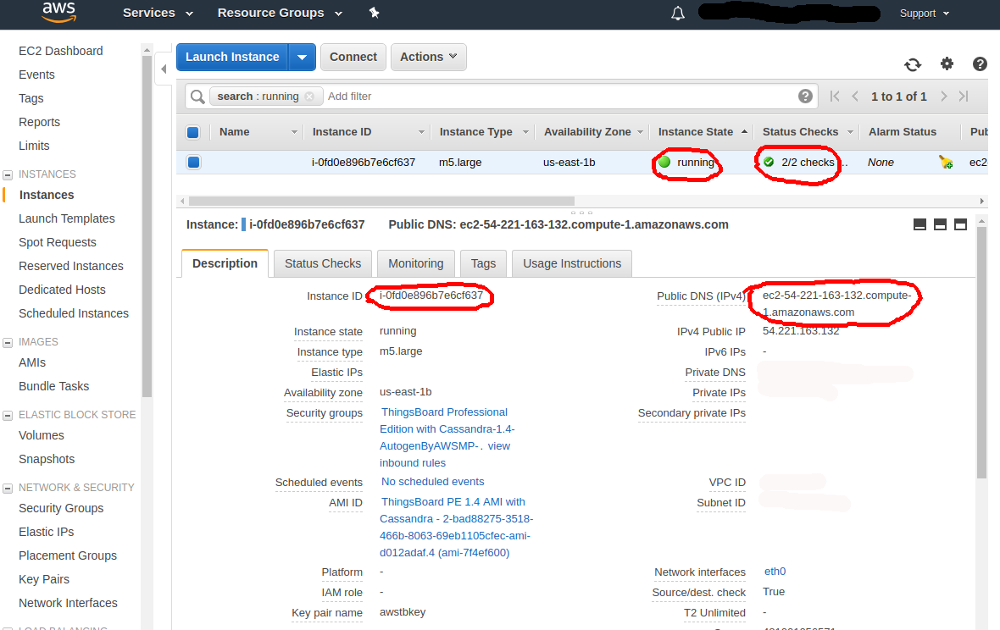
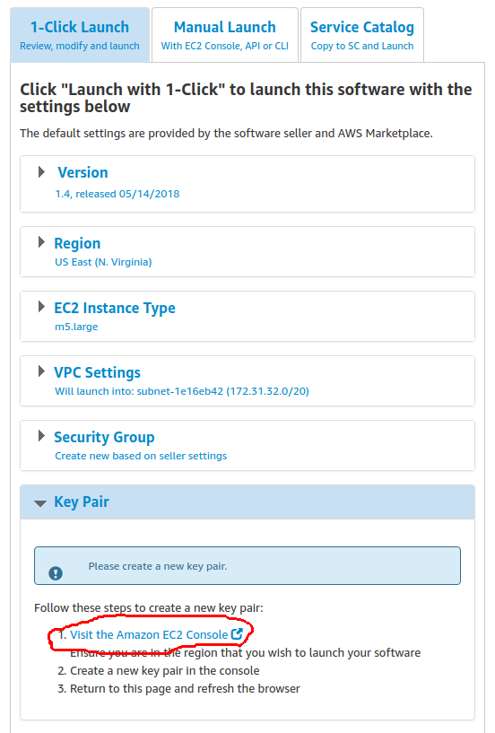
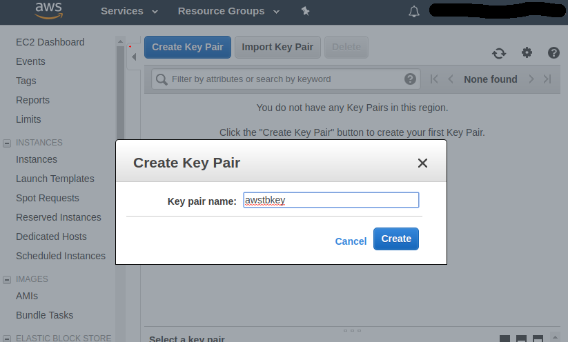

# aws-marketplace-pe

This guide describes how to install ThingsBoard Professional Edition from AWS Marketplace.

With this option you pay for Thingsboard Professional Edition on hourly basis. Software usage for the first 5 days is free of charge.

* TOC

  {:toc}

## Prerequisites

* Active [Amazon AWS](https://aws.amazon.com/){:target="\_blank"} account

## Step 1. Subscribe to ThingsBoard Professional Edition

* Go to [AWS Marketplace: ThingsBoard Professional Edition with Cassandra](https://aws.amazon.com/marketplace/pp/B07CSTDN9W){:target="\_blank"} page
* Press **Continue to Subscribe** button

## Step 2. Configure instance and Launch

In **1-Click Launch** tab select required properties:

* **Version** - Thingsboard PE version
* **Region** - AWS Region where instance will be started
* **EC2 Instance Type** - Instance type where Thingsboard PE will be started. We recommend to use **m5.xlarge** instance type
* **Optional: Key Pairs** - if you do not have any generated key pairs. Please create them using this instruction [Optional: Create a new key pair for AWS EC2 region](aws-marketplace-pe.md#optional-create-a-new-key-pair-for-aws-ec2-region)

After configuration is finished press **Launch with 1-click**. New EC2 instance will be created and started with installed Thingsboard Professional Edition and Cassandra as data storage. You can go to your AWS EC2 console to view Instance details by clicking on the link highlighted on the image below:

## Step 3. Check instance status

In AWS EC2 console you need to wait while instance state will be changes to **running** and all Status checks will be finished.

On the image above example instance has this Public DNS name

* **ec2-54-221-163-132.compute-1.amazonaws.com**

Instance ID

* **i-0fd0e896b7e6cf637**

## Step 4. Connect to Thingsboard UI

Now you can open this link in your browser:

* [http://PUBLIC\_DNS\_NAME/login](http://PUBLIC_DNS_NAME/login)

In this example it is:

* [http://ec2-54-221-163-132.compute-1.amazonaws.com/login](http://ec2-54-221-163-132.compute-1.amazonaws.com/login)

Use this login to connect as system Administrator

* **sysadmin@thingsboard.org**

Default password for System Administrator is Instance ID \(from Step 3\). In this example it is

* **i-0fd0e896b7e6cf637**

Now you can proceed with Thingsboard Configuration.

## Optional: Connect to Thingsboard over SSH

You can use configured key pairs for accessing Thingsboard instance over SSH. Below is example command as a reference:

Thingsboard configuration file location:

* /etc/thingsboard/conf/thingsboard.yml

Thingsboard logs location:

* /var/log/thingsboard/thingsboard.log

## Optional: Create a new key pair for AWS EC2 region

If it is your first experience with AWS, you will need to generate SSH key pairs before starting any EC2 instances. Those keys are used for secured access via SSH to the instance.

Here are steps for creating your first key pair

* Open EC2 Console by clicking on the link highlighted on the image below

* Press **Create Key Pair** and enter any name for the key. For example _**awstbkey**_

Finally your private SSH key will be downloaded. Please save it in safe place in order to get access to your instance over SSH.

