# windows

* TOC

  {:toc}

This guide describes how to install ThingsBoard on a Windows machine. Instructions below are provided for Windows 10/8.1/8/7 32-bit/64-bit.

### Hardware requirements

To run ThingsBoard and third-party components on a single machine you will need at least 2Gb of RAM \(4Gb recommended\).

### Third-party components installation

#### Java

ThingsBoard service is running on Java 8. If you don't have Java installed, please download and install Java 8 using this [link](https://java.com/en/download/).

### \[Optional\] External database installation

**SQL Database: PostgreSQL**

Download the installation file [here](https://www.enterprisedb.com/downloads/postgres-postgresql-downloads#windows) and follow the installation instructions.

Once PostgreSQL is installed you may want to create the new user or set the password for the main user.

**NoSQL Database: Cassandra**

Instructions listed below will help you to install Cassandra.

* Download DataStax Community Edition v3.0.9
  * [MSI Installer \(32-bit\)](http://downloads.datastax.com/community/datastax-community-32bit_3.0.9.msi)
  * [MSI Installer \(64-bit\)](http://downloads.datastax.com/community/datastax-community-64bit_3.0.9.msi)
* Run downloaded MSI package. You are first presented with an initial welcome panel that identifies your installation package:

  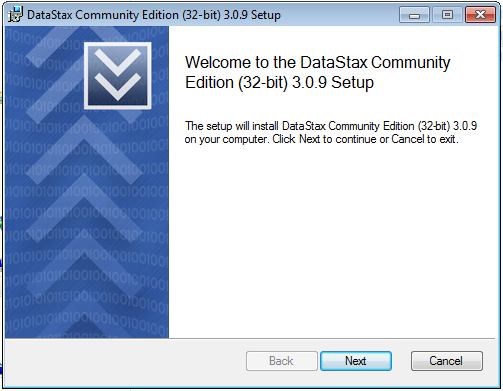

* Clicking next takes you to the end user license agreement:

  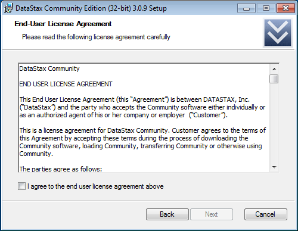

* The next panel allows you to specify where the software is to be installed:

  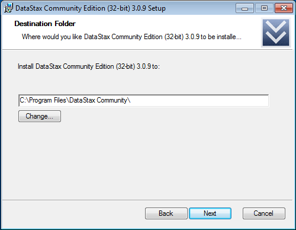

* Once the installation directory has been set, the installer will ask how you want to handle the service that will be installed:

  

* The next panel initiates the installation process:

  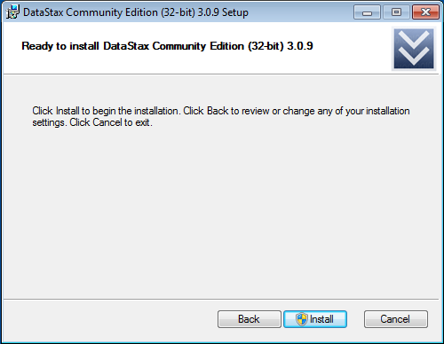

  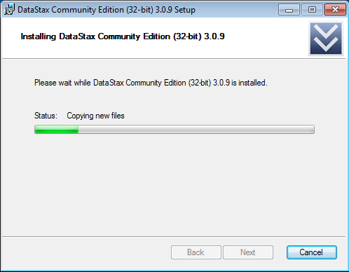

* The final panel asks if you would like to register to be updated when new versions of the software become available:

  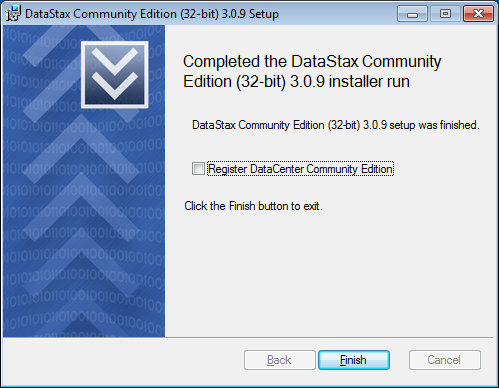

* You can find installed interfaces in "DataStax Community Edition" program group that the installer creates for you:

  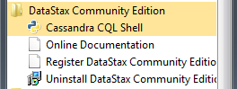

* The primary interface into Cassandra is the CQL \(Cassandra Query Language\) shell utility, which can be used to execute CQL commands for the new Cassandra server.

### ThingsBoard service installation

* Create working directory, for example "C:\thingsboard". 
* Download [installation archive](https://github.com/thingsboard/thingsboard/releases/download/v2.1/thingsboard-windows-2.1.zip) or [build it from source](https://github.com/caoyingde/thingsboard.github.io/tree/9437083b88083a9b2563248432cbbe460867fbaf/docs/user-guide/install/building-from-source/README.md).
* Unzip installation archive to the working directory. The working directory should look like this after installation:

  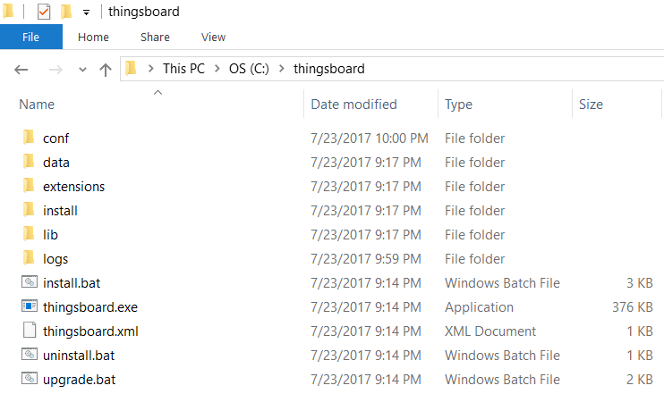

* Run windows shell \(cmd\) as Administrator. Change directory to your working dir.
* Run **install.bat** script to install ThingsBoard as a Windows service \(or run **"install.bat --loadDemo"** to install and add demo data\). This means it will be automatically started on system startup. Similar, **uninstall.bat** will remove ThingsBoard from Windows services. The output should be like:

  ```text
    C:\thingsboard>install.bat --loadDemo
    Detecting Java version installed.
    Detecting if it is 64 bit machine
    CurrentVersion
    Detecting if it is 32 bit machine
    CurrentVersion 1.8
    Java 1.8 found!
    Installing thingsboard ...
     ===================================================
     :: ThingsBoard ::       (v2.1)
     ===================================================

    Starting ThingsBoard Installation...
    Installing DataBase schema...
    Installing Cassandra DataBase schema...
    Loading system data...
    Installation finished successfully!
    2017-07-23 21:47:12,079 INFO  - Starting ServiceWrapper in the CLI mode
    2017-07-23 21:47:12,317 INFO  - Completed. Exit code is 0
    ThingsBoard installed successfully!
  ```

### \[Optional\] Configure ThingsBoard to use external database

Edit ThingsBoard configuration file:

```text
C:\thingsboard\conf\thingsboard.yml
```

For **PostgreSQL**:

For **Cassandra DB**:

Locate and set database type configuration parameter to 'cassandra'.

```text
database:
  type: "${DATABASE_TYPE:cassandra}" # cassandra OR sql
```

Go to your environment variables and set JAVA\_OPTS variable:

```text
JAVA_OPTS=-Xms256M -Xmx256M
```

#### Start ThingsBoard service

Now let's start the ThingsBoard service! Open the command prompt as an Administrator and execute the following command:

```text
net start thingsboard
```

Expected output:

```text
The ThingsBoard Server Application service is starting.
The ThingsBoard Server Application service was started successfully.
```

In order to restart the ThingsBoard service you can execute following commands:

```text
net stop thingsboard
net start thingsboard
```

Once started, you will be able to open Web UI using the following link:

```bash
http://localhost:8080/
```

**NOTE**: Please allow up to 90 seconds for the Web UI to start

#### Troubleshooting

The log files are located in **logs** folder \("C:\thingsboard\logs" in our case\).

The **thingsboard.log** file should contain following line:

```text
YYYY-MM-DD HH:mm:ss,sss [main] INFO  o.t.s.ThingsboardServerApplication - Started ThingsboardServerApplication in x.xxx seconds (JVM running for x.xxx)
```

In case of any unclear errors, use general [troubleshooting guide](https://github.com/caoyingde/thingsboard.github.io/tree/9437083b88083a9b2563248432cbbe460867fbaf/docs/user-guide/troubleshooting/README.md#getting-help) or [contact us](https://github.com/caoyingde/thingsboard.github.io/tree/9437083b88083a9b2563248432cbbe460867fbaf/docs/contact-us/README.md).

#### Windows firewall settings

In order to have external access to ThingsBoard Web UI and device connectivity \(HTTP, MQTT, CoAP\) you need to create a new inbound rule with Windows Firewall with Advanced Security.

* Open "Windows Firewall" from "Control Panel":

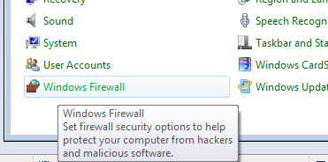

* Click "Advanced settings" on the left panel:

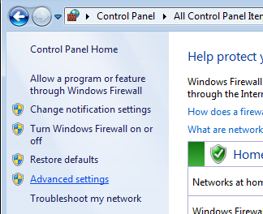

* Select "Inbound Rules" on the left panel, then click "New Rule..." on the right "Actions" panel:

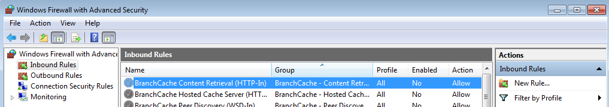

* Now new "New Inbound Rule Wizard" window will open. On the first step "Rule Type" select "Port" option: 

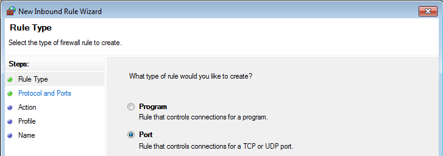

* On the "Protocol and Ports" step select "TCP" protocol and enter port list **8080, 1883, 5683** in the "Specific local ports" field:

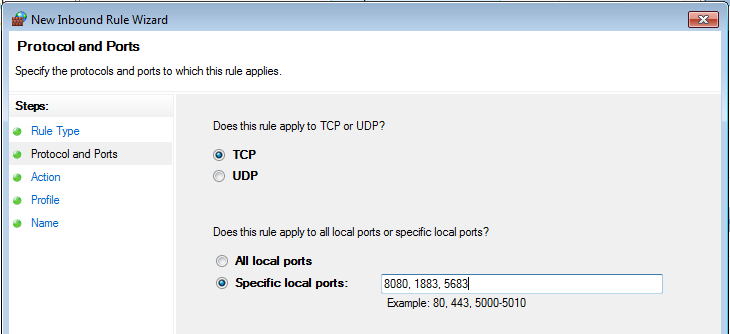

* On the "Action" step leave "Allow the connection" option selected:

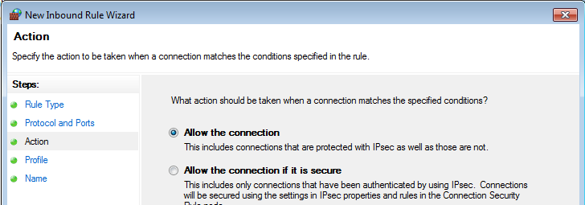

* On the "Profile" step select Windows network profiles when to apply this rule:

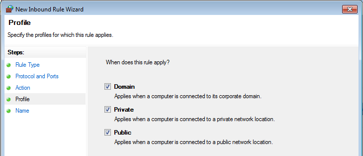

* Finally, give the name to this rule \(for ex. "ThingsBoard Service Networking"\) and click "Finish".

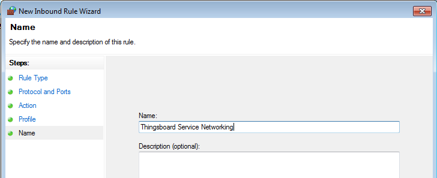

## Next steps

