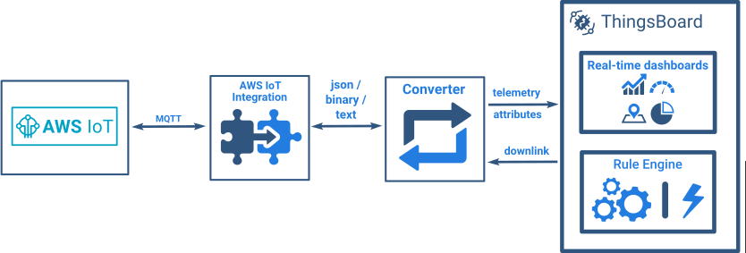

# aws-iot

* TOC

  {:toc}

AWS IoT Integration allows to stream data from AWS IoT Backend to ThingsBoard and converts device payloads to the ThingsBoard format.

See video tutorial below for step-by-step instruction how to setup AWS IoT Integration.

## Next steps

