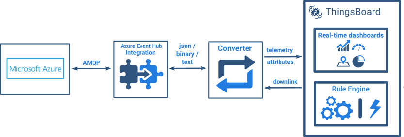

# azure-event-hub

* TOC

  {:toc}

Azure Event Hub Integration allows to stream data from Azure Event Hub to ThingsBoard and converts device payloads to the ThingsBoard format.

See video tutorial below for step-by-step instruction how to setup Azure Event Hub Integration.

## Next steps

