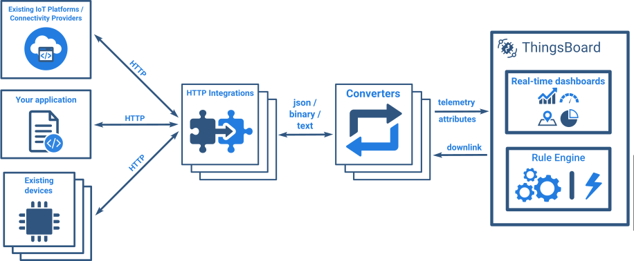

# http

* TOC

  {:toc}

HTTP Integration allows to convert existing protocols and payload formats to ThingsBoard message format and is useful in several deployment scenarios:

* stream device and/or asset data from external system, IoT platform or connectivity provider back-end.
* stream device and/or asset data from your custom application running in the cloud.
* connect the existing device with custom HTTP based protocol to ThingsBoard.

Please review the integration diagram and video tutorial to learn more.

See video tutorial below for step-by-step instruction how to setup HTTP Integration.

## Next steps

