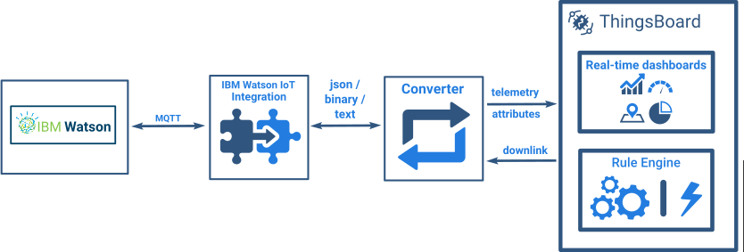

# ibm-watson-iot

* TOC

  {:toc}

IBM Watson IoT Integration allows to stream data from IBM Watson IoT to ThingsBoard and converts device payloads to the ThingsBoard format.

See video tutorial below for step-by-step instruction how to setup IBM Watson IoT Integration.

## Next steps

