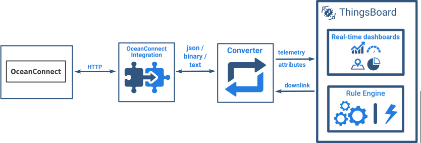
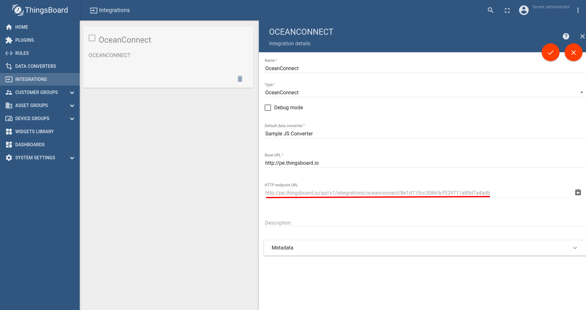

# ocean-connect

* TOC

  {:toc}

Huawei OceanConnect Integration allows to stream data from OceanConnect platform to ThingsBoard and converts binary device payloads to the ThingsBoard format.

Configuration steps:

* Create new Integration of type "OceanConnect"

* Copy HTTP endpoint URL from the auto-generated field in the form \(highlighted with red\)
* Review official OceanConnect [documentation](http://developer.huawei.com/ict/en/site-oceanconnect)

  to learn how to provision the endpoint URL from the previous step 

