# opc-ua

* TOC

  {:toc}

## Overview

OPC UA Integration allows you to stream data from the OPC UA server to ThingsBoard and converts the device payloads to the ThingsBoard format.

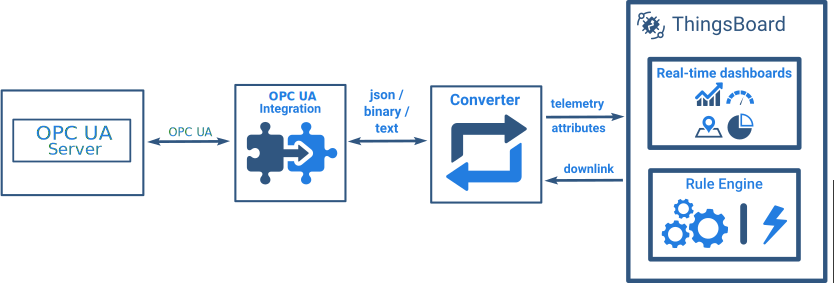

### OPC-UA Integration Tutorial

In this tutorial, we will configure the integration between ThingsBoard and OPC-UA to get the Airconditioners data from the [OPC UA C++ Demo Server](https://www.unified-automation.com/downloads/opc-ua-servers/file/download/details/opc-ua-c-demo-server-v161-windows.html) and allow the user to switch on/off any Airconditioner using the Integration downlink feature.

#### Prerequisites

* Download and install the [OPC UA C++ Demo Server](https://www.unified-automation.com/downloads/opc-ua-servers/file/download/details/opc-ua-c-demo-server-v161-windows.html).
* After installation, launch the **UA Admin Dialog**.
* Verify that the **Endpoint URL** is set correctly and remember the values of **Endpoint Host** and **Endpoint Port**. These values will be needed during the OPC-UA Integration setup.

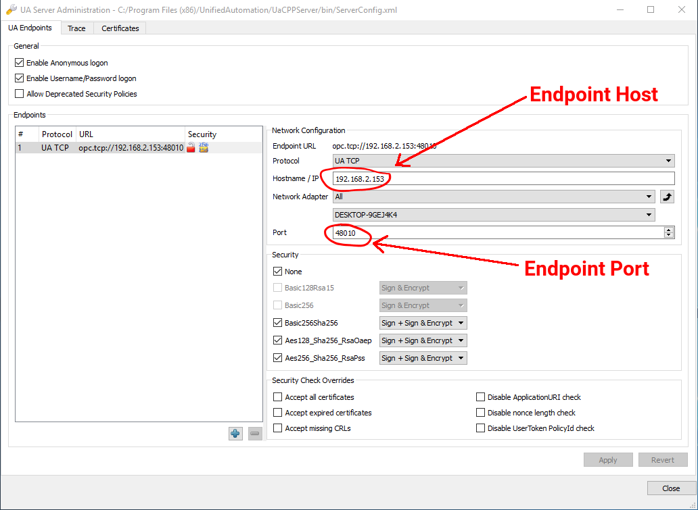

* Launch the **UaCPPServer**. The console dialog will open showing the server endpoints URLs.

#### ThingsBoard setup

**Uplink Data Converter**

First, we need to create the Uplink Data converter that will be used for receiving the messages from the OPC UA server. The converter should transform the incoming payload into the required message format. The message must contain the **deviceName** and **deviceType**. These fields are used to submit the data to the correct device. If a device cannot not be found, a new device will be created. Here is how the payload from the OPC UA integration will look like:

Payload:

Metadata:

We will take the **opcUaNode\_name** metadata value and map it to the **deviceName** and set the **deviceType** as **airconditioner**.

However, you can use another mapping in your specific use cases.

Also, we will retrieve the values of the **temperature**, **humidity** and **powerConsumption** fields and use them as device telemetries.

Go to the **Data Converters** and create a new **uplink** Converter using this function:

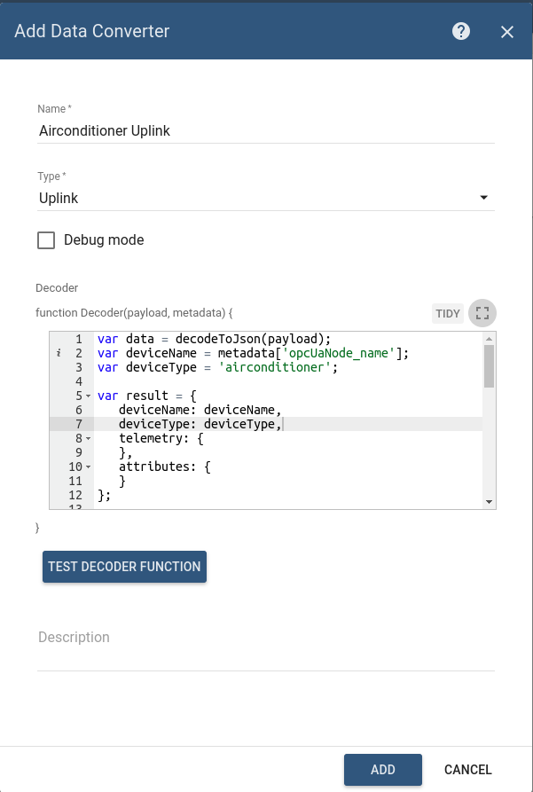

**Downlink Data Converter**

For sending Downlink messages from the Thingsboard to the OPC UA node, we need to define a downlink Converter.

In general, the output from a Downlink converter should have the following structure:

* **contentType** - defines how data will be encoded {TEXT \| JSON \| BINARY}. In case of OPC UA Integration, JSON is used by default.
* **data** - the actual data that will be processed by OPC UA Integration and sent to the target OPC UA nodes:
  * **writeValues** - array of write values methods:
    * **nodeId** - target node in [OPC UA NodeId format](http://documentation.unified-automation.com/uasdkhp/1.0.0/html/_l2_ua_node_ids.html#UaNodeIdsConcept) \(`ns=<namespaceIndex>;<identifiertype>=<identifier>`\)
    * **value** - value to write
  * **callMethods** - array of call methods:
    * **objectId** - target object in [OPC UA NodeId format](http://documentation.unified-automation.com/uasdkhp/1.0.0/html/_l2_ua_node_ids.html#UaNodeIdsConcept)
    * **methodId** - target method in [OPC UA NodeId format](http://documentation.unified-automation.com/uasdkhp/1.0.0/html/_l2_ua_node_ids.html#UaNodeIdsConcept)
    * **args** - array of method input values
* **metadata** - not used in case of OPC UA Integration and can be empty.

Go to **Data Converters** and create a new **downlink** Converter using this function:

This converter will process the RPC command to the device using the method **setState** and a boolean **params** value to call the 'Start' or 'Stop' method of the Airconditioner.

Destination node is detected using the **deviceName** field of the incoming message metadata.

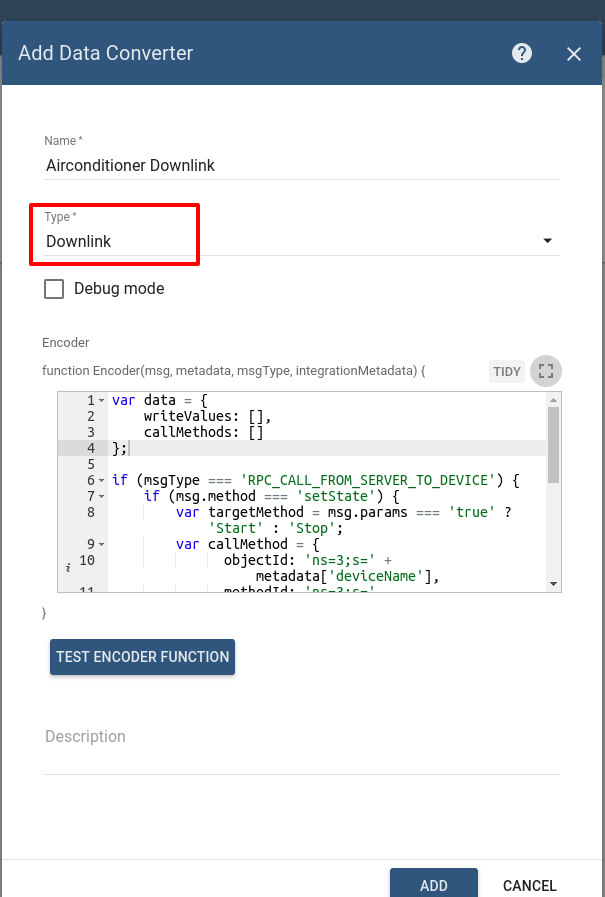

**OPC-UA Integration**

Next, we will create Integration with OPC UA server inside the ThingsBoard. Open the **Integrations** section and add a new Integration with a type **OPC-UA**

* Name: OPC-UA Airconditioners
* Type: OPC-UA
* Uplink data converter: Airconditioner Uplink
* Downlink data converter: Airconditioner Downlink
* Application name: \ \(client application name\)
* Application uri: \ \(client application uri\)
* Host: **Endpoint Host** \(see [Prerequisites](https://github.com/caoyingde/thingsboard.github.io/tree/9437083b88083a9b2563248432cbbe460867fbaf/docs/user-guide/integrations/opc-ua/README.md#prerequisites)\)
* Port: **Endpoint Port** \(see [Prerequisites](https://github.com/caoyingde/thingsboard.github.io/tree/9437083b88083a9b2563248432cbbe460867fbaf/docs/user-guide/integrations/opc-ua/README.md#prerequisites)\)
* Scan period in seconds: 10 \(how often to rescan OPC UA nodes\)
* Timeout in milliseconds: 5000 \(the timeout, in milliseconds, before failing a request to OPC UA server\)
* Security: None \(can be _Basic128Rsa15 / Basic256 / Basic256Sha256 / None_\)
* Identity: Anonymous \(can be _Anonymous / Username_\)
* Mapping:
  * Device Node Pattern: `Objects\.BuildingAutomation\.AirConditioner_\d+$` \(regular expression used to match scanned OPC UA Node FQNs/IDs to device name.\)
  * MappingType: Fully Qualified Name \(can be _Fully Qualified Name_ / _ID_\)
  * Subscription tags \(list of node tags \(**Path**\) to subscribe with mappings to keys \(**Key**\) used in the output message\):
    * state - State
    * temperature - Temperature
    * humidity - Humidity
    * powerConsumption - PowerConsumption

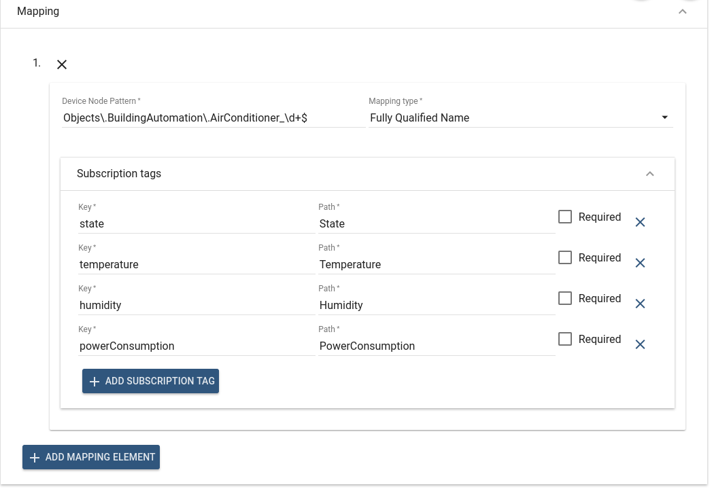

**Airconditioners Rule Chain**

To demonstrate OPC-UA Integration and Rule Engine capabilities, we will create a separate Rule Chain to process the uplink and downlink messages related to the OPC-UA Integration.

Let´s create the **Airconditioners** Rule Chain.

* Download the [**airconditioners.json**](https://github.com/caoyingde/thingsboard.github.io/tree/9437083b88083a9b2563248432cbbe460867fbaf/docs/user-guide/resources/airconditioners.json) file.
* To import this JSON file, click the `+` button at the bottom right corner of the **Rule Chains** page and select the **Import rule chain**.
* double-click on the **Airconditioners** integration downlink node and select **OPC-UA Airconditioners** in the **Integrations** field.
* Apply and save all changes.

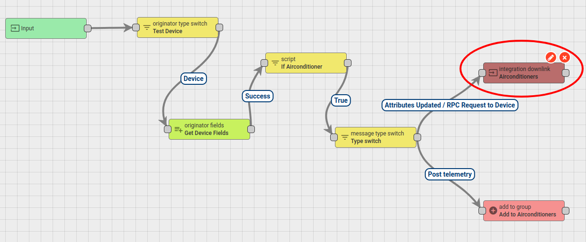 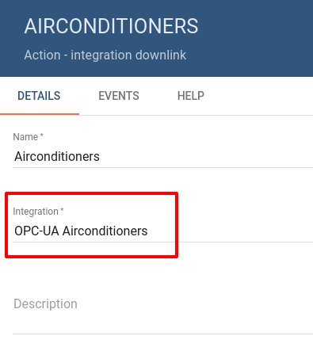

* Open and edit the **Root Rule Chain**.
* Add the **rule chain** node.
* Select the **Airconditioners** Rule Chain and connect it to the Message Type Switch Node using the following link labels:

  **Attributes Updated** / **Post telemetry** / **RPC Request to Device**.

**Airconditioners Dashboard**

To visualize the Airconditioners data and test RPC commands, we will create the **Airconditioners** dashboard.

* Download the [**airconditioners\_dashboard.json**](https://github.com/caoyingde/thingsboard.github.io/tree/9437083b88083a9b2563248432cbbe460867fbaf/docs/user-guide/resources/airconditioners_dashboard.json) file.
* To import this JSON file, click the `+` button at the bottom right corner of the **Dashboards** page and select **Import dashboard**.

#### Validation

To verify our integration,

* Go to the **Device groups** page. You will see the **Airconditioners** group.
* When you open this group, you will see the 10 Airconditioner devices.

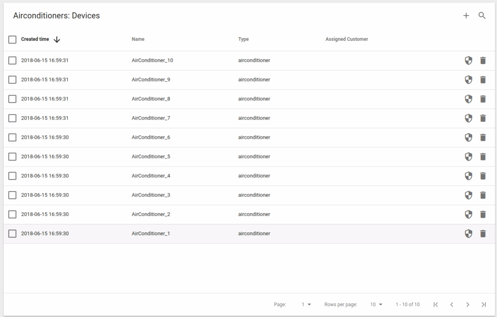

* Open the details of one of the Airconditioners and select the **Latest Telemetry** tab.
* You will see that telemetry values are frequently updated.

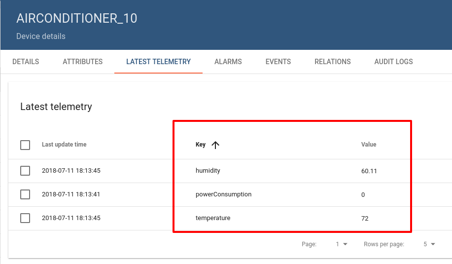

* Go to **Dashboards** and open the **Airconditioners** dashboard.
* You will see the telemetry till the last minute from all the 10 airconditioners.

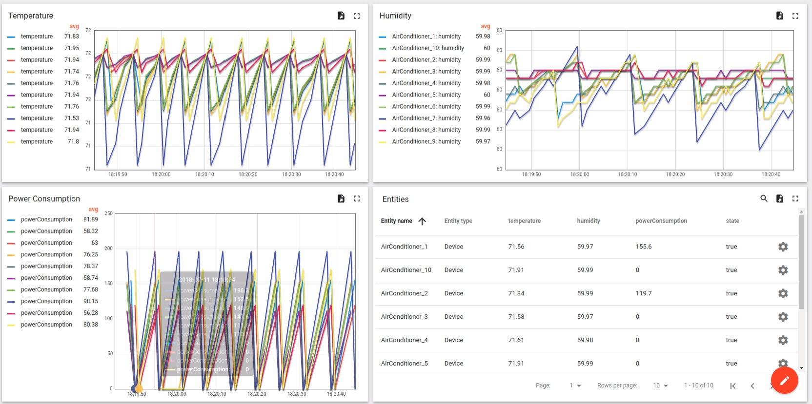

* Open the Airconditioner details page by clicking on the details button in the Entities widget.

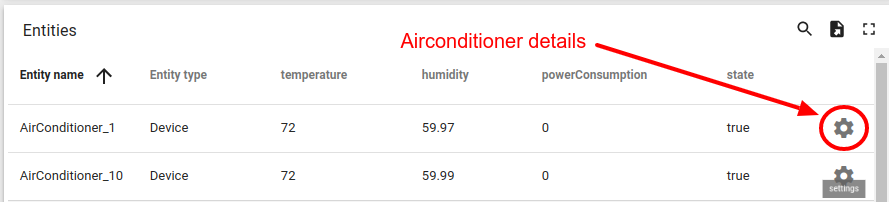

* You will find the Airconditioner status light green.
* Try to switch off the airconditioner by clicking on the **On/Off Round switch**.
* The Airconditioner status light will turn into grey, the temperature will start rising, the humidity will start increasing and the power consumption will stop.

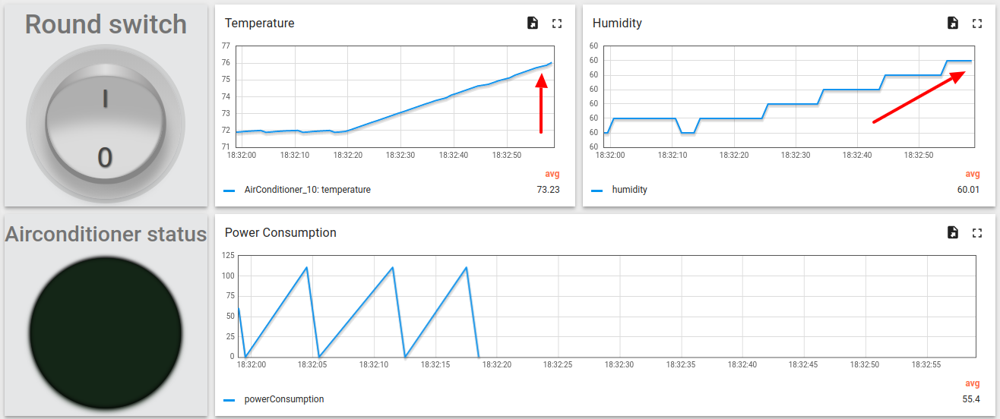

## See also

* [Integration Overview](https://github.com/caoyingde/thingsboard.github.io/tree/9437083b88083a9b2563248432cbbe460867fbaf/docs/user-guide/integrations/README.md) 
* [Uplink Converters](https://github.com/caoyingde/thingsboard.github.io/tree/9437083b88083a9b2563248432cbbe460867fbaf/docs/user-guide/integrations/README.md#uplink-data-converter) 
* [DownLink Converters](https://github.com/caoyingde/thingsboard.github.io/tree/9437083b88083a9b2563248432cbbe460867fbaf/docs/user-guide/integrations/README.md#downlink-data-converter) 
* [Rule Engine](https://github.com/caoyingde/thingsboard.github.io/tree/9437083b88083a9b2563248432cbbe460867fbaf/docs/user-guide/rule-engine-2-0/re-getting-started/README.md) 

## Next steps

