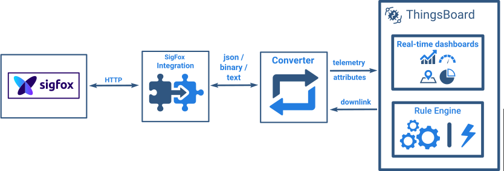

# sigfox

* TOC

  {:toc}

Sigfox Integration allows to stream data from Sigfox Backend to ThingsBoard and converts binary device payloads to the ThingsBoard format.

See video tutorial below for step-by-step instruction how to setup SigFox Integration.

## Next steps

