# ttn

* TOC

  {:toc}

## Overview

TheThingsNetwork is LoRaWAN network designed for connecting your devices using LoRaWAN stack. After integrating TheThingsNetwork with the Thingsboard, you can connect, communicate, process and visualize data from devices in the Thingsboard IoT platform.

## TheThingsNetwork setup

### Register Application

The first step is to create an **application** in TheThingsNetwork console. Go to [console](https://console.thethingsnetwork.org/){:target="\_blank"}, open **Applications** section, press **add application** button and fill required fields.

* **Application ID** - tb\_applciation
* **Handler registration** - ttn-handler-eu

Handler registration - used to identify region where application will be registered. In our example it will be _eu_ region.

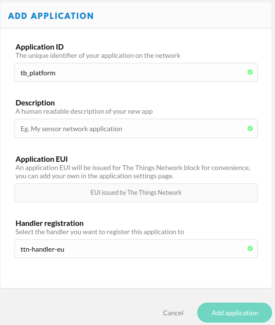

### Payload Decoder

Our device submits data in binary format. We have 2 options where to decode this data:

* **TheThingsNetwork decoder** - data will be decoded before entering the Thingsboard
* **Thingsboard converters** - uplink/downlink converters will be used to decode data from binary format into JSON

In this tutorial, we will make an initial transformation into JSON with TTN decoder and then use Thingsboard converters for correct data processing. In real life scenario, it is up to you where to decode/encode data, because it is possible to do this on any side.

After application registered in TTN, go to **payload\_formats**, select decoder function. We will take the first byte as a temperature value from a device and transform it into JSON.

Decode Function

Output json:

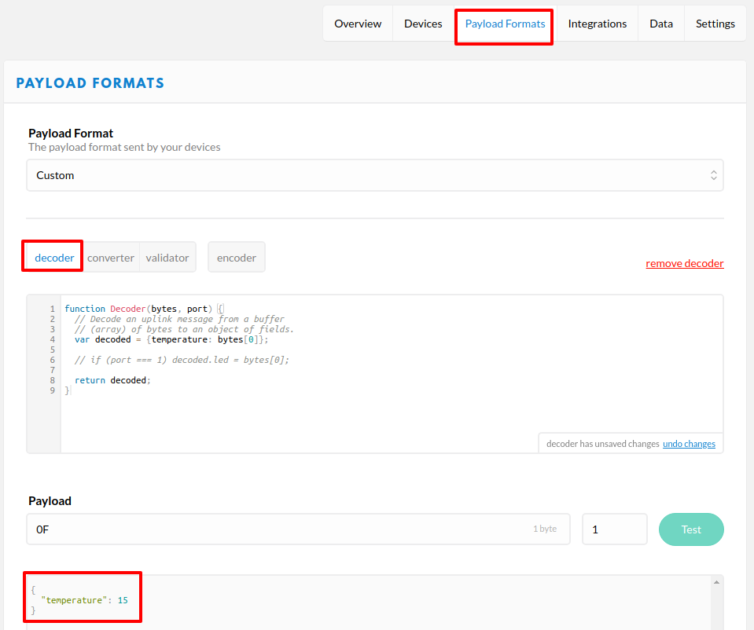

Press **Save payload function**

### Device Registration in TheThingsNetwork

Next step is a Device creation in the TTN. Open **Devices** page and press **register device**

* Device ID - thermostat\_a
* Device EUI - press **generate** button for generating random identified

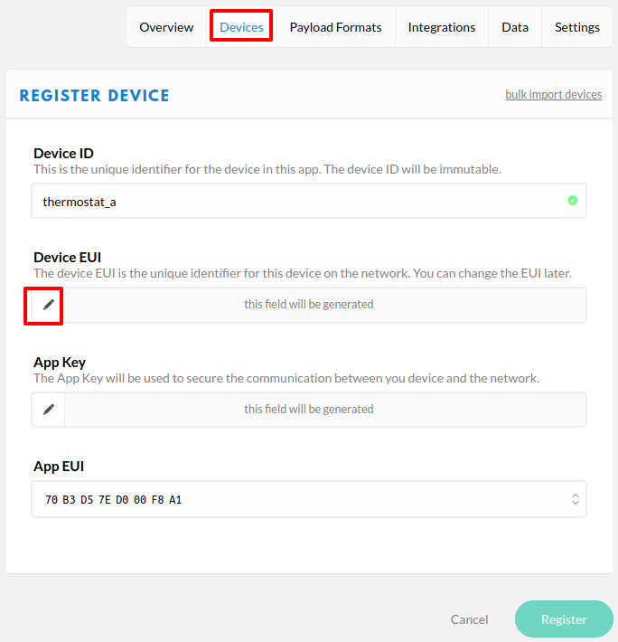

Press **Register** button.

## Integration with the Thingsboard

In the TheThingsNetwork, we already make all required configuration \(register device, decoder function, and register application\). Now we can start configuring the Thingsboard.

### Thingsboard Uplink Data Converter

First, we need to create Uplink Data converter that will be used for receiving messaged from the TTN. The converter should transform incoming payload into the required message format. Message must contains **deviceName** and **deviceType**. Those fields are used for submitting data to the correct device. If a device was not found then new device will be created. Here is how payload from TheThingsNetwork will look like:

We will take **dev\_id** and map it to the **deviceName** and **app\_id** map to the **deviceType**. But you can use another mapping in your specific use cases. Also, we will take the value of the **temperature** field and use it as a device telemetry.

Go to **Data Converters** and create new **uplink** Converter with this function:

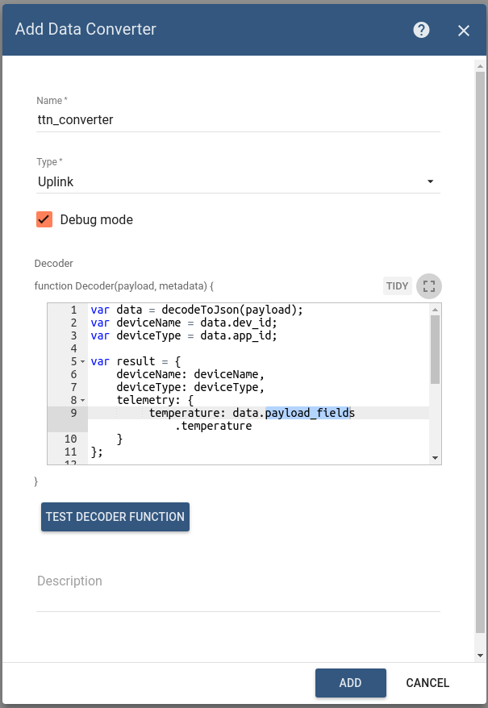

### Thingsboard Downlink Data Converter

For sending Downlink messages from the Thingsboard to the device inside TTN, we need to define downlink Converter. In general, output from Downlink converter should have the following structure:

* **contentType** - defines how data will be encoded {TEXT \| JSON \| BINARY}
* **data** - actual data that will be sent to the device in TTN. More details about API can be foind in this [TTN API](https://www.thethingsnetwork.org/docs/applications/mqtt/api.html){:target="\_blank"}
* **metadata** - in this object you should place correct devId value that will be used to identify target device in TTN

Go to **Data Converters** and create new **downlink** Converter with this function:

This converter will take **version** field from the incoming message and add it is a payload field in the outbound message. Destination device is a **thermostat\_a** device.

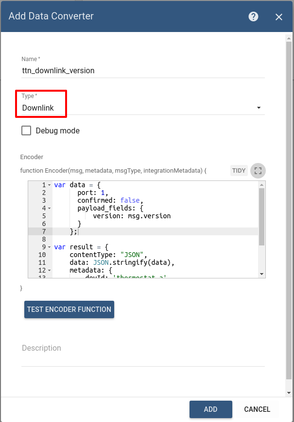

### TTN Integration

Next we will create Integration with TheThingsNetwork inside the Thingsboard. Open **Integrations** section and add new Integration with type **TheThingsNetwork**

* Name: ttn\_integration
* Type: TheThingsNetwork
* Uplink data converter: ttn\_converter
* Downlink data converter: ttn\_downlink\_version
* Region: eu \(region where your application was registered inside TTN\)
* Application ID: tb\_platform \(use **Application ID** from TTN\)
* Access Key: use **Access Key** from TTN

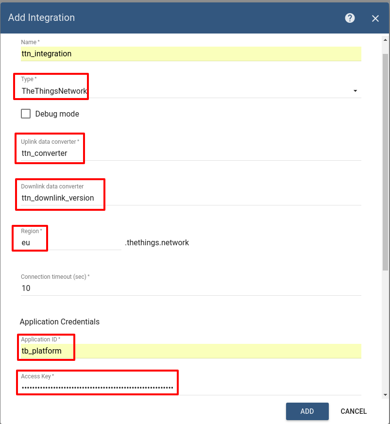

## Validation

### Validate Uplink Messages

Lets verify our integration. Go to the device **thermostat\_a** page in TheThingsNetwork. Scroll to the **Simulate Uplink** section. Our device will publish temperature **0F** \(15\). So enter **0F** into payload field and press **Send** button.

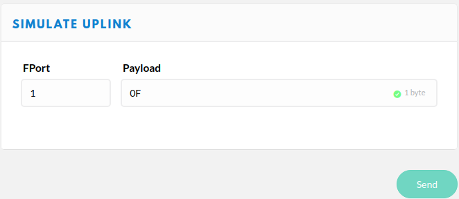

Go to **Device Group** -&gt; **All** -&gt; **thermostat\_a** - you can see that

* new device was registered in the thingsboard
* In the **Latest Telemetry** section you will see that last submitted temperature = 15.

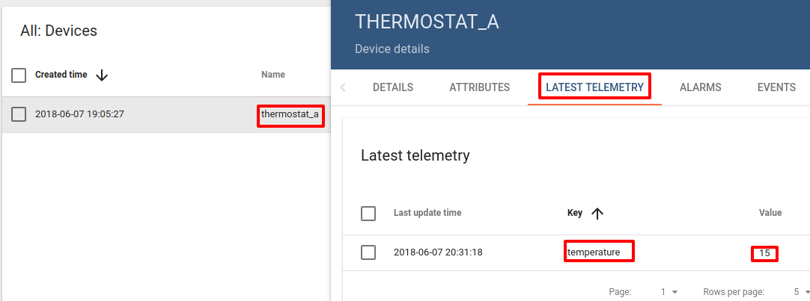

### Validate Downlink Messages

For testing Downlink Messages, we will update our Root Rule Chain to send downlink message when device attribute is changed. Open and edit **Root Rule Chain**. Add **Integration Downlink** Action node and connect it with the **Message Type Switch** Node using relation **Attributes Updated**

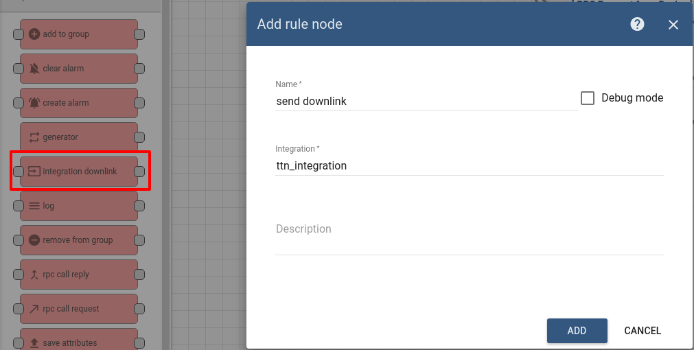

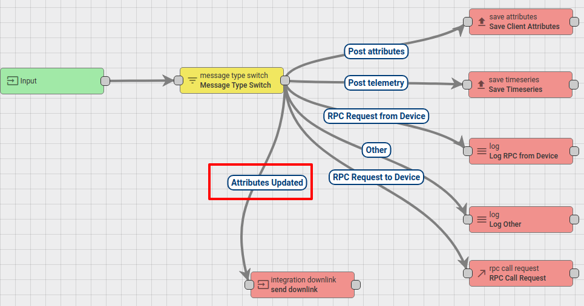

Save Changes.

Go to **Device Group** -&gt; **All** -&gt; **thermostat\_a** -&gt; attributes section. We will add **Shared attribute** with name **version** and value **v.0.11**

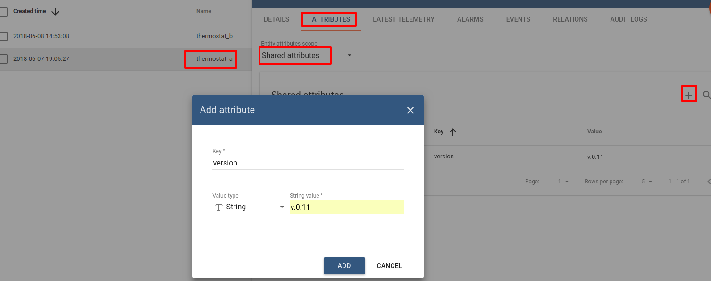

By making this step, we triggered downlink message to the device **thermostat\_a** and this message should contains version field value. Open TTN Console, navigate to **tb\_platfrom** application, to the section **Data**. And we see that Downlink message was received.

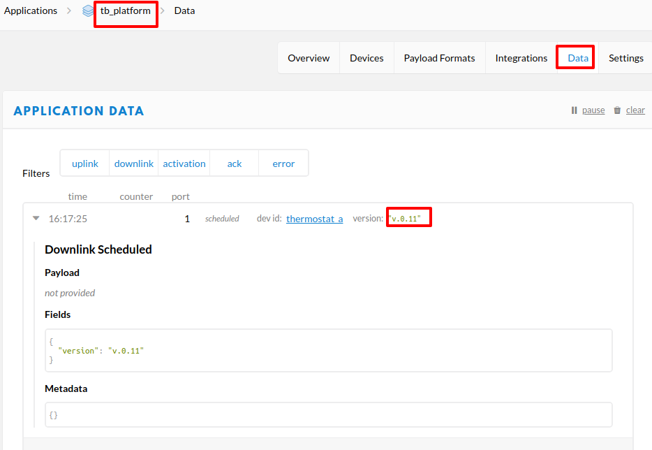

## See also

With this integration you can also configure Downlink converters and trigger required actions using Rule Engine nodes.

* [Integration Overview](https://github.com/caoyingde/thingsboard.github.io/tree/9437083b88083a9b2563248432cbbe460867fbaf/docs/user-guide/integrations/README.md) 
* [Uplink Converters](https://github.com/caoyingde/thingsboard.github.io/tree/9437083b88083a9b2563248432cbbe460867fbaf/docs/user-guide/integrations/README.md#uplink-data-converter) 
* [DownLink Converters](https://github.com/caoyingde/thingsboard.github.io/tree/9437083b88083a9b2563248432cbbe460867fbaf/docs/user-guide/integrations/README.md#downlink-data-converter) 
* [Rule Engine](https://github.com/caoyingde/thingsboard.github.io/tree/9437083b88083a9b2563248432cbbe460867fbaf/docs/user-guide/rule-engine-2-0/re-getting-started/README.md) 

## Next steps

