# action-nodes

Action Nodes execute various actions based on incoming Message.

* TOC

  {:toc}

## Create Alarm Node

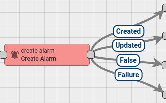

This Node tries to load latest Alarm with configured **Alarm Type** for Message Originator. If **Uncleared** Alarm exist, then this Alarm will be updated, otherwise a new Alarm will be created.

Node Configuration:

* **Alarm Details Builder** script
* **Alarm Type** - any string that represents Alarm Type
* **Alarm Severity** - {CRITICAL \| MAJOR \| MINOR \| WARNING \| INDETERMINATE}
* is **Propagate** - whether Alarm should be propagated to all parent related entities.

**Alarm Details Builder** script used for generating Alarm Details JsonNode. It is useful for storing additional parameters inside Alarm. For example you can save attribute name/value pair from Original Message payload or Metadata.

**Alarm Details Builder** script should return **details** object.

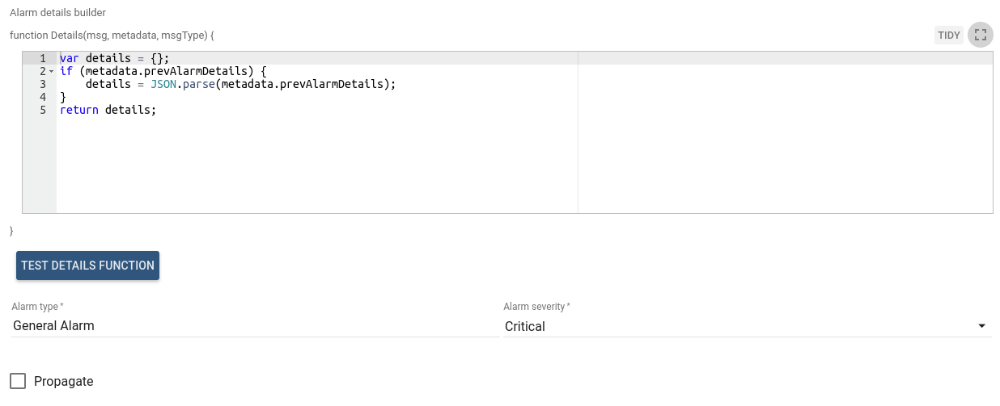

* Message _payload_ can be accessed via `msg` property. For example `msg.temperature`  
* Message _metadata_ can be accessed via `metadata` property. For example `metadata.customerName`  
* Message _type_ can be accessed via `msgType` property. For example `msgType` 

**Optional:** previous Alarm Details can be accessed via `metadata.prevAlarmDetails`. If previous Alarm does not exist, this field will not be present in Metadata. **Note** that `metadata.prevAlarmDetails` is a raw String field and it needs to be converted into object using this construction:

**Alarm Details Builder** script function can be verified using [Test JavaScript function](https://github.com/caoyingde/thingsboard.github.io/tree/9437083b88083a9b2563248432cbbe460867fbaf/docs/user-guide/rule-engine-2-0/overview/README.md#test-javascript-functions).

**Example of Details Builder Function**

This function takes `count` property from previous Alarm and increment it. Also put `temperature` attribute from inbound Message payload into Alarm details.

**Alarm created/updated with those properties:**

* Alarm details - object returned from **Alarm Details Builder** script
* Alarm status - if **new alarm** -&gt; _ACTIVE\_UNACK_. If **existing Alarm** -&gt; does not changed
* Severity - value from Node Configuration
* Propagation - value from Node Configuration
* Alarm type - value from Node Configuration
* Alarm start time - if **new alarm** -&gt; _current system time_. If **existing Alarm** -&gt; does not changed
* Alarm end time - _current system time_

**Outbound message will have the following structure:**

* **Message Type** - _ALARM_
* **Originator** - the same originator from inbound Message
* **Payload** - JSON representation of new Alarm that was created/updated
* **Metadata** - all fields from original Message Metadata  

After new Alarm _**created**_, Outbound message will contain additional property inside Metadata - **isNewAlarm** with **true** value. Message will be passed via **Created** chain.

After existing Alarm _**updated**_, Outbound message will contain additional property inside Metadata - **isExistingAlarm** with **true** value. Message will be passed via **Updated** chain.

Here is an example of Outbound Message **payload**

More details about Alarms in the Thingsboard can be found in [this tutorial](https://github.com/caoyingde/thingsboard.github.io/tree/9437083b88083a9b2563248432cbbe460867fbaf/docs/user-guide/alarms/README.md)

You can see the real life example, where this node is used, in the next tutorial:

* [Create and Clear Alarms](https://github.com/caoyingde/thingsboard.github.io/tree/9437083b88083a9b2563248432cbbe460867fbaf/docs/user-guide/rule-engine-2-0/tutorials/create-clear-alarms/README.md)

## Clear Alarm Node

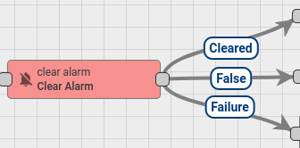

This Node loads the latest Alarm with configured **Alarm Type** for Message Originator and Clear the Alarm if it exist.

Node Configuration:

* **Alarm Details Builder** script
* **Alarm Type** - any string that represents Alarm Type

**Alarm Details Builder** script used for updating Alarm Details JsonNode. It is useful for storing additional parameters inside Alarm. For example you can save attribute name/value pair from Original Message payload or Metadata.

**Alarm Details Builder** script should return **details** object.

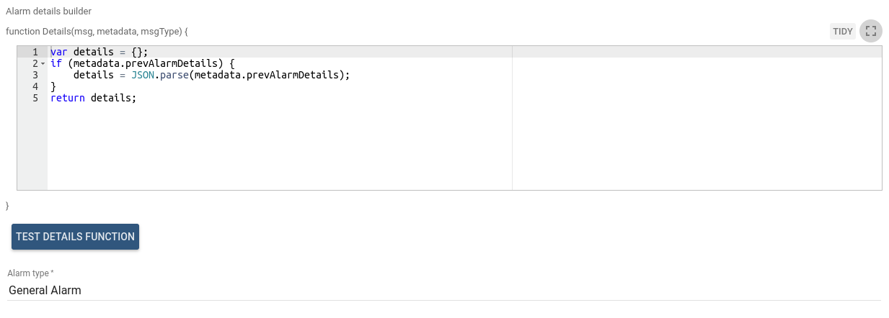

* Message _payload_ can be accessed via `msg` property. For example `msg.temperature`  
* Message _metadata_ can be accessed via `metadata` property. For example `metadata.customerName`  
* Message _type_ can be accessed via `msgType` property. For example `msgType` 
* Current Alarm Details can be accessed via `metadata.prevAlarmDetails`. 

**Note** that `metadata.prevAlarmDetails` is a raw String field and it needs to be converted into object using this construction:

**Alarm Details Builder** script function can be verified using [Test JavaScript function](https://github.com/caoyingde/thingsboard.github.io/tree/9437083b88083a9b2563248432cbbe460867fbaf/docs/user-guide/rule-engine-2-0/overview/README.md#test-javascript-functions).

**Example of Details Builder Function**

This function takes `count` property from previous Alarm and increment it. Also put `temperature` attribute from inbound Message payload into Alarm details.

This Node updates Current Alarm:

* change alarm **status** to **CLEARED\_ACK** if it was already acknowledged, otherwise to **CLEARED\_UNACK**
* set **clear time** to current system time
* update Alarm details with new object returned from **Alarm Details Builder** script

In case when Alarm does not exist or it is already **Cleared** Alarm, original Message will be passed to the next nodes via **False** chain.

Otherwise new Message will be passed via **Cleared** chain.

**Outbound message will have the following structure:**

* **Message Type** - _ALARM_
* **Originator** - the same originator from inbound Message
* **Payload** - JSON representation of Alarm that was cleared
* **Metadata** - all fields from original Message Metadata. Also additional property inside Metadata will be added -&gt; **isClearedAlarm** with **true** value.

Here is an example of Outbound Message **payload**

More details about Alarms in the Thingsboard can be found in [this tutorial](https://github.com/caoyingde/thingsboard.github.io/tree/9437083b88083a9b2563248432cbbe460867fbaf/docs/user-guide/alarms/README.md)

You can see the real life example, where this node is used, in the next tutorial:

* [Create and Clear Alarms](https://github.com/caoyingde/thingsboard.github.io/tree/9437083b88083a9b2563248432cbbe460867fbaf/docs/user-guide/rule-engine-2-0/tutorials/create-clear-alarms/README.md)

## Delay Node

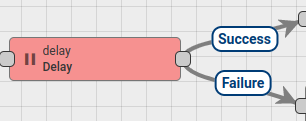

Delays incoming messages for configurable period.

Configuration:

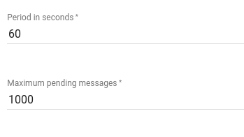

* **Period in seconds** - specifies the value of the period during which incoming message should be suspended
* **Maximum pending messages** - specifies the amount of maximum allowed pending messages \(queue of suspended messages\) 

When delay period for particular incoming message will be reached it will be removed from pending queue and routed to the next nodes via **Success** chain.

Each next message will be routed via **Failure** chain if the maximum pending messages limit will be reached.

## Generator Node

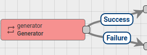

Generates Messages with configurable period. JavaScript function is used for message generation.

Node Configuration:

* Message generation frequency in seconds
* Message originator 
* JavaScript function that will generate the actual message.

JavaScript function receive 3 input parameters:

* `prevMsg` - is a previously generated Message payload.
* `prevMetadata` - is a previously generated Message metadata.
* `prevMsgType` - is a previously generated Message type.

Script should return the following structure:

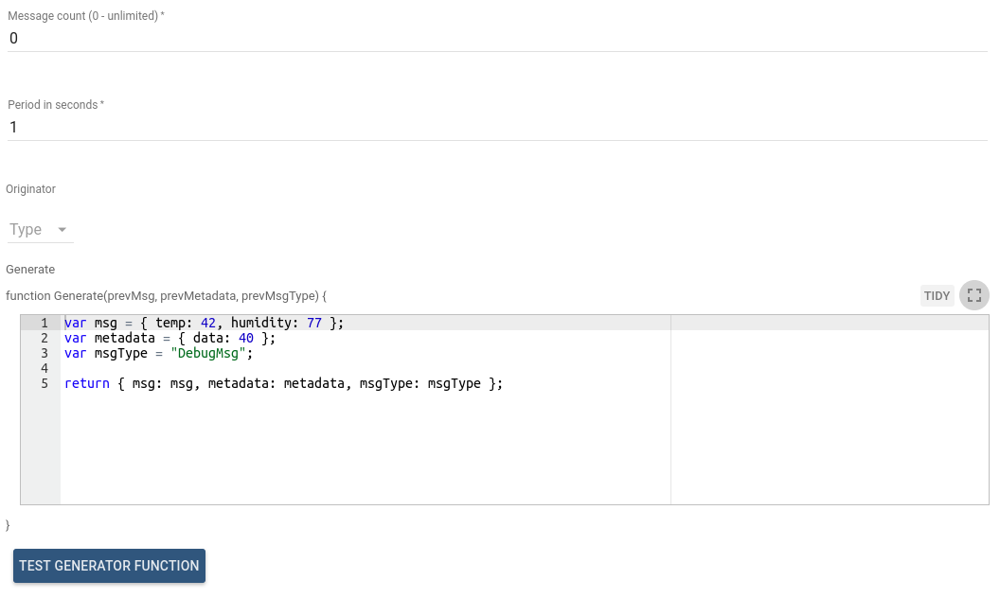

All fields in resulting object are optional and will be taken from previously generated Message if not specified.

Outbound Message from this Node will be new Message that was constructed using configured JavaScript function.

JavaScript generator function can be verified using [Test JavaScript function](https://github.com/caoyingde/thingsboard.github.io/tree/9437083b88083a9b2563248432cbbe460867fbaf/docs/user-guide/rule-engine-2-0/overview/README.md#test-javascript-functions).

This node can be used for Rule Chain debugging purposes.

## Log Node

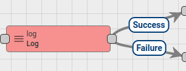

Transform incoming Message with configured JavaScript function to String and log final value into the Thingsboard log file.

**INFO** log level is used for logging.

JavaScript function receive 3 input parameters

* `metadata` - is a Message metadata.
* `msg` - is a Message payload.
* `msgType` - is a Message type.

Script should return String value.

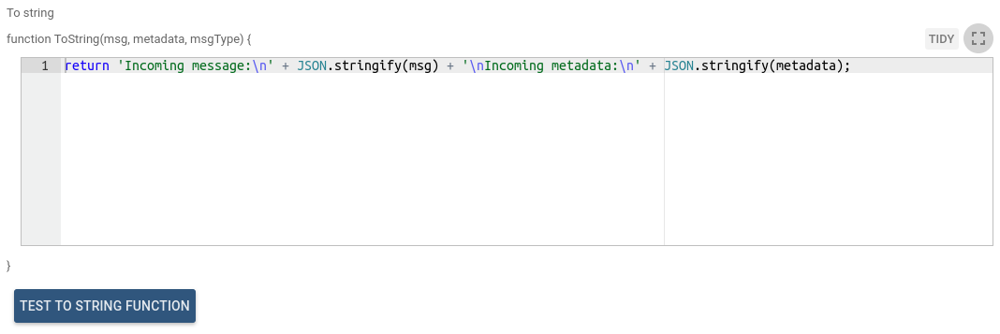

JavaScript transform function can be verified using [Test JavaScript function](https://github.com/caoyingde/thingsboard.github.io/tree/9437083b88083a9b2563248432cbbe460867fbaf/docs/user-guide/rule-engine-2-0/overview/README.md#test-javascript-functions).

You can see the real life example, where this node is used, in the next tutorial:

* [Reply to RPC Calls](tutorials/rpc-reply-tutorial.md#log-unknown-request)

## RPC Call Reply Node

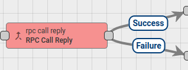

Sends response to the RPC Call originator. All incoming RPC requests are passed through Rule Chain as Messages. Also all RPC requests have request ID field. It is used for mapping requests and responses. Message Originator must be a **Device** entity because RPC response is initiated to the Message Originator.

Node configuration has special request ID field mapping. If the mapping is not specified, **requestId** metadata field is used by default.

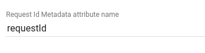

RPC request can be received via different transports:

* MQTT
* HTTP
* CoAP  

Message payload example:

Message will be routed via **Failure** chain in the following cases:

* Inbound Message originator is not a **Device** entity
* Request id is not present in the Message metadata
* Inbound Message payload is empty

For more details how RPC works in the Thingsboard, please read [RPC capabilities](https://github.com/caoyingde/thingsboard.github.io/tree/9437083b88083a9b2563248432cbbe460867fbaf/docs/user-guide/rpc/README.md) Article.

You can see the real life example, where this node is used, in the next tutorial:

* [Reply to RPC Calls](tutorials/rpc-reply-tutorial.md)

## RPC Call Request Node

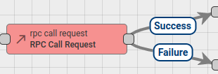

Sends RPC requests to the Device and routing response to the next Rule nodes. Message Originator must be a **Device** entity as RPC request can be initiated only to device.

Node configuration has **Timeout** field used to specify timeout waiting for response from device.

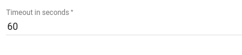

Message payload must have correct format for RPC request. It must contains **method** and **params** fields. Example:

If Message Payload contains **requestId** field, its value used to identify RPC request to the Device. Otherwise random requestId will be generated.

Outbound Message will have same originator and metadata as in inbound Message. Response from the Device will be added into Message payload.

Message will be routed via **Failure** chain in the following cases:

* Inbound Message originator is not a **Device** entity
* Inbound Message has missed **method** or **params** fields
* If Node will not receive a response during configured timeout

Otherwise Message will be routed via **Success** chain.

For more details how RPC works in the Thingsboard, please read [RPC capabilities](https://github.com/caoyingde/thingsboard.github.io/tree/9437083b88083a9b2563248432cbbe460867fbaf/docs/user-guide/rpc/README.md) article.

## Save Attributes Node

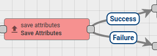

Stores attributes from incoming Message payload to the database and associate them to the Entity, that is identified by the Message Originator. Configured **scope** is used to identify attributes scope.

Supported scope types:

* Client attributes
* Shared attributes
* Server attributes

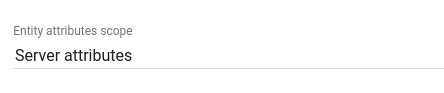

Expects messages with **POST\_ATTRIBUTES\_REQUEST** message type. If message Type is not **POST\_ATTRIBUTES\_REQUEST**, Message will be routed via **Failure** chain.

When attributes are uploaded over existing API \(HTTP / MQTT / CoAP / etc.\) Message with correct payload and type will be passed into **Input** node of the **Root Rule Chain**.

In cases when it is required to trigger attributes saving inside Rule Chain, the Rule Chain should be configured to transform Message payload to the expected format and set message type to **POST\_ATTRIBUTES\_REQUEST**. It could be done using [**Script Transformation Node**](https://github.com/caoyingde/thingsboard.github.io/tree/9437083b88083a9b2563248432cbbe460867fbaf/docs/user-guide/rule-engine-2-0/transformation-nodes/README.md#script-transformation-node).

**Expected Message Payload example:**

After successful attributes saving, original Message will be passed to the next nodes via **Success** chain, otherwise **Failure** chain is used.

## Save Timeseries Node

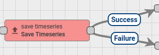

Stores Timeseries data from incoming Message payload to the database and associate them to the Entity, that is identified by the Message Originator. Configured **TTL** seconds is used for timeseries data expiration. **0** value means that data will never expire.

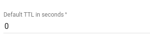

Expects messages with **POST\_TELEMETRY\_REQUEST** message type. If message Type is not **POST\_TELEMETRY\_REQUEST**, Message will be routed via **Failure** chain.

When timeseries data is published over existing API \(HTTP / MQTT / CoAP / etc.\) Message with correct payload and type will be passed into **Input** node of the **Root Rule Chain**.

In cases when it is required to trigger timeseries data saving inside Rule Chain, the Rule Chain should be configured to transform Message payload  
to the expected format and set message type to **POST\_TELEMETRY\_REQUEST**. It could be done using [**Script Transformation Node**](https://github.com/caoyingde/thingsboard.github.io/tree/9437083b88083a9b2563248432cbbe460867fbaf/docs/user-guide/rule-engine-2-0/transformation-nodes/README.md#script-transformation-node).

Message Metadata must contain **ts** field. This field identifies timestamp in milliseconds of published telemetry.

Also, if Message Metadata contains **TTL** field, its value is used for timeseries data expiration, otherwise **TTL** from Node Configuration is used.

**Expected Message Payload example:**

After successful timeseries data saving, original Message will be passed to the next nodes via **Success** chain, otherwise **Failure** chain is used.

