# enrichment-nodes

Enrichment Nodes are used to update meta-data of the incoming Message.

* TOC

  {:toc}

## Customer attributes

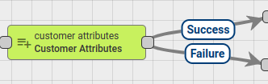

Node finds Customer of the Message Originator entity and adds Customers Attributes or Latest Telemetry value into Message Metadata.

Administrator can configure the mapping between original attribute name and Metadata attribute name.

There is **Latest Telemetry** checkbox in the Node configuration. If this checkbox selected, Node will fetch Latest telemetry for configured keys. Otherwise, Node will fetch server scope attributes.

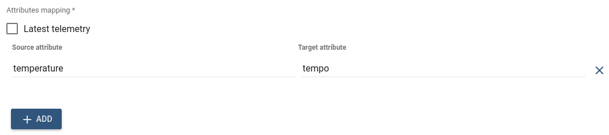

Outbound Message Metadata will contain configured attributes if they exist. To access fetched attributes in other nodes you can use this template '`metadata.temperature`'

Following Message Originator types are allowed: **Customer**, **User**, **Asset**, **Device**.

If unsupported Originator type found, an error is thrown.

If Originator does not have assigned Customer Entity **Failure** chain is used, otherwise **Success** chain.

You can see the real life example, where this node is used, in the next tutorial:

* [Send Email](https://github.com/caoyingde/thingsboard.github.io/tree/9437083b88083a9b2563248432cbbe460867fbaf/docs/user-guide/rule-engine-2-0/tutorials/send-email/README.md)

## Device attributes

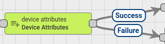

Node finds Related Device of the Message Originator entity using configured query and adds Attributes \(client\shared\server scope\) and Latest Telemetry value into Message Metadata.

Attributes are added into metadata with scope prefix:

* shared attribute -&gt; `shared_`
* client attribute -&gt; `cs_`
* server attribute -&gt; `ss_`
* telemetry -&gt; no prefix used 

For example, shared attribute 'version' will be added into Metadata with the name 'shared_version'. Client attributes will use 'cs_' prefix. Server attributes use 'ss\_' prefix. Latest telemetry value added into Message Metadata as is, without prefix.

In 'Device relations query' configuration Administrator can select required **Direction** and **relation depth level**. Also **Relation type** can be configured with required set of **Device types**.

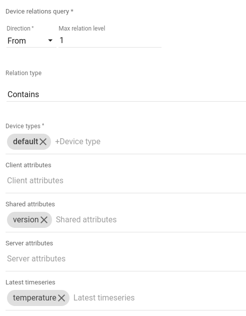

If multiple Related Entities were found, _**only the first Entity is used**_ for attributes enrichment, other entities will be discarded.

**Failure** chain is used if no Related Entity was found, otherwise - **Success** chain.

If attribute or telemetry was not found, it is not added into Message Metadata and still routed via **Success** chain.

Outbound Message Metadata will contain configured attributes only if they exist.

To access fetched attributes in other nodes you can use this template '`metadata.temperature`'

## Originator attributes

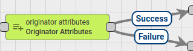

Add Message Originator Attributes \(client\shared\server scope\) and Latest Telemetry value into Message Metadata.

Attributes are added into metadata with scope prefix:

* shared attribute -&gt; `shared_`
* client attribute -&gt; `cs_`
* server attribute -&gt; `ss_`
* telemetry -&gt; no prefix used 

For example, shared attribute 'version' will be added into Metadata with the name 'shared_version'. Client attributes will use 'cs_' prefix. Server attributes use 'ss\_' prefix. Latest telemetry value added into Message Metadata as is, without prefix.

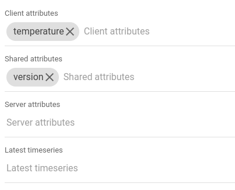

Outbound Message Metadata will contain configured attributes if they exist.

If attribute or telemetry was not found, it is not added into Message Metadata and still routed via **Success** chain.

To access fetched attributes in other nodes you can use this template '`metadata.cs_temperature`'

You can see the real life example, where this node is used, in the following tutorials:

* [Transform telemetry using previous record](https://github.com/caoyingde/thingsboard.github.io/tree/9437083b88083a9b2563248432cbbe460867fbaf/docs/user-guide/rule-engine-2-0/tutorials/transform-telemetry-using-previous-record/README.md)
* [Send Email](https://github.com/caoyingde/thingsboard.github.io/tree/9437083b88083a9b2563248432cbbe460867fbaf/docs/user-guide/rule-engine-2-0/tutorials/send-email/README.md)

## Originator fields

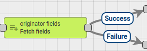

Node fetches fields values of the Message Originator entity and adds them into Message Metadata. Administrator can configure the mapping between field name and Metadata attribute name. If specified field is not part of Message Originator entity fields it will be ignored.

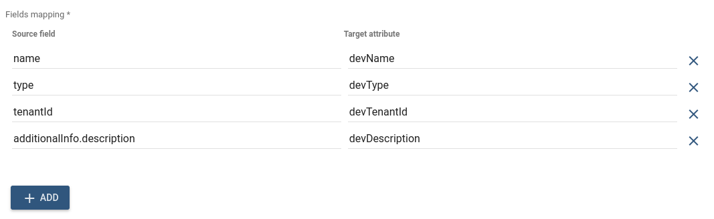

Following Message Originator types are allowed: **Tenant**, **Customer**, **User**, **Asset**, **Device**, **Alarm**, **Rule Chain**.

**Failure** chain is used If unsupported Originator type found, otherwise - **Success** chain.

If field value was not found, it is not added into Message Metadata and still routed via **Success** chain.

Outbound Message Metadata will contain configured attributes only if they exist.

To access fetched attributes in other nodes you can use this template '`metadata.devType`'

## Related attributes

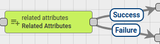

Node finds Related Entity of the Message Originator entity using configured query and adds Attributes or Latest Telemetry value into Message Metadata.

Administrator can configure the mapping between original attribute name and Metadata attribute name.

In 'Relations query' configuration Administrator can select required **Direction** and **relation depth level**. Also set of **Relation filters** can be configured with required Relation type and Entity Types.

There is **Latest Telemetry** checkbox in the Node configuration. If this checkbox selected, Node will fetch Latest telemetry for configured keys. Otherwise, Node will fetch server scope attributes.

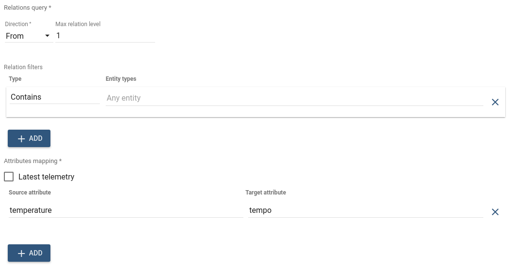

If multiple Related Entities are found, _**only first Entity is used**_ for attributes enrichment, other entities are discarded.

If no Related Entity found **Failure** chain is used, otherwise **Success** chain.

Outbound Message Metadata will contain configured attributes if they exist.

To access fetched attributes in other nodes you can use this template '`metadata.tempo`'

You can see the real life example, where this node is used, in the next tutorial:

* [Reply to RPC Calls](https://github.com/caoyingde/thingsboard.github.io/tree/9437083b88083a9b2563248432cbbe460867fbaf/docs/user-guide/rule-engine-2-0/tutorials/rpc-reply-tutorial/README.md#add-related-attributes-node)

## Tenant attributes

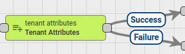

Node finds Tenant of the Message Originator entity and adds Tenant Attributes or Latest Telemetry value into Message Metadata.

Administrator can configure the mapping between original attribute name and Metadata attribute name.

There is **Latest Telemetry** checkbox in the Node configuration. If this checkbox selected, Node will fetch Latest telemetry for configured keys. Otherwise, Node will fetch server scope attributes.

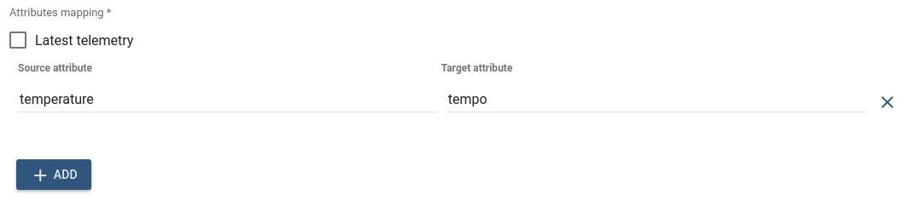

Outbound Message Metadata will contain configured attributes if they exist. To access fetched attributes in other nodes you can use this template '`metadata.tempo`'

Following Message Originator types are allowed: **Tenant**, **Customer**, **User**, **Asset**, **Device**, **Alarm**, **Rule Chain**.

If unsupported Originator type found, an error is thrown.

**Failure** chain is used if Originator does not have assigned Tenant Entity, otherwise - **Success** chain.

## Originator telemetry

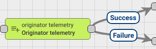

Adds Message Originator telemetry values from particular time range that was selected in node configuration to the Message Metadata.

Telemetry values added to Message Metadata without prefix.

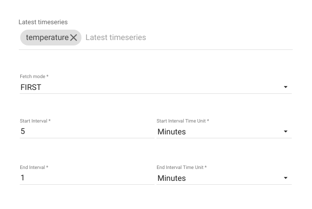

The rule node has three fetch modes:

* FIRST: retrieves telemetry from the database that is closest to the beginning of the time range
* LAST: retrieves telemetry from the database that is closest to the end of the time range
* ALL: retrieves all telemetry from the database, which is in the specified time range.

**NOTE**: End of the interval must always be less than the beginning of the interval.  

If selected fetch mode **FIRST** or **LAST**, Outbound Message Metadata would contain JSON elements\(key/value\) otherwise if the selected fetch mode **ALL**, telemetry would be fetched as an array.

This array will contain JSON objects with the timestamp and value.

Outbound Message Metadata will contain configured telemetry fields if they exist and belong to the selected range.

If attribute or telemetry was not found, it is not added into Message Metadata and still routed via **Success** chain.

To access fetched telemetry in other nodes you can use this template '`JSON.parse(metadata.temperature)`'

You can see the real-life example, where this node is used, in the following tutorials:

* [Telemetry delta calculation](https://github.com/caoyingde/thingsboard.github.io/tree/9437083b88083a9b2563248432cbbe460867fbaf/docs/user-guide/rule-engine-2-0/tutorials/telemetry-delta-validation/README.md)

