# external-nodes

External Nodes used are used to interact with external systems.

* TOC

  {:toc}

## AWS SNS Node

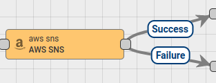

Node publish messages to AWS SNS \(Amazon Simple Notification Service\).

Configuration:

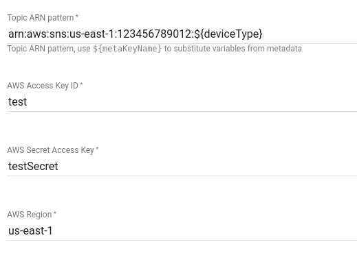

* **Topic ARN pattern** - can be set direct topic name for message publishing 

  or pattern can be used, that will be resolved to the real ARN Topic name using Message metadata. 

* **AWS Access Key ID** and **AWS Secret Access Key** are the credentials of an AWS IAM User with programmatic access. More information on AWS access keys can be found [here](http://docs.aws.amazon.com/IAM/latest/UserGuide/id_credentials_access-keys.html). 
* **AWS Region** must correspond to the one in which the SNS Topic\(s\) are created. Current list of AWS Regions can be found [here](http://docs.aws.amazon.com/general/latest/gr/rande.html).

In the following example, topic name depends on Device Type and there is a Message that contains **deviceType** field in Metadata:

For publishing message in **controller**'s topic, we will set this pattern in **Topic ARN pattern**:

In runtime, pattern will be resolved to `arn:aws:sns:us-east-1:123456789012:controller`

**Published payload** - Node will publish full Message payload to the SNS. If required, Rule Chain can be configured to use chain of Transformation Nodes for sending correct Payload to the SNS.

**Outbound message** from this node will contain response **messageId** and **requestId** in Message metadata. Original Message payload, type and originator will not be changed.

## AWS SQS Node

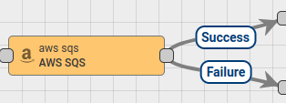

Node publish messages to the AWS SQS \(Amazon Simple Queue Service\).

Configuration:

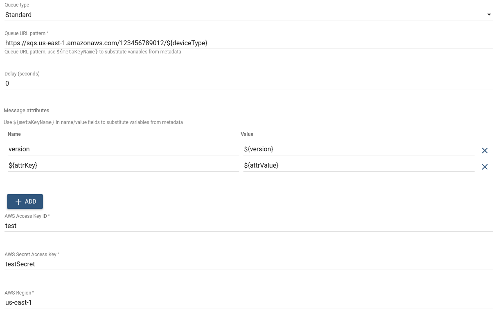

* **Queue Type** - SQS queue type. Can be _Standard_ or _FIFO_.
* **Queue URL Pattern** - Pattern for building Queue URL. For example `${deviceType}`.

  Can be set direct Queue URL for message publishing or pattern can be used, that will be resolved to the real Queue URL using Message metadata.

* **Delay** - delay in seconds, used to delay a specific message.
* **Message attributes** - optional list of message attributes to publish.
* **AWS Access Key ID** and **AWS Secret Access Key** are the credentials of an AWS IAM User with programmatic access. More information on AWS access keys can be found [here](http://docs.aws.amazon.com/IAM/latest/UserGuide/id_credentials_access-keys.html). 
* **AWS Region** must correspond to the one in which the SQS Queue\(s\) are created. Current list of AWS Regions can be found [here](http://docs.aws.amazon.com/general/latest/gr/rande.html).

In the following example, Queue URL depends on Device Type and there is a Message that contains **deviceType** field in Metadata:

For publishing message in **controller**'s Queue, we will set this pattern in **Queue URL pattern**:

In runtime, pattern will be resolved to [`https://sqs.us-east-1.amazonaws.com/123456789012/controller`](https://sqs.us-east-1.amazonaws.com/123456789012/controller)

**Published body** - Node will publish full Message payload to the SQS. If required, Rule Chain can be configured to use chain of Transformation Nodes for sending correct Payload to the SQS.

**Published attributes** - optional list of attributes can be added for publishing message in SQS. It is a collection of  -  pairs. Both, NAME and VALUE, could be a static values or patterns that will be resolved using Message metadata.

If **FIFO** queue is selected, then Message ID will be used as **deduplication ID** and Message originator as **group ID**.

**Outbound message** from this node will contain response **messageId**, **requestId**, **messageBodyMd5**, **messageAttributesMd5** and **sequenceNumber** in Message metadata. Original Message payload, type and originator will not be changed.

## Kafka Node

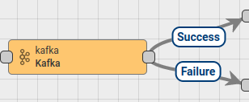

Kafka Node sends messages to Kafka brokers. Expects messages with any message type. Will send record via Kafka producer to Kafka server.

Configuration:

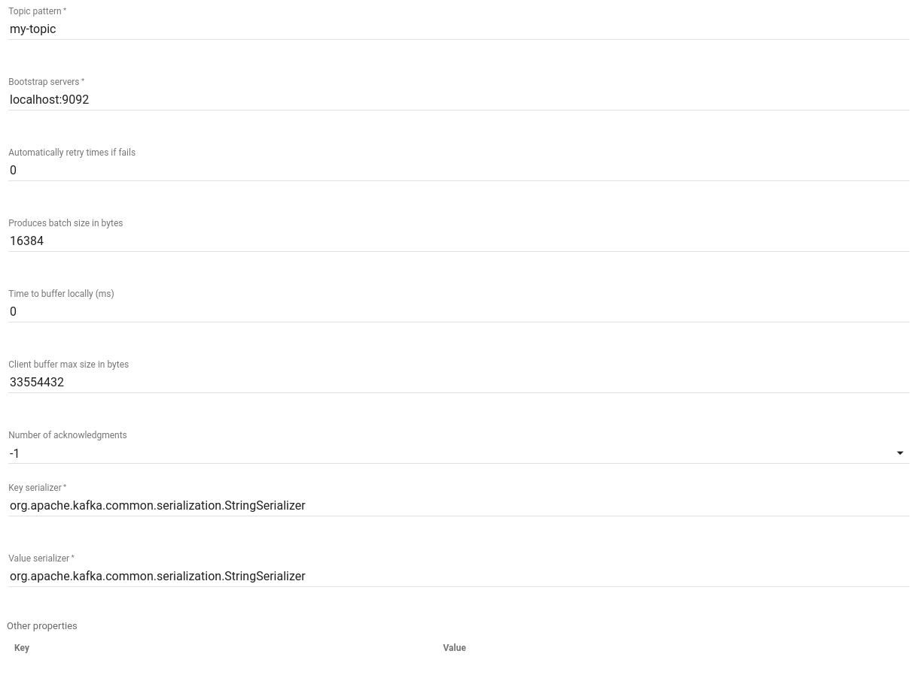

* **Topic pattern** - can be a static string, or pattern that is resolved using Message Metadata properties. For example `${deviceType}`
* **bootstrap servers** - list of kafka brokers separated with comma.
* **Automatically retry times** - number of attempts to resend message if connection fails.
* **Produces batch size** - batch size in bytes for grouping messages with the same partition.
* **Time to buffer locally** - max local buffering window duration in ms.
* **Client buffer max size** - max buffer size in bytes for sending messages.
* **Number of acknowledgments** - number of acknowledgments node requires to received before considering a request complete.
* **Key serializer** - by default org.apache.kafka.common.serialization.StringSerializer
* **Value serializer** - by default org.apache.kafka.common.serialization.StringSerializer
* **Other properties** - any other additional properties could be provided for kafka broker connection.

**Published body** - Node will send full Message payload to the Kafka topic. If required, Rule Chain can be configured to use chain of Transformation Nodes for sending correct Payload to the Kafka.

**Outbound message** from this node will contain response **offset**, **partition** and **topic** properties in the Message metadata. Original Message payload, type and originator will not be changed.

## MQTT Node

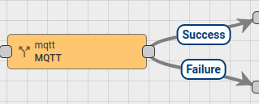

Publish incoming message payload to the topic of the configured MQTT broker with QoS **AT\_LEAST\_ONCE**.

Configuration:

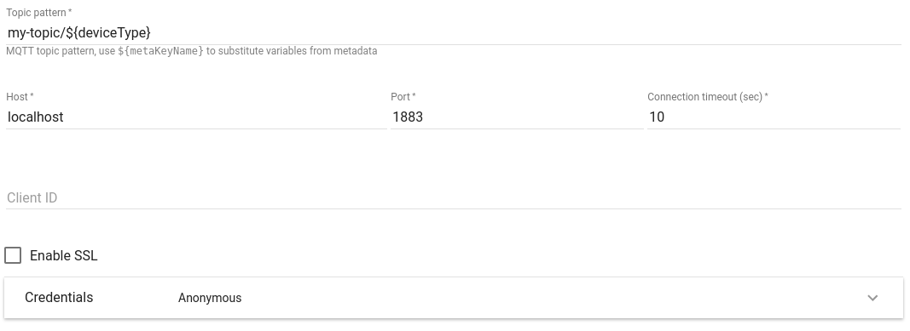

* **Topic pattern** - can be a static string, or pattern that is resolved using Message Metadata properties. For example `${deviceType}`.
* **Host** - MQTT broker host.
* **Port** - MQTT broker port.
* **Connection timeout** - timeout in seconds for connecting to MQTT broker.
* **Client ID** - optional client identifier used for connecting to MQTT broker. If not specified, default generated clientId will be used.
* **SSL Enable/Disable** - enable/disable secure communication.  
* **Credentials** - MQTT connection credentials. Can be either _Anonymous_, _Basic_ or _PEM_.

Different Authentication credentials are supported for external MQTT broker:

* Anonymous - no authentication
* Basic - username\password pair is used for authenticating
* PEM - PEM certificates are used for Authentication

If **PEM** credentials type is selected, the following configuration should be provided:

* CA certificate file
* Certificate file
* Private key file
* Private key password

**Published body** - Node will send full Message payload to the MQTT topic. If required, Rule Chain can be configured to use chain of Transformation Nodes for sending correct Payload to the MQTT broker.

In case of successful message publishing, original Message will be passed to the next nodes via **Success** chain, otherwise **Failure** chain is used.

## RabbitMQ Node

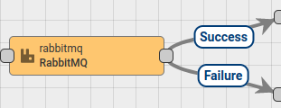

Publish incoming message payload to the RabbitMQ.

Configuration:

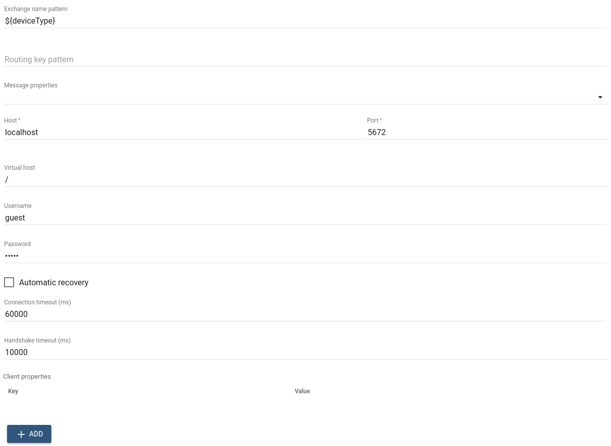

* **Exchange name pattern** - the exchange to publish the message to. Can be a static string, or pattern that is resolved using Message Metadata properties. For example `${deviceType}` .
* **Routing key pattern** - the routing key. Can be a static string, or pattern that is resolved using Message Metadata properties. For example `${deviceType}` .
* **Message properties** - optional routing headers. Supported headers _BASIC_, _TEXT\_PLAIN_, _MINIMAL\_BASIC_, _MINIMAL\_PERSISTENT\_BASIC_, _PERSISTENT\_BASIC_, _PERSISTENT\_TEXT\_PLAIN_
* **Host** - default host to use for connections
* **Port** - default port to use for connections
* **Virtual host** - the virtual host to use when connecting to the broker
* **Username** - AMQP user name to use when connecting to the broker
* **Password** - AMQP password to use when connecting to the broker
* **Automatic recovery** - enables or disables automatic connection recovery
* **Connection timeout** - connection TCP establishment timeout in milliseconds; zero for infinite
* **Handshake timeout** - the AMQP0-9-1 protocol handshake timeout, in milliseconds
* **Client properties** - additional properties that are sent to the server during connection startup 

**Published body** - Node will send full Message payload to the RabbitMQ. If required, Rule Chain can be configured to use chain of Transformation Nodes for sending correct Payload.

In case of successful message publishing, original Message will be passed to the next nodes via **Success** chain, otherwise **Failure** chain is used.

## REST API Call Node

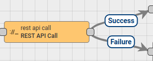

Invoke REST API calls to the external REST server.

Configuration:

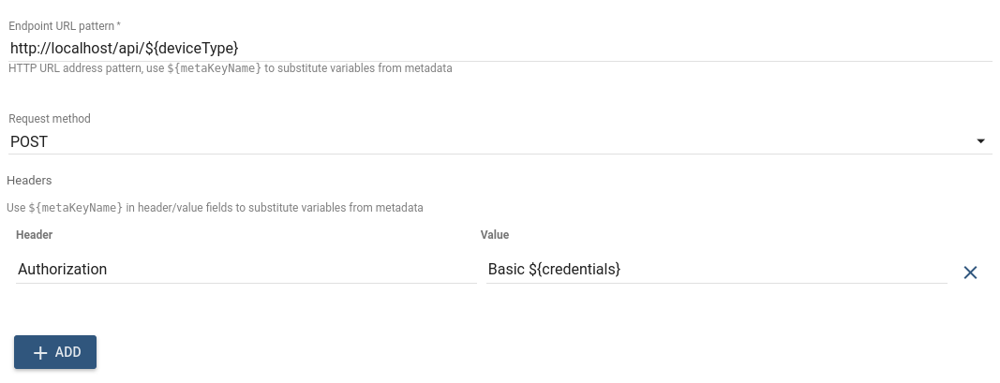

* **Endpoint URL pattern** - Can be a static string, or pattern that is resolved using Message Metadata properties. For example `${deviceType}`
* **Request method** - _GET_, _POST_, _PUT_, _DELETE_
* **Headers** - request headers, header or value can be a static string, or pattern that is resolved using Message Metadata properties.

**Endpoint URL**

URL can be a static string or a pattern. Only Message metadata is used for resolving patterns. So property names that are used in the patterns must exist in the Message Metadata, otherwise raw pattern will be added into URL.

For example, if Message payload contains property **deviceType** with value **container**, then this pattern:

[`http://localhost/api/${deviceType}/update`](http://localhost/api/${deviceType}/update)

will be resolved to

[`http://localhost/api/container/update`](http://localhost/api/container/update)

**Headers**

Collection of header name/value can be configured. Those headers will be added into Rest request. Pattern should be used for configured both header name and header value. For example `${deviceType}`. Only Message metadata is used for resolving patterns. So property names that are used in the pattern must exist in the Message Metadata, otherwise raw pattern will be added into header.

**Request body** - Node will send full Message payload to the configured REST endpoint. If required, Rule Chain can be configured to use chain of Transformation Nodes for sending correct Payload.

**Outbound message** from this node will contain response **status**, **statusCode**, **statusReason** and responce **headers** in the Message metadata. Outbound Message payload will be the same as response body. Original Message type and originator will not be changed.

In case of successful request, outbound message will be passed to the next nodes via **Success** chain, otherwise **Failure** chain is used.

## Send Email Node

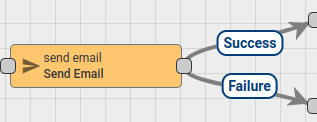

Node sends incoming message using configured Mail Server. This Node works only with messages that where created using [**To Email**](https://github.com/caoyingde/thingsboard.github.io/tree/9437083b88083a9b2563248432cbbe460867fbaf/docs/user-guide/rule-engine-2-0/transformation-nodes/README.md#to-email-node) transformation Node, please connect this Node with **To Email** Node using **Success** chain.

Configuration:

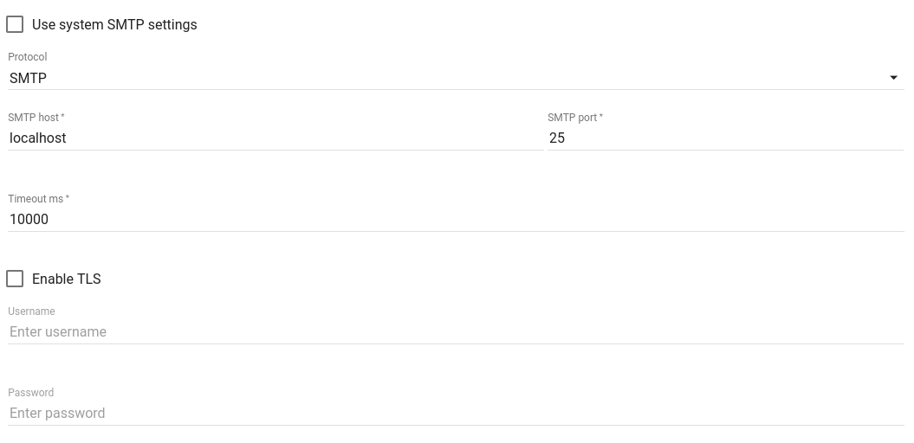

* **Use system SMTP settings** - if enabled default Mail Server configured on System level will be used
* **Protocol** - Mail Server transport protocol: _SMTP_ or _SMTPS_
* **SMTP host** - Mail Server host
* **SMTP port** - Mail Server port
* **Timeout ms** - read timeout in milliseconds
* **Enable TLS** - if true, enables the use of the STARTTLS command \(if supported by the server\)
* **Username** - username for the account at the mail host, if any
* **Password** - password for the account at the mail host, if any

This Node can work with default Mail Server configured on System level. Please find more details about [how to configure default System SMTP Settings.](https://github.com/caoyingde/thingsboard.github.io/tree/9437083b88083a9b2563248432cbbe460867fbaf/docs/user-guide/ui/mail-settings/README.md)

If specific Mail Server is required for this node - disable **Use system SMTP settings** checkbox and configure Mail Server manually.

Additionally this node can create email attachments if incoming message has prepared **attachments** field with reference to files stored in DataBase.

**NOTE**: This is part of [File Storage](https://github.com/caoyingde/thingsboard.github.io/tree/9437083b88083a9b2563248432cbbe460867fbaf/docs/user-guide/file-storage/README.md) feature supported by [ThingsBoard Professional Edition](https://github.com/caoyingde/thingsboard.github.io/tree/9437083b88083a9b2563248432cbbe460867fbaf/products/thingsboard-pe/README.md).

In case of successful mail sending, original Message will be passed to the next nodes via **Success** chain, otherwise **Failure** chain is used.

You can see the real life example, where this node is used, in the next tutorial:

* [Send Email](https://github.com/caoyingde/thingsboard.github.io/tree/9437083b88083a9b2563248432cbbe460867fbaf/docs/user-guide/rule-engine-2-0/tutorials/send-email/README.md)

## Twilio SMS Node

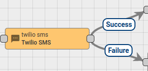

Sends incoming message payload as SMS message via Twilio service.

Configuration:

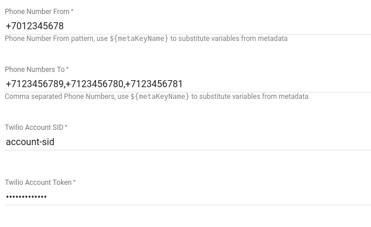

* **Phone Number From** - can be set direct phone number as Number From of SMS

  ```text
                      or pattern can be used, that will be resolved to the real Number From using Message metadata.
  ```

* **Phone Numbers To** - comma separated recipient Phone Numbers list. Can be set direct phone numbers or pattern can be used, that will be resolved to the real phone numbers using Message metadata.
* **Twilio Account SID** - your Account Sid at twilio.com/console
* **Twilio Account Token** - your Account Token at twilio.com/console

SMS message will be sent to all recipients taken from **Phone Numbers To** list.

If SMS message will be sent to all recipients successfully, original Message will be passed to the next nodes via **Success** chain, otherwise **Failure** chain is used.

