# filter-nodes

Filter Nodes are used for Message filtering and routing.

* TOC

  {:toc}

## Check Relation Filter Node

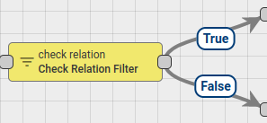

Checks the relation from the selected entity to originator of the message by type and direction.

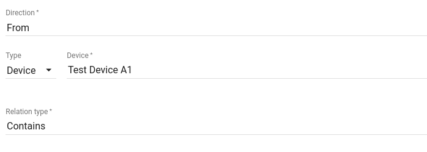

If relation exists - Message is sent via **True** chain, otherwise **False** chain is used.

## Message Type Filter Node

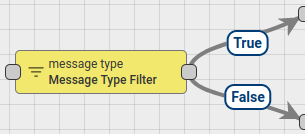

In the Node configuration, administrator defines set of allowed Message Types for incoming Message. There are [predefined Message Types](https://github.com/caoyingde/thingsboard.github.io/tree/9437083b88083a9b2563248432cbbe460867fbaf/docs/user-guide/rule-engine-2-0/overview/README.md#predefined-message-types) in the system, like **Post attributes**, **Post telemetry**, **RPC Request**, etc. An administrator can also define any Custom Message Types in the node configuration.

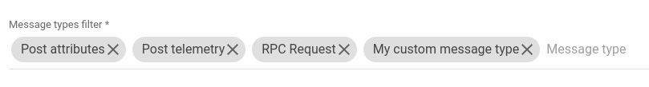

If incoming Message Type is expected - Message is sent via **True** chain, otherwise **False** chain is used.

## Message Type Switch Node

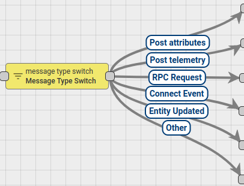

Route incoming messages by Message Type. If incoming Message has known [Message Type](https://github.com/caoyingde/thingsboard.github.io/tree/9437083b88083a9b2563248432cbbe460867fbaf/docs/user-guide/rule-engine-2-0/overview/README.md#predefined-message-types) then it is sent to the corresponding chain, otherwise, message is sent to **Other** chain.

If you use Custom Message Types than you can route those messages via **Other** chain of **Message Type Switch Node** to the **Switch Node** or **Message Type Filter Node** configured with required routing logic.

## Originator Type Filter Node

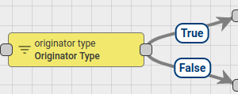

In the Node configuration, administrator defines set of allowed Originator [Entity](https://github.com/caoyingde/thingsboard.github.io/tree/9437083b88083a9b2563248432cbbe460867fbaf/docs/user-guide/entities-and-relations/README.md) types for incoming Message.

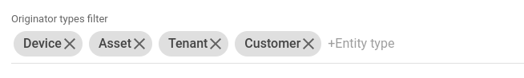

If incoming Originator Type is expected - Message is sent via **True** chain, otherwise **False** chain is used.

## Originator Type Switch Node

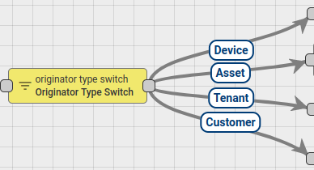

Routes incoming messages by Originator [Entity](https://github.com/caoyingde/thingsboard.github.io/tree/9437083b88083a9b2563248432cbbe460867fbaf/docs/user-guide/entities-and-relations/README.md) type.

## Script Filter Node

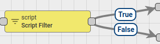

Evaluates incoming Message with configured JavaScript condition.

JavaScript function receive 3 input parameters:

* `msg` - is a Message payload.
* `metadata` - is a Message metadata.
* `msgType` - is a Message type.

Script should return Boolean value. If **True** - send Message via **True** chain, otherwise **False** chain is used.

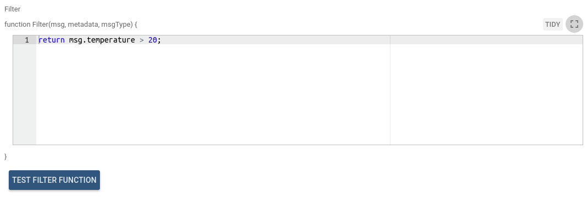

Message payload can be accessed via `msg` variable. For example `msg.temperature`  
 Message metadata can be accessed via `metadata` variable. For example `metadata.customerName === 'John';`  
 Message type can be accessed via `msgType` variable. For example `msgType === 'POST_TELEMETRY_REQUEST'`  

Full script example:

JavaScript condition can be verified using [Test JavaScript function](https://github.com/caoyingde/thingsboard.github.io/tree/9437083b88083a9b2563248432cbbe460867fbaf/docs/user-guide/rule-engine-2-0/overview/README.md#test-javascript-functions).

You can see the real life examples, where this node is used, in the next tutorials:

* [Create and Clear Alarms](https://github.com/caoyingde/thingsboard.github.io/tree/9437083b88083a9b2563248432cbbe460867fbaf/docs/user-guide/rule-engine-2-0/tutorials/create-clear-alarms/README.md)
* [Reply to RPC Calls](https://github.com/caoyingde/thingsboard.github.io/tree/9437083b88083a9b2563248432cbbe460867fbaf/docs/user-guide/rule-engine-2-0/tutorials/rpc-reply-tutorial/README.md#add-filter-script-node)

## Switch Node

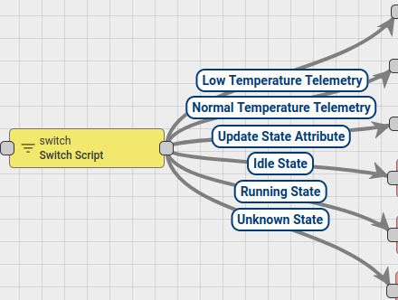

Routes incoming Message to one OR multiple output chains. Node executes configured JavaScript function.

JavaScript function receive 3 input parameters:

* `msg` - is a Message payload.
* `metadata` - is a Message metadata.
* `msgType` - is a Message type.

The script should return _**an array of next Relation names**_ where Message should be routed. If returned array is empty - message will not be routed to any Node and discarded.

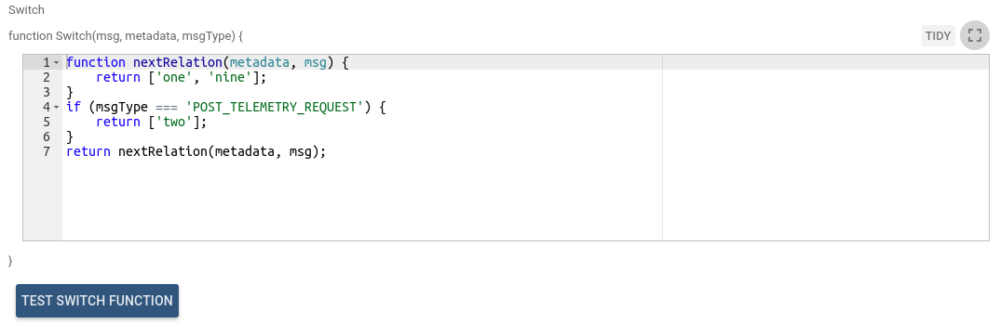

Message payload can be accessed via `msg` variable. For example `msg.temperature`  
 Message metadata can be accessed via `metadata` variable. For example `metadata.customerName === 'John';`  
 Message type can be accessed via `msgType` variable. For example `msgType === 'POST_TELEMETRY_REQUEST'`  

Full script example:

JavaScript switch function can be verified using [Test JavaScript function](https://github.com/caoyingde/thingsboard.github.io/tree/9437083b88083a9b2563248432cbbe460867fbaf/docs/user-guide/rule-engine-2-0/overview/README.md#test-javascript-functions).

In order to specify custom relation name **Custom** type should be selected. This will allow to input custom relation name. Custom relation names are case-insensitive.

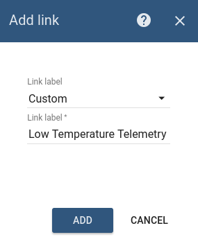

