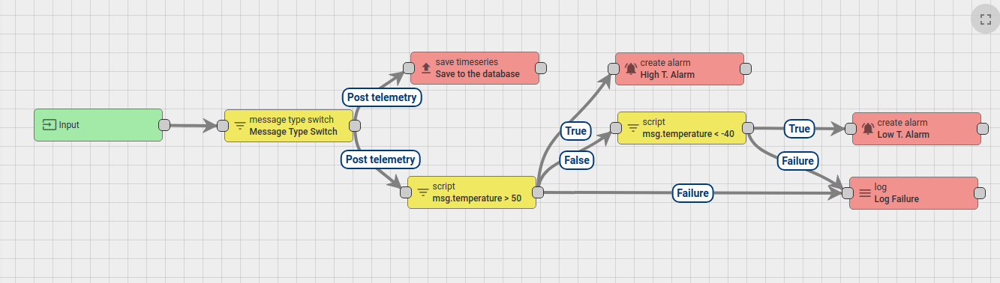
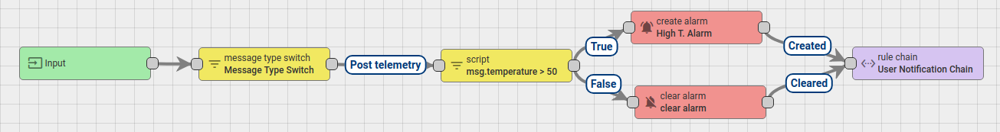
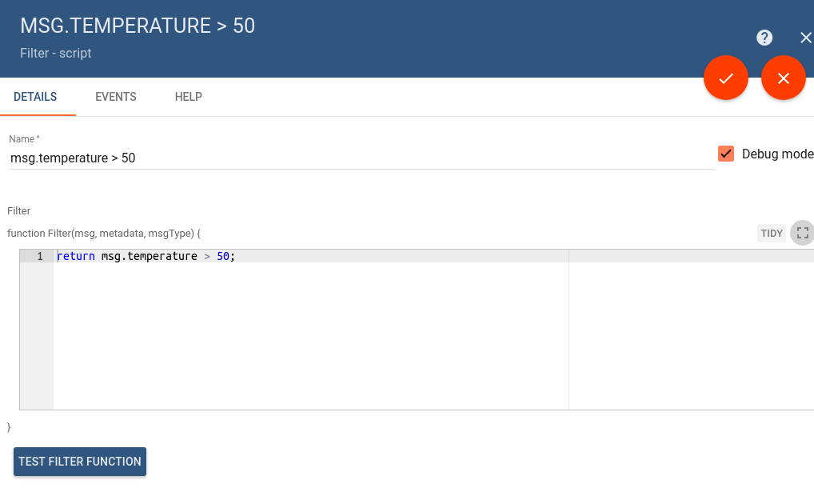
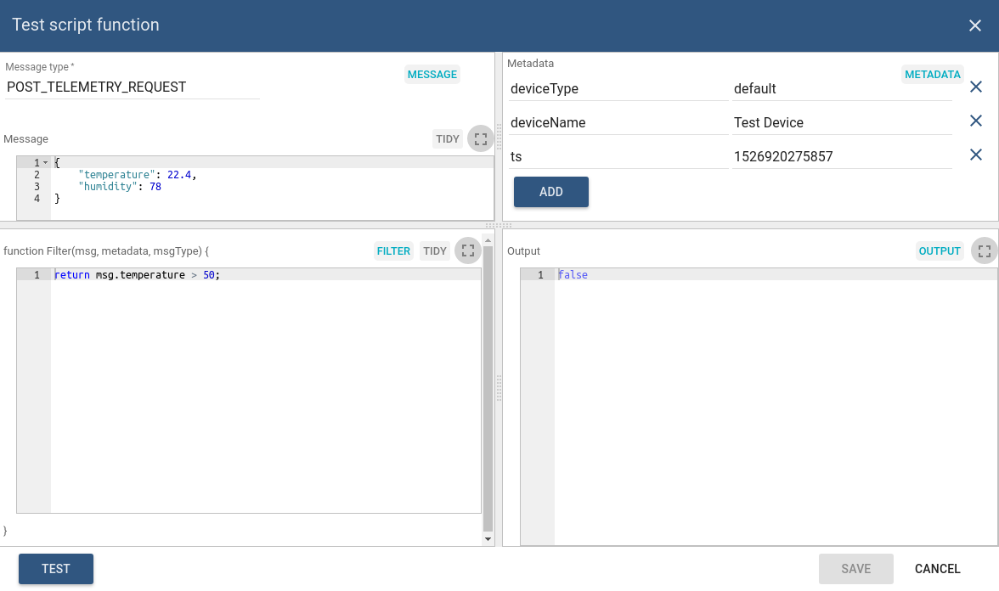
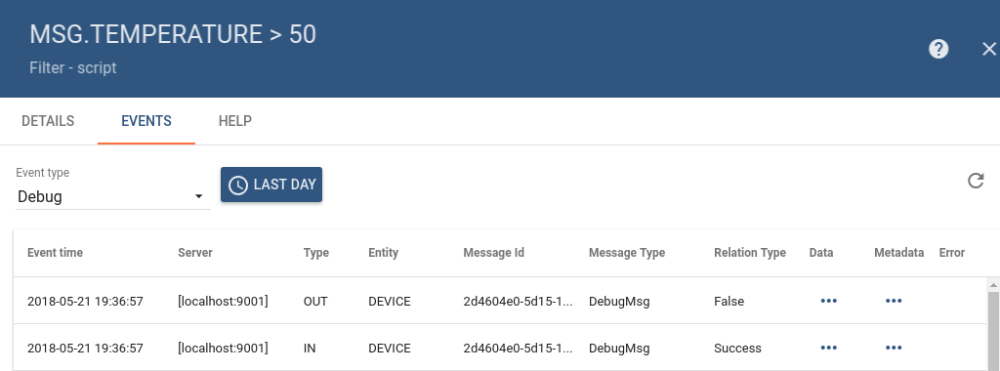
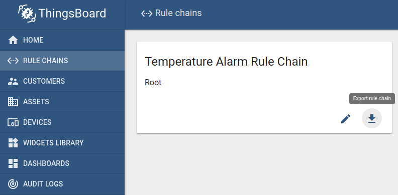

# overview

* TOC

  {:toc}

ThingsBoard Rule Engine is a highly customizable and configurable system for complex event processing. With rule engine you are able to filter, enrich and transform incoming messages originated by IoT devices and related assets. You are also able to trigger various actions, for example, notifications or communication with external systems.

## Key Concepts

#### Rule Engine Message

Rule Engine Message is a serializable, immutable data structure that represent various messages in the system. For example:

* Incoming [telemetry](https://github.com/caoyingde/thingsboard.github.io/tree/9437083b88083a9b2563248432cbbe460867fbaf/docs/user-guide/telemetry/README.md), [attribute update](https://github.com/caoyingde/thingsboard.github.io/tree/9437083b88083a9b2563248432cbbe460867fbaf/docs/user-guide/attributes/README.md) or [RPC call](https://github.com/caoyingde/thingsboard.github.io/tree/9437083b88083a9b2563248432cbbe460867fbaf/docs/user-guide/rpc/README.md) from device;
* Entity life-cycle event: created, updated, deleted, assigned, unassigned, attributes updated;
* Device status event: connected, disconnected, active, inactive, etc;
* Other system events.

Rule Engine Message contains the following information:

* Message ID: time based, universally unique identifier;
* Originator of the message: Device, Asset or other [Entity](https://github.com/caoyingde/thingsboard.github.io/tree/9437083b88083a9b2563248432cbbe460867fbaf/docs/user-guide/entities-and-relations/README.md) identifier;
* Type of the message: "Post telemetry" or "Inactivity Event", etc;
* Payload of the message: JSON body with actual message payload;
* Metadata: List of key-value pairs with additional data about the message. 

**Predefined Message Types**

List of the predefined Message Types is presented in the following table:

| **Message Type** | **Display Name** | **Description** | **Message metadata** | **Message payload** |
| :--- | :--- | :--- | :--- | :--- |
| POST\_ATTRIBUTES\_REQUEST | **Post attributes** | Request from device to publish [client side](https://github.com/caoyingde/thingsboard.github.io/tree/9437083b88083a9b2563248432cbbe460867fbaf/docs/user-guide/attributes/README.md#attribute-types) attributes \(see [attributes api](https://github.com/caoyingde/thingsboard.github.io/tree/9437083b88083a9b2563248432cbbe460867fbaf/docs/reference/mqtt-api/README.md#publish-attribute-update-to-the-server) for reference\) | **deviceName** - originator device name, **deviceType** - originator device type | key/value json:  `{    "currentState": "IDLE"  }` |
| POST\_TELEMETRY\_REQUEST | **Post telemetry** | Request from device to publish telemetry \(see [telemetry upload api](https://github.com/caoyingde/thingsboard.github.io/tree/9437083b88083a9b2563248432cbbe460867fbaf/docs/reference/mqtt-api/README.md#telemetry-upload-api) for reference\) | **deviceName** - originator device name, **deviceType** - originator device type, **ts** - timestamp \(milliseconds\) | key/value json:  `{    "temperature": 22.7  }` |
| TO\_SERVER\_RPC\_REQUEST | **RPC Request from Device** | RPC request from device \(see [client side rpc](https://github.com/caoyingde/thingsboard.github.io/tree/9437083b88083a9b2563248432cbbe460867fbaf/docs/reference/mqtt-api/README.md#client-side-rpc) for reference\) | **deviceName** - originator device name, **deviceType** - originator device type, **requestId** - RPC request Id provided by client | json containing **method** and **params**:  `{    "method": "getTime",   "params": { "param1": "val1" }  }` |
| RPC\_CALL\_FROM\_SERVER\_TO\_DEVICE | **RPC Request to Device** | RPC request from server to device \(see [server side rpc api](https://github.com/caoyingde/thingsboard.github.io/tree/9437083b88083a9b2563248432cbbe460867fbaf/docs/user-guide/rpc/README.md#server-side-rpc-api) for reference\) | **requestUUID** - internal request id used by sustem to identify reply target, **expirationTime** - time when request will be expired, **oneway** - specifies request type: true - without response, false - with response | json containing **method** and **params**:  `{    "method": "getGpioStatus",   "params": { "param1": "val1" }  }` |
| ACTIVITY\_EVENT | **Activity Event** | Event indicating that device becomes active | **deviceName** - originator device name, **deviceType** - originator device type | json containing device activity information:  `{    "active": true,    "lastConnectTime": 1526979083267,    "lastActivityTime": 1526979083270,    "lastDisconnectTime": 1526978493963,    "lastInactivityAlarmTime": 1526978512339,    "inactivityTimeout": 10000 }` |
| INACTIVITY\_EVENT | **Inactivity Event** | Event indicating that device becomes inactive | **deviceName** - originator device name, **deviceType** - originator device type | json containing device activity information, see **Activity Event** payload |
| CONNECT\_EVENT | **Connect Event** | Event produced when device is connected | **deviceName** - originator device name, **deviceType** - originator device type | json containing device activity information, see **Activity Event** payload |
| DISCONNECT\_EVENT | **Disconnect Event** | Event produced when device is disconnected | **deviceName** - originator device name, **deviceType** - originator device type | json containing device activity information, see **Activity Event** payload |
| ENTITY\_CREATED | **Entity Created** | Event produced when new entity was created in system | **userName** - name of the user who created the entity, **userId** - the user Id | json containing created entity details:  `{    "id": {      "entityType": "DEVICE",      "id": "efc4b9e0-5d0f-11e8-8559-37a7f8cdca74"    },    "createdTime": 1526918366334,    ...    "name": "my-device",    "type": "temp-sensor" }` |
| ENTITY\_UPDATED | **Entity Updated** | Event produced when existing entity was updated | **userName** - name of the user who updated the entity, **userId** - the user Id | json containing updated entity details, see **Entity Created** payload |
| ENTITY\_DELETED | **Entity Deleted** | Event produced when existing entity was deleted | **userName** - name of the user who deleted the entity, **userId** - the user Id | json containing deleted entity details, see **Entity Created** payload |
| ENTITY\_ASSIGNED | **Entity Assigned** | Event produced when existing entity was assigned to customer | **userName** - name of the user who performed assignment operation, **userId** - the user Id, **assignedCustomerName** - assigned customer name, **assignedCustomerId** - Id of assigned customer | json containing assigned entity details, see **Entity Created** payload |
| ENTITY\_UNASSIGNED | **Entity Unassigned** | Event produced when existing entity was unassigned from customer | **userName** - name of the user who performed unassignment operation, **userId** - the user Id, **unassignedCustomerName** - unassigned customer name, **unassignedCustomerId** - Id of unassigned customer | json containing unassigned entity details, see **Entity Created** payload |
| ADDED\_TO\_ENTITY\_GROUP | **Added to Group** | Event produced when entity was added to [Entity Group](https://github.com/caoyingde/thingsboard.github.io/tree/9437083b88083a9b2563248432cbbe460867fbaf/docs/user-guide/groups/README.md). This Message Type is specific to [ThingsBoard PE](https://github.com/caoyingde/thingsboard.github.io/tree/9437083b88083a9b2563248432cbbe460867fbaf/products/thingsboard-pe/README.md). | **userName** - name of the user who performed assignment operation, **userId** - the user Id, **addedToEntityGroupName** - entity group name, **addedToEntityGroupId** - Id of entity group | empty json payload |
| REMOVED\_FROM\_ENTITY\_GROUP | **Removed from Group** | Event produced when entity was removed from [Entity Group](https://github.com/caoyingde/thingsboard.github.io/tree/9437083b88083a9b2563248432cbbe460867fbaf/docs/user-guide/groups/README.md). This Message Type is specific to [ThingsBoard PE](https://github.com/caoyingde/thingsboard.github.io/tree/9437083b88083a9b2563248432cbbe460867fbaf/products/thingsboard-pe/README.md). | **userName** - name of the user who performed unassignment operation, **userId** - the user Id, **removedFromEntityGroupName** - entity group name, **removedFromEntityGroupId** - Id of entity group | empty json payload |
| ATTRIBUTES\_UPDATED | **Attributes Updated** | Event produced when entity attributes update was performed | **userName** - name of the user who performed attributes update, **userId** - the user Id, **scope** - updated attributes scope \(can be either **SERVER\_SCOPE** or **SHARED\_SCOPE**\) | key/value json with updated attributes:  `{    "softwareVersion": "1.2.3"  }` |
| ATTRIBUTES\_DELETED | **Attributes Deleted** | Event produced when some of entity attributes were deleted | **userName** - name of the user who deleted attributes, **userId** - the user Id, **scope** - deleted attributes scope \(can be either **SERVER\_SCOPE** or **SHARED\_SCOPE**\) | json with **attributes** field containing list of deleted attributes keys:  `{    "attributes": ["modelNumber", "serial"]  }` |
| ALARM | **Alarm event** | Event produced when an alarm was created, updated or deleted |  All fields from original Message Metadata **isNewAlarm** - true if a new alram was just created **isExistingAlarm** - true if an alarm is existing already **isClearedAlarm** - true if an alarm was cleared | json containing created alarm details:  `{    "tenantId": {       ...    },    "type": "High Temperature Alarm",    "originator": {       ...    },    "severity": "CRITICAL",    "status": "CLEARED_UNACK",    "startTs": 1526985698000,    "endTs": 1526985698000,    "ackTs": 0,    "clearTs": 1526985712000,    "details": {      "temperature": 70,      "ts": 1526985696000    },    "propagate": true,    "id": "33cd8999-5dac-11e8-bbab-ad47060c9431",    "createdTime": 1526985698000,    "name": "High Temperature Alarm" }` |
| REST\_API\_REQUEST | **REST API Request to Rule Engine** | Event produced when user executes REST API call | **requestUUID** - the unique request id, **expirationTime** - the expiration time of the request | json with request payload |

#### Rule Node

Rule Node is a basic component of Rule Engine that process single incoming message at a time and produce one or more outgoing messages. Rule Node is a main logical unit of the Rule Engine. Rule Node can filter, enrich, transform incoming messages, perform action or communicate with external systems.

#### Rule Node Relation

Rule Nodes may be related to other rule nodes. Each relation has relation type, a label used to identify logical meaning of the relation. When rule node produces the outgoing message it always specifies the relation type which is used to route message to next nodes.

Typical rule node relations are "Success" and "Failure". Rule nodes that represent logical operations may use "True" or "False". Some specific rule nodes may use completely different relation types, for example: "Post Telemetry", "Attributes Updated", "Entity Created", etc.

#### Rule Chain

Rule Chain is a logical group of rule nodes and their relations. For example, the rule chain below will:

* save all telemetry messages to the database;
* raise "High Temperature Alarm" if temperature field in the message will be higher then 50 degrees;
* raise "Low Temperature Alarm" if temperature field in the message will be lower then -40 degrees;
* log failure to execute the temperature check scripts to console in case of logical or syntax error in the script. 

Tenant administrator is able to define one **Root Rule Chain** and optionally multiple other rule chains. Root rule chain handles all incoming messages and may forward them to other rule chains for additional processing. Other rule chains may also forward messages to different rule chains.

For example, the rule chain below will:

* raise "High Temperature Alarm" if temperature field in the message will be higher then 50 degrees;
* clear "High Temperature Alarm" if temperature field in the message will be less then 50 degrees;
* forward events about "Created" and "Cleared" alarms to external rule chain that handles notifications to corresponding users.

## Message Queue

All incoming messages are stored in the queue before they are pushed for processing by the root rule chain. Once message are processed, they are removed from queue. For security and performance reasons, system administrator may configure max size of the queue per tenant and other important parameters. To learn more about message queue, acknowledgement criteria and internals of the rule engine, see [architecture](https://github.com/caoyingde/thingsboard.github.io/tree/9437083b88083a9b2563248432cbbe460867fbaf/docs/user-guide/rule-engine-2-0/architecture/README.md) page.

## Rule Node Types

All available rule nodes are grouped in correspondence with their nature:

* [**Filter Nodes**](https://github.com/caoyingde/thingsboard.github.io/tree/9437083b88083a9b2563248432cbbe460867fbaf/docs/user-guide/rule-engine-2-0/filter-nodes/README.md) are used for message filtering and routing;
* [**Enrichment Nodes**](https://github.com/caoyingde/thingsboard.github.io/tree/9437083b88083a9b2563248432cbbe460867fbaf/docs/user-guide/rule-engine-2-0/enrichment-nodes/README.md) are used to update meta-data of the incoming Message;
* [**Transformation Nodes**](https://github.com/caoyingde/thingsboard.github.io/tree/9437083b88083a9b2563248432cbbe460867fbaf/docs/user-guide/rule-engine-2-0/transformation-nodes/README.md) are used for changing incoming Message fields like Originator, Type, Payload, Metadata;
* [**Action Nodes**](https://github.com/caoyingde/thingsboard.github.io/tree/9437083b88083a9b2563248432cbbe460867fbaf/docs/user-guide/rule-engine-2-0/action-nodes/README.md) execute various actions based on incoming Message;
* [**External Nodes**](https://github.com/caoyingde/thingsboard.github.io/tree/9437083b88083a9b2563248432cbbe460867fbaf/docs/user-guide/rule-engine-2-0/external-nodes/README.md) are used to interact with external systems.

## Configuration

Each Rule Node may have specific configuration parameters that depend on the Rule Node Implementation. For example, "Filter - script" rule node is configurable via custom JS function that process incoming data. "External - send email" node configuration allows to specify mail server connection parameters.

Rule Node configuration window may be opened by double-clicking on the node in the Rule Chain editor:

### Test JavaScript functions

Some rule nodes have specific UI feature that allow users to test JS functions. Once you click on the **Test Filter Function** you will see the JS Editor that allows you to substitute input parameters and verify the output of the function.

You can define:

* **Message Type** in the top left field.
* **Message payload** in the left Message section.
* **Metadata** in right Metadata section.
* Actual **JS script** in Filter section.

After pressing **Test** output will be returned in right **Output** section.

## Debugging

ThingsBoard provides ability to review incoming and outgoing messages for each Rule Node. To enable debug, user need to ensure that "Debug mode" checkbox is selected in the main configuration window \(see first image in the [Configuration](https://github.com/caoyingde/thingsboard.github.io/tree/9437083b88083a9b2563248432cbbe460867fbaf/docs/user-guide/rule-engine-2-0/overview/README.md#configuration) section\).

Once debug is enabled, user is able to see incoming and outgoing messages info as long as corresponding relation types. See image below for a sample debug messages view:

## Import/Export

You are able to export your rule chain to JSON format and import it to the same or another ThingsBoard instance.

In order to export rule chain, you should navigate to the **Rule Chains** page and click on the export button located on the particular rule chain card.

Similar, to import the rule chain you should navigate to the **Rules Chains** page and click on the big "+" button in the bottom-right part of the screen and then click on the import button.

## Architecture

To learn more about internals of the rule engine, see [architecture](https://github.com/caoyingde/thingsboard.github.io/tree/9437083b88083a9b2563248432cbbe460867fbaf/docs/user-guide/rule-engine-2-0/architecture/README.md) page.

## Custom REST API calls to Rule Engine

ThingsBoard provides API to send custom REST API calls to the rule engine, process the payload of the request and return result of the processing in response body. This is useful for a number of use cases. For example:

* extend existing REST API of the platform with custom API calls;
* enrich REST API call with the attributes of device/asset/customer and forward to external system for complex processing;
* provide custom API for your custom widgets.

To execute the REST API call, you may use rule-engine-controller [REST APIs](https://github.com/caoyingde/thingsboard.github.io/tree/9437083b88083a9b2563248432cbbe460867fbaf/docs/reference/rest-api/README.md):

Note: the entity id you have specified in the call will be the originator of Rule Engine message. If you do not specify the entity id parameters, your user entity will become an originator of the message.

## Tutorials

ThingsBoard authors have prepared several tutorials to help you get started with designing rule chains by example:

* [**Transform incoming messages from device**](https://github.com/caoyingde/thingsboard.github.io/tree/9437083b88083a9b2563248432cbbe460867fbaf/docs/user-guide/rule-engine-2-0/tutorials/transform-incoming-telemetry/README.md) 
* [**Transform incoming messages using previous messages from device**](https://github.com/caoyingde/thingsboard.github.io/tree/9437083b88083a9b2563248432cbbe460867fbaf/docs/user-guide/rule-engine-2-0/tutorials/transform-telemetry-using-previous-record/README.md) 
* [**Create and clear alarms on incoming device messages**](https://github.com/caoyingde/thingsboard.github.io/tree/9437083b88083a9b2563248432cbbe460867fbaf/docs/user-guide/rule-engine-2-0/tutorials/create-clear-alarms/README.md)
* [**Send emails to customer on device alarm**](https://github.com/caoyingde/thingsboard.github.io/tree/9437083b88083a9b2563248432cbbe460867fbaf/docs/user-guide/rule-engine-2-0/tutorials/send-email/README.md) 
* [**Send messages between related devices**](https://github.com/caoyingde/thingsboard.github.io/tree/9437083b88083a9b2563248432cbbe460867fbaf/docs/user-guide/rule-engine-2-0/tutorials/rpc-reply-tutorial/README.md)

## NEW

* \[**Raise alarms on constant threshold violation**\] - Learn how to raise alarms when telemetry is violating thresholds for some time. 
* \[**Flexible processing thresholds**\] - Learn how to raise alarms when device telemetry is violating thresholds set on the customer or parent asset level.
* \[**Check relation**\] - Learn how to filter messages based on the relation to parent asset.
* \[**Combine telemetry**\] - Learn how to combine messages from different devices and make decisions based on complex functions. 

  \(in this tutorial we fetch two different values from devices related to same asset and use them somehow\)

* [**Create alarm when device is offline for 1 minute**](https://github.com/caoyingde/thingsboard.github.io/tree/9437083b88083a9b2563248432cbbe460867fbaf/docs/user-guide/rule-engine-2-0/tutorials/rpc-reply-tutorial/README.md)

## Pushing data to External systems

* [**Enrich and push sensor readings to Kafka**](https://github.com/caoyingde/thingsboard.github.io/tree/9437083b88083a9b2563248432cbbe460867fbaf/docs/user-guide/rule-engine-2-0/tutorials/push-telemetry-to-kafka/README.md)  - Learn how to enrich incoming message with device or parent asset attributes and push this message to external system;
* [**Enrich and push sensor readings to RabbitMQ**](https://github.com/caoyingde/thingsboard.github.io/tree/9437083b88083a9b2563248432cbbe460867fbaf/docs/user-guide/rule-engine-2-0/tutorials/push-telemetry-to-rabbitmq/README.md)  - Learn how to enrich incoming message with device or parent asset attributes and push this message to external system;
* [**Push new or cleared alarm event to AWS SQS**](https://github.com/caoyingde/thingsboard.github.io/tree/9437083b88083a9b2563248432cbbe460867fbaf/docs/user-guide/rule-engine-2-0/tutorials/push-telemetry-to-aws-sqs/README.md)  - Learn how to enrich incoming message with device or parent asset attributes and push this message to external system;
* [**Push new or cleared alarm event to AWS SNS**](https://github.com/caoyingde/thingsboard.github.io/tree/9437083b88083a9b2563248432cbbe460867fbaf/docs/user-guide/rule-engine-2-0/tutorials/push-telemetry-to-aws-sns/README.md)  - Learn how to enrich incoming message with device or parent asset attributes and push this message to external system;
* [**Push information about new created device or asset to Kafka**](https://github.com/caoyingde/thingsboard.github.io/tree/9437083b88083a9b2563248432cbbe460867fbaf/docs/user-guide/rule-engine-2-0/tutorials/push-telemetry-to-aws-sns/README.md)  - Learn how to ..;
* [**Enrich and push sensor readings to External MQTT Broker**](https://github.com/caoyingde/thingsboard.github.io/tree/9437083b88083a9b2563248432cbbe460867fbaf/docs/user-guide/rule-engine-2-0/tutorials/push-telemetry-to-mqtt/README.md)  - Learn how to enrich incoming message with device or parent asset attributes and push this message to external system;
* [**Execute REST API call to External system**](https://github.com/caoyingde/thingsboard.github.io/tree/9437083b88083a9b2563248432cbbe460867fbaf/docs/user-guide/rule-engine-2-0/tutorials/rest-api-call-to-external-system/README.md)  - Learn how to enrich incoming message with device or parent asset attributes and push this message to external system;
* [**Push data to external system via REST API and update telemetry based on content of the reply**](https://github.com/caoyingde/thingsboard.github.io/tree/9437083b88083a9b2563248432cbbe460867fbaf/docs/user-guide/rule-engine-2-0/tutorials/rest-api-call-to-external-system/README.md)  - Learn how to process data in external system and save results of processing in asset telemetry;

## PE

* \[**Send SMS on alarm**\] - Deliver notification about the alarm via SMS to customer cell phone;
* \[**Add & remove devices from a group**\] - Learn how to dynamically add & remove devices from a group based on incoming attributes or telemetry;
* \[**Aggregate data stream**\] - Learn how to aggregate incoming telemetry values \(e.g. calculate total energy consumption on a building, district or customer level\);
* \[**Aggregate latest values**\] - Learn how to aggregate latest telemetry values \(e.g. calculate average temperature in the office area\);
* \[**Alarm count visualization**\] - Calculate and visualize amount of active alarms on device, apartment, building levels;
* \[**Alarm count thresholds**\] - Raise high priority alarms when threshold of low priority alarms reached;
* \[**Raise alarm on the results of aggregation**\] - Raise alarm when total power consumption in the warehouse is higher then threshold;
* \[**Schedule reports**\] - schedule beautiful reports to be sent to your end-users \(e.g. export dashboard as pdf or png and send via email\);
* \[**Schedule device updates**\] - schedule periodic configuration updates to a group of devices \(e.g. turn on air conditioning at 7 am\);

