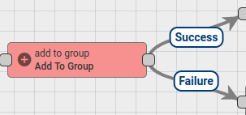
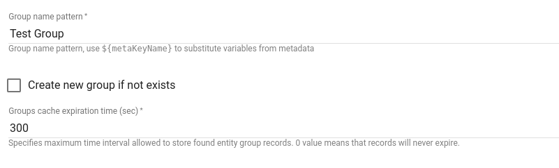
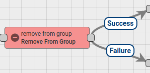
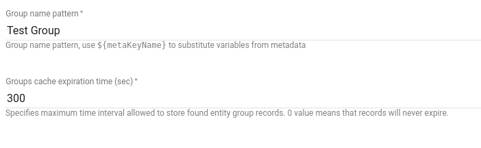
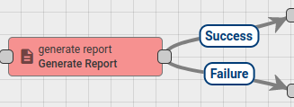
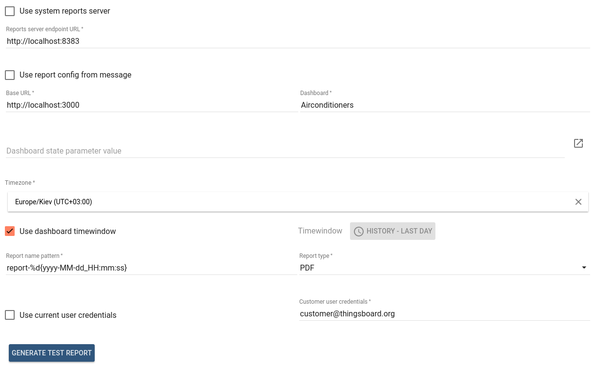
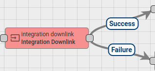
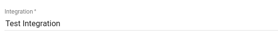
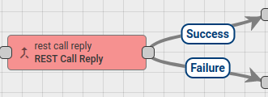
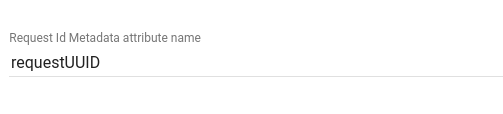

# action-nodes

Action Nodes that are specific to ThingsBoard PE. Execute various actions based on incoming Message.

* TOC

  {:toc}

## Add To Group Node

Adds Message Originator Entity to [Entity Group](https://github.com/caoyingde/thingsboard.github.io/tree/9437083b88083a9b2563248432cbbe460867fbaf/docs/user-guide/groups/README.md).

Following Message Originator types are allowed: **Customer**, **Asset**, **Device**.

Finds target Entity Group by group name pattern and then adds Originator Entity to this group. Will create new Entity Group if it doesn't exist and **Create new group if not exists** is set to true.

Configuration:

* **Group name pattern** - can be set direct group name or pattern can be used, that will be resolved to the real group name using Message metadata.
* **Create new group if not exists** - if checked will create new entity group if it doesn't exist.
* **Groups cache expiration time** - specifies maximum time interval is seconds allowed to store found entity group records. 0 value means that records will never expire.

Message will be routed via **Failure** chain in the following cases:

* When Originator entity type is not supported.
* Target entity group doesn't exist and **Create new group if not exists** is unchecked.

In other cases Message will be routed via **Success** chain.

## Remove From Group Node

Removes Message Originator Entity from [Entity Group](https://github.com/caoyingde/thingsboard.github.io/tree/9437083b88083a9b2563248432cbbe460867fbaf/docs/user-guide/groups/README.md).

Following Message Originator types are allowed: **Customer**, **Asset**, **Device**.

Finds target Entity Group by group name pattern and then removes Originator Entity from this group.

Configuration:

* **Group name pattern** - can be set direct group name or pattern can be used, that will be resolved to the real group name using Message metadata.
* **Groups cache expiration time** - specifies maximum time interval is seconds allowed to store found entity group records. 0 value means that records will never expire.

Message will be routed via **Failure** chain in the following cases:

* When Originator entity type is not supported.
* Target entity group doesn't exist.

In other cases Message will be routed via **Success** chain.

## Generate Report Node

Generates report files by capturing target dashboard with specific configuration.

This node can be configured to use specific report configuration or take it from incoming message body.

Mode when report configuration is taken from message body usually is used when message is generated by [**Generate Report** Scheduler Event](https://github.com/caoyingde/thingsboard.github.io/tree/9437083b88083a9b2563248432cbbe460867fbaf/docs/user-guide/scheduler/README.md#generate-report).

Generate Report node invokes [Reports Server](https://github.com/caoyingde/thingsboard.github.io/tree/9437083b88083a9b2563248432cbbe460867fbaf/docs/user-guide/reporting/README.md#reports-server) to generate report file using specified dashboard.

Resulting report file is stored in DataBase using [File Storage](https://github.com/caoyingde/thingsboard.github.io/tree/9437083b88083a9b2563248432cbbe460867fbaf/docs/user-guide/file-storage/README.md) feature and reference to this file is stored in **attachments** field of output message metadata.

**attachments** metadata field can be used by other Rule Nodes to get actual file from DataBase. For instance [**To Email Node**](https://github.com/caoyingde/thingsboard.github.io/tree/9437083b88083a9b2563248432cbbe460867fbaf/docs/user-guide/rule-engine-2-0/transformation-nodes/README.md#to-email-node) detects presence of this field and prepares email attachments used by [**Send Email Node**](https://github.com/caoyingde/thingsboard.github.io/tree/9437083b88083a9b2563248432cbbe460867fbaf/docs/user-guide/rule-engine-2-0/external-nodes/README.md#send-email-node) to send email with attachments.

Configuration:

* **Use system reports server** - if set, [Reports Server](https://github.com/caoyingde/thingsboard.github.io/tree/9437083b88083a9b2563248432cbbe460867fbaf/docs/user-guide/reporting/README.md#reports-server) endpoint URL will be taken from system configuration \(**thingsboard.yml**\).
* **Reports server endpoint URL** - endpoint URL of [Reports Server](https://github.com/caoyingde/thingsboard.github.io/tree/9437083b88083a9b2563248432cbbe460867fbaf/docs/user-guide/reporting/README.md#reports-server).
* **Use report config from message** - if set, report generation configuration will be taken from incoming message body.
* **Base URL** - base URL of ThingsBoard UI that should be accessible by Report Server.
* **Dashboard** - dashboard that will be used for report generation.
* **Dashboard state parameter value** - used to specify target dashboard state for report generation. Can be set automatically by clicking on right most button of the field and invoking **Select dashboard state** dialog.       
* **Timezone** - timezone in which target dashboard will be presented in report.
* **Use dashboard timewindow** - if set, timewindow configured in the target dashboard will be used during report generation.
* **Timewindow** - specific dashboard timewindow that will be used during report generation.
* **Report name pattern** - file name pattern of generated report, can contain date-time pattern in form of `%d{date-time pattern}`. See [SimpleDateFormat](https://docs.oracle.com/javase/8/docs/api/java/text/SimpleDateFormat.html) documentation for date-time pattern details.
* **Report type** - report file type, can be _PDF \| PNG \| JPEG_.
* **Use current user credentials** - if set, credentials of user created this report configuration will be used to open dashboard UI during report generation.
* **Customer user credentials** - target customer user whose credentials will be used to open dashboard UI during report generation.

**Generate Test Report** button is used for testing purposes. It invokes report generation process with provided configuration. Resulting report file will be automatically downloaded if the report generation will be successful.

Message will be routed via **Failure** chain in the following cases:

* When **Use report config from message** is set and incoming message does not contain valid report configuration JSON object.
* When [Reports Server](https://github.com/caoyingde/thingsboard.github.io/tree/9437083b88083a9b2563248432cbbe460867fbaf/docs/user-guide/reporting/README.md#reports-server) is unavailable at the specified endpoint URL.
* When [Reports Server](https://github.com/caoyingde/thingsboard.github.io/tree/9437083b88083a9b2563248432cbbe460867fbaf/docs/user-guide/reporting/README.md#reports-server) will fail generate report and return corresponding error message. 

In other cases Message will be routed via **Success** chain.

## Integration Downlink Node

Forwards Message to selected [Integration](https://github.com/caoyingde/thingsboard.github.io/tree/9437083b88083a9b2563248432cbbe460867fbaf/docs/user-guide/integrations/README.md) as downlink message.

Message will be pushed to the selected integration downlink queue.

Configuration:

* **Integration** - target Integration for downlink message processing.

**Failure** chain is used if Message push to Integration will fail, otherwise **Success** chain.

## REST Call Reply Node

Sends reply to REST API call that was originally sent to rule engine.

Expects messages with any message type. Forwards incoming message as a reply to REST API call sent to rule engine.

Configuration:

