# re-getting-started

* TOC

  {:toc}

## What is ThingsBoard Rule Engine?

Rule Engine is an easy to use framework for building event-based workflows. There are 3 main components:

* **Message** - any incoming event. It can be an incoming data from devices, device life-cycle event, REST API event, RPC request, etc.
* **Rule Node** - a function that is executed on an incoming message. There are many different Node types that can filter, transform or execute some action on incoming Message. 
* **Rule Chain** - nodes are connected with each other with relations, so the outbound message from rule node is sent to next connected rule nodes.

## Typical Use Cases

ThingsBoard Rule Engine is a highly customizable framework for complex event processing. Here are some common use cases that one can configure via ThingsBoard Rule Chains:

* Data validation and modification for incoming telemetry or attributes before saving to the database.
* Copy telemetry or attributes from devices to related assets so you can aggregate telemetry. For example data from multiple devices can be aggregated

  in related Asset.

* Create/Update/Clear alarms based on defined conditions.
* Trigger actions based on device life-cycle events. For example, create alerts if Device is Online/Offline.
* Load additional data required for processing. For example, load temperature threshold value for a device that is defined in Device's Customer or Tenant attribute.
* Trigger REST API calls to external systems.
* Send emails when complex event occurs and use attributes of other entities inside Email Template.
* Take into account User preferences during event processing.
* Make RPC calls based on defined condition.
* Integrate with external pipelines like Kafka, Spark, AWS services, etc.

## Hello-World Example

Let’s assume your device is using DHT22 sensor to collect and push temperature to the ThingsBoard. DHT22 sensor can measure temperature from -40°C to +80°C.

In this tutorial we will configure ThingsBoard Rule Engine to store all temperature within -40 to 80°C range and log all other readings to the system log.

### Adding temperature validation node

In Thingsboard UI go to **Rule Chains** section and open **Root Rule Chain**.

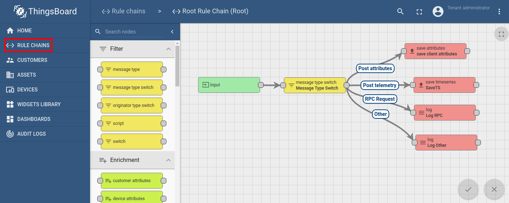

Drag and Drop **Script Filter** rule node to the chain. Node configuration window will be opened. We will use this script for data validation:

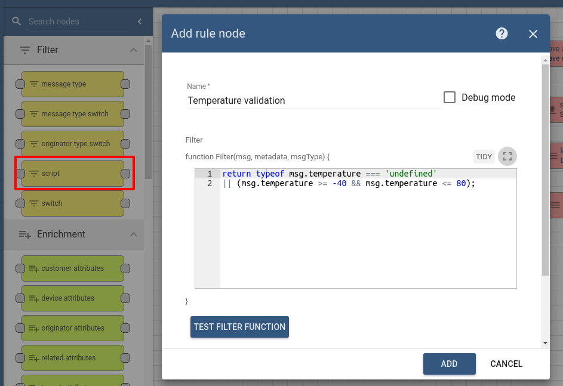

If temperature property not defined or temperature is valid - script will return **True**, otherwise it will return **False**. If script returns **True** incoming message will be routed to the next nodes that are connected with **True** relation.

Now we want that all **telemetry requests** pass through this validation script. We need to remove the existing **Post Telemetry** relation between **Message Type Switch** node and **Save Telemetry** node:

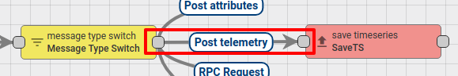

And connect **Message Type Switch** node with **Script Filter** node using **Post Telemetry** relation:

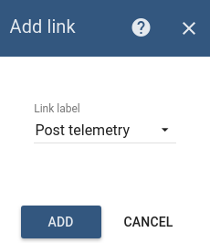

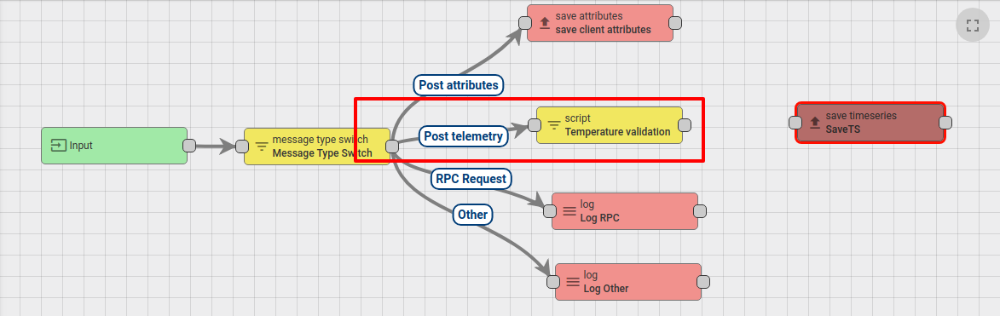

Next, we need to connect **Script Filter** node with **Save Telemetry** node using **True** relation. So all valid telemetry will be saved:

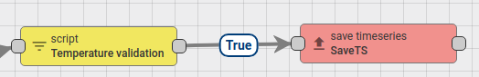

Also, we will connect **Script Filter** node with **Log Other** node using **False** relation. So that all not valid telemetry will be logged in the system log:

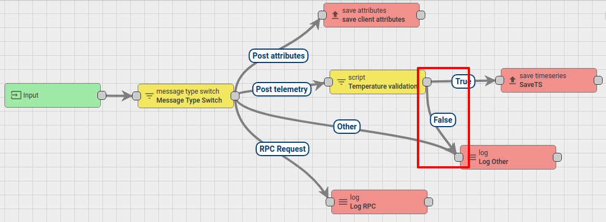

Press Save button to apply changes.

### Validate results

For validating results we will need to create Device and submit telemetry to the Thingsboard. So go to **Devices** section and create new Device:

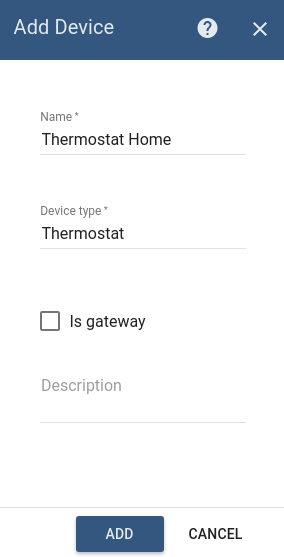

For posting device telemetry we will use [Rest API](https://github.com/caoyingde/thingsboard.github.io/tree/9437083b88083a9b2563248432cbbe460867fbaf/docs/reference/http-api/README.md#telemetry-upload-api). To do this this we will need to copy device access token from the device **Thermostat Home**.

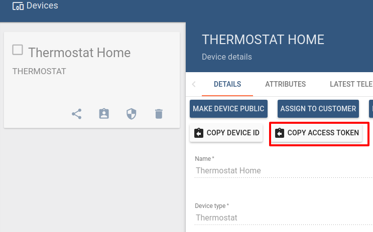

Lets post temperature = 99. We will see that telemetry **was not** added in Device **Latest Telemetry** section:

**\*you need to replace $ACCESS\_TOKEN with actual device token**

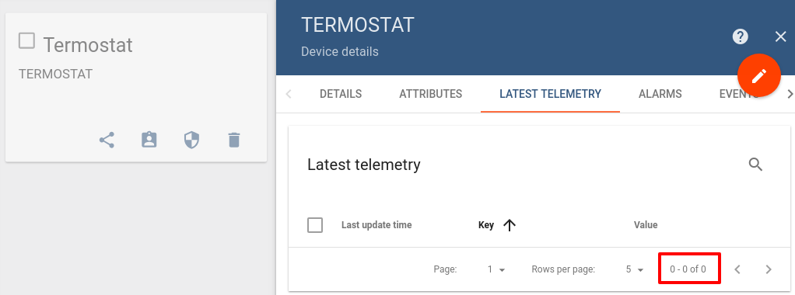

Lets post temperature = 24. We will see that telemetry was saved successfully.

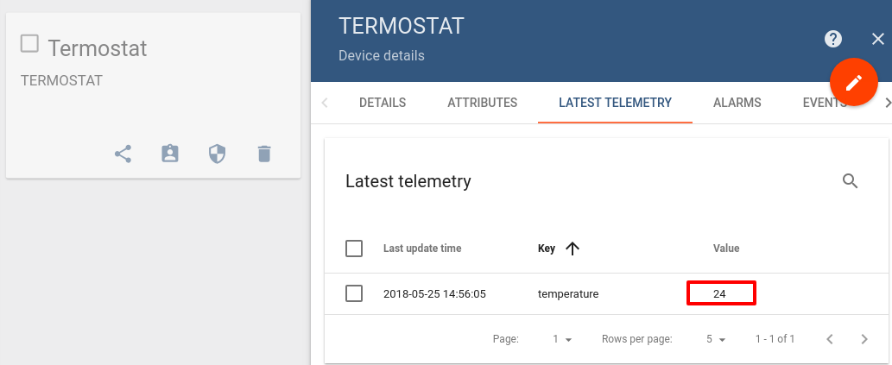

## See Also:

You can use the next links for learning more about Thingsboard Rule Engine:

* [Rule Engine Overview](https://github.com/caoyingde/thingsboard.github.io/tree/9437083b88083a9b2563248432cbbe460867fbaf/docs/user-guide/rule-engine-2-0/overview/README.md)
* [Rule Engine Architecture](https://github.com/caoyingde/thingsboard.github.io/tree/9437083b88083a9b2563248432cbbe460867fbaf/docs/user-guide/rule-engine-2-0/architecture/README.md)
* [Debug Node Execution](https://github.com/caoyingde/thingsboard.github.io/tree/9437083b88083a9b2563248432cbbe460867fbaf/docs/user-guide/rule-engine-2-0/overview/README.md#debugging)
* [Validate incoming telemetry](https://github.com/caoyingde/thingsboard.github.io/tree/9437083b88083a9b2563248432cbbe460867fbaf/docs/user-guide/rule-engine-2-0/tutorials/validate-incoming-telemetry/README.md)
* [Transform incoming telemetry](https://github.com/caoyingde/thingsboard.github.io/tree/9437083b88083a9b2563248432cbbe460867fbaf/docs/user-guide/rule-engine-2-0/tutorials/transform-incoming-telemetry/README.md)
* [Transform telemetry using previous record](https://github.com/caoyingde/thingsboard.github.io/tree/9437083b88083a9b2563248432cbbe460867fbaf/docs/user-guide/rule-engine-2-0/tutorials/transform-telemetry-using-previous-record/README.md)
* [Create & clear alarms](https://github.com/caoyingde/thingsboard.github.io/tree/9437083b88083a9b2563248432cbbe460867fbaf/docs/user-guide/rule-engine-2-0/tutorials/create-clear-alarms/README.md)
* [Send email on alarm](https://github.com/caoyingde/thingsboard.github.io/tree/9437083b88083a9b2563248432cbbe460867fbaf/docs/user-guide/rule-engine-2-0/tutorials/send-email/README.md)
* [Create alarm when the device is offline](https://github.com/caoyingde/thingsboard.github.io/tree/9437083b88083a9b2563248432cbbe460867fbaf/docs/user-guide/rule-engine-2-0/tutorials/create-inactivity-alarm/README.md)
* [Check Relation between Entities](https://github.com/caoyingde/thingsboard.github.io/tree/9437083b88083a9b2563248432cbbe460867fbaf/docs/user-guide/rule-engine-2-0/tutorials/check-relation-tutorial/README.md)
* [RPC Request to Related Device](https://github.com/caoyingde/thingsboard.github.io/tree/9437083b88083a9b2563248432cbbe460867fbaf/docs/user-guide/rule-engine-2-0/tutorials/rpc-request-tutorial/README.md)
* [Add & remove devices to group dynamically](https://github.com/caoyingde/thingsboard.github.io/tree/9437083b88083a9b2563248432cbbe460867fbaf/docs/user-guide/rule-engine-2-0/tutorials/add-devices-to-group/README.md)
* [Aggregate incoming data stream](https://github.com/caoyingde/thingsboard.github.io/tree/9437083b88083a9b2563248432cbbe460867fbaf/docs/user-guide/rule-engine-2-0/tutorials/aggregate-incoming-data-stream/README.md)

## Next steps

