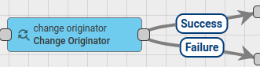
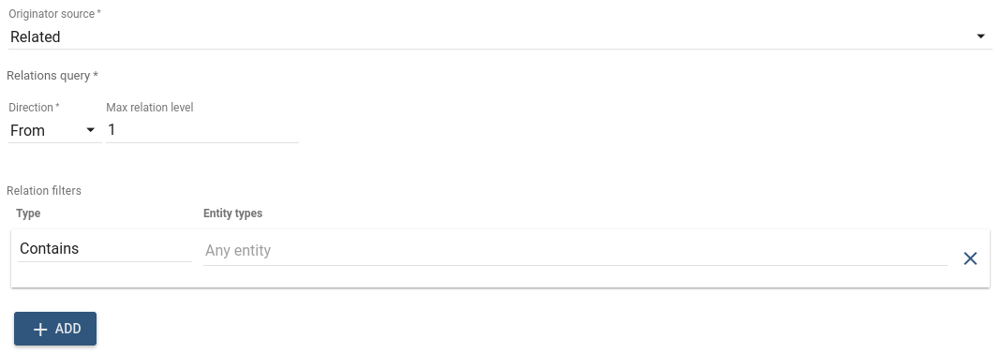
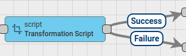
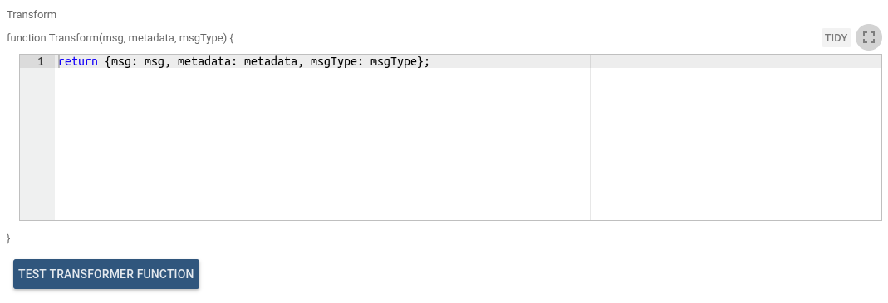
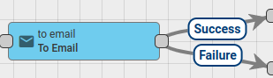
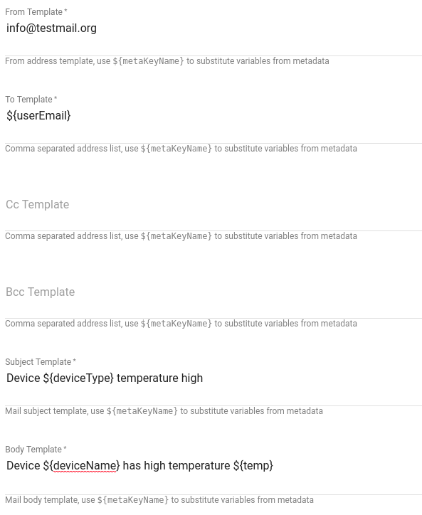

# transformation-nodes

Transformation Nodes are used for changing incoming Message fields like Originator, Message Type, Payload and Metadata.

* TOC

  {:toc}

## Change originator



All incoming Messages in the Thingsboard have originator field that identifies an entity that submits Message. It could be a Device, Asset, Customer, Tenant, etc.

This node is used in cases when a submitted message should be processed as a message from another entity. For example, Device submits telemetry and telemetry should be copied into higher level Asset or to a Customer. In this case, Administrator should add this node before [**Save Timeseries**](https://github.com/caoyingde/thingsboard.github.io/tree/9437083b88083a9b2563248432cbbe460867fbaf/docs/user-guide/rule-engine-2-0/action-nodes/README.md#save-timeseries-node) Node.

The originator can be changed to:

* Originator's Customer
* Originator's Tenant
* Related Entity that is identified by Relations Query

In 'Relations query' configuration Administrator can select required **Direction** and **relation depth level**. Also set of **Relation filters** can be configured with required Relation type and Entity Types.



If multiple Related Entities are found, _**only the first Entity is used**_ as new originator, other entities are discarded.

**Failure** chain is used if no Related Entity / Customer / Tenant was found, otherwise - **Success** chain.

Outbound Message will have new originator Id.

## Script Transformation Node



Changes Message payload, Metadata or Message type using configured JavaScript function.

JavaScript function receives 3 input parameters:

* `msg` - is a Message payload.
* `metadata` - is a Message metadata.
* `msgType` - is a Message type.

Script should return the following structure:



All fields in resulting object are optional and will be taken from original message if not specified.

Outbound Message from this Node will be new Message that was constructed using configured JavaScript function.

JavaScript transform function can be verified using [Test JavaScript function](https://github.com/caoyingde/thingsboard.github.io/tree/9437083b88083a9b2563248432cbbe460867fbaf/docs/user-guide/rule-engine-2-0/overview/README.md#test-javascript-functions).

  
 **Example**

Node receives Message with **payload**:

Original **Metadata**:

Original **Message Type** - POST\_TELEMETRY\_REQUEST   


The following modifications should be performed:

* change message type to 'CUSTOM\_UPDATE' 
* add additional attribute _**version**_ into payload with value _**v1.1**_
* change _**sensorType**_ attribute value in Metadata to _**roomTemp**_

The following transform function will perform all necessary modifications:

You can see real life example, how to use this node in those tutorials:

* [Transform incoming telemetry](https://github.com/caoyingde/thingsboard.github.io/tree/9437083b88083a9b2563248432cbbe460867fbaf/docs/user-guide/rule-engine-2-0/tutorials/transform-incoming-telemetry/README.md)
* [Reply to RPC Calls](tutorials/rpc-reply-tutorial.md#add-transform-script-node)

## To Email Node



Transforms message to Email Message by populating email fields using values derived from Message metadata. Set 'SEND\_EMAIL' output Message type that can be accepted later by [**Send Email Node**](https://github.com/caoyingde/thingsboard.github.io/tree/9437083b88083a9b2563248432cbbe460867fbaf/docs/user-guide/rule-engine-2-0/external-nodes/README.md#send-email-node). All email fields can be configured to use values from metadata.



For example incoming message has **deviceName** field in metadata and email body should contain its value.

In this case value of **deviceName** can be referenced as `${deviceName}` like in the following example:

```text
 Device ${deviceName} has high temperature
```

Additionally this node can prepare email attachments if incoming message metadata contains **attachments** field with reference to files stored in DataBase.

**NOTE**: This is part of [File Storage](https://github.com/caoyingde/thingsboard.github.io/tree/9437083b88083a9b2563248432cbbe460867fbaf/docs/user-guide/file-storage/README.md) feature supported by [ThingsBoard Professional Edition](https://github.com/caoyingde/thingsboard.github.io/tree/9437083b88083a9b2563248432cbbe460867fbaf/products/thingsboard-pe/README.md).

You can see the real life example, where this node is used, in the next tutorial:

* [Send Email](https://github.com/caoyingde/thingsboard.github.io/tree/9437083b88083a9b2563248432cbbe460867fbaf/docs/user-guide/rule-engine-2-0/tutorials/send-email/README.md)

