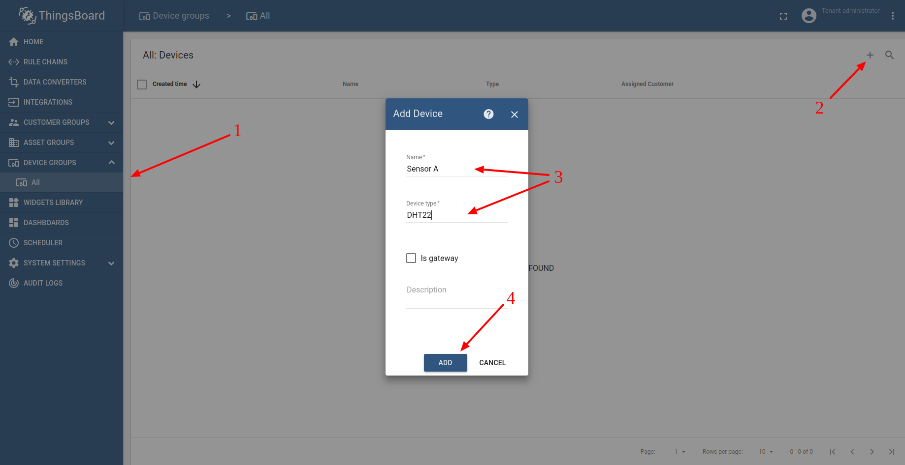
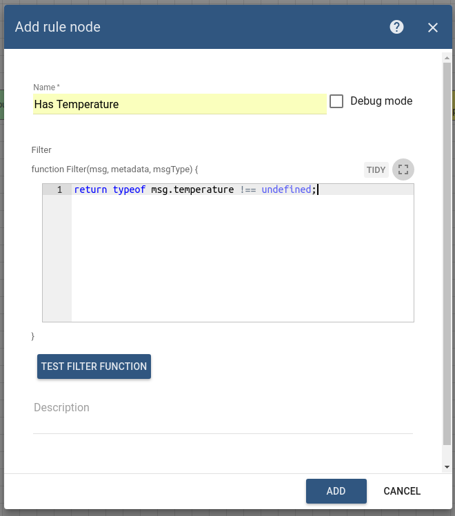
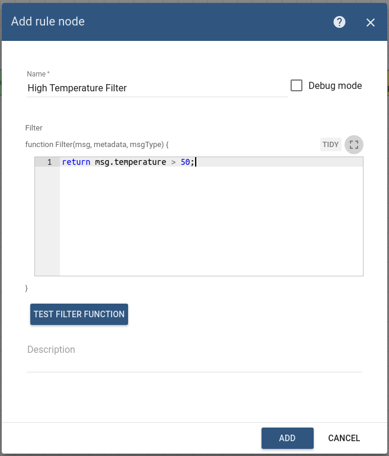
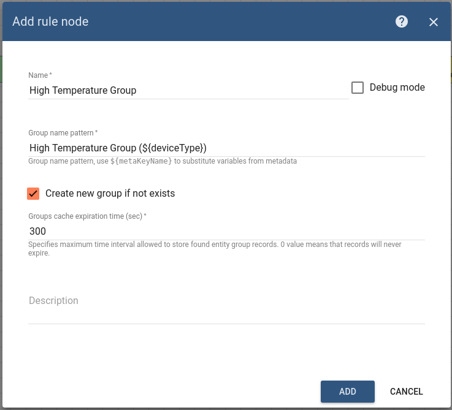
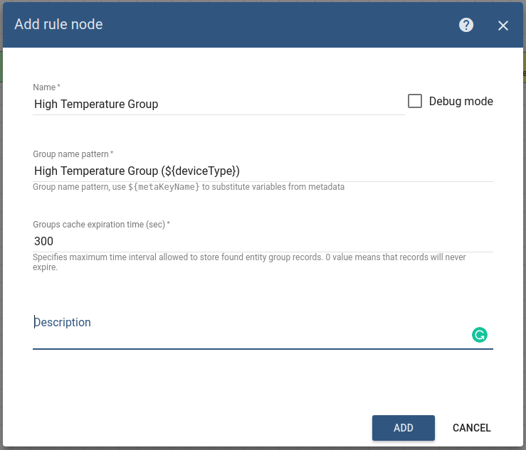
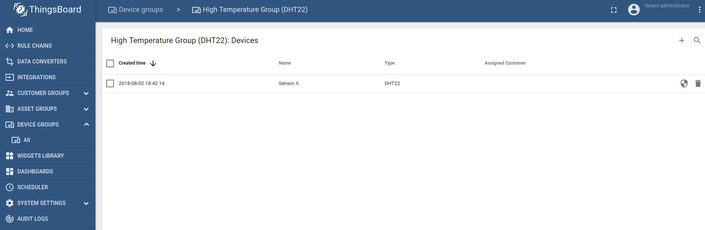

# add-devices-to-group

This tutorial will show how to dynamically add & remove device from the device group based on incoming data from device.

* TOC

  {:toc}

## Use case

Let's assume your device is reporting temperature readings to ThingsBoard and you would like to visualize devices that have reported temperature &gt; 50°C.

In this tutorial we will configure ThingsBoard Rule Engine to automatically update "High temperature devices" group members based on incoming temperature readings from the device. You can use this tutorial as a basis for much more complex filtering.

## Prerequisites

We assume you have completed the following guides and reviewed the articles listed below:

* [Getting Started](https://github.com/caoyingde/thingsboard.github.io/tree/9437083b88083a9b2563248432cbbe460867fbaf/docs/getting-started-guides/helloworld/README.md) guide.
* [Rule Engine Overview](https://github.com/caoyingde/thingsboard.github.io/tree/9437083b88083a9b2563248432cbbe460867fbaf/docs/user-guide/rule-engine-2-0/overview/README.md).

## Model definition

We will operate with Temperature sensor device that has name "Sensor A" and type "DHT22".

## Message Flow

In this section, we explain the purpose of each node in this tutorial.

### Root rule chain

* **Node A**: Rule Chain node
  * We modify the default root rule chain to forward all telemetry to new "Add device to group" rule chain

### New "Add device to group" rule chain

* **Node B**: Script filter node
  * Checks that the incoming message from device contains temperature readings
  * If message from device contains temperature readings it is forwarded to Node C

* **Node C**: Script filter node
  * Checks that the incoming message temperature is &gt; 50°C
  * If temperature &gt; 50°C message is forwarded to Node D
  * If temperature &lt;= 50°C message is forwarded to Node E

* **Node D**: Add to Group node
  * Adds device to the group
  * Constructs group name by substituting deviceType metadata value
  * Automatically creates device group if needed

* **Node E**: Remove from Group node
  * Removes device from the group
  * Constructs group name by substituting deviceType metadata value

## Configuring the Rule Chain

Download and [**import**](https://github.com/caoyingde/thingsboard.github.io/tree/9437083b88083a9b2563248432cbbe460867fbaf/docs/user-guide/ui/rule-chains/README.md#rule-chains-importexport) attached json [**file**](https://github.com/caoyingde/thingsboard.github.io/tree/9437083b88083a9b2563248432cbbe460867fbaf/docs/user-guide/rule-engine-2-0/pe/tutorials/add_device_to_group.json) as a new "Add device to group" rule chain. Please note that all nodes have debug enabled. This affects performance. Create Node A as shown on the image above in the root rule chain to forward telemetry to new rule chain.

## Validating the flow

[Publish](https://github.com/caoyingde/thingsboard.github.io/tree/9437083b88083a9b2563248432cbbe460867fbaf/docs/getting-started-guides/helloworld/README.md#pushing-data-from-the-device) temperature readings on behalf of the new device and observe new group automatically created:

## Next steps

