# check-relation-tutorial

The purpose of this tutorial is to show how the [**Check Relation**](https://github.com/caoyingde/thingsboard.github.io/tree/9437083b88083a9b2563248432cbbe460867fbaf/docs/user-guide/rule-engine-2-0/filter-nodes/README.md#check-relation-filter-node) node can be used to check the relation between Entities.

* TOC

  {:toc}

### Use case

Let’s assume the following use case:

* You have 2 devices:
  * **Smoke Detector** with the **Smoke Sensor** which sends data to ThingsBoard when it appears.
  * **Fire Alarm System** which provides a fire alarm, when the smoke is present.

However, there are different ways for the realization of this case, for example, it can be implemented using the **Switch** node that routes incoming Message to one or multiple output chains.  
 For more information about how to use the **Switch** node, please check the link to **The article of Switch Node** in the [**See Also**](https://github.com/caoyingde/thingsboard.github.io/tree/9437083b88083a9b2563248432cbbe460867fbaf/docs/user-guide/rule-engine-2-0/tutorials/check-relation-tutorial/README.md#see-also) section.

### Prerequisites

You need to read the following guides before you start this tutorial:

* [Getting Started](https://github.com/caoyingde/thingsboard.github.io/tree/9437083b88083a9b2563248432cbbe460867fbaf/docs/getting-started-guides/helloworld/README.md).
* [Rule Engine Overview](https://github.com/caoyingde/thingsboard.github.io/tree/9437083b88083a9b2563248432cbbe460867fbaf/docs/user-guide/rule-engine-2-0/overview/README.md).

## Adding the devices and creating the relation between them

Add two Device entity in ThingsBoard:

* Smoke Detector is represented as a Device. Its name is **Smoke Detector** and its type is **Smoke Sensor**.
* Fire Alarm System is represented as a Device. Its name is **Fire Alarm System** and its type is **Fire Alarm Device**.

  Create a relation of the type Uses:

* from Smoke Detector to Fire Alarm System;

  The following screenshots show how to do this:

  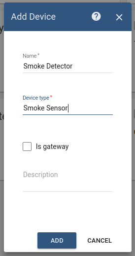 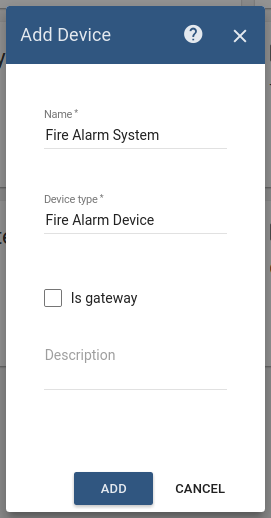   
   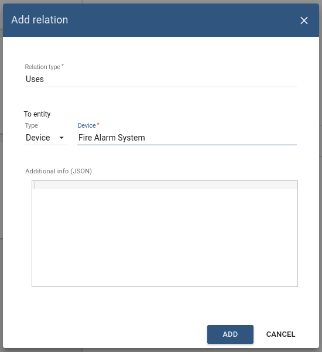

## Message flow

In this section, we explain the purpose of each node in this tutorial:

* Node A: [**Check Relation**](https://github.com/caoyingde/thingsboard.github.io/tree/9437083b88083a9b2563248432cbbe460867fbaf/docs/user-guide/rule-engine-2-0/filter-nodes/README.md#check-relation-filter-node) node.
  * Checks the relation from the Device, **Fire Alarm System**, to the originator of the message **Smoke Detector** using the type and direction of relation. 
* Node B: [**Change originator**](https://github.com/caoyingde/thingsboard.github.io/tree/9437083b88083a9b2563248432cbbe460867fbaf/docs/user-guide/rule-engine-2-0/transformation-nodes/README.md#change-originator) node.
  * Change the originator from Devices **Smoke Detector** to the related Device **Fire Alarm System** and the submitted message will be processed as a message from Device **Fire Alarm System**.
* Node C: [**Transformation Script**](https://github.com/caoyingde/thingsboard.github.io/tree/9437083b88083a9b2563248432cbbe460867fbaf/docs/user-guide/rule-engine-2-0/transformation-nodes/README.md#script-transformation-node).
  * Transform an original message into RPC request message. 
* Node D: [**RPC call request**](https://github.com/caoyingde/thingsboard.github.io/tree/9437083b88083a9b2563248432cbbe460867fbaf/docs/user-guide/rule-engine-2-0/action-nodes/README.md#rpc-call-request-node) node.
  * Takes the message payload and sends it as a response to the **Fire Alarm System**.
* Node E: [**Filter Script**](https://github.com/caoyingde/thingsboard.github.io/tree/9437083b88083a9b2563248432cbbe460867fbaf/docs/user-guide/rule-engine-2-0/filter-nodes/README.md#script-filter-node) node.
  * Checks if data of incoming message is **smoke**.
* Node F: [**Clear alarm**](https://github.com/caoyingde/thingsboard.github.io/tree/9437083b88083a9b2563248432cbbe460867fbaf/docs/user-guide/rule-engine-2-0/action-nodes/README.md#clear-alarm-node) node.
  * Loads the latest Alarm with configured Alarm Type for Message Originator **Smoke Detector** and Clears the Alarm if it exists.  
* Node G: [**Create alarm**](https://github.com/caoyingde/thingsboard.github.io/tree/9437083b88083a9b2563248432cbbe460867fbaf/docs/user-guide/rule-engine-2-0/action-nodes/README.md#create-alarm-node) node.
  * Tries to load the latest Alarm with configured Alarm Type for Message Originator, namely **Smoke Detector**.  
* Node H: **Rule Chain** node.
  * Forwards incoming Message to specified Rule Chain **Related Fire Alarm System**. 

## Configure Rule Chains

In this tutorial, we modified our **Root Rule Chain** and also created Rule Chain **Related Fire Alarm System**

  
The following screenshots show how the above Rule Chains should look like:

* **Related Fire Alarm System:**

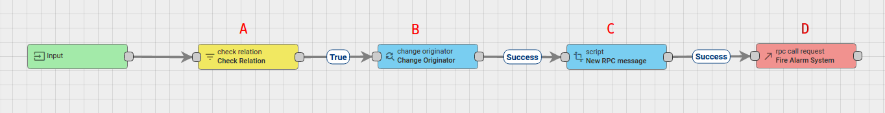

* **Root Rule Chain:**

Download the attached json [**file**](https://github.com/caoyingde/thingsboard.github.io/tree/9437083b88083a9b2563248432cbbe460867fbaf/docs/user-guide/rule-engine-2-0/tutorials/resources/check-relation-tutorial.json) for the **Root Rule Chain**. Don't forget to mark this rule chain as **root**.

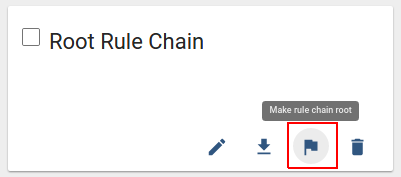

Also, you need to create **Related Fire Alarm System** Rule Chain or you can download the attached json [**file**](https://github.com/caoyingde/thingsboard.github.io/tree/9437083b88083a9b2563248432cbbe460867fbaf/docs/user-guide/rule-engine-2-0/tutorials/resources/related_fire_alarm_system.json) for this Chain and import it.   
   

The following section shows you how to create it.

#### Create new Rule Chain \(**Related Fire Alarm System**\)

Go to **Rule Chains** -&gt; **Add new Rule Chain**

Configuration:

* Name : **Related Fire Alarm System**

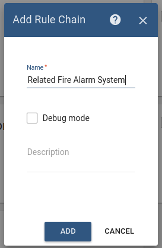

New Rule Chain is created. Press **Edit** button and configure Chain.

**Adding the required nodes**

In this rule chain, you will create 4 nodes as it will be explained in the following sections:

**Node A: Check Relation**

* Add the **Check Relation** node and connect it to the **Input** node.  

  This node will check the relation from the Device, **Fire Alarm System**, to the originator of the message **Smoke Detector** using the type and direction of relation. If the relation exists, the message will be sent through the True chain.

* Fill in the fields with the input data shown in the following table:

  | **Field** | **Input Data** |
  | :--- | :--- |
  | Name | Check Relation |
  | Direction | To |
  | Type | Device |
  | Device | Fire Alarm System |
  | Relation type | Uses |

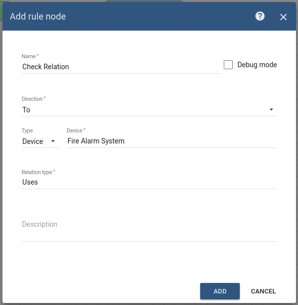

**Node B: Change Orignator**

* Add the **Change Orignator** node and connect it to the **Check Relation** node with a relation type **True**.   This node will change the originator from the Device **Smoke Detector** to the related Device **Fire Alarm System** and the submitted message will be processed as a message from another entity, namely **Fire Alarm System**.
* Fill in the fields with the input data shown in the following table:

| **Field** | **Input Data** |
| :--- | :--- |
| Name | Change Originator |
| Originator source | Related |
| Direction | From |
| Max relationship level | 1 |
| Relation type | Uses |
| Entity type | Device |

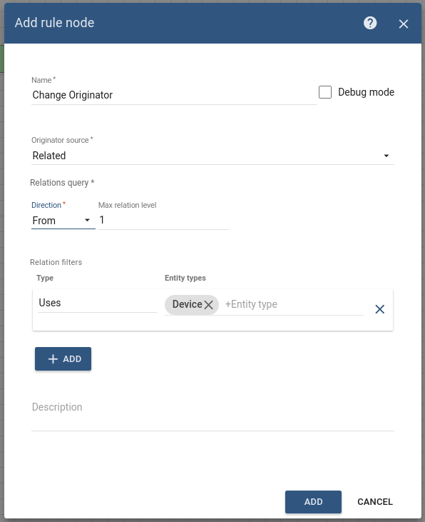

**Node C: Script Transformation**

* Add the **Script Transformation** node and connect it to the **Change Orignator** node with a relation type **Success**.

This node will transform an original message into RPC request message.

* The RPC call will have 2 properties:

  | **Property** | **Value** |
  | :--- | :--- |
  | method | ON |
  | params | {} |

  * In order to do this, add the following Script:

* Enter the Name field as **New RPC message**.

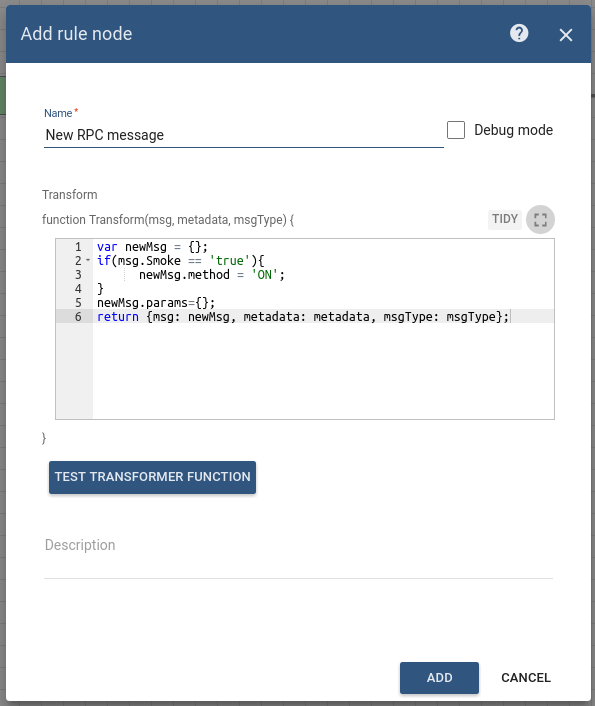

**Node D: RPC call request node**

* Add the **RPC call request** node and connect it to the **Script Transformation** node with a relation type **Success**.   

  This node takes the message payload and sends it as a response to the Message Originator **Fire Alarm System**.

* Enter the Name field as **Fire Alarm System**.
* Enter the Timeout value as 60 seconds.

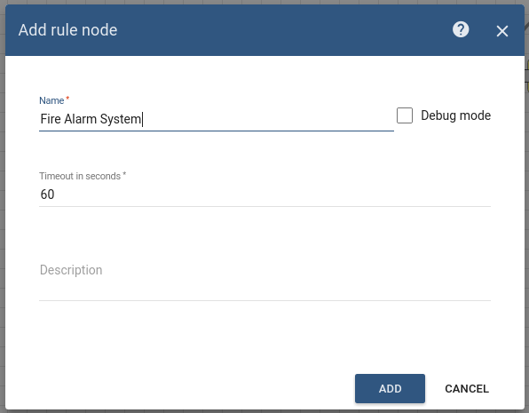

This Rule chain is ready and we should save it.

#### Modify Root Rule Chain

The initial Rule Chain has been modified by adding the following nodes:

**Node E: Filter Script**

* Add the **Filter Script** node and connect it to the **Save Timeseries** node with a relation type **Success**.   This node will check if data of incoming message is **smoke** using the following script:
* Enter the Name field as **Smoke Alarm Filter**.

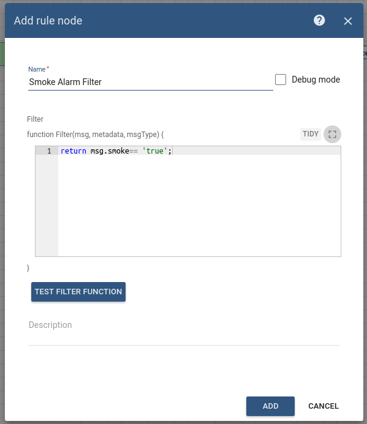

**Node F: Clear Alarm**

* Add the **Clear Alarm** node and connect it to the **Filter Script** node with a relation type **False**.   This node loads the latest Alarm with configured Alarm Type for Message Originator **Smoke Detector** and Clears the Alarm if it exists.
* Enter the Name field as **Clear Smoke Alarm** and the Alarm type as **Smoke Alarm**.

**Node G: Create alarm**

* Add the **Create alarm** node and connect it to the **Filter Script** node with a relation type **True**.   This node tries to load the latest Alarm with configured Alarm Type for Message Originator, namely **Smoke Detector**.
  * Enter the Name field as **Create Smoke Alarm** and the Alarm type as **Smoke Alarm**.

**Node H: Rule Chain**

* Add the **Rule Chain** node and connect it to the **Filter Script** node with a relation type **True**.   This node forwards incoming Message to specified Rule Chain **Related Fire Alarm System**.
* Enter the Name field as **Related Fire Alarm System**.

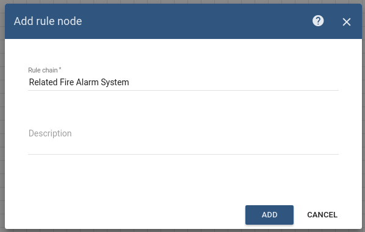

The following screenshot shows how the final **Root Rule Chain** should look like:

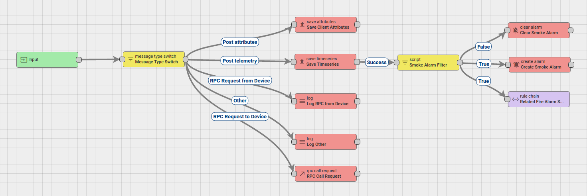

## How to verify the Rule Chain and Post telemetry

* Use the following javascript code to emulate the **Fire Alarm System** device.
  * [**FireAlarmEmulator.js**](https://github.com/caoyingde/thingsboard.github.io/tree/9437083b88083a9b2563248432cbbe460867fbaf/docs/user-guide/rule-engine-2-0/tutorials/resources/FireAlarmEmulator.js).
  * To run the script, you need to do the following steps:
  * Copy the **Fire Alarm System** device access token, then paste them in the script.   You can copy the access token from the Device page.    
* Use the Rest APIs, [Telemetry upload APIs](https://github.com/caoyingde/thingsboard.github.io/tree/9437083b88083a9b2563248432cbbe460867fbaf/docs/reference/http-api/README.md#telemetry-upload-api), for posting telemetry from the device **Smoke Detector**.  

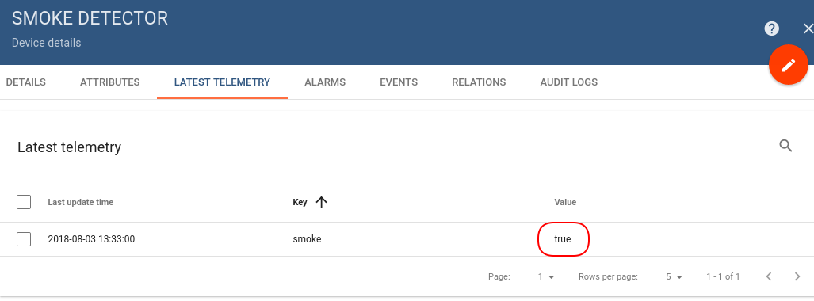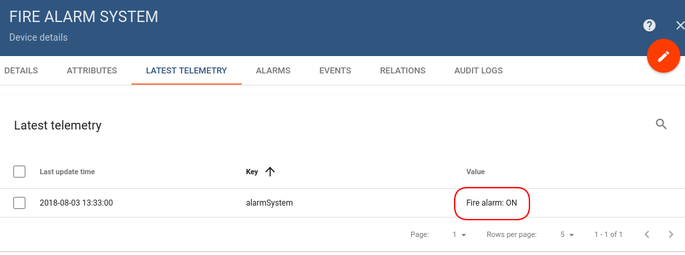

  
 Also, you can:

* configure the Dashboard by adding an alarm widget to visualize the alarms.
* define an additional logic for alarm processing, for example, sending an email.

Please refer to the third and fourth links under the **See Also** section to see how to do this.

## See Also

* [Switch Node](https://github.com/caoyingde/thingsboard.github.io/tree/9437083b88083a9b2563248432cbbe460867fbaf/docs/user-guide/rule-engine-2-0/filter-nodes/README.md#switch-node) guide - for more information about how to use Switch Node in Thignsboard.
* [Validate incoming telemetry](https://github.com/caoyingde/thingsboard.github.io/tree/9437083b88083a9b2563248432cbbe460867fbaf/docs/user-guide/rule-engine-2-0/tutorials/validate-incoming-telemetry/README.md#step-1-adding-temperature-validation-node) tutorial - for more information about how to validate an incoming telemetry using the Script Filter node.
* [Create & Clear Alarms: configure dashboard](https://github.com/caoyingde/thingsboard.github.io/tree/9437083b88083a9b2563248432cbbe460867fbaf/docs/user-guide/rule-engine-2-0/tutorials/create-clear-alarms/README.md#configure-device-and-dashboard) guide - to learn how to add an Alarm widget to the dashboard.
* [Send Email](https://github.com/caoyingde/thingsboard.github.io/tree/9437083b88083a9b2563248432cbbe460867fbaf/docs/user-guide/rule-engine-2-0/tutorials/send-email/README.md) tutorial.
* [RPC capabilities](https://github.com/caoyingde/thingsboard.github.io/tree/9437083b88083a9b2563248432cbbe460867fbaf/docs/user-guide/rpc/README.md#server-side-rpc-api) guide - for more information about how RPC works in Thignsboard, please refer to the RPC capabilities guide.

### Next steps

