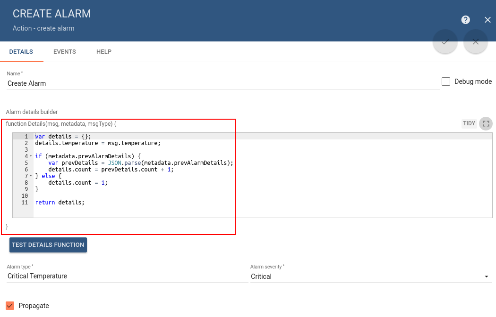
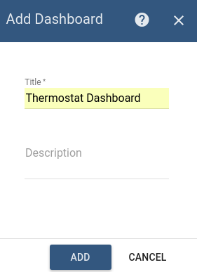
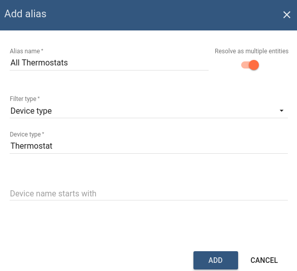
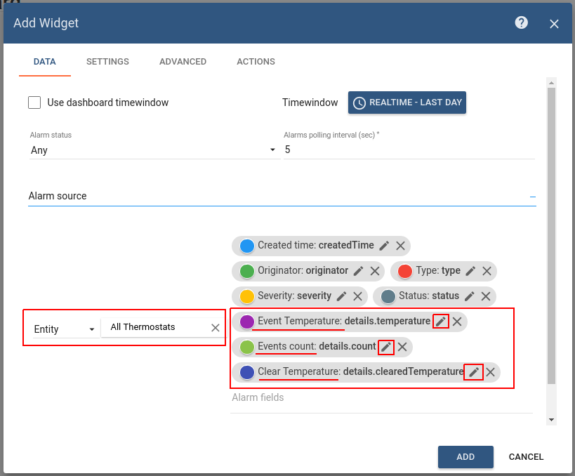
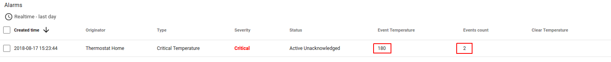
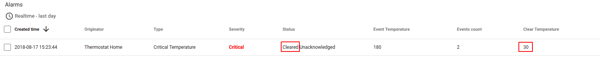

# create-clear-alarms-with-details

* TOC

  {:toc}

### Use case

This tutorial is based on the [create & clear alarms](https://github.com/caoyingde/thingsboard.github.io/tree/9437083b88083a9b2563248432cbbe460867fbaf/docs/user-guide/rule-engine-2-0/tutorials/create-clear-alarms/README.md#use-case) tutorial and it's use case. We will reuse the rule chains from the above-mentioned tutorial and will configure the Alarm Details function in the Create and Clear Alarm nodes. Let's assume your device is using DHT22 sensor to collect and push temperature readings to ThingsBoard. DHT22 sensor is good for -40 to 80°C temperature readings. We want generate Alarms if temperature is out of good range.

In this tutorial we will configure ThingsBoard Rule Engine to:

* Count number of critical temperature updates for each device and save this info in Alarm details.
* Save latest critical temperature value in Alarm details.

### Prerequisites

We assume you have completed the following guides and reviewed the articles listed below:

* [Getting Started](https://github.com/caoyingde/thingsboard.github.io/tree/9437083b88083a9b2563248432cbbe460867fbaf/docs/getting-started-guides/helloworld/README.md) guide.
* [Rule Engine Overview](https://github.com/caoyingde/thingsboard.github.io/tree/9437083b88083a9b2563248432cbbe460867fbaf/docs/user-guide/rule-engine-2-0/overview/README.md).
* [Create & clear alarms](https://github.com/caoyingde/thingsboard.github.io/tree/9437083b88083a9b2563248432cbbe460867fbaf/docs/user-guide/rule-engine-2-0/tutorials/create-clear-alarms/README.md) guide.

## Message flow

In this section, we explain the purpose of each node in this tutorial:

* Node A: [**Create alarm**](https://github.com/caoyingde/thingsboard.github.io/tree/9437083b88083a9b2563248432cbbe460867fbaf/docs/user-guide/rule-engine-2-0/action-nodes/README.md#create-alarm-node) node.
  * Creates or Updates an  alarm if the published temperature is not at expected time range \(filter script node returns True\).    
* Node B: [**Clear alarm**](https://github.com/caoyingde/thingsboard.github.io/tree/9437083b88083a9b2563248432cbbe460867fbaf/docs/user-guide/rule-engine-2-0/action-nodes/README.md#clear-alarm-node) node.
  * Clears alarm if it exists in case if the published temperature is in expected time range \(script node returns False\). 
* Node C: **Rule Chain** node.
  * Forwards incoming Message to specified Rule Chain **Create & Clear Alarms with details**.     

## Configure Rule Chains

In this tutorial, we only modified **Create & Clear Alarms** rule chain, namely configured Alarm Details function in nodes that was described above in the section [Message flow](https://github.com/caoyingde/thingsboard.github.io/tree/9437083b88083a9b2563248432cbbe460867fbaf/docs/user-guide/rule-engine-2-0/tutorials/create-clear-alarms-with-details/README.md#message-flow)  
 Also, we renamed this Rule Chain to **Create & Clear Alarms with details**.

  
The following screenshots show how the above Rule Chains should look like:

* **Create & Clear Alarms with details:**

* **Root Rule Chain:**

Download the attached json [**file**](https://github.com/caoyingde/thingsboard.github.io/tree/9437083b88083a9b2563248432cbbe460867fbaf/docs/user-guide/rule-engine-2-0/tutorials/resources/create___clear_alarms_with_details.json) for the **Create & Clear Alarms with details:** rule chain. Create Node **C** as shown on the image above in the root rule chain to forward telemetry to the imported rule chain.   
   

The following section shows you how to modify this rule chain, specifically: rule nodes [**A**](https://github.com/caoyingde/thingsboard.github.io/tree/9437083b88083a9b2563248432cbbe460867fbaf/docs/user-guide/rule-engine-2-0/tutorials/create-clear-alarms-with-details/README.md#node-a-create-alarm) and [**B**](https://github.com/caoyingde/thingsboard.github.io/tree/9437083b88083a9b2563248432cbbe460867fbaf/docs/user-guide/rule-engine-2-0/tutorials/create-clear-alarms-with-details/README.md#node-b-clear-alarm).

### Modify **Create & Clear Alarms with details:**

#### Modify the required nodes

In this rule chain, you will modify 2 nodes as it will be explained in the following sections:

**Node A: Create alarm**

If published temperature **is not in** expected time range \(**script** node returns **True**\) we want to create an Alarm. We want to add current **temperature** into Alarm Details field. Also we want to increment **count** field in Alarm Details if alarm already exist, otherwise set count to 1.

For making it we will overwrite **Details** function:

**Details** function:

**Details** function create required **details** object with initial parameters. Then, in **if** statement, we verify is it a new Alarm or Alarm already exist. If exist - take previous **count** field and increment it.

If new Alarm was created in **Create Alarm** node it is passed to other nodes via relation **Created** if they exist. If Alarm was updated - it is passed to other nodes via relation **Updated** if they exist.

**Node B: Clear Alarm**

If published temperature **is in** expected time range \(**script** node returns **False**\) we want to clear an existing Alarm. Also during clearing, we want to add latest **temperature** to the existing Alarm details.

For making it we will overwrite **Details** function:

**Alarm Details** function:

If **Clear Alarm** node could not find existing Alarm, nothing is changed and original message is passed to other nodes via relation **False** if they exist. If Alarm do exist - it is cleared and passed to other nodes via relation **Cleared**.

Chain configuration is finished and we need to **save it**.

## Configure Dashboard

Download the attached json [**file**](https://github.com/caoyingde/thingsboard.github.io/tree/9437083b88083a9b2563248432cbbe460867fbaf/docs/user-guide/resources/thermostat_dashboard.json) for the dashboard indicated in this tutorial and import it.

* Go to **Dashboards** -&gt; **Add new Dashboard** -&gt; **Import Dashboard** and drop the downloaded json file.

Also you can Create Dashboard from scratch and the following section show you how to do this:

### Creating Dashboard

We will create Dashboard for all **Thermostat** devices and add Alarm widget on it. Create new Dashboard:

Press **Edit** dashboard and **add alias** that will be resolved to all devices with type **Thermostat**:

Add **Alarm widget** to the Dashboard \(Add new widget -&gt; Alarm widget bundle -&gt; Alarms\). Select configured alias **entity alarm source**. Also, add additional **alarm fields**.

* details.temperature.
* details.count.
* details.clearedTemperature. 

And rename label of each field by press **edit** button on the field:

* From: -&gt; To:
  * details.temperature        -&gt; Event Temperature.
  * details.count              -&gt; Events count.
  * details.clearedTemperature -&gt; Clear Temperature.

## Post telemetry and verify

For posting device telemetry we will use Rest API \([link](https://github.com/caoyingde/thingsboard.github.io/tree/9437083b88083a9b2563248432cbbe460867fbaf/docs/reference/http-api/README.md#telemetry-upload-api)\). For this we will need to copy device access token from then device **Thermostat Home**.

**\*you need to replace $ACCESS\_TOKEN with actual device token**

Lets post temperature = 99. Alarm should be created:

Lets post temperature = 180. Alarm should be updated and count field incremented:

Lets post temperature = 30. Alarm should be cleared and cleared temperature should be shown:

Also, you can see how to:

* Define an additional logic for alarm processing, for example, sending an email or sending notification to Telegram App.

  Please refer links under the **See Also** section to see how to do this.

## See Also

* [Send Email](https://github.com/caoyingde/thingsboard.github.io/tree/9437083b88083a9b2563248432cbbe460867fbaf/docs/user-guide/rule-engine-2-0/tutorials/send-email/README.md) guide.
* [Notifications and Alarms on your smartphone using Telegram Bot](https://github.com/caoyingde/thingsboard.github.io/tree/9437083b88083a9b2563248432cbbe460867fbaf/docs/iot-gateway/integration-with-telegram-bot/README.md) guide.

## Next steps

