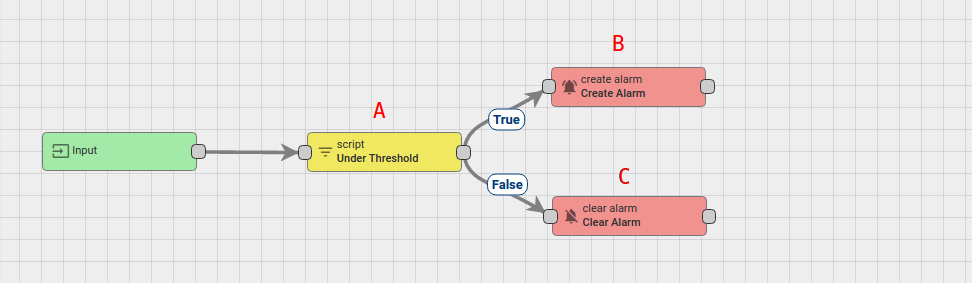
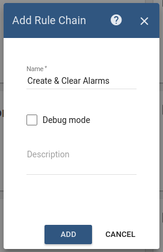
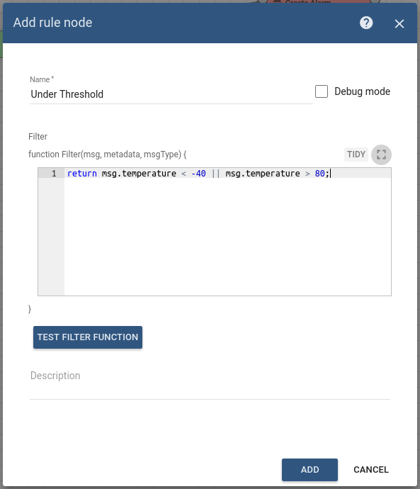
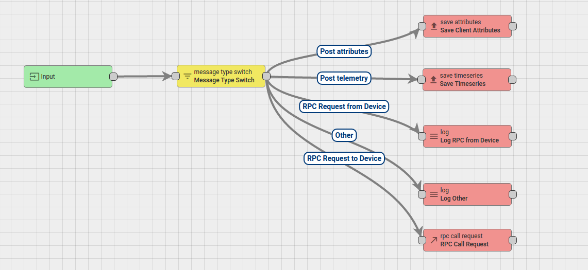
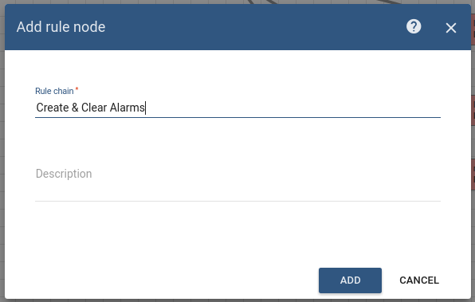
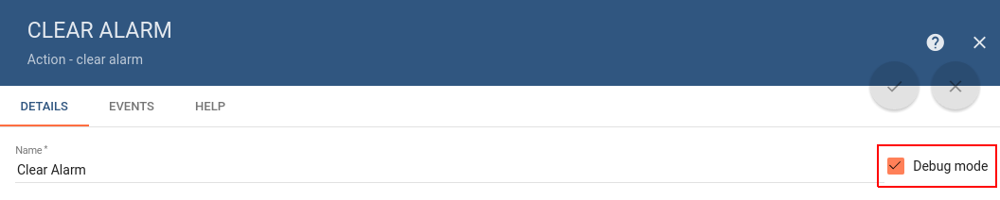
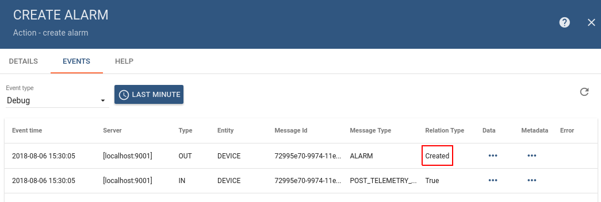

# create-clear-alarms

* TOC

  {:toc}

### Use case

Let's assume your device is using DHT22 sensor to collect and push temperature readings to ThingsBoard. DHT22 sensor is good for -40 to 80°C temperature readings. We want generate Alarms if temperature is out of good range.

In this tutorial we will configure ThingsBoard Rule Engine to

* Create or Update existing Alarm if temperature &gt; 80°C or temperature &lt; -40°C
* Clear Alarm if temperature &gt; -40°C and &lt; 80°C

### Prerequisites

We assume you have completed the following guides and reviewed the articles listed below:

* [Getting Started](https://github.com/caoyingde/thingsboard.github.io/tree/9437083b88083a9b2563248432cbbe460867fbaf/docs/getting-started-guides/helloworld/README.md) guide.
* [Rule Engine Overview](https://github.com/caoyingde/thingsboard.github.io/tree/9437083b88083a9b2563248432cbbe460867fbaf/docs/user-guide/rule-engine-2-0/overview/README.md).

## Adding the device

Add Device entity in ThingsBoard. Its name is **Thermostat Home** and its type is **Thermostat**.

## Message flow

In this section, we explain the purpose of each node in this tutorial:

* Node A: [**Filter Script**](https://github.com/caoyingde/thingsboard.github.io/tree/9437083b88083a9b2563248432cbbe460867fbaf/docs/user-guide/rule-engine-2-0/filter-nodes/README.md#check-relation-filter-node) node.
  * This node with temperature threshold check script will verify: "if the temperature is in the expected interval, the script will return False, otherwise True will be returned".
* Node B: [**Create alarm**](https://github.com/caoyingde/thingsboard.github.io/tree/9437083b88083a9b2563248432cbbe460867fbaf/docs/user-guide/rule-engine-2-0/action-nodes/README.md#create-alarm-node) node.
  * Creates or Updates an  alarm if the published temperature is not at expected time range \(filter script node returns True\).    
* Node C: [**Clear alarm**](https://github.com/caoyingde/thingsboard.github.io/tree/9437083b88083a9b2563248432cbbe460867fbaf/docs/user-guide/rule-engine-2-0/action-nodes/README.md#clear-alarm-node) node.
  * Clears alarm if it exists in case if the published temperature is in expected time range \(script node returns False\).   
* Node D: **Rule Chain** node.
  * Forwards incoming Message to specified Rule Chain **Create & Clear Alarms**. 

## Configure Rule Chains

In this tutorial, we modified our **Root Rule Chain** and also created Rule Chain **Create & Clear Alarms**

  
The following screenshots show how the above Rule Chains should look like:

* **Create & Clear Alarms:**

* **Root Rule Chain:**

Download the attached json [**file**](https://github.com/caoyingde/thingsboard.github.io/tree/9437083b88083a9b2563248432cbbe460867fbaf/docs/user-guide/rule-engine-2-0/tutorials/resources/create___clear_alarms.json) for the **Create & Clear Alarms** rule chain. Create Node D as shown on the image above in the root rule chain to forward telemetry to the imported rule chain.   
   

The following section shows you how to create this rule chain from scratch.

#### Create new Rule Chain \(**Create & Clear Alarms**\)

Go to **Rule Chains** -&gt; **Add new Rule Chain**

Configuration:

* Name : **Create & Clear Alarms**

New Rule Chain is created. Press **Edit** button and configure Chain.

**Adding the required nodes**

In this rule chain, you will create 3 nodes as it will be explained in the following sections:

**Node A: Filter Script**

* Add the **Filter Script** node and connect it to the **Input** node with a relation type **Success**.  This node will verify: "if the temperature is in the expected interval" using the following script:

If the temperature is in the expected interval the script will return False, otherwise True will be returned.

* Enter the Name field as **Under Threshold**.  

**Node B: Create alarm**

* Add the **Create alarm** node and connect it to the **Filter Script** node with a relation type **True**.   This node loads the latest Alarm with configured Alarm Type for Message Originator, namely **Thermostat Home**  if the published temperature is not at expected range \(filter script node returns True\).
  * Enter the Name field as **Create alarm** and the Alarm type as **Critical Temperature**.

**Node C: Clear Alarm**

* Add the **Clear Alarm** node and connect it to the **Filter Script** node with a relation type **False**.   This node loads the latest Alarm with configured Alarm Type for Message Originator **Thermostat Home**  and Clears alarm if it exists in case if the published temperature is in expected range \(script node returns False\).
* Enter the Name field as **Clear Alarm** and the Alarm type as **Critical Temperature**.

#### Modify Root Rule Chain

The following screenshot shows the initial Root Rule Chain.

The initial Rule Chain has been modified by adding the following node:

**Node D: Rule Chain**

* Add the **Rule Chain** node and connect it to the **Filter Script** node with a relation type **True**.   This node forwards incoming Message to specified Rule Chain **Create & Clear Alarms**.
* Enter the Name field as **Create & Clear Alarms**.

The following screenshot shows how the final **Root Rule Chain** should look like:

## How to verify the Rule Chain and Post telemetry

For posting device telemetry we will use the Rest APIs, [Telemetry upload APIs](https://github.com/caoyingde/thingsboard.github.io/tree/9437083b88083a9b2563248432cbbe460867fbaf/docs/reference/http-api/README.md#telemetry-upload-api). For this we will need to copy device access token from the device **Thermometer**.

Let's pushed debug mode button in Clear Alarm and Create Alarm node to verify the results.

  
 

sent temperature = 99. Alarm should be created:

Lets post temperature = 180. Alarm should be updated:

Lets post temperature = 30. Alarm should be cleared:

Also, you can:

* configure Alarm Details function in the Create and Clear Alarm nodes.
* configure the Dashboard by adding an alarm widget to visualize the alarms.
* define an additional logic for alarm processing, for example, sending an email.

Please refer to the links from the second to the fourth under the **See Also** section to see how to do this.

## See Also

* [Validate incoming telemetry](https://github.com/caoyingde/thingsboard.github.io/tree/9437083b88083a9b2563248432cbbe460867fbaf/docs/user-guide/rule-engine-2-0/tutorials/validate-incoming-telemetry/README.md) tutorial - for more information about how to validate an incoming telemetry using the Script Filter node.
* [Create & Clear Alarms: alarm details:](https://github.com/caoyingde/thingsboard.github.io/tree/9437083b88083a9b2563248432cbbe460867fbaf/docs/user-guide/rule-engine-2-0/tutorials/create-clear-alarms-with-details/README.md#modify-the-required-nodes) guide - to learn how to configure Alarm Details function in Alarm nodes.
* [Create & Clear Alarms: configure dashboard](https://github.com/caoyingde/thingsboard.github.io/tree/9437083b88083a9b2563248432cbbe460867fbaf/docs/user-guide/rule-engine-2-0/tutorials/create-clear-alarms-with-details/README.md#configure-dashboard) guide - to learn how to add an Alarm widget to the dashboard.
* [Send Email](https://github.com/caoyingde/thingsboard.github.io/tree/9437083b88083a9b2563248432cbbe460867fbaf/docs/user-guide/rule-engine-2-0/tutorials/send-email/README.md) tutorial.

### Next steps

