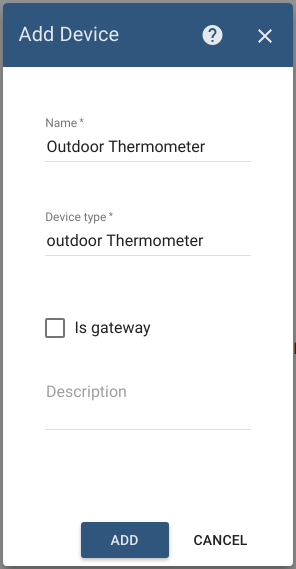
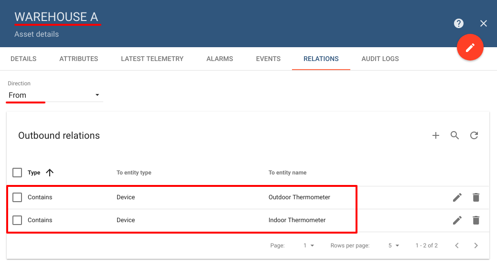
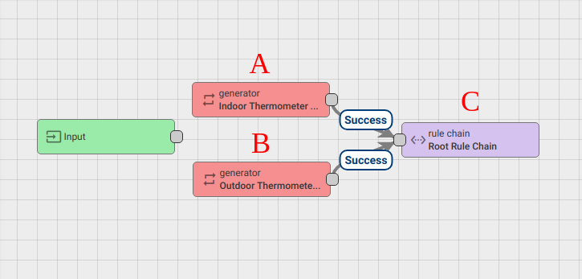
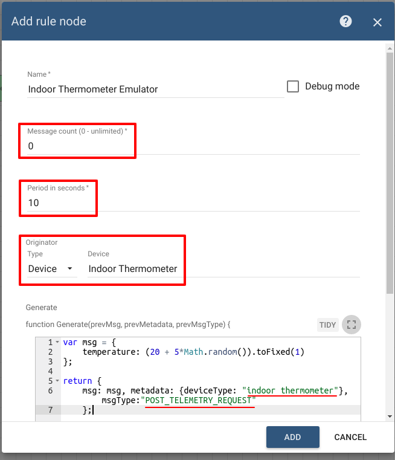
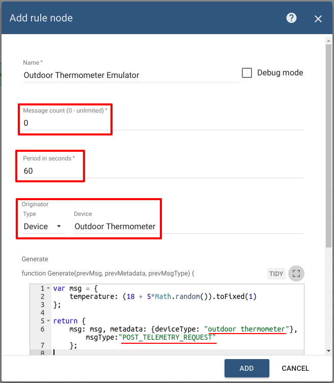
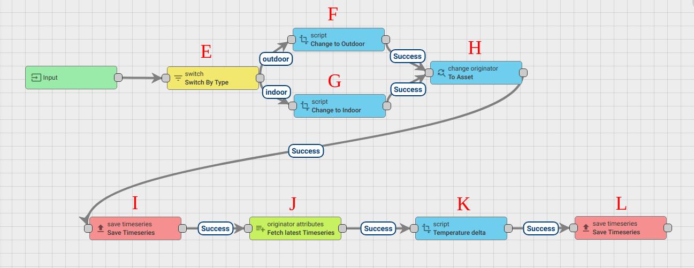
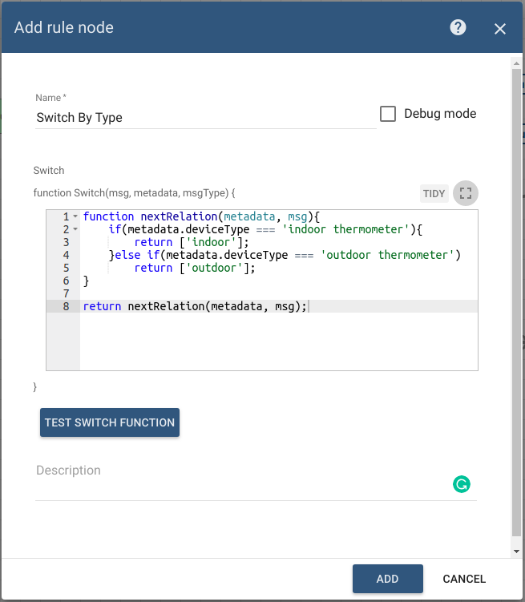
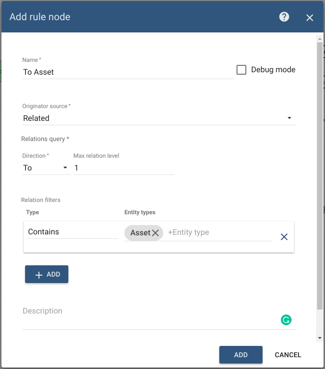
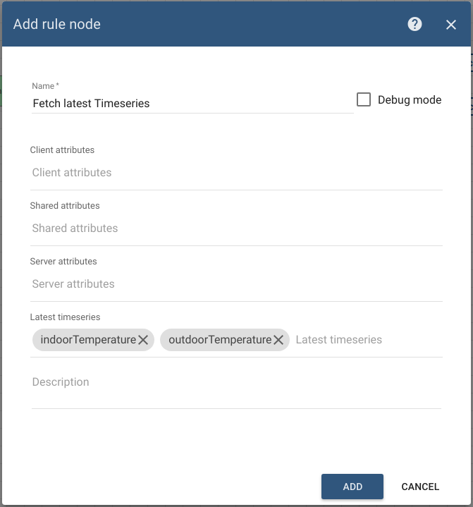
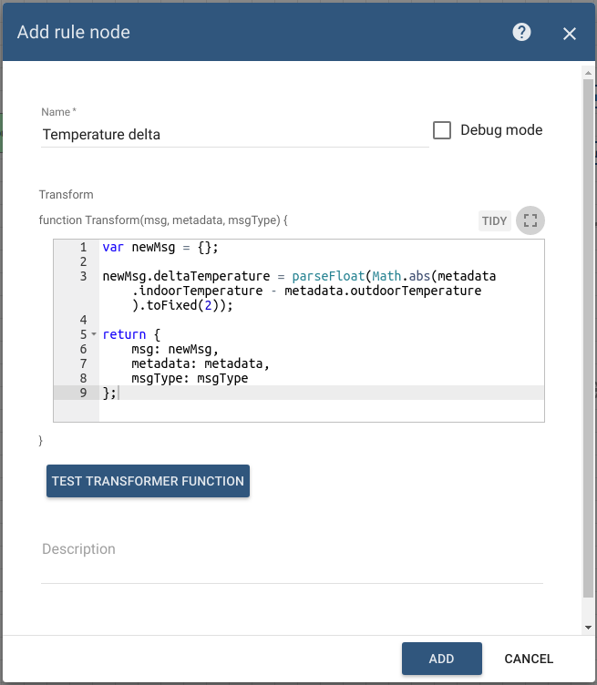

# function-based-on-telemetry-from-two-devices

This tutorial will show how to calculate temperature delta based on the readings from the indoor outdoor warehouse thermometers.

* TOC

  {:toc}

## Use case

Let's assume you have a warehouse with two thermometers: indoor and outdoor. In this tutorial, we will configure ThingsBoard Rule Engine to automatically calculate the delta of temperatures inside and outside the warehouse based on the latest readings from temperature sensors. Please note that this is just a simple theoretical use case to demonstrate the capabilities of the platform. You can use this tutorial as a basis for much more complex scenarios.

## Prerequisites

We assume you have completed the following guides and reviewed the articles listed below:

* [Getting Started](https://github.com/caoyingde/thingsboard.github.io/tree/9437083b88083a9b2563248432cbbe460867fbaf/docs/getting-started-guides/helloworld/README.md) guide.
* [Rule Engine Overview](https://github.com/caoyingde/thingsboard.github.io/tree/9437083b88083a9b2563248432cbbe460867fbaf/docs/user-guide/rule-engine-2-0/overview/README.md).

## Model definition

We will create one asset that has name "Warehouse A" and type "warehouse".


We will create two devices that have names "Inside Thermometer" and "Outside Thermometer" and accordingly with types "inside thermometer" and "outside thermometer".

 

We must also create the relation between asset "Warehouse A" and device "Inside Thermometer". This relation will be used in the rule chain to change originator of the messages from the thermometer to the warehouse itself and also the relation from device "Inside Thermometer" to device "Outside Thermometer" to fetch the latest temperature from "Outside Thermometer".



**Note**: Please review the following [**documentation page**](https://github.com/caoyingde/thingsboard.github.io/tree/9437083b88083a9b2563248432cbbe460867fbaf/docs/user-guide/entities-and-relations/README.md) to learn how to create assets and relations.

## Message Flow

In this section, we explain the purpose of each node in this tutorial. There will be three rule chains involved:

* "Thermometer Emulators" - optional rule chain to simulate data from two temperature sensors;
* "Root rule chain" - rule chain that actually saves telemetry from devices into the database, and filters messages by device type before redirecting it to "Delta Temperature" chain
* "Delta Temperature" - rule chain that actually calculates delta temperature between thermometers in the warehouse and outside;

### Thermometer Emulators rule chain



* **Nodes A and B**: Generator nodes
  * Two similar nodes that periodically generate a very simple message with random temperature reading.
* **Node A: Indoor Thermometer emulator**

  ```text
       
       var msg = {
           temperature: (20 + 5 * Math.random()).toFixed(1)
       };

       return {
           msg: msg,
           metadata: {
               deviceType: "indoor thermometer"
           },
           msgType: "POST_TELEMETRY_REQUEST"
       };
       
  ```

* **Node B: Outdoor Thermometer emulator**

  ```text
       
       var msg = {
           temperature: (18 + 5 * Math.random()).toFixed(1)
       };

       return {
           msg: msg,
           metadata: {
               deviceType: "outdoor thermometer"
           },
           msgType: "POST_TELEMETRY_REQUEST"
       };
       
  ```

  

  

**Note**: in the real case, the device type is set to the message metadata by default.

* **Node C**: Rule Chain node
  * Forwards all messages to default root rule chain.

### Root rule chain


* **Nodes D**: Rule Chain node
  * Forwards incoming Message to specified rule chain "Delta Temperature". 

### Delta Temperature rule chain



* **Node E**: Switch node.
  * Routes incoming messages by deviceType fetched from message metadata. If deviceType from incoming message is "indoor thermometer" switches to the chain via "indoor" relation type, else if deviceType from incoming message is "outdoor thermometer" switches to the chain via "outdoor" relation type.



* **Nodes F and G**: Transform script nodes
  * Two similar nodes that changes key names from message payload from "temperature" to "indoorTemperature" or "outdoorTemperature" depending on relation type from the previous node.
  * Creates a new outbound message in which it puts the new telemetry.  
* **Node F: Change to Outdoor**

  ```text
   
   var newMsg = {};

   newMsg.outdoorTemperature = msg.temperature;

   return {
      msg: newMsg,
         metadata: metadata,
         msgType: msgType
   };
   
  ```

* **Node G: Change to Indoor**

  ```text
   
   var newMsg = {};

   newMsg.indoorTemperature = msg.temperature;

   return {
        msg: newMsg,
        metadata: metadata,
        msgType: msgType
   };
   
  ```

* **Node H**: Change originator node.
  * Changes the originator from "Inside Thermometer" to the related Asset "Warehouse A" and the submitted message will be processed as a message from the Asset.



* **Node I**: Save Timeseries node.
  * Saves the TimeSeries data from the incoming Message payload into the database.
* **Node J**: Originator attributes node.
  * Adds message originator latest telemetry values into message metadata.



* **Node K**: Transform script node.
  * Creates a new outbound message in which it puts the new telemetry "deltaTemperature" that calculated like the absolute value between the difference of message metadata telemetry values namely, "indoorTemperature" and "outdoorTemperature".  



* **Node L**: Save Timeseries node.
  * Saves the TimeSeries data from the incoming Message payload into the database.

## Configuring the Rule Chains

Download and [**import**](https://github.com/caoyingde/thingsboard.github.io/tree/9437083b88083a9b2563248432cbbe460867fbaf/docs/user-guide/ui/rule-chains/README.md#rule-chains-importexport) attached emulators rule chain [**file**](https://github.com/caoyingde/thingsboard.github.io/tree/9437083b88083a9b2563248432cbbe460867fbaf/docs/user-guide/rule-engine-2-0/tutorials/resources/thermometer_emulators.json) as a new "Thermometer Emulators" rule chain, root rule chain [**file**](https://github.com/caoyingde/thingsboard.github.io/tree/9437083b88083a9b2563248432cbbe460867fbaf/docs/user-guide/rule-engine-2-0/tutorials/resources/root_rule_chain_function_from_two_devices.json) as a new "Root rule chain" and "Delta Temperature" [**file**](https://github.com/caoyingde/thingsboard.github.io/tree/9437083b88083a9b2563248432cbbe460867fbaf/docs/user-guide/rule-engine-2-0/tutorials/resources/delta_temperature.json). Please note that some nodes have debug enabled.

## Validating the flow

Download and [**import**](https://github.com/caoyingde/thingsboard.github.io/tree/9437083b88083a9b2563248432cbbe460867fbaf/docs/user-guide/ui/dashboards/README.md#iot-dashboard-importexport) attached dashboard [**file**](https://github.com/caoyingde/thingsboard.github.io/tree/9437083b88083a9b2563248432cbbe460867fbaf/docs/user-guide/rule-engine-2-0/tutorials/resources/warehouse_dashboard.json) as a new "Warehouse dashboard".


## Next steps

