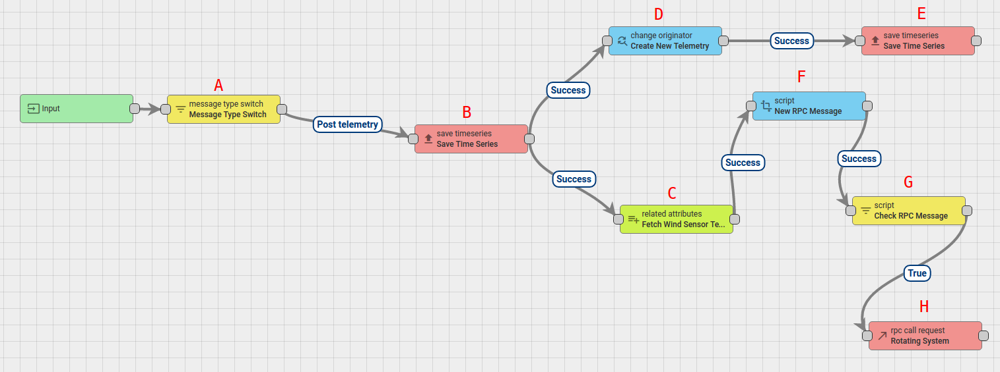
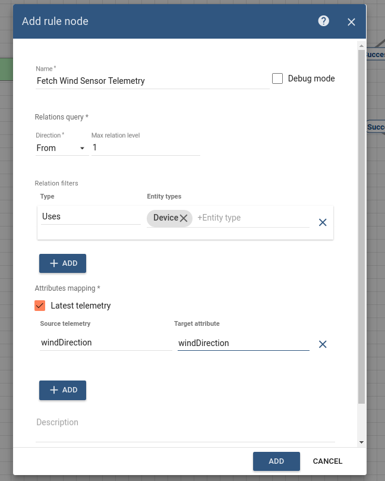
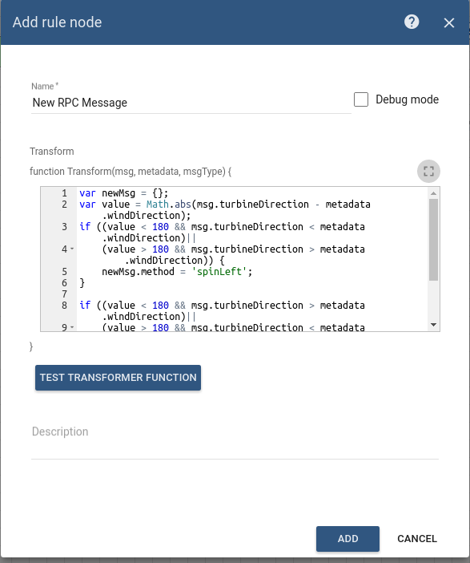
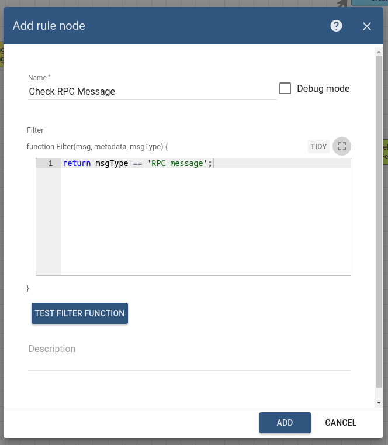
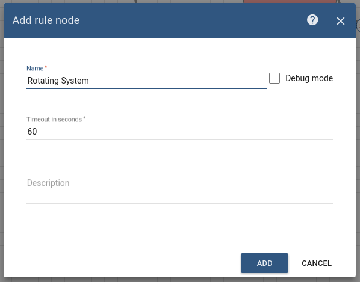
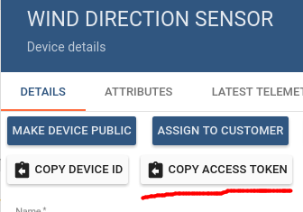
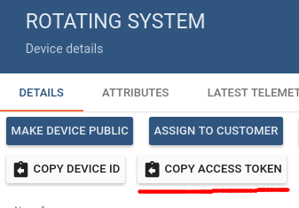
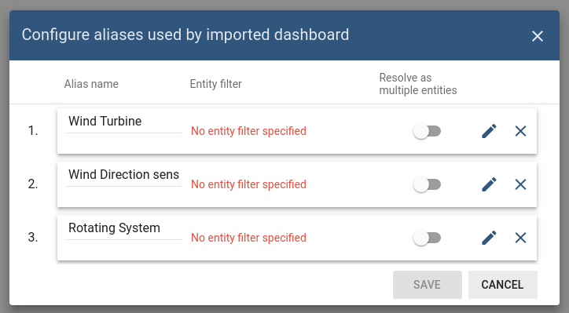

# rpc-request-tutorial

ThingsBoard allows you to send remote procedure calls [**RPC**](https://github.com/caoyingde/thingsboard.github.io/tree/9437083b88083a9b2563248432cbbe460867fbaf/docs/user-guide/rpc/README.md#server-side-rpc-api) from server-side applications to devices and vice versa.   
 This Tutorial is to show you how to send a remote request call to a Related Device using Rule Engine.

* TOC

  {:toc}

## Use case

Let’s assume the following use case:

* you have the following devices connected to ThingsBoard:    
  * Wind Direction Sensor.    
  * Rotating System.    
* also, you have one asset:
  * Wind Turbine. 
  * You want to initiate an RPC request to the Rotating System and change the direction of the Wind Turbine according to the direction of the wind.
  * The RPC call will have two properties:
  * method: **spinLeft** or **spinRight**.
  * params: **value**.

| _**Note:**_ |
| :--- |
| Turning the Rotating System to the left or to the right is based on which way is better and faster so that the difference between the direction of the wind and the wind turbine has to be not more than 5 degrees. |

### Prerequisites

We assume you have completed the following guides and reviewed the articles listed below:

* [Getting Started](https://github.com/caoyingde/thingsboard.github.io/tree/9437083b88083a9b2563248432cbbe460867fbaf/docs/getting-started-guides/helloworld/README.md) guide.
* [Rule Engine Overview](https://github.com/caoyingde/thingsboard.github.io/tree/9437083b88083a9b2563248432cbbe460867fbaf/docs/user-guide/rule-engine-2-0/overview/README.md).

## Model definition

The Wind Turbine has two devices installed: Wind Direction Sensor and Rotating System.

* The Wind turbine is represented as an Asset. Its name is **Wind Turbine** and its type is **Wind turbine**. 
* The Wind Direction Sensor is represented as a Device. Its name is **Wind Direction Sensor** and its type is **Direction Sensor**.
* The Rotating System is represented as a Device. Its name is **Rotating System** and its type is **Rotating System**.
* Create a relation of the type **Contains**:
  * from **Wind Turbine** to **Wind Direction Sensor**, and
  * from **Wind Turbine** to **Rotating System**.
* Create a relation of the type **Uses**:
  * from **Rotating System** to **Wind Direction Sensor**.

## Message flow

In this section, we explain the purpose of each node in this tutorial:

* Node A: [**Message Type Switch**](https://github.com/caoyingde/thingsboard.github.io/tree/9437083b88083a9b2563248432cbbe460867fbaf/docs/user-guide/rule-engine-2-0/filter-nodes/README.md#message-type-switch-node) node.
  * Routes incoming messages based on the message type.
* Node B: [**Save Timeseries**](https://github.com/caoyingde/thingsboard.github.io/tree/9437083b88083a9b2563248432cbbe460867fbaf/docs/user-guide/rule-engine-2-0/action-nodes/README.md#save-timeseries-node) node.
  * Stores messages telemetry from **Wind Direction Sensor** and **Rotating System** into the database. 
* Node C: [**Related attributes**](https://github.com/caoyingde/thingsboard.github.io/tree/9437083b88083a9b2563248432cbbe460867fbaf/docs/user-guide/rule-engine-2-0/enrichment-nodes/README.md#related-attributes).
  * Loads the source telemetry **windDirection** of the related **Wind Direction Sensor** and save it into the Message metadata with the name **windDirection**.
* Node D: [**Change originator**](https://github.com/caoyingde/thingsboard.github.io/tree/9437083b88083a9b2563248432cbbe460867fbaf/docs/user-guide/rule-engine-2-0/transformation-nodes/README.md#change-originator) node.
  * Change the originator from Devices **Wind Direction Sensor** and **Rotating System** to the related Asset **Wind Turbine** and the submitted message will be processed as a message from Asset.
* Node E: [**Save Timeseries**](https://github.com/caoyingde/thingsboard.github.io/tree/9437083b88083a9b2563248432cbbe460867fbaf/docs/user-guide/rule-engine-2-0/action-nodes/README.md#save-timeseries-node) node.
  * Stores messages telemetry from Asset **Wind Turbine** into the database. 
* Node F: [**Transformation Script**](https://github.com/caoyingde/thingsboard.github.io/tree/9437083b88083a9b2563248432cbbe460867fbaf/docs/user-guide/rule-engine-2-0/transformation-nodes/README.md#script-transformation-node).
  * Transform an original message into RPC request message. 
* Node G: [**Filter Script**](https://github.com/caoyingde/thingsboard.github.io/tree/9437083b88083a9b2563248432cbbe460867fbaf/docs/user-guide/rule-engine-2-0/filter-nodes/README.md#script-filter-node) node.
  * Checks if msgType of incoming message is **RPC message**.
* Node H: [**RPC call request**](https://github.com/caoyingde/thingsboard.github.io/tree/9437083b88083a9b2563248432cbbe460867fbaf/docs/user-guide/rule-engine-2-0/action-nodes/README.md#rpc-call-request-node) node.
  * Takes the message payload and sends it as a response to the **Rotating System**.

## Configuring the Rule Chain

The following screenshot shows how the **Tutorial of RPC Call Request** Rule Chain should look like:

* Download the attached json [**file**](https://github.com/caoyingde/thingsboard.github.io/tree/9437083b88083a9b2563248432cbbe460867fbaf/docs/user-guide/rule-engine-2-0/tutorials/resources/tutorial_of_rpc_call_request.json) for the rule chain indicated above and import it.
* Don't forget to mark the new rule chain as "root".  

Also, you can create the new Rule Chain from scratch. The following section shows you how to create it.

#### Creating a new Rule Chain \(**Tutorial of RPC Call Request**\)

* Go to **Rule Chains** -&gt; **Add new Rule Chain** 
* Enter the Name field as **Tutorial of RPC Call Request**, then click the **ADD** button.

 

* The new Rule Chain is now created. Don’t forget to mark it as “root”.

**Adding the required nodes**

In this tutorial, you will create 8 nodes as it will be explained in the following sections:

**Node A: Message Type Switch**

* Add the **Message Type Switch** node and connect it to the **Input** node.   This node will route the incoming messages according to the message type, namely **POST\_TELEMETRY\_REQUEST**.
* Enter the Name field as **Message Type Switch**.

**Node B: Save TimeSeries**

* Add the **Save TimeSeries** node and connect it to the **Message Type Switch** node with a relation type **Post telemetry**.   This node will store TimeSeries data from incoming Message payload to the database and associate them to the Device, that is identified by the Message Originator, namely **Wind Direction Sensor** and **Rotating System**.
* Enter the Name field as **Save Time Series**.

**Node C: Related attributes**

* Add the **Related attributes** node and connect it to the **Save TimeSeries** node with a relation type **Success**.   

  This node will load the source telemetry **windDirection** from the related **Wind Direction Sensor** to **Rotating System** and save it into the Message metadata with the name **windDirection**.

* Fill in the fields with the input data shown in the following table: 

| **Field** | **Input Data** |
| :--- | :--- |
| Name | Fetch Wind Sensor Telemetry |
| Direction | From |
| Max relationship level | 1 |
| Relationship type | Uses |
| Entity type | Device |
| Latest telemetry | true |
| Source telemetry | windDirection |
| Target telemetry | windDirection |

**Node D: Change Orignator**

* Add the **Change Orignator** node and connect it to the **Save TimeSeries** node with a relation type **Success**.   

  This node will change the originator from Devices **Wind Direction Sensor** and **Rotating System** to the Related Asset **Wind Turbine** that has a relation of the type **Contains** from each of them. 

  
  As a result, the submitted message will be processed as a message from this Entity

* Fill in the fields with the input data shown in the following table: 

| **Field** | **Input Data** |
| :--- | :--- |
| Name | Create New Telemetry |
| Originator source | Related |
| Direction | To |
| Max relationship level | 1 |
| Relationship type | Contains |
| Entity type | Asset |

**Node E: Save TimeSeries**

* Add the **Save TimeSeries** node and connect it to the **Change Orignator** node with a relation type **Success**.   

  This node will store the TimeSeries data from the incoming Message payload into the database from the Asset **Wind Turbine** that is Message Originator.

* Enter the Name field as **Save Time Series**.

**Node F: Transform Script**

* Add the **Transform Script** node and connect it to the **Related attributes** node with a relation type **Success**.   

  This node will transform an original message into RPC request message. 

* The RPC call will have 2 properties:
  * method: **spinLeft** or **spinRight**.
  * params: **value**.

* Enter the Name field as **New RPC Message**.
* Add the following Script: 

  var newMsg = {};

  var value = Math.abs\(msg.turbineDirection - metadata.windDirection\);

  if \(\(value &lt; 180 && msg.turbineDirection &lt; metadata.windDirection\)\|\|

     \(value &gt; 180 && msg.turbineDirection &gt; metadata.windDirection\)\) {

     newMsg.method = 'spinLeft';

  }

  if \(\(value &lt;= 180 && msg.turbineDirection &gt; metadata.windDirection\)\|\|

     \(value &gt;= 180 && msg.turbineDirection &lt; metadata.windDirection\)\) {

     newMsg.method = 'spinRight';

  }

  if\(newMsg.method == 'spinLeft' \|\| 'spinRight'\){

     msgType = 'RPC message';

  }

  newMsg.params = Math.round\(value \* 100\) / 100;

  return {msg: newMsg, metadata: metadata, msgType: msgType}; 

**Node G: Filter Script**

* Add the the **Filter Script** node and connect it to the **Transform Script** node with a relation type **Success**.   This node will check if msgType of incoming message is **RPC message**.
* Enter the Name field as **Check RPC Message**.
* Add the following Script: : return msgType == 'RPC message'; 

**Node H: RPC call request**

* Add the **RPC call request** node and connect it to the **Filter Script** node with a relation type **True**.   

  This node takes the message payload and sends it as a response to the Message Originator.

* Enter the Name field as **Rotating System**.
* Enter the Timeout value as 60 seconds.

This Rule chain is now ready and you need to save it.

## How to verify the Rule Chain

* Use the following javascript code to emulate the **Wind Direction Sensor** device.
  * [**WindDirectionEmulator.js**](https://github.com/caoyingde/thingsboard.github.io/tree/9437083b88083a9b2563248432cbbe460867fbaf/docs/user-guide/rule-engine-2-0/tutorials/resources/WindDirectionEmulator.js).
* Also, use the following javascript code to emulate the **Rotating System** device.   

  This code contains a method to emulate changing the turbine direction based on the incoming RPC message.

  * [**RotatingSystemEmulator.js**](https://github.com/caoyingde/thingsboard.github.io/tree/9437083b88083a9b2563248432cbbe460867fbaf/docs/user-guide/rule-engine-2-0/tutorials/resources/RotatingSystemEmulator.js).

To run the scripts, you need to do the following steps:

* Copy the **Wind Direction Sensor** device access token and the **Rotating System** device access token, then paste them in the script.   
   You can copy the access token from the Device page.   
   
   In this tutorial,

  * the **Wind Direction Sensor** device access token is **Z61K03FAGSziW9b0nKsm**
  * the **Rotating System** device access token is **jSuvzrURCbw7q4LGtygc**

  However, these access tokens are unique and you will need to copy the access tokens of your devices.

   

* Open the terminal and go to the folder that contains these emulator scripts, then run the following commands:
  * node WindDirectionEmulator.js
  * node RotatingSystemEmulator.js

## Configuring Dashboards

The following screenshot shows how the **Wind Turbine Dashboard** Rule Chain should look like:

Download the attached json [**file**](https://github.com/caoyingde/thingsboard.github.io/tree/9437083b88083a9b2563248432cbbe460867fbaf/docs/user-guide/rule-engine-2-0/tutorials/resources/wind_turbine_dashboard.json) for the dashboard indicated above and import it.

* Go to **Dashboards** -&gt; **Add new Dashboard** -&gt; **Import Dashboard** and drop the downloaded json file.

The next Step is to configure the aliases used by the imported dashboard.

Click the **Edit alias** button and enter the input data shown in the following table:

| Alias | Field | Input Data |
| :--- | :--- | :--- |
| Wind Turbine | Filter type | Single entity |
| Type | Asset |  |
| Asset | Wind Turbine |  |
| Wind Direction Sensor | Filter type | Single entity |
| Type | Device |  |
| Device | Wind Direction Sensor |  |
| Rotating System | Filter type | Single entity |
| Type | Device |  |
| Device | Rotating System |  |

The configuration of the dashboard is now completed and you can verify that it works as expected.

Also, you can see:

* how to work with **RPC call reply** Rule Node

Please refer to the second link under the **See Also** section to see how to do this.

## See Also

* For more details about how RPC works in Thignsboard, please refer to the [RPC capabilities](https://github.com/caoyingde/thingsboard.github.io/tree/9437083b88083a9b2563248432cbbe460867fbaf/docs/user-guide/rpc/README.md#server-side-rpc-api) guide.
* [RPC Reply With data from Related Device](https://github.com/caoyingde/thingsboard.github.io/tree/9437083b88083a9b2563248432cbbe460867fbaf/docs/user-guide/rule-engine-2-0/tutorials/rpc-reply-tutorial/README.md) guide.

### Next steps

