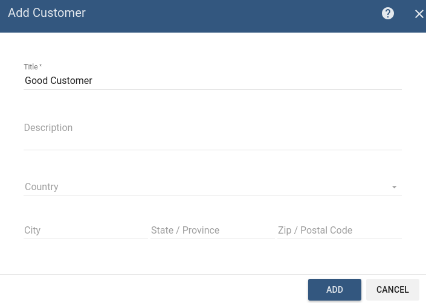
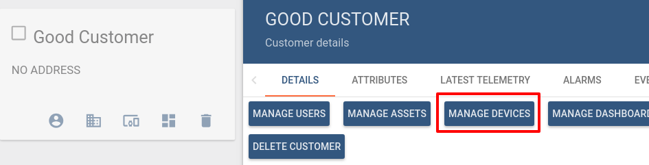
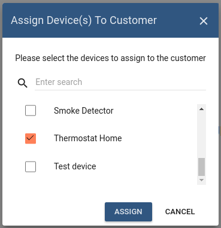
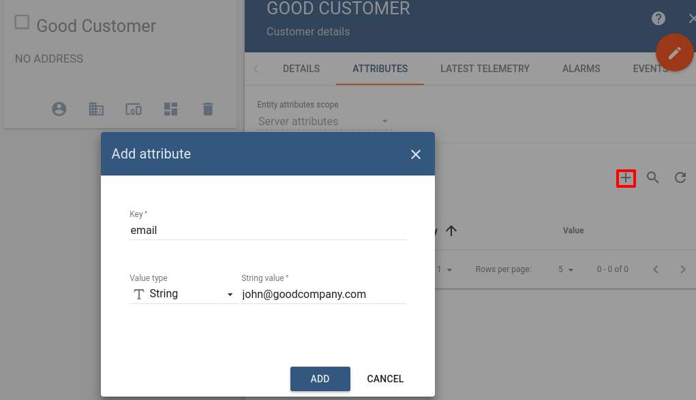
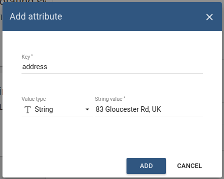
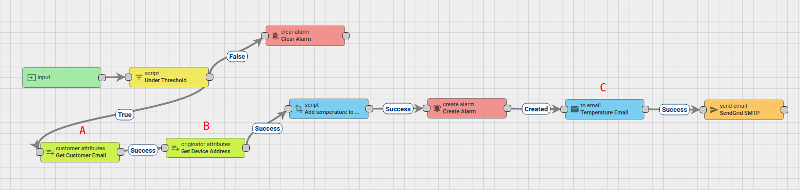
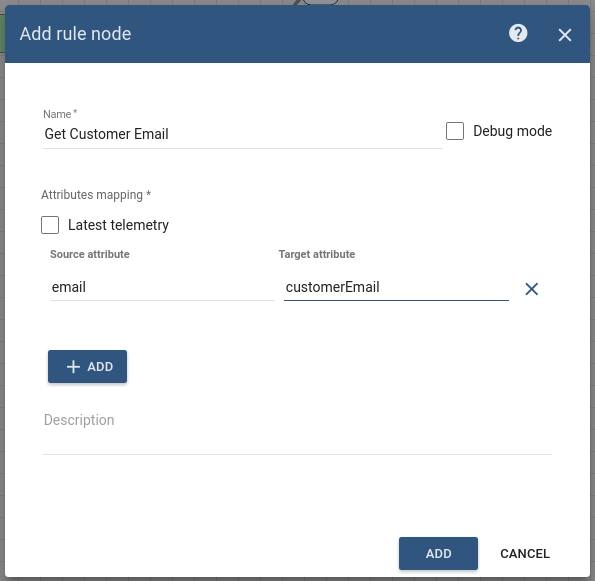
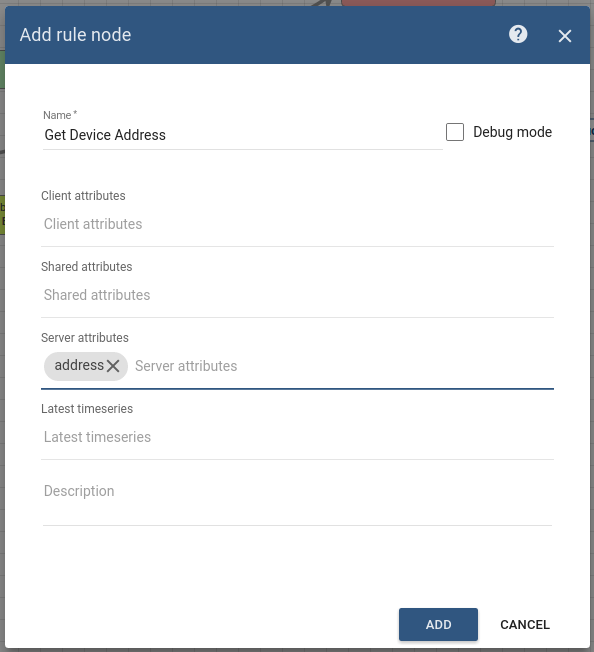
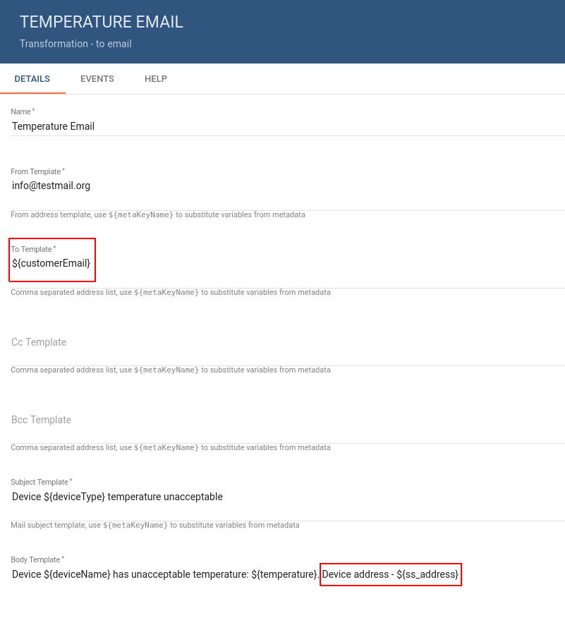

# send-email-to-customer

This Tutorial is to show you how to send an Email to the customer using the Rule Engine.

* TOC

  {:toc}

**Note:**

This tutorial is based on the [send email on alarm](https://github.com/caoyingde/thingsboard.github.io/tree/9437083b88083a9b2563248432cbbe460867fbaf/docs/user-guide/rule-engine-2-0/tutorials/send-email/README.md#use-case) tutorial and it's use case. We will reuse the rule chains from the above-mentioned tutorial and will add a few more rule nodes to send email to the customer of the assigned device.

## Use case

Let's assume your device is using DHT22 sensor to collect and push temperature readings to ThingsBoard. DHT22 sensor is good for -40 to 80°C temperature readings.We want to generate Alarms if temperature is out of good range and send the email when the alarm was created.

In this tutorial we will configure ThingsBoard Rule Engine to:

* Send an email to the customer of the assigned device if the temperature was out of range, namely: less than -40 and more than 80 degrees.
* Add message originator attributes to the message.
* Add additional data to the email body using Script Transform node from the incoming message.

## Prerequisites

We assume you have completed the following guides and reviewed the articles listed below:

* [Getting Started](https://github.com/caoyingde/thingsboard.github.io/tree/9437083b88083a9b2563248432cbbe460867fbaf/docs/getting-started-guides/helloworld/README.md) guide.
* [Rule Engine Overview](https://github.com/caoyingde/thingsboard.github.io/tree/9437083b88083a9b2563248432cbbe460867fbaf/docs/user-guide/rule-engine-2-0/overview/README.md).
* [Create & Clear alarms](https://github.com/caoyingde/thingsboard.github.io/tree/9437083b88083a9b2563248432cbbe460867fbaf/docs/user-guide/rule-engine-2-0/tutorials/create-clear-alarms/README.md) guide.
* [Send email on alarm](https://github.com/caoyingde/thingsboard.github.io/tree/9437083b88083a9b2563248432cbbe460867fbaf/docs/user-guide/rule-engine-2-0/tutorials/send-email/README.md) guide.

## Create customer and assign device

First of all, we need to create Customer and assign device to customer. The following screenshots show you how to do this:

Customer created. Now we need to assign device **Thermostat Home**\(the creation of which was described in the [Create & clear alarms](https://github.com/caoyingde/thingsboard.github.io/tree/9437083b88083a9b2563248432cbbe460867fbaf/docs/user-guide/rule-engine-2-0/tutorials/create-clear-alarms/README.md#adding-the-device) tutorial\) to the customer.  
 Go to **Manage devices** on Customer page and select our device

Next our customer should have **server scope** attribute **email**. Note that email will be sent to this email, so write your email for testing.

Also we need add server scope attribute - **address** to our device **Thermostat Home**:   

Go to **Devices** -&gt; **Thermostat Home** -&gt; **Attributes** -&gt; **Server attributes** and press **+** button to add **address**

## Message flow

In this section, we explain the purpose of each node that was added or modified to initial rule chains in this tutorial:

* Node A: [**Customer attributes**](https://github.com/caoyingde/thingsboard.github.io/tree/9437083b88083a9b2563248432cbbe460867fbaf/docs/user-guide/rule-engine-2-0/enrichment-nodes/README.md#customer-attributes) node.
  * This node will be used for taking email attribute of the customer and save it in Message Metadata property customerEmail
* Node B: [**Originator attributes**](https://github.com/caoyingde/thingsboard.github.io/tree/9437083b88083a9b2563248432cbbe460867fbaf/docs/user-guide/rule-engine-2-0/enrichment-nodes/README.md#originator-attributes) node.
  * This node will be used for taking address server scope attribute of the originator \(device is an originator of the incoming message\) and save it in the Message Metadata.    
* Node C: [**To Email**](https://github.com/caoyingde/thingsboard.github.io/tree/9437083b88083a9b2563248432cbbe460867fbaf/docs/user-guide/rule-engine-2-0/transformation-nodes/README.md#to-email-node) node.
  * This node builds actual email from the configured template.
* Node D: **Rule Chain** node.
  * Forwards incoming Message to specified Rule Chain **Create/Clear Alarm & Send Email to Customer**.     

## Configure Rule Chains

In this tutorial, we used Rule Chains from [send email on alarm](https://github.com/caoyingde/thingsboard.github.io/tree/9437083b88083a9b2563248432cbbe460867fbaf/docs/user-guide/rule-engine-2-0/tutorials/send-email/README.md) tutorial. We modified Rule Chain **Create/Clear Alarm & Send Email** by adding nodes that was described above in the section [Message flow](https://github.com/caoyingde/thingsboard.github.io/tree/9437083b88083a9b2563248432cbbe460867fbaf/docs/user-guide/rule-engine-2-0/tutorials/send-email-to-customer/README.md#message-flow)  
 and renamed this rule chain to: **Create/Clear Alarm & Send Email to Customer**.

  
The following screenshots show how the above Rule Chains should look like:

* **Create/Clear Alarm & Send Email to Customer:**

* **Root Rule Chain:**

Download the attached json [**file**](https://github.com/caoyingde/thingsboard.github.io/tree/9437083b88083a9b2563248432cbbe460867fbaf/docs/user-guide/rule-engine-2-0/tutorials/resources/create_clear_alarm___send_email_to_customer.json) for the **Create/Clear Alarm & Send Email to Customer:** rule chain. Create Node **D** as shown on the image above in the root rule chain to forward telemetry to the imported rule chain.

The following section shows you how to modify this rule chain, specifically: add rule nodes [**A**](https://github.com/caoyingde/thingsboard.github.io/tree/9437083b88083a9b2563248432cbbe460867fbaf/docs/user-guide/rule-engine-2-0/tutorials/send-email-to-customer/README.md#node-a-customer-attributes) and [**B**](https://github.com/caoyingde/thingsboard.github.io/tree/9437083b88083a9b2563248432cbbe460867fbaf/docs/user-guide/rule-engine-2-0/tutorials/send-email-to-customer/README.md#node-b-originator-attributes) and modify node [**C**](https://github.com/caoyingde/thingsboard.github.io/tree/9437083b88083a9b2563248432cbbe460867fbaf/docs/user-guide/rule-engine-2-0/tutorials/send-email-to-customer/README.md#node-c-to-email).   

### Modify **Create & Clear Alarms with details:**

#### Modify the required nodes

In this rule chain, you will add 2 nodes and modify 1 node as it will be explained in the following sections:

**Node A: Customer attributes**

* Add the **Customer attributes** node and connect it to the **Filter Script** node with a relation type **True**.  
   This node will be used for taking **email** attribute of the customer and save it in Message Metadata property **customerEmail**

  * Fill in the fields with the input data shown in the following table: 

  | Field | Input Data |
  | :--- | :--- |
  | Name | Get Customer Email |
  | Source attribute | email |
  | Target attribute | customerEmail |

**Node B: Originator attributes**

* Add the **Originator attributes** node and pastes it between the nodes: **Customer attributes** and **Create alarm** with a relation type **Success**.  
   This node will be used for taking address server scope attribute of the originator **\(Thermostat Home\)**. This attribute will be saved in the Message Metadata property ss\_address.

  * Fill in the fields with the input data shown in the following table: 

  | Field | Input Data |
  | :--- | :--- |
  | Name | Get Device Address |
  | Server attributes | address |

**Node C: To Email**

* Modify the **To Email** node. For this, we need change some fields in details of this node, namely:
  * **To template**.
  * **Body tempalte**.
* Fill in the fields with the input data shown in the following table:

| Field | Input Data |
| :--- | :--- |
| To template | ${customerEmail} |
| Body tempalte | Device ${deviceName} has unacceptable temperature: ${temperature}. Device address - ${ss\_address} |

## Post telemetry and verify

For posting device telemetry we will use the Rest APIs, [Telemetry upload APIs](https://github.com/caoyingde/thingsboard.github.io/tree/9437083b88083a9b2563248432cbbe460867fbaf/docs/reference/http-api/README.md#telemetry-upload-api). For this we will need to copy device access token from then device **Thermostat Home**.

Lets post temperature = 99. Mail should be sent:

You should understand that message won't be sent to the email when the alarm was updated, only in the case when alarm will be created.

Finally we can see that email was received with correct values. \(Please check your spam folder if you did not receive any email\)

Also, you can see the more information about how to:

* define other additional logic for alarm processing, for example, sending notification to Telegram App using Telegram Bot.
* configure Alarm Details function in the Create and Clear Alarm nodes and configure the Dashboard by adding an alarm widget to visualize the alarms..
* create alarm when device is offline.

Please refer to the links under the **See Also** section to see how to do this.

## See Also

* [Notifications and Alarms on your smartphone using Telegram Bot](https://github.com/caoyingde/thingsboard.github.io/tree/9437083b88083a9b2563248432cbbe460867fbaf/docs/iot-gateway/integration-with-telegram-bot/README.md) guide
* [Create alarm with details](https://github.com/caoyingde/thingsboard.github.io/tree/9437083b88083a9b2563248432cbbe460867fbaf/docs/user-guide/rule-engine-2-0/tutorials/create-clear-alarms-with-details/README.md) guide.
* [Create Alarm when the Device is offline](https://github.com/caoyingde/thingsboard.github.io/tree/9437083b88083a9b2563248432cbbe460867fbaf/docs/user-guide/rule-engine-2-0/tutorials/create-inactivity-alarm/README.md) guide.

## Next steps

