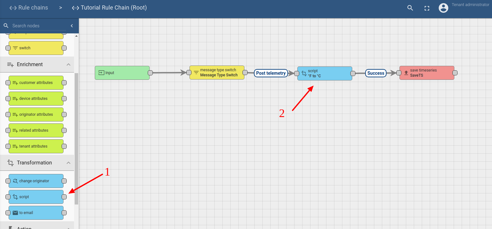
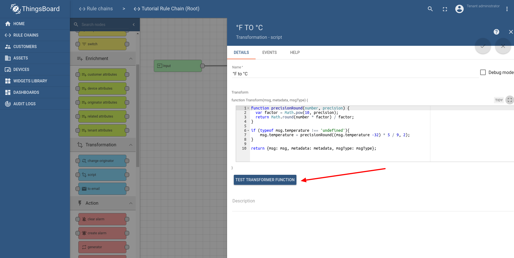
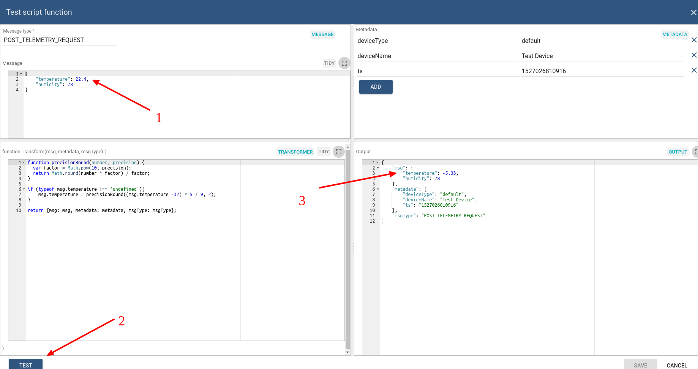
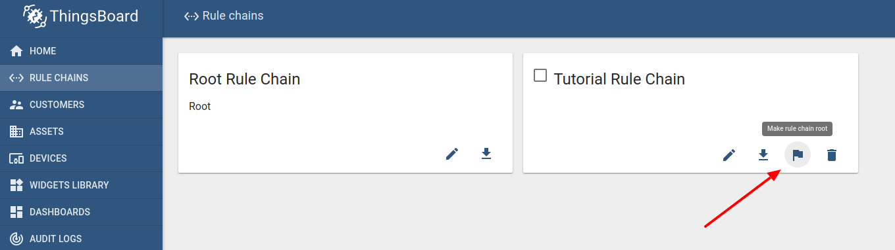

# transform-incoming-telemetry

* TOC

  {:toc}

## Use case

Let's assume your device is using custom sensor to collect and push temperature readings to ThingsBoard. This sensor collects temperature readings in °F and you would like to convert them to °C before storage into the database and visualization.

In this tutorial we will configure ThingsBoard Rule Engine to modify temperature readings according to a formula:

```text
[°C] = ([°F] - 32) × 5/9.
```

## Prerequisites

We assume you have completed the following guides and reviewed the articles listed below:

* [Getting Started](https://github.com/caoyingde/thingsboard.github.io/tree/9437083b88083a9b2563248432cbbe460867fbaf/docs/getting-started-guides/helloworld/README.md) guide.
* [Rule Engine Overview](https://github.com/caoyingde/thingsboard.github.io/tree/9437083b88083a9b2563248432cbbe460867fbaf/docs/user-guide/rule-engine-2-0/overview/README.md).

## Step 1: Adding temperature transformation node

We will modify default rule chain and will add [**transformation**](https://github.com/caoyingde/thingsboard.github.io/tree/9437083b88083a9b2563248432cbbe460867fbaf/docs/user-guide/rule-engine-2-0/transformation-nodes/README.md#script-transformation-node) rule node with temperature transformation script. We will place this rule node between default "message type switch" and "save timeseries" rule nodes. Please note that we have removed irrelevant rule nodes from the root rule chain as well.



Let's assume the data that arrive to a system may or may not have the "temperature" field. We will treat all data that does not have "temperature" field as valid. In order to do this we will use the following function

```javascript
function precisionRound(number, precision) {
  var factor = Math.pow(10, precision);
  return Math.round(number * factor) / factor;
}

if (typeof msg.temperature !== 'undefined'){
    msg.temperature = precisionRound((msg.temperature -32) * 5 / 9, 2);
}

return {msg: msg, metadata: metadata, msgType: msgType};
```

## Step 2: Validation script debugging

Let's check that our script is correct by using built-in "Test transformer function" button





You can check few more cases, for example when temperature is not set.

## TL;DR

Download and import attached json [**file**](https://github.com/caoyingde/thingsboard.github.io/tree/9437083b88083a9b2563248432cbbe460867fbaf/docs/user-guide/resources/transformation-rule-chain.json) with a rule chain from this tutorial. Don't forget to mark new rule chain as "root".



## Next steps

