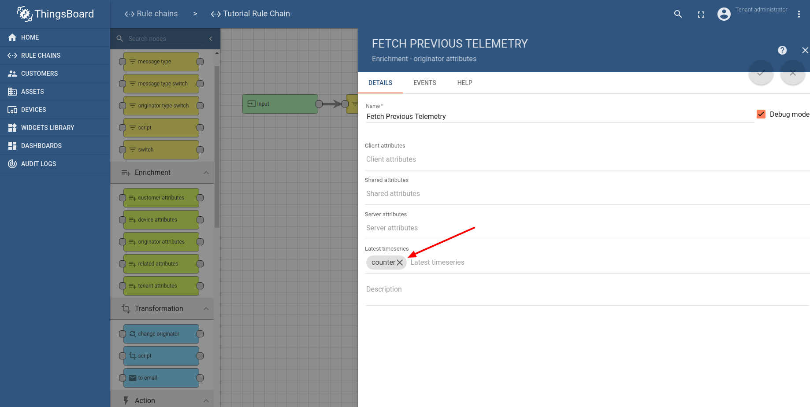
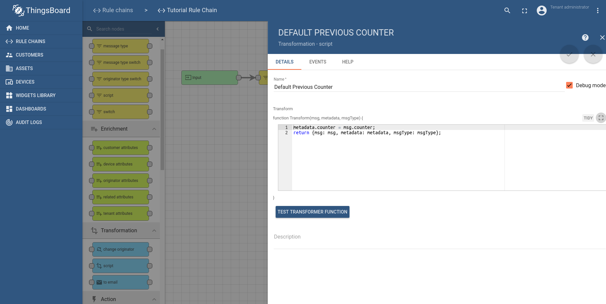
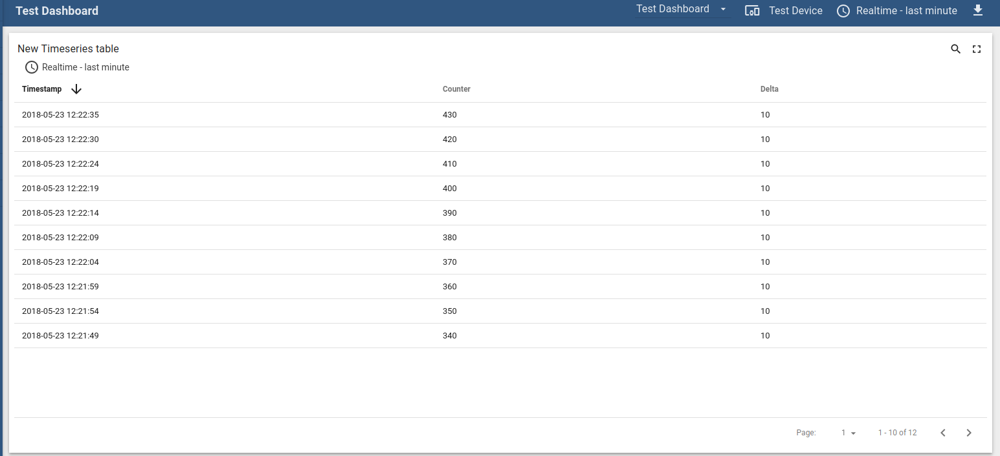

# transform-telemetry-using-previous-record

* TOC

  {:toc}

## Use case

Let's assume your device is reporting absolute "counter" that correspond to water consumption. However, you would like to visualize not the "absolute" but "delta" values, e.g. how many water was consumer within last day, week, month.

In this tutorial we will calculate "delta" of the counter readings based on current and previous reading.

Assuming that previous reported value of counter was 90, we will transform incoming telemetry:

```javascript
{
  "counter": 100
}
```

to

```javascript
{
  "counter": 100,
  "delta": 10
}
```

## Prerequisites

We assume you have completed the following guides and reviewed the articles listed below:

* [Getting Started](https://github.com/caoyingde/thingsboard.github.io/tree/9437083b88083a9b2563248432cbbe460867fbaf/docs/getting-started-guides/helloworld/README.md) guide.
* [Rule Engine Overview](https://github.com/caoyingde/thingsboard.github.io/tree/9437083b88083a9b2563248432cbbe460867fbaf/docs/user-guide/rule-engine-2-0/overview/README.md).
* [Transform Incoming Telemetry](https://github.com/caoyingde/thingsboard.github.io/tree/9437083b88083a9b2563248432cbbe460867fbaf/docs/user-guide/rule-engine-2-0/tutorials/transform-incoming-telemetry/README.md) guide.

## Step 1: Adding enrichment node

We will modify default rule chain and will an [**enrichment**](https://github.com/caoyingde/thingsboard.github.io/tree/9437083b88083a9b2563248432cbbe460867fbaf/docs/user-guide/rule-engine-2-0/enrichment-nodes/README.md#originator-attributes) rule node to fetch previous telemetry value from the database and put it to the message metadata.


We will use the following node configuration:



Please note that if the "counter" value is missing, the rule node will return failure. We will protect from this failure by setting the default previous counter on the next step.

## Step 2: Default previous counter node

This [**transformation**](https://github.com/caoyingde/thingsboard.github.io/tree/9437083b88083a9b2563248432cbbe460867fbaf/docs/user-guide/rule-engine-2-0/transformation-nodes/README.md#script-transformation-node) node will set the default counter to the metadata from the incoming message. This will be used to set default "delta" value to 0 on the next step.



## Step 3: Delta transformation node

This [**transformation**](https://github.com/caoyingde/thingsboard.github.io/tree/9437083b88083a9b2563248432cbbe460867fbaf/docs/user-guide/rule-engine-2-0/transformation-nodes/README.md#script-transformation-node) node will calculate delta based on previous counter value from the metadata and current value from the message.


## Step 4: Setup dashboard to view the data

We have added simple card widget to show the latest values generated by the rule chain



## TL;DR

Download and import attached json [**file**](https://github.com/caoyingde/thingsboard.github.io/tree/9437083b88083a9b2563248432cbbe460867fbaf/docs/user-guide/resources/previous-telemetry-rule-chain.json) with a rule chain from this tutorial. Don't forget to mark new rule chain as "root".


Download and import attached json [**file**](https://github.com/caoyingde/thingsboard.github.io/tree/9437083b88083a9b2563248432cbbe460867fbaf/docs/user-guide/resources/previous-telemetry-dashboard.json) with a dashboard from this tutorial.

## Next steps

