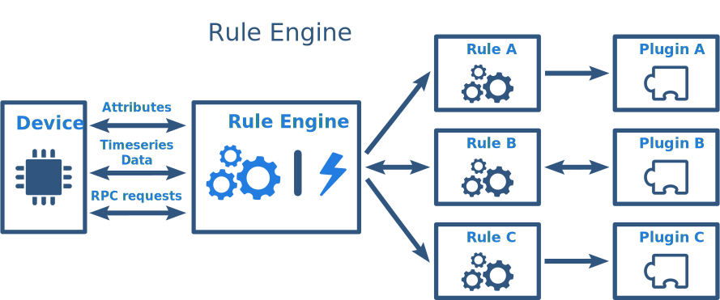
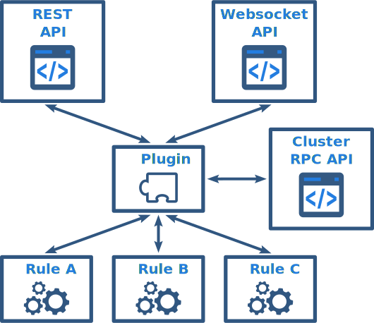
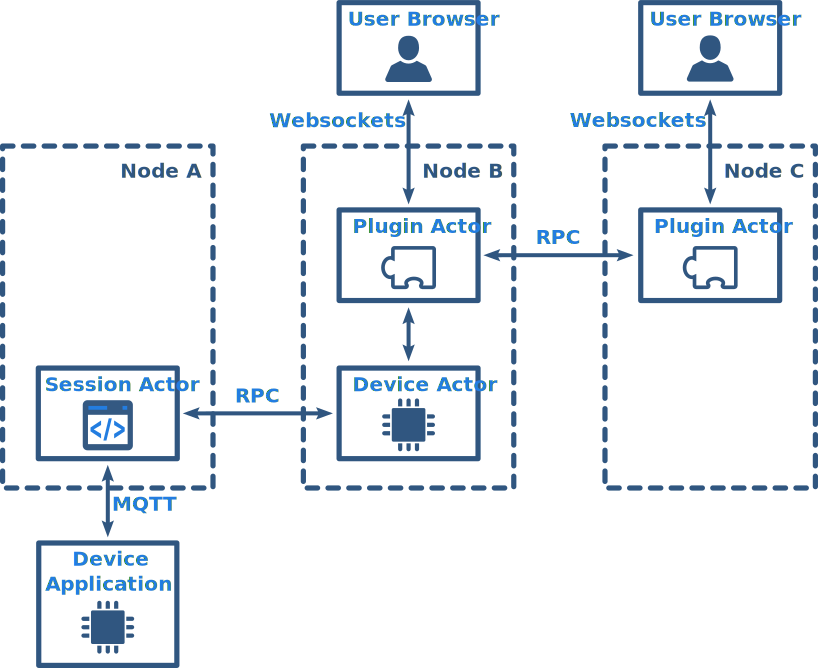

# rule-engine

* TOC

  {:toc}

Rule engine allows you to process messages from devices with a configurable set of rules. With Rule Engine you can:

* send an email when device attribute changes.
* create an alarm when telemetry value exceeds a certain threshold.
* forward telemetry data to Kafka, RabbitMQ or external RESTful server.
* and much more using other rules and plugins.

**Please Note** we recommend to get familiar with basic ThingsBoard features - \( [Attributes](https://github.com/caoyingde/thingsboard.github.io/tree/9437083b88083a9b2563248432cbbe460867fbaf/docs/user-guide/attributes/README.md), [Telemetry](https://github.com/caoyingde/thingsboard.github.io/tree/9437083b88083a9b2563248432cbbe460867fbaf/docs/user-guide/telemetry/README.md) and [RPC](https://github.com/caoyingde/thingsboard.github.io/tree/9437083b88083a9b2563248432cbbe460867fbaf/docs/user-guide/rpc/README.md) \) before you proceed.

Rule engine operates with two main components: Rules and Plugins. The job of Rule Engine is to sequentially apply configured rules to incoming messages. Although rules are applied sequentially, rule execution is asynchronous and is based on [actors](http://akka.io/). This allows processing of messages from the device in the same order in which they are received without sacrificing performance.

The results of processing may or may not be delivered back to device application. This depends on rule configuration. For example, you may push incoming telemetry data to internal Cassandra DB, and simultaneously send it to Kafka. You are able to configure to ignore Kafka errors or report an error back to the device. In this case, the device may either retry the operation, re-send the data to a different server or simply ignore the error.



## Rule vs Plugin

We will review following example to explain the difference between Rule and Plugin. Let's assume you want to send an email to an engineer when the engine temperature is too high. In this case, Rule is responsible for analyzing telemetry data and building email \(body, to, cc, etc\). However, the plugin is responsible for actual communication with the email server and sending emails. So, multiple rules may use the same email plugin that is configured once.

## Scopes

Rules and Plugins may be operating on _System_ and _Tenant_ levels.

**System** level rules and plugins are managed by System Administrator. They process messages from all devices.

**Tenant** level rules and plugins are managed by corresponding Tenant Administrator. They process messages from devices that belong to particular tenant. Tenant level rules are able to target system level plugins. For example, you can configure plugin that sends notifications on the system level. You will need to specify your email account in the plugin configuration. However, all tenant level rules may use this plugin to send email notifications.

## Lifecycle

ThingsBoard Rules and Plugins components have same lifecycle events:

* Created - component is provisioned, but is not processing any messages yet.
* Activated - component is able to receive and process new device messages. 
* Suspended - component is not able to receive new device messages. 
* Deleted - component is stopped and deleted from the database.

## Rules

ThingsBoard Rule consists of three main components: Filters, Processor and Action. Depending on implementation, each component may require certain configuration before it can be used. In order to configure Rule, you need to specify at least one filter and one action. Rule Processors are optional.

Let's review role of each component.

### Filters

Rule Filter is responsible for filtering incoming messages. You can treat it as a boolean function that has device attributes and message as parameters:

```java
   boolean filter(DeviceAttributes attributes, FromDeviceMessage message)
```

ThingsBoard provides the following Rule filters out of the box:

* [Message Type Filter](https://github.com/caoyingde/thingsboard.github.io/tree/9437083b88083a9b2563248432cbbe460867fbaf/docs/reference/filters/message-type-filter/README.md) - allows to filter incoming messages by type.
* [Device Attributes Filter](https://github.com/caoyingde/thingsboard.github.io/tree/9437083b88083a9b2563248432cbbe460867fbaf/docs/reference/filters/device-attributes-filter/README.md) - allows to filter incoming messages based on current device attributes. 

  You can define filter using javascript. See filter documentation for more details. 

* [Device Telemetry Filter](https://github.com/caoyingde/thingsboard.github.io/tree/9437083b88083a9b2563248432cbbe460867fbaf/docs/reference/filters/device-telemetry-filter/README.md) - allows to filter incoming "Post Telemetry" message based on it's values. 

  You can define filter using javascript. See filter documentation for more details.

* [Method Name Filter](https://github.com/caoyingde/thingsboard.github.io/tree/9437083b88083a9b2563248432cbbe460867fbaf/docs/reference/filters/method-name-filter/README.md) - allows to filter incoming "RPC Request" message based on it's method name.

Single Rule may contain multiple filters. Usually, one can filter based on message type and device attributes first and then apply additional filtering based on content of the message.

### Processors

Rule Processor is responsible for processing incoming message and adding metadata to it. You can treat it as a function that has device attributes and message as parameters and returns certain metadata:

```java
   MessageMetadata process(DeviceAttributes attributes, FromDeviceMessage message)
```

ThingsBoard provides the following Rule processors out of the box:

* [Alarm Deduplication Processor](https://github.com/caoyingde/thingsboard.github.io/tree/9437083b88083a9b2563248432cbbe460867fbaf/docs/reference/processors/alarm-deduplication-processor/README.md) generates and persists unique alarms. 

  Populates certain metadata tag to identify new alarms. See filter documentation for more details.

### Actions

Plugin Action is responsible for converting incoming message and metadata to new custom message that is forwarded to certain plugin. Action may be **oneway** or **twoway**. In case of _oneway_ action, rule is not expecting any reply from plugin. In case of _twoway_ action, rule is expecting a reply from plugin within a certain timeout. If there is no reply within a configured timeout, Rule will report an error to the device.

For example, storing data into the internal storage is _twoway_ action, however, pushing data into external system may be _oneway_ \(optional\).

Although particular Action is a part of the corresponding Rule, you can also treat it as part of the corresponding Plugin. So, you can treat an action as the following interface between Rule and Plugin:

```java
   RuleToPluginMessage<T> convert(DeviceAttributes attributes, FromDeviceMessage message, MessageMetadata metadata)

   ToDeviceMsg convert(PluginToRuleMsg<T> message)

   boolean isOneWay()
```

ThingsBoard provides the following Actions out of the box:

* [Telemetry Plugin Action](https://github.com/caoyingde/thingsboard.github.io/tree/9437083b88083a9b2563248432cbbe460867fbaf/docs/reference/actions/telemetry-plugin-action/README.md) - system action that push data to system [Telemetry Plugin](https://github.com/caoyingde/thingsboard.github.io/tree/9437083b88083a9b2563248432cbbe460867fbaf/docs/reference/plugins/telemetry/README.md). 
* [Send Mail Action](https://github.com/caoyingde/thingsboard.github.io/tree/9437083b88083a9b2563248432cbbe460867fbaf/docs/reference/actions/send-mail-action/README.md) - action that allows to send emails. You can specify templates for email body and recipients. 

  During templates evaluation, you may substitute device attributes and data from incoming messages. See action documentation for more details.

* [Kafka Plugin Action](https://github.com/caoyingde/thingsboard.github.io/tree/9437083b88083a9b2563248432cbbe460867fbaf/docs/reference/actions/kafka-plugin-action/README.md) - action that allows to push messages to kafka topics. You can specify template for message body. 

  During templates evaluation you may substitute device attributes and data from incoming messages. See action documentation for more details.

* [RabbitMQ Plugin Action](https://github.com/caoyingde/thingsboard.github.io/tree/9437083b88083a9b2563248432cbbe460867fbaf/docs/reference/actions/rabbitmq-plugin-action/README.md) - similar to Kafka action but pushes data to RabbitMQ.    
* [REST API Call Plugin Action](https://github.com/caoyingde/thingsboard.github.io/tree/9437083b88083a9b2563248432cbbe460867fbaf/docs/reference/actions/rest-api-call-plugin-action/README.md) - similar to Kafka action but executes a REST API call.
* [RPC Plugin Action](https://github.com/caoyingde/thingsboard.github.io/tree/9437083b88083a9b2563248432cbbe460867fbaf/docs/reference/actions/rpc-plugin-action/README.md) - forwards device RPC call to corresponding plugin.

## Plugins

ThingsBoard Plugins allow you to configure and customize system behavior. Although plugins are able to process messages from Rules, they also provide APIs to integrate with your server-side applications. With Plugin you can:

* process messages from devices
* process REST API calls from server side applications
* communicate with server-side applications using websockets.
* communicate between instances of the same plugin in the ThingsBoard cluster using asynchronous RPC calls.
* persist and query events, telemetry data, and device attributes.

  

As we already discussed, Rules may communicate with Plugins using [Actions](rule-engine.md#actions). Let's review other Plugin APIs.

### REST API

Plugins are able to process REST API calls from authorized users - customers and system or tenant administrators. This may be useful for server-side integrations. For example, System RPC Plugin allows executing RPC calls to devices using REST API.

### Websocket API

Plugins are able to handle websocket messages from authorized users - customers and system or tenant administrators. This may be useful for integrations with server-side applications that want to receive real-time updates. For example, System Telemetry Plugin allows subscribing to device attributes and timeseries data changes using websockets.

### Clustering API

When plugin is provisioned, ThingsBoard creates an instance of the plugin actor on each ThingsBoard server in the cluster. In order to implement complex use-cases, plugin instances may require a way to communicate with each other.

For example, let's assume that we have a three node cluster \(nodes A, B and C\). A device may be connected via MQTT session to node A. Customer users may open a Web UI to observe telemetry data in real time and load balancer will forward their browsers to different nodes \(B and C in our case\). Telemetry plugin needs to keep track of websocket subscriptions for particular device in order to push update to customer's browser.



ThingsBoard Clustering and Actor models are covered in ThingsBoard Architecture.

[ThingsBoard Architecture](https://github.com/caoyingde/thingsboard.github.io/tree/9437083b88083a9b2563248432cbbe460867fbaf/docs/reference/architecture/README.md)

### Implementations

ThingsBoard provides the following Plugins out of the box:

* [Telemetry Plugin](https://github.com/caoyingde/thingsboard.github.io/tree/9437083b88083a9b2563248432cbbe460867fbaf/docs/reference/plugins/telemetry/README.md) - system plugin that is responsible for processing various requests 

  related to device attributes and telemetry.

* [RPC Plugin](https://github.com/caoyingde/thingsboard.github.io/tree/9437083b88083a9b2563248432cbbe460867fbaf/docs/reference/plugins/rpc/README.md) - allows to execute RPC calls to devices using REST API. RPC call will be delivered to device using supported network protocols.
* [Device Messaging Plugin](https://github.com/caoyingde/thingsboard.github.io/tree/9437083b88083a9b2563248432cbbe460867fbaf/docs/reference/plugins/messaging/README.md) - allows devices that are assigned to the same customer exchange events.
* [Send Mail Plugin](https://github.com/caoyingde/thingsboard.github.io/tree/9437083b88083a9b2563248432cbbe460867fbaf/docs/reference/plugins/mail/README.md) - allows to send emails. You can specify mail server properties. See plugin documentation for more details.
* [Kafka Plugin](https://github.com/caoyingde/thingsboard.github.io/tree/9437083b88083a9b2563248432cbbe460867fbaf/docs/reference/plugins/kafka/README.md) - allows to push telemetry messages to Apache Kafka. See plugin documentation for more details.
* [RabbitMQ Plugin](https://github.com/caoyingde/thingsboard.github.io/tree/9437083b88083a9b2563248432cbbe460867fbaf/docs/reference/plugins/rabbitmq/README.md) - allows to push telemetry messages to RabbitMQ. See plugin documentation for more details.
* [REST API Call Plugin](https://github.com/caoyingde/thingsboard.github.io/tree/9437083b88083a9b2563248432cbbe460867fbaf/docs/reference/plugins/rest/README.md) - allows to push telemetry messages to external servers using REST API. See plugin documentation for more details.
* [Time RPC Plugin](https://github.com/caoyingde/thingsboard.github.io/tree/9437083b88083a9b2563248432cbbe460867fbaf/docs/reference/plugins/time/README.md) - allows to send RPC requests from device to get current server-side timestamp.

## Troubleshooting and statistics

ThingsBoard keeps track of usage statistics, errors and lifecycle events for each rule and plugin.

### Statistics

ThingsBoard collects and periodically persists usage statistics to internal database. You can review this statistics via [Web UI](https://github.com/caoyingde/thingsboard.github.io/tree/9437083b88083a9b2563248432cbbe460867fbaf/docs/user-guide/ui/rules/README.md) or get it using [REST API](https://github.com/caoyingde/thingsboard.github.io/tree/9437083b88083a9b2563248432cbbe460867fbaf/docs/reference/rest-api/README.md). Statistics contain an amount of successfully processed messages and amount of errors during processing.

### Errors

Whenever exception or error occurs, ThingsBoard persists it to the internal database. You can review this errors via [Web UI](https://github.com/caoyingde/thingsboard.github.io/tree/9437083b88083a9b2563248432cbbe460867fbaf/docs/user-guide/ui/rules/README.md) or get it using [REST API](https://github.com/caoyingde/thingsboard.github.io/tree/9437083b88083a9b2563248432cbbe460867fbaf/docs/reference/rest-api/README.md). In case of misconfiguration or critical issue with plugin, errors may happen quite frequently. Persisting all errors may significantly reduce performance, so you can [configure](https://github.com/caoyingde/thingsboard.github.io/tree/9437083b88083a9b2563248432cbbe460867fbaf/docs/user-guide/install/config/README.md) how often errors are persisted.

### Lifecycle events

Whenever plugin or rule [lifecycle event](rule-engine.md#lifecycle) happens, ThingsBoard persists it to the internal database. You can observe status of the lifecycle, stack trace in case of errors, event time and server address. In case of misconfiguration, you can easily detect the root cause by browsing the error stack trace.

