# scheduler

* TOC

  {:toc}

### Overview

ThingsBoard allows you to schedule various types of events with flexible schedule configuration. ThingsBoard Scheduler fires configured scheduler events according to their schedule. When scheduler event is fired the [Rule Engine Message](https://github.com/caoyingde/thingsboard.github.io/tree/9437083b88083a9b2563248432cbbe460867fbaf/docs/user-guide/rule-engine-2-0/overview/README.md#rule-engine-message) is generated from the event configuration which has a similar structure with a Rule Engine Message. Generated message is then forwarded to [Rule Engine](https://github.com/caoyingde/thingsboard.github.io/tree/9437083b88083a9b2563248432cbbe460867fbaf/docs/user-guide/rule-engine-2-0/re-getting-started/README.md) and processed starting from the [Root Rule Chain](https://github.com/caoyingde/thingsboard.github.io/tree/9437083b88083a9b2563248432cbbe460867fbaf/docs/user-guide/rule-engine-2-0/overview/README.md#rule-chain).

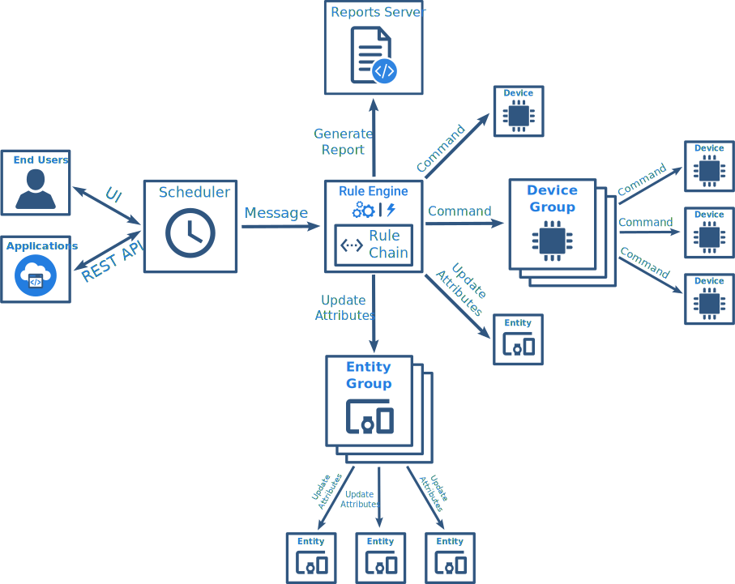

### Scheduler Administration

Tenant administrator and customer users are able to configure **Scheduler events** in ThingsBoard.

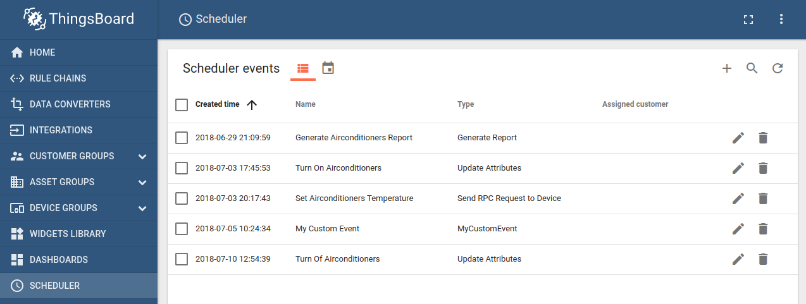

**Scheduler events** page displays current configured scheduler events. It allows to add, update or delete scheduler events. The page can be presented in two modes **List view** or **Calendar view**. The views can be switched by pressing corresponding icons in the page header.

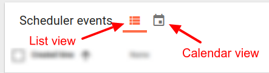

In the calendar view mode scheduler events are presented as labels according to their schedule.

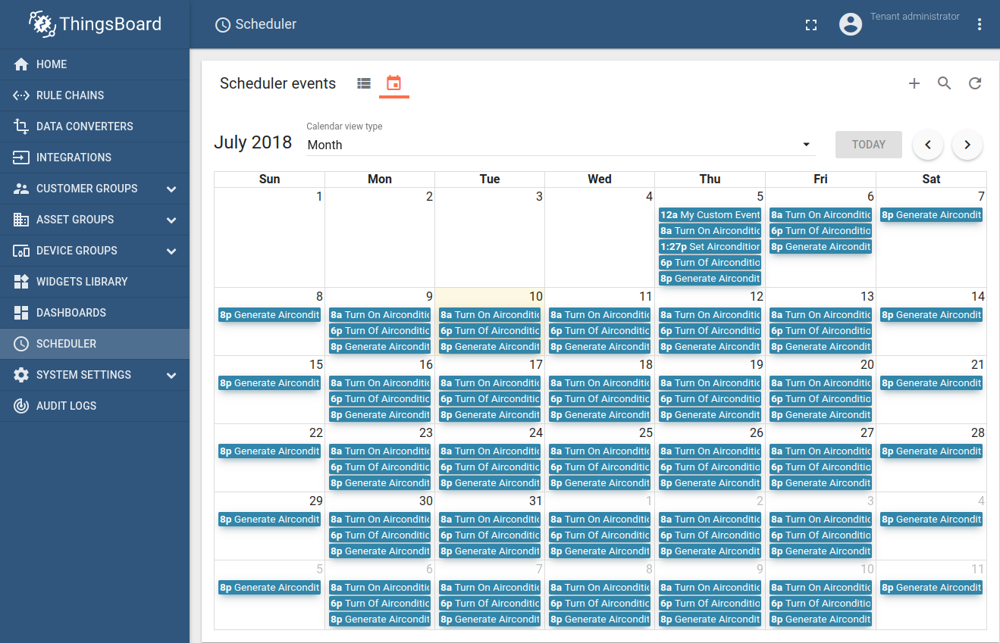

By default calendar view is presented as **Month** view type. **Calendar view type** dropdown allows to switch to other view types. The following view types can be selected:

* _Month / Week / Day / List Year / List Month / List Week / List Day / Agenda Week / Agenda Day_

New scheduler event can be created by clicking on `+` button in top right corner or by clicking on any cell of Calendar view.

#### Scheduler Event Dialog

Scheduler event edit dialog consist of two forms **Configuration** and **Schedule**.

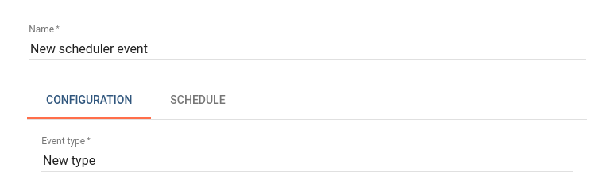

**Configuration** form allows to set event type and event configuration parameters according to selected event type. Configuration of scheduler event is described in [Scheduler Event Types](scheduler.md#scheduler-event-types) section.

**Schedule** form allows to setup event schedule configuration.

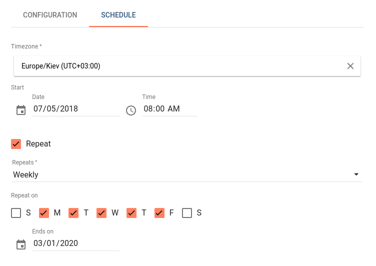

Schedule form has the following parameters:

* **Timezone** - timezone in which this scheduler event should be processed.
* **Start Date/Time** - date/time when this scheduler event should be fired.
* **Repeat** - if this scheduler event is one time or it should be repeated. 
* **Repeats** - repeat rule, can be either _Daily_ or _Weekly_.
* **Repeat on** - applicable for _Weekly_ repeat rule. Specifies weekdays when this scheduler event should be fired.
* **Ends on** - date until which this scheduler event should be repeated.

### Scheduler Event Types

In Configuration **Event type** field can be selected existing event type or specified custom one.

#### Custom Type

Custom type uses default scheduler event configuration form according to message structure.

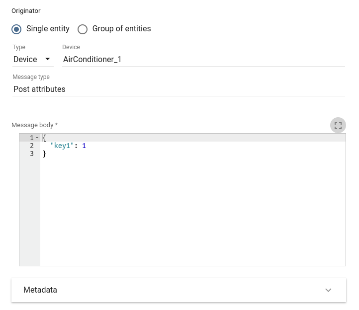

* **Originator** - message originator, can be _Single entity_ \(ex. Device, Asset etc.\) or [_Group of entities_](https://github.com/caoyingde/thingsboard.github.io/tree/9437083b88083a9b2563248432cbbe460867fbaf/docs/user-guide/groups/README.md). If not specified, scheduler event entity itself will be considered as originator.
* **Message type** - message type according to the Rule Engine message types. Can be [existing message type](https://github.com/caoyingde/thingsboard.github.io/tree/9437083b88083a9b2563248432cbbe460867fbaf/docs/user-guide/rule-engine-2-0/overview/README.md#predefined-message-types) or custom. If not specified, scheduler event type will be considered as message type. 
* **Message body** - message body in JSON representation.
* **Metadata** - key/value table representing message metadata fields.

#### Generate Report

Allows to schedule reports generation supported by [Reporting](https://github.com/caoyingde/thingsboard.github.io/tree/9437083b88083a9b2563248432cbbe460867fbaf/docs/user-guide/reporting/README.md#generate-report-rule-chain) feature.

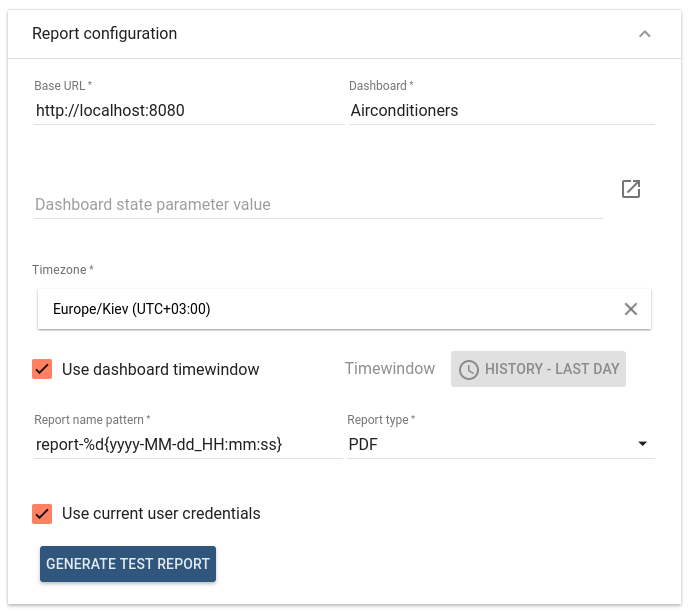

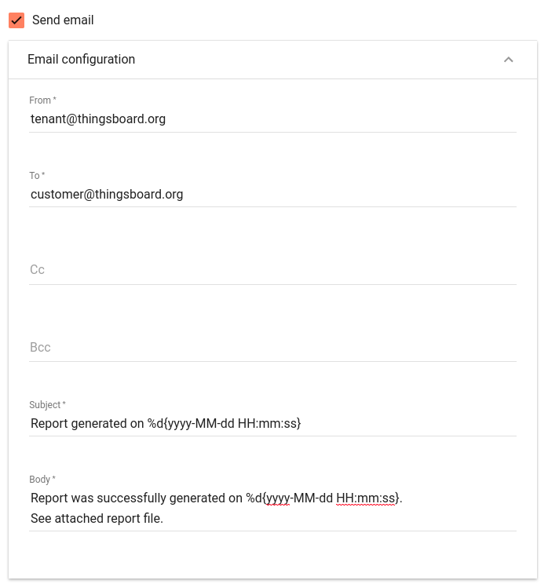

* **Report configuration**:
  * **Base URL** - base URL of ThingsBoard UI that should be accessible by Report Server.
  * **Dashboard** - dashboard that will be used for report generation.
  * **Dashboard state parameter value** - used to specify target dashboard state for report generation. Can be set automatically by clicking on right most button of the field and invoking **Select dashboard state** dialog.       
  * **Timezone** - timezone in which target dashboard will be presented in report.
  * **Use dashboard timewindow** - if set, timewindow configured in the target dashboard will be used during report generation.
  * **Timewindow** - specific dashboard timewindow that will be used during report generation.
  * **Report name pattern** - file name pattern of generated report, can contain date-time pattern in form of `%d{date-time pattern}`. See [SimpleDateFormat](https://docs.oracle.com/javase/8/docs/api/java/text/SimpleDateFormat.html) documentation for date-time pattern details.
  * **Report type** - report file type, can be _PDF \| PNG \| JPEG_.
  * **Use current user credentials** - if set, credentials of user created this report configuration will be used to open dashboard UI during report generation.
  * **Customer user credentials** - target customer user whose credentials will be used to open dashboard UI during report generation.
  * **Generate Test Report** button is used for testing purposes. It invokes report generation process with provided configuration. Resulting report file will be automatically downloaded if the report generation will be successful.
* **Send email** - if set, email message with report file in attachment will be sent.
* **Email configuration**:
  * **From** - from address
  * **To** - comma separated address list of recipients
  * **Cc** - comma separated address list
  * **Bcc** - comma separated address list
  * **Subject** - mail subject, can contain date-time pattern in form of `%d{date-time pattern}` according to [SimpleDateFormat](https://docs.oracle.com/javase/8/docs/api/java/text/SimpleDateFormat.html).
  * **Body** - mail body, can contain date-time pattern in form of `%d{date-time pattern}` according to [SimpleDateFormat](https://docs.oracle.com/javase/8/docs/api/java/text/SimpleDateFormat.html).

#### Update Attributes

Allows to schedule update of attributes for entity or group of entities.

* **Target** - target entity which attributes should be updated, can be _Single entity_ \(ex. Device, Asset etc.\) or [_Group of entities_](https://github.com/caoyingde/thingsboard.github.io/tree/9437083b88083a9b2563248432cbbe460867fbaf/docs/user-guide/groups/README.md).
* **Entity attributes scope** - [scope](https://github.com/caoyingde/thingsboard.github.io/tree/9437083b88083a9b2563248432cbbe460867fbaf/docs/user-guide/attributes/README.md#attribute-types) of updated attributes. Can be selected if Device entity type is specified in **Target**. Can be either **Server attributes** or **Shared attributes**. For all other entity types **Server attributes** scope is used. 
* **Server / Shared attributes** - key/value table representing attributes with values to update.

#### Send RPC Request to Device

Allows to schedule command \([RPC call](https://github.com/caoyingde/thingsboard.github.io/tree/9437083b88083a9b2563248432cbbe460867fbaf/docs/user-guide/rpc/README.md#server-side-rpc-api)\) to device or group of devices.

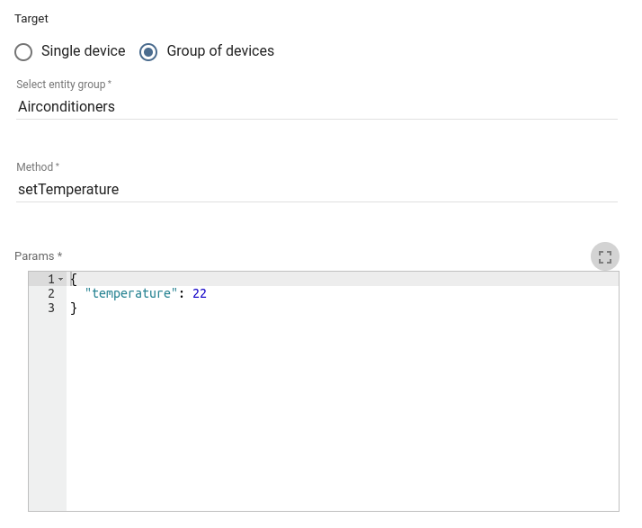

* **Target** - target device to which command should be sent, can be _Single device_ or [_Group of devices_](https://github.com/caoyingde/thingsboard.github.io/tree/9437083b88083a9b2563248432cbbe460867fbaf/docs/user-guide/groups/README.md).
* **Method** - RPC call method.
* **Params** - RPC call params in JSON representation.

### Scheduler Widget

ThingsBoard provides ability to manage scheduler events via **Scheduler events** or **Reports schedule** Widgets which is part of **Scheduling** Widgets Bundle.

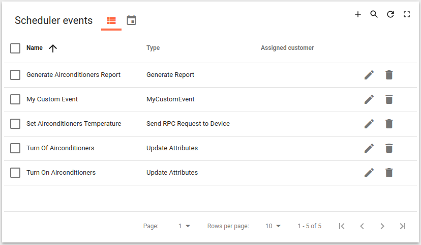

**Scheduler events** widget has same capabilities as [**Scheduler events** page](scheduler.md#scheduler-administration). Additionally it can be customized with predefined forms for custom scheduler event types. This can be achieved by configuring list of **Custom event types** in **Advanced** tab of widget configuration.

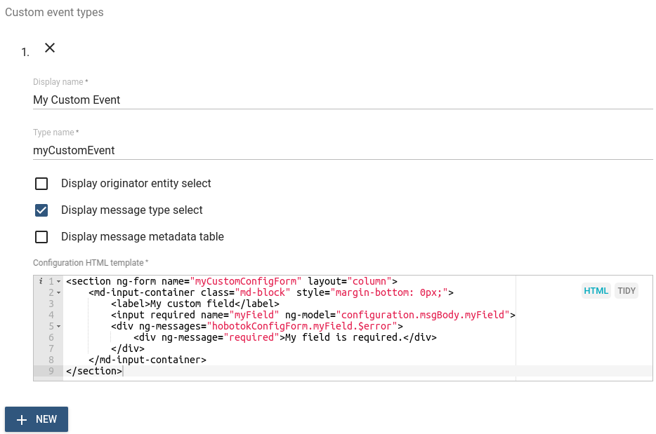

* **Display name** - display name of custom event type.
* **Type name** - internal name of custom event.
* **Display originator entity select** - whether to allow select originator in scheduler event configuration form.
* **Display message type select** - whether to allow select message type in scheduler event configuration form.
* **Display message metadata table** - whether to display metadata table in scheduler event configuration form.
* **Configuration HTML template** - HTML code used to generate custom event configuration form used to edit event configuration object.

## Next steps

