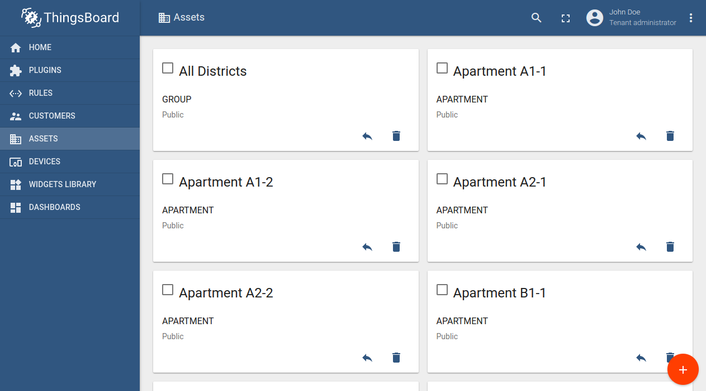
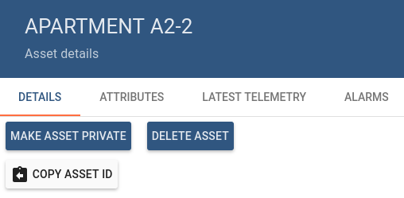
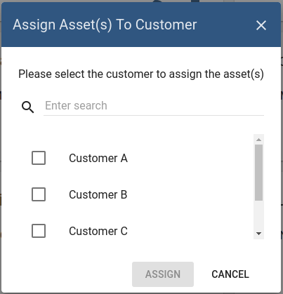
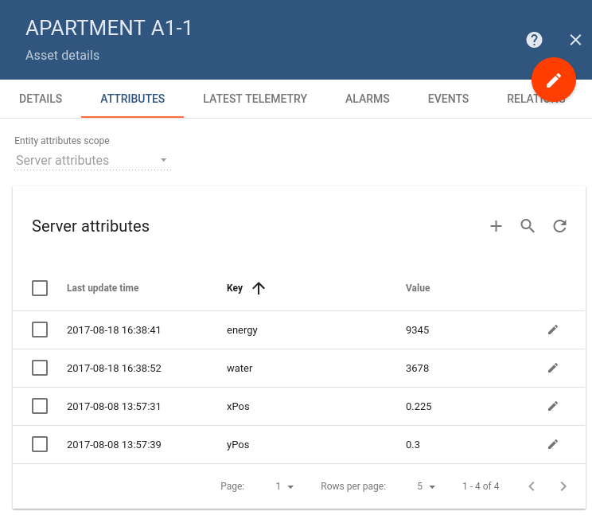
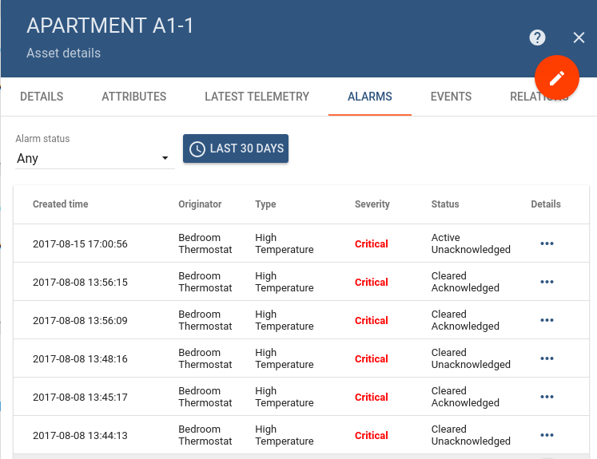
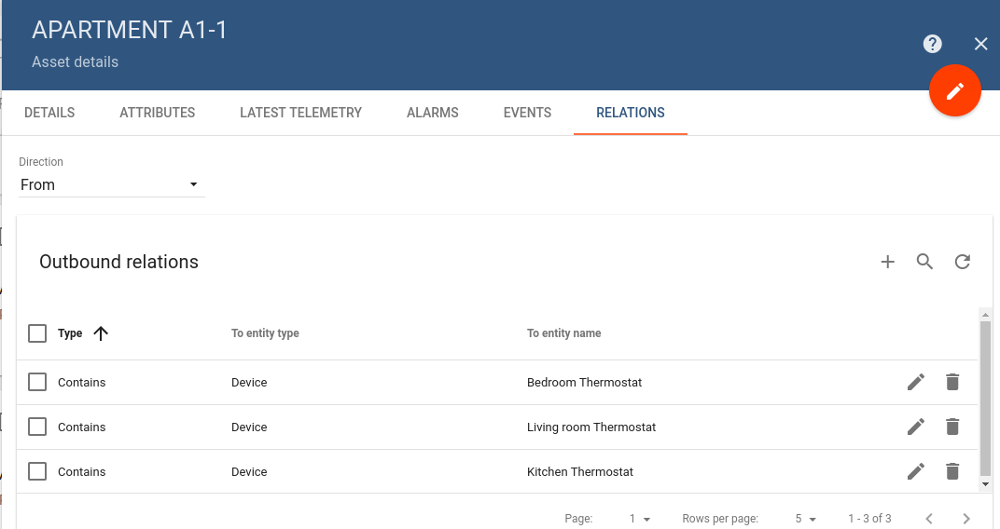

# assets

Thingsboard support following asset management features using Web UI and [REST API](https://github.com/caoyingde/thingsboard.github.io/tree/9437083b88083a9b2563248432cbbe460867fbaf/docs/reference/rest-api/README.md).

* TOC

  {:toc}

## Add and delete assets

Tenant administrator is able to register new assets or delete them from Thingsboard.

## Get Asset Id

Tenant administrator and customer users are able to copy asset id to clipboard using "Copy Asset Id" button.

## Assign assets to customers

Tenant administrator is able to assign assets to certain [customer](https://github.com/caoyingde/thingsboard.github.io/tree/9437083b88083a9b2563248432cbbe460867fbaf/docs/user-guide/ui/customers/README.md). This will allow Customer users to fetch asset data using REST APIs or Web UI.

## Manage asset attributes

Tenant administrator and customer users are able to manage asset server-side [attributes](https://github.com/caoyingde/thingsboard.github.io/tree/9437083b88083a9b2563248432cbbe460867fbaf/docs/user-guide/attributes/README.md).

## Browse asset alarms

Tenant administrator and customer users are able to browse asset [alarms](https://github.com/caoyingde/thingsboard.github.io/tree/9437083b88083a9b2563248432cbbe460867fbaf/docs/user-guide/alarms/README.md).

## Browse asset events

Tenant administrator and customer users are able to browse events related to particular asset using "Events" tab. Lifecycle events and statistics are coming soon.

## Manage asset relations

Tenant administrator and customer users are able to manage asset [relations](https://github.com/caoyingde/thingsboard.github.io/tree/9437083b88083a9b2563248432cbbe460867fbaf/docs/user-guide/entities-and-relations/README.md).

